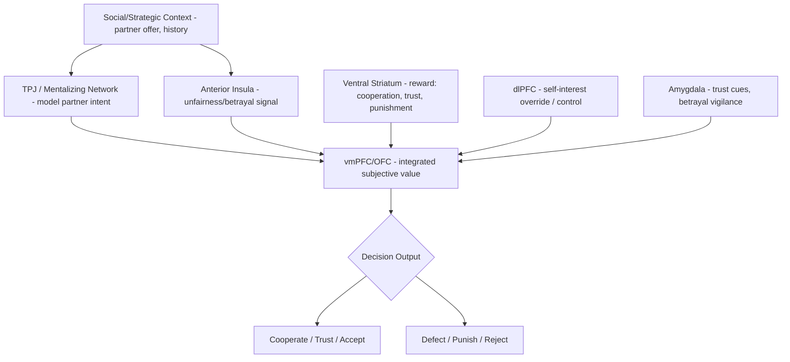

## Social Decision Making and Cooperation

### Overview

Social decision making encompasses the neural and computational processes underlying choices made in interactive contexts, where outcomes depend not only on one's own actions but on the actions, beliefs, and expected responses of other agents. This domain sits at the intersection of decision neuroscience, game theory, and social cognition, integrating value-based computation (as in individual decision making) with mentalizing about others' likely strategies and social-normative considerations such as fairness, trust, and reciprocity. Cooperation — behavior that benefits others, often at a cost to the individual — represents a central puzzle for this field, since it must be explained despite an apparent tension with pure self-interest-maximizing accounts of rational choice.

### Behavioral Economic Game Paradigms

**Key Points**

- **Prisoner's Dilemma**: two players simultaneously choose to cooperate or defect; mutual cooperation yields a better joint outcome than mutual defection, but each player has an individual incentive to defect regardless of the other's choice, creating tension between individual and collective rationality — the canonical model for studying cooperation dilemmas.
- **Ultimatum Game**: a proposer offers a division of a resource; a responder can accept (both receive the proposed split) or reject (both receive nothing). Widespread rejection of unfair offers, at a direct material cost to the responder, is a robust cross-cultural finding that challenges purely self-interested rational choice models.
- **Dictator Game**: a simplified variant in which the proposer unilaterally decides the split with no possibility of rejection, isolating pure other-regarding preferences (since the proposer's choice cannot be strategically motivated by anticipated rejection).
- **Trust Game**: an investor sends a portion of an endowment to a trustee, the sent amount is multiplied, and the trustee decides how much (if any) to return; used to study trust extension and reciprocity/trustworthiness as dissociable behavioral and neural phenomena.
- **Public Goods Game**: multiple players decide how much to contribute to a shared pool that is multiplied and redistributed equally regardless of individual contribution, creating a free-rider incentive structure; used to study cooperation dynamics, punishment of non-cooperators, and the erosion or maintenance of cooperation over repeated rounds.

### Core Neuroanatomy

- **Ventromedial prefrontal cortex (vmPFC) / orbitofrontal cortex (OFC)**: computes integrated subjective value signals for decision options, incorporating both material payoffs and social-contextual factors (fairness, reputation, social value) into a common valuation currency proposed by several computational models of value-based choice.
- **Ventral striatum (including nucleus accumbens)**: reward-related processing of favorable social outcomes, mutual cooperation, receiving trust, and — notably — the reward associated with punishing free-riders or unfair partners ("altruistic punishment").
- **Anterior insula**: implicated in aversive responses to unfairness, betrayal, and norm violations; anterior insula activation during ultimatum game unfair-offer rejection is one of the most replicated findings in social decision neuroscience.
- **Dorsolateral prefrontal cortex (dlPFC)**: supports cognitive control processes needed to override self-interested impulses in favor of cooperative or fairness-consistent behavior; disruption of right dlPFC via TMS has been shown in some studies to increase acceptance of unfair ultimatum offers without changing fairness judgments, suggesting a role in behavioral control rather than pure evaluation.
- **Temporoparietal junction (TPJ) and mentalizing network**: recruited when strategic decisions require modeling another player's beliefs, intentions, or likely future actions (as in iterated or strategic games), reflecting substantial functional overlap with theory-of-mind processing.
- **Amygdala**: contributes to trust-related processing, including trust judgments based on facial trustworthiness cues, and to aversive/vigilance responses following experienced betrayal.

### Circuit Diagram (svg_diagram)

<svg xmlns="http://www.w3.org/2000/svg" viewBox="0 0 900 560" font-family="Helvetica, Arial, sans-serif">
<text x="450" y="30" text-anchor="middle" font-size="20" font-weight="bold" fill="#1a1a1a">Social Decision-Making Circuit (svg_diagram)</text>
<rect x="360" y="70" width="220" height="60" rx="8" fill="#f7ead1" stroke="#b5822c" stroke-width="1.5" />
<text x="470" y="95" text-anchor="middle" font-size="13">Social/Strategic Context</text>
<text x="470" y="112" text-anchor="middle" font-size="11">(partner's offer, prior behavior)</text>
<rect x="120" y="180" width="200" height="60" rx="8" fill="#dce8f7" stroke="#3b6ea5" stroke-width="1.5" />
<text x="220" y="205" text-anchor="middle" font-size="13">TPJ / Mentalizing Network</text>
<text x="220" y="222" text-anchor="middle" font-size="11">modeling partner's intent</text>
<rect x="600" y="180" width="200" height="60" rx="8" fill="#f5cccc" stroke="#a03030" stroke-width="1.5" />
<text x="700" y="205" text-anchor="middle" font-size="13">Anterior Insula</text>
<text x="700" y="222" text-anchor="middle" font-size="11">unfairness/betrayal aversion</text>
<rect x="360" y="270" width="220" height="70" rx="8" fill="#e2f0d9" stroke="#5a8f3c" stroke-width="1.5" />
<text x="470" y="295" text-anchor="middle" font-size="13">vmPFC / OFC</text>
<text x="470" y="312" text-anchor="middle" font-size="11">integrated subjective value</text>
<text x="470" y="328" text-anchor="middle" font-size="11">(material + social factors)</text>
<rect x="120" y="380" width="200" height="60" rx="8" fill="#e3d7f5" stroke="#6b3fa0" stroke-width="1.5" />
<text x="220" y="405" text-anchor="middle" font-size="13">dlPFC</text>
<text x="220" y="422" text-anchor="middle" font-size="11">self-interest override</text>
<rect x="600" y="380" width="200" height="60" rx="8" fill="#d9f2d9" stroke="#3a7d3a" stroke-width="1.5" />
<text x="700" y="405" text-anchor="middle" font-size="13">Ventral Striatum</text>
<text x="700" y="422" text-anchor="middle" font-size="11">reward: cooperation, punishment</text>
<rect x="330" y="470" width="280" height="55" rx="8" fill="#f5f5f5" stroke="#888" stroke-width="1.5" />
<text x="470" y="493" text-anchor="middle" font-size="13">Decision Output</text>
<text x="470" y="509" text-anchor="middle" font-size="13">(cooperate/defect, accept/reject)</text>
<line x1="400" y1="130" x2="260" y2="180" stroke="#444" stroke-width="1.5" marker-end="url(#arrow10)" />
<line x1="540" y1="130" x2="680" y2="180" stroke="#444" stroke-width="1.5" marker-end="url(#arrow10)" />
<line x1="220" y1="240" x2="400" y2="270" stroke="#444" stroke-width="1.5" marker-end="url(#arrow10)" />
<line x1="700" y1="240" x2="540" y2="270" stroke="#444" stroke-width="1.5" marker-end="url(#arrow10)" />
<line x1="220" y1="380" x2="400" y2="320" stroke="#444" stroke-width="1.5" stroke-dasharray="4,3" marker-end="url(#arrow10)" />
<line x1="700" y1="380" x2="540" y2="320" stroke="#444" stroke-width="1.5" marker-end="url(#arrow10)" />
<line x1="470" y1="340" x2="470" y2="470" stroke="#444" stroke-width="1.5" marker-end="url(#arrow10)" />

<text x="450" y="545" font-size="12" fill="#555">vmPFC integrates mentalized social context and affective signals into a common value estimate</text>

</svg>

### Theoretical Models of Cooperation

**Key Points**

- **Direct reciprocity**: cooperation is sustained because interacting individuals expect repeated future interactions, making cooperative reputation and retaliation for defection individually advantageous over time (formalized in iterated Prisoner's Dilemma models such as tit-for-tat).
- **Indirect reciprocity**: cooperation is sustained via reputation effects even without repeated direct interaction between the same two individuals — cooperating enhances one's reputation, which is then rewarded by third parties, extending the logic of direct reciprocity to larger social networks.
- **Strong reciprocity / altruistic punishment**: proposes that humans possess a genuine (not purely strategically self-interested) disposition to cooperate with cooperators and to punish defectors even at personal cost and without prospect of future interaction or reputational gain, evidenced by punishment behavior in anonymous, one-shot public goods game variants.
- **Inequity aversion models**: propose that individuals derive disutility from unequal outcomes (both disadvantageous and, to a lesser degree in most models, advantageous inequity), providing a formal account of ultimatum game rejection behavior that does not require assuming pure altruism.
- **Kin selection and inclusive fitness theory**: an evolutionary framework proposing that cooperative behavior toward genetic relatives can be favored by natural selection even at a fitness cost to the individual, because it promotes the propagation of shared genes.

### Trust and Reputation

**Example**

In a repeated trust game, an investor initially sends a moderate proportion of their endowment to a trustee. If the trustee reciprocates generously across several rounds, the investor's subsequent investments typically increase, and neuroimaging studies of this paradigm commonly report increasing ventral striatal and caudate activation in response to reciprocated trust across repeated interactions, interpreted as a reward-learning signal that reinforces trust-building behavior. Conversely, a single instance of betrayal (the trustee keeping the entire amount) often produces a sharp and sometimes durable reduction in subsequent investment, illustrating the asymmetric weighting of betrayal relative to reciprocation in trust-related learning.

**Key Points**

- Trust and trustworthiness are behaviorally and neurally dissociable constructs — extending trust (investor role) and honoring trust (trustee role) engage overlapping but non-identical neural systems.
- The caudate nucleus has been specifically implicated in learning to trust based on a partner's reputation and reciprocity history, consistent with a broader role for the striatum in reward-based social learning.
- Oxytocin administration has been shown in some experimental studies to increase trusting behavior in economic trust games, though the specificity, replicability, and underlying mechanism of this effect remain actively debated within the field. [Unverified: oxytocin-trust findings have faced replication challenges in more recent, larger studies, and effects appear more context- and individual-difference-dependent than initially proposed.]

### Punishment and Norm Enforcement

**Key Points**

- **Altruistic punishment**: costly punishment of norm violators by uninvolved third parties (not just directly harmed individuals) has been repeatedly demonstrated in public goods game variants, and is associated with ventral striatal activation, suggesting that punishing defectors is itself intrinsically rewarding.
- Public goods games without a punishment option typically show cooperation rates declining across repeated rounds as free-riding erodes trust; introducing a costly punishment option for participants typically restores and sustains higher cooperation levels, illustrating punishment's role in stabilizing cooperative equilibria.
- **Second-order free-riding problem**: punishing defectors is itself costly to the punisher and benefits the group collectively, raising the theoretical puzzle of why individuals engage in costly punishment at all — a puzzle partially addressed by strong reciprocity and reputation-based models, though it remains a genuinely debated area in the cooperation literature. [Inference: the theoretical resolution of the second-order free-rider problem remains an active area of modeling and empirical work rather than a fully settled question.]

### Individual and Group Differences

**Key Points**

- **Social value orientation (SVO)**: a well-established individual difference dimension distinguishing prosocial individuals (who weight others' outcomes positively in their own utility function) from individualistic or competitive orientations, predicting behavior across cooperation and fairness-related economic games.
- **Cultural variation**: large cross-cultural studies (notably work spanning small-scale societies to industrialized nations) have found substantial variation in ultimatum game offer and rejection norms, linked to differences in market integration and everyday cooperative/exchange practices, challenging the universality of specific quantitative fairness norms while supporting the broader universality of fairness as a relevant consideration. [Inference: while cross-cultural variation in specific game behavior is well-documented, the precise causal drivers of this variation remain debated.]
- **Developmental trajectory**: young children show rudimentary fairness-related behavior (e.g., resource-sharing preferences) from an early age, with more sophisticated strategic and reputation-sensitive cooperative behavior developing progressively through childhood alongside theory of mind and executive function maturation.

### Clinical Relevance

**Key Points**

- **Autism spectrum conditions**: some studies report atypical patterns of trust and cooperative behavior in economic games, potentially related to differences in mentalizing about a partner's intentions, though findings vary considerably in direction and magnitude across studies. [Unverified: the specific pattern and consistency of social decision-making differences in autism across game paradigms is not fully established in the literature.]
- **Borderline personality disorder**: associated in some studies with reduced trust and cooperative behavior alongside heightened sensitivity to perceived betrayal in economic exchange paradigms, consistent with broader interpersonal instability characteristic of the condition.
- **Psychopathy**: associated with reduced sensitivity to fairness norms and reduced altruistic punishment tendencies in some studies, alongside intact strategic/cognitive understanding of game structure, paralleling the broader dissociation between preserved cognitive and impaired affective/moral processing characteristic of the condition.
- **Addiction**: some research links altered discounting and reward-processing in ventral striatum to atypical cooperative and trust-related decision-making in substance-use populations, though this remains an area of ongoing investigation. [Inference: the specific mechanistic link between addiction-related reward dysregulation and social decision-making deficits is not fully established and represents an active research direction.]

### Circuit Summary Diagram

### Key Experimental Techniques

- **Behavioral economic game paradigms**: Prisoner's Dilemma, Ultimatum Game, Dictator Game, Trust Game, and Public Goods Game, often adapted for fMRI or hyperscanning (simultaneous two-brain recording) designs.
- **Hyperscanning**: simultaneous neuroimaging of two or more interacting participants, used to study inter-brain synchrony and coordination during cooperative and competitive social exchange.
- **Computational modeling (game-theoretic and reinforcement learning models)**: fitting formal models (e.g., inequity aversion models, reinforcement learning models of trust updating) to behavioral choice data to characterize latent decision parameters.
- **Pharmacological manipulation studies**: oxytocin, testosterone, and serotonergic manipulation used to probe hormonal and neurochemical modulation of trust and fairness-related behavior.
- **Cross-cultural and cross-species comparative studies**: examining the generalizability of cooperation and punishment behavior across human societies and in non-human primates.

### Conclusion

Social decision making and cooperation are supported by an integration of value-based computation (vmPFC/OFC), mentalizing about partners' intentions (TPJ), affective signaling around fairness and betrayal (anterior insula, amygdala), and reward-related reinforcement of cooperative and punitive behavior (ventral striatum), modulated by cognitive control processes (dlPFC) capable of overriding self-interested impulses. Behavioral economic game paradigms — the Prisoner's Dilemma, Ultimatum Game, Trust Game, and Public Goods Game — have provided the primary empirical toolkit for this field, revealing robust and largely cross-culturally general (if quantitatively variable) tendencies toward fairness-sensitivity, reciprocity, and costly punishment of norm violators that challenge purely self-interest-maximizing accounts of rational choice, with substantial ongoing clinical relevance for understanding social decision-making atypicalities across autism, personality disorders, and psychopathy.

**Related Topics**

- Moral cognition and judgment (fairness and punishment overlap)
- Theory of mind and the mentalizing network (strategic intent modeling)
- Empathy and its neural substrates (affective basis of trust and reciprocity)
- Reward processing and the ventral striatum in value-based decision-making
- Evolutionary theories of cooperation: kin selection and reciprocal altruism
- Oxytocin and neuropeptide modulation of social behavior
- Hyperscanning and two-person neuroscience methodology
- Behavioral game theory and computational models of social choice