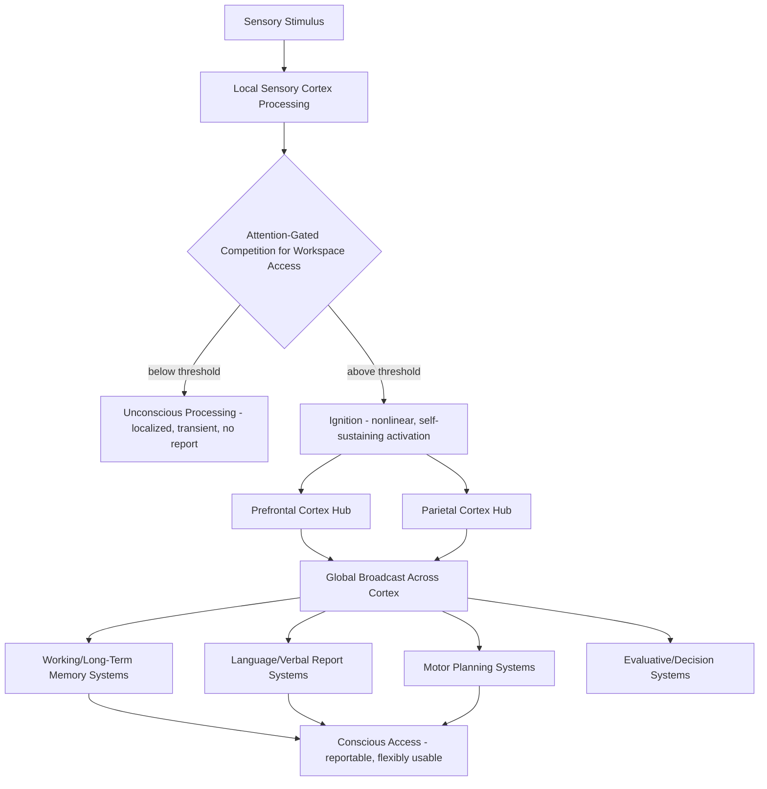

## Global Workspace Theory

### Overview

Global Workspace Theory (GWT), originally proposed by Bernard Baars and subsequently extended into an influential neurobiological framework (Global Neuronal Workspace Theory, GNWT) by Stanislas Dehaene, Jean-Pierre Changeux, and colleagues, proposes that conscious awareness arises when information is broadcast widely across a distributed network of interconnected brain regions, making it globally available to multiple specialized cognitive processes (attention, memory, language, motor planning) simultaneously. Under this framework, the distinction between conscious and unconscious processing is not primarily about which brain regions are active, but about whether information achieves this widespread, sustained, and mutually accessible broadcast — a state termed "ignition." GWT is one of the most empirically productive and widely tested theories in the contemporary neuroscience of consciousness.

### Core Theoretical Claims

**Key Points**

- **Workspace metaphor**: Baars proposed an analogy to a theater, in which a "spotlight" of attention illuminates certain information on a stage, making it available to a large, mostly unconscious "audience" of specialized cognitive processors; only the illuminated content becomes consciously accessible.
- **Global broadcasting**: information that enters the workspace is not processed locally in isolation but is broadcast to multiple distant brain regions simultaneously, allowing many different cognitive systems to access and utilize the same information — a property proposed to be functionally necessary for flexible, integrated cognition (e.g., verbal report, deliberate reasoning, novel behavioral planning).
- **Limited capacity**: the workspace has limited capacity at any given moment — only a restricted amount of information can be globally broadcast and consciously available simultaneously, consistent with well-established limits on attention and working memory.
- **Competition for access**: multiple candidate representations compete for entry into the global workspace, with attention acting as a key gating mechanism determining which representation wins access and becomes conscious.
- **Ignition**: Dehaene and colleagues' key neurobiological addition — a nonlinear, all-or-none-like amplification process in which a stimulus representation that crosses a threshold of activation triggers a sudden, self-sustaining, widespread cortical activation pattern, distinguishing conscious "ignited" processing from unconscious processing that remains locally confined and decays without ever reaching this threshold.

### Core Neuroanatomy of the Global Neuronal Workspace

- **Prefrontal cortex (particularly dorsolateral and frontopolar regions)**: proposed as a key hub of the global workspace, containing neurons with long-range connections capable of broadcasting information widely across cortex; prefrontal damage has been associated in some studies with impaired conscious access despite preserved unconscious processing.
- **Parietal cortex (particularly posterior parietal and intraparietal regions)**: another key workspace hub, implicated in supporting the attentional selection and integration processes necessary for entry into the global workspace.
- **Anterior cingulate cortex (ACC)**: proposed to contribute to workspace access via its role in monitoring, effort allocation, and selecting which representations should be prioritized for broadcast.
- **Long-range cortico-cortical white matter connections**: GWT emphasizes that the workspace's function depends critically not just on activity within individual regions but on the fidelity and integrity of extensive long-range connections (particularly fronto-parietal and cross-hemispheric pathways) enabling wide broadcast, making white matter integrity a key structural correlate of conscious access.
- **Thalamocortical loops**: proposed to play a supporting role in sustaining and synchronizing the widespread cortical activation pattern characteristic of ignition, complementing purely cortico-cortical accounts.

### Circuit Diagram (svg_diagram)

<svg xmlns="http://www.w3.org/2000/svg" viewBox="0 0 900 560" font-family="Helvetica, Arial, sans-serif">
<text x="450" y="30" text-anchor="middle" font-size="20" font-weight="bold" fill="#1a1a1a">Global Neuronal Workspace: Local vs. Broadcast Processing (svg_diagram)</text>
<rect x="60" y="90" width="200" height="60" rx="8" fill="#dce8f7" stroke="#3b6ea5" stroke-width="1.5" />
<text x="160" y="115" text-anchor="middle" font-size="13">Sensory Input</text>
<text x="160" y="131" text-anchor="middle" font-size="11">(visual, auditory, etc.)</text>
<rect x="60" y="200" width="200" height="70" rx="8" fill="#f7ead1" stroke="#b5822c" stroke-width="1.5" />
<text x="160" y="225" text-anchor="middle" font-size="13">Local Specialized</text>
<text x="160" y="241" text-anchor="middle" font-size="13">Processors</text>
<text x="160" y="257" text-anchor="middle" font-size="10">(unconscious if not ignited)</text>
<rect x="360" y="200" width="220" height="70" rx="8" fill="#f5cccc" stroke="#a03030" stroke-width="1.5" />
<text x="470" y="222" text-anchor="middle" font-size="13">Threshold Competition</text>
<text x="470" y="239" text-anchor="middle" font-size="11">(attention-gated selection</text>
<text x="470" y="255" text-anchor="middle" font-size="11">among candidate representations)</text>
<rect x="640" y="90" width="220" height="60" rx="8" fill="#e2f0d9" stroke="#5a8f3c" stroke-width="1.5" />
<text x="750" y="112" text-anchor="middle" font-size="13">Prefrontal-Parietal</text>
<text x="750" y="128" text-anchor="middle" font-size="13">Workspace Hubs</text>
<rect x="640" y="200" width="220" height="90" rx="8" fill="#d9f2d9" stroke="#3a7d3a" stroke-width="1.5" />
<text x="750" y="225" text-anchor="middle" font-size="13">"Ignition"</text>
<text x="750" y="242" text-anchor="middle" font-size="11">nonlinear, self-sustaining,</text>
<text x="750" y="258" text-anchor="middle" font-size="11">widespread cortical</text>
<text x="750" y="274" text-anchor="middle" font-size="11">activation</text>
<rect x="360" y="360" width="220" height="70" rx="8" fill="#e3d7f5" stroke="#6b3fa0" stroke-width="1.5" />
<text x="470" y="385" text-anchor="middle" font-size="13">Global Broadcast</text>
<text x="470" y="402" text-anchor="middle" font-size="11">simultaneous access by memory,</text>
<text x="470" y="418" text-anchor="middle" font-size="11">language, motor, evaluative systems</text>
<rect x="330" y="470" width="280" height="55" rx="8" fill="#f5f5f5" stroke="#888" stroke-width="1.5" />
<text x="470" y="493" text-anchor="middle" font-size="13">Conscious Access</text>
<text x="470" y="509" text-anchor="middle" font-size="13">(reportable, flexibly usable)</text>
<line x1="160" y1="150" x2="160" y2="200" stroke="#444" stroke-width="1.5" marker-end="url(#arrow11)" />
<line x1="260" y1="235" x2="360" y2="235" stroke="#444" stroke-width="1.5" marker-end="url(#arrow11)" />
<line x1="750" y1="150" x2="750" y2="200" stroke="#444" stroke-width="1.5" marker-end="url(#arrow11)" />
<line x1="580" y1="235" x2="640" y2="245" stroke="#444" stroke-width="1.5" marker-end="url(#arrow11)" />
<line x1="750" y1="290" x2="580" y2="380" stroke="#444" stroke-width="1.5" marker-end="url(#arrow11)" />
<line x1="470" y1="430" x2="470" y2="470" stroke="#444" stroke-width="1.5" marker-end="url(#arrow11)" />

<text x="450" y="545" font-size="12" fill="#555">Only representations that cross threshold and "ignite" achieve widespread broadcast and conscious access</text>

</svg>

### The Contrastive Method: Conscious vs. Unconscious Processing

**Key Points**

- GWT/GNWT is distinguished empirically via **contrastive analysis** — comparing brain activity when the same or matched stimuli are consciously perceived versus not consciously perceived, most commonly using masking paradigms (a target stimulus followed rapidly by a masking stimulus that renders it subjectively invisible/unreportable while still being processed by early visual cortex).
- **Subliminal (unconscious) processing**: masked stimuli reliably produce measurable, but typically transient, spatially limited activation confined to early sensory cortex and sometimes local higher-order regions, without triggering the widespread ignition pattern.
- **Supraliminal (conscious) processing**: unmasked, consciously reportable stimuli of otherwise similar physical properties produce a qualitatively distinct pattern — a late (~300ms post-stimulus in EEG, associated with the P3b/P300 event-related potential component), sudden, and widespread amplification of activity across frontal and parietal regions, interpreted as the neural signature of ignition.
- **Attentional blink and inattentional blindness paradigms**: additional experimental tools demonstrating that even fully visible, unmasked stimuli can fail to reach conscious report when attention is otherwise engaged, supporting the model's emphasis on attention-gated competitive access to the workspace.

### Key Neural Signatures Associated with GNWT

| Signature | Description | Association |
| --- | --- | --- |
| P3b / P300 (EEG) | Late positive event-related potential, typically 300-600ms post-stimulus | Proposed neural marker of conscious ignition |
| Late gamma-band amplification | Sustained, widespread high-frequency oscillatory activity | Associated with sustained conscious representation |
| Frontoparietal network activation | Broad recruitment of prefrontal and parietal regions | Considered a hallmark of successful workspace access |
| All-or-none activation pattern | Nonlinear transition rather than graded activation increase | Central distinguishing feature of "ignition" versus mere activation strength |
| Long-distance phase synchronization | Increased inter-regional synchrony (particularly beta/gamma range) | Proposed mechanism for coordinating global broadcast across distant regions |

[Inference: while the P3b/ignition association is one of the most replicated findings supporting GNWT, whether the P3b itself is a direct marker of consciousness or a downstream consequence of post-perceptual processes (e.g., decision-making, report preparation) remains genuinely and actively debated in the literature — this is one of the central points of contention with rival theories such as higher-order theories and some readings of integrated information theory.]

### Relationship to Other Consciousness Theories

**Key Points**

- **Integrated Information Theory (IIT, Tononi)**: proposes consciousness corresponds to a system's capacity for integrated information (denoted Φ), emphasizing the intrinsic causal structure of a system rather than functional broadcast; IIT and GNWT differ substantially in their core claims and have become central rival frameworks in adversarial collaboration testing efforts within the field.
- **Higher-Order Theories (HOT)**: propose that a mental state becomes conscious specifically when it is the target of an appropriate higher-order representation (a "thought about" or metacognitive representation of the first-order state), often implicating prefrontal cortex similarly to GNWT but through a different proposed mechanism (metacognitive representation rather than broad availability/broadcast).
- **Recurrent processing theory (Lamme)**: proposes that recurrent (feedback) processing within sensory cortex, even without necessarily engaging frontoparietal regions, may be sufficient for a more basic form of "phenomenal" consciousness, distinguished from the "access" consciousness that GNWT specifically targets — a distinction (access versus phenomenal consciousness, originally due to philosopher Ned Block) that remains actively contested.
- An ongoing, prominent **adversarial collaboration** effort (notably involving GNWT and IIT proponents, coordinated through structured pre-registered experimental designs) has sought to empirically adjudicate between competing predictions of these theories, with results as of recent years described by different commentators as producing mixed or partially theory-favoring outcomes depending on interpretation. [Unverified: interpretation of adversarial collaboration results between GNWT and IIT has been actively disputed by proponents of each theory, and no clear consensus resolution has been established as of the most recent widely available reporting.]

### Empirical Support and Applications

**Example**

In a classic masking paradigm supporting GNWT, a word is flashed briefly (e.g., for 16ms) and immediately followed by a masking pattern, rendering it subjectively invisible to the participant. Despite the absence of conscious report, semantic priming effects can often still be measured (e.g., faster responses to a related subsequent word), demonstrating that meaningful processing occurred without conscious access — localized activation is measurable in relevant sensory and semantic processing regions, but the characteristic late, widespread frontoparietal ignition pattern associated with conscious perception is absent.

**Key Points**

- **Anesthesia studies**: propofol and other general anesthetics have been shown to selectively disrupt long-range frontoparietal connectivity and reduce the P3b/ignition-like response to stimuli, while relatively preserving local sensory cortical responses, providing convergent evidence linking loss of consciousness specifically to breakdown of global broadcast rather than global cessation of neural activity.
- **Disorders of consciousness (vegetative state/unresponsive wakefulness syndrome vs. minimally conscious state)**: patients with preserved minimal consciousness show, in some studies, partial preservation of ignition-like late frontoparietal responses to auditory stimuli, whereas those in unresponsive wakefulness syndrome show more consistently locally confined responses — used as a proposed diagnostic/prognostic biomarker approach, though clinical application remains an active area of methodological development. [Inference: while this general pattern is supported by a body of research, the diagnostic reliability of ignition-based EEG/fMRI markers for individual clinical decision-making in disorders of consciousness remains an active area of validation rather than an established clinical standard.]
- **Split-brain and callosal disconnection studies**: have been used to examine how disruption of long-range interhemispheric connectivity affects the scope and unity of the global workspace, generally supporting the model's emphasis on connectivity as functionally central to unified conscious access.

### Circuit Summary Diagram

### Key Experimental Techniques

- **Masking paradigms**: backward/forward visual masking to render stimuli subjectively invisible while preserving early sensory processing, enabling contrastive conscious/unconscious comparison.
- **Attentional blink paradigms**: rapid serial visual presentation designs demonstrating attention-dependent failures of conscious report for fully visible stimuli.
- **EEG/MEG event-related potential analysis**: identifying the P3b and related late components as candidate neural markers of ignition.
- **Intracranial EEG (in neurosurgical patients)**: providing high spatiotemporal resolution evidence for the timing and spread of ignition-like activity across cortex.
- **Anesthesia and disorders-of-consciousness neuroimaging/EEG studies**: examining connectivity and ignition-marker breakdown as a function of consciousness level.
- **Computational and neural network modeling**: simulating workspace dynamics (competitive selection, threshold-based ignition, broadcast) to generate testable predictions.

### Conclusion

Global Workspace Theory, extended into its neurobiological form as the Global Neuronal Workspace Theory, proposes that conscious awareness arises specifically when a mental representation wins competitive, attention-gated access to a distributed frontoparietal workspace and triggers a nonlinear "ignition" process that broadcasts the information widely across cortex, making it simultaneously available to memory, language, motor, and evaluative systems. This framework has generated substantial and often highly specific empirical predictions — most notably regarding the P3b component and late frontoparietal activation as neural signatures distinguishing conscious from unconscious processing — that have been tested extensively via masking paradigms, anesthesia studies, and disorders-of-consciousness research, positioning GNWT as one of the most influential and empirically active theories in the contemporary science of consciousness, while remaining in ongoing, unresolved empirical and theoretical competition with rival frameworks such as Integrated Information Theory and Higher-Order Theories.

**Related Topics**

- Integrated Information Theory and the measurement of consciousness (Φ)
- Higher-order theories of consciousness and metacognition
- Neural correlates of consciousness: methodology and contrastive analysis
- Disorders of consciousness: vegetative state, minimally conscious state, and diagnostic biomarkers
- Attention and its gating role in conscious access
- Anesthesia mechanisms and the neuroscience of unconsciousness
- Split-brain research and the unity of conscious experience
- Access versus phenomenal consciousness (Block's distinction)