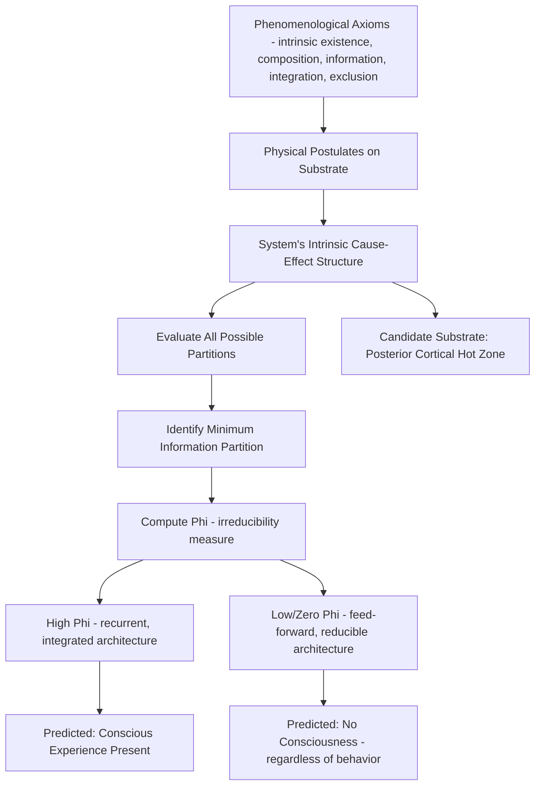

## Integrated Information Theory

### Overview

Integrated Information Theory (IIT), developed principally by Giulio Tononi and subsequently elaborated with collaborators including Christof Koch and Marcello Massimini, proposes a fundamentally different starting point from most other consciousness theories: rather than beginning with observed neural correlates and inferring what mechanism produces consciousness, IIT begins from purported essential phenomenological properties of experience itself and derives, via a formal mathematical framework, what physical properties a system must possess to be conscious. The theory's central claim is that consciousness corresponds to a system's capacity for **integrated information**, quantified by a measure denoted **Φ (phi)**, and that both the quantity and the specific quality of an experience are determined by the system's intrinsic causal structure rather than by what the system does functionally or how it behaves.

### Foundational Axioms and Postulates

**Key Points**

- IIT's methodology proceeds from a small set of proposed **axioms** — claimed self-evident phenomenological truths about any conscious experience — to corresponding **postulates** about the physical substrate that must be true of any system generating that experience.
- **Intrinsic existence**: consciousness exists from its own (intrinsic) perspective, independent of any external observer; correspondingly, the physical substrate must have cause-effect power upon itself, existing intrinsically rather than merely as observed from outside.
- **Composition**: experience is structured, composed of multiple phenomenological distinctions (e.g., a conscious visual scene has color, shape, location as distinct components); correspondingly, the substrate must be composed of multiple elements combinable into higher-order mechanisms.
- **Information**: each experience is specific, differing from other possible experiences; correspondingly, the substrate's cause-effect structure must specify a particular state out of many possible states, ruling out alternatives.
- **Integration**: experience is unified — a conscious scene cannot be subdivided into fully independent, separately experienced components without loss (e.g., you cannot experience "red" and "left" as two entirely separate consciousnesses when viewing a red object on the left); correspondingly, the substrate's cause-effect structure must be irreducible to independent, non-interacting parts.
- **Exclusion**: each experience has definite content and definite spatiotemporal grain, excluding all other possible content and grains; correspondingly, the physical substrate of consciousness is the one specific set of elements, at the one specific spatial and temporal scale, that maximizes integrated information — termed the system's **maximum irreducible conceptual structure**.

### The Central Measure: Φ (Phi)

**Key Points**

- Φ quantifies the amount of integrated information generated by a system above and beyond the information generated independently by its parts — formally, the degree to which a system's cause-effect structure is irreducible to that of its independent components.
- Computing Φ (or its more refined successor formulations, such as Φ-max or the more recent IIT 4.0 formalism) requires evaluating a system's causal structure across all possible ways of partitioning it into parts, identifying the partition that makes the least difference (the "minimum information partition"), and using this to quantify irreducibility.
- A system with high Φ has a rich, highly interconnected causal structure in which the whole genuinely constrains and is constrained by its parts in a way that cannot be decomposed without loss of causal power — proposed by IIT to correspond to a correspondingly rich, unified conscious experience.
- Critically, **Φ is a property of a system's actual, current causal structure** — not of its behavior, its function, or the information it processes in an input-output sense — meaning IIT explicitly decouples consciousness from functional/computational descriptions, a claim that has proven both distinctive and highly contested.

$$\Phi(\text{system}) = \min_{\text{partition}} \left[ D\big(\text{cause-effect structure}, \text{partitioned structure}\big) \right]$$

Where $D$ represents a measure of the difference between the system's intact cause-effect structure and the structure resulting from its minimum information partition (the partition causing the least reduction). [Inference: this is a highly simplified schematic representation intended for conceptual illustration; the actual IIT formalism (particularly in its more recent 4.0 iteration) involves substantially more elaborate mathematical machinery, including distinctions, relations, and multiple distinct distance measures across different versions of the theory.]

### Distinguishing Predictions and Claims

**Key Points**

- **Consciousness admits of degree**: because Φ is a graded, continuous quantity, IIT predicts that consciousness itself is graded (richer or more limited) rather than strictly all-or-none, in principle applicable across biological and non-biological systems alike.
- **Panpsychist-adjacent implications**: because Φ can in principle be computed for any physical system with the right causal structure (not only biological brains), IIT has been interpreted by some commentators as implying a form of graded panpsychism — that even simple physical systems with nonzero integrated information possess some minimal degree of experience — an implication that proponents regard as a logical consequence of the theory's premises and that critics regard as a serious liability. [Inference: whether IIT is best characterized as genuinely panpsychist, or merely compatible with panpsychism as one possible interpretation, is itself a matter of ongoing philosophical debate among commentators on the theory.]
- **Feed-forward networks predicted to lack consciousness regardless of function**: IIT predicts that a purely feed-forward computational system — even one behaviorally indistinguishable from a conscious system, including passing any conceivable behavioral or verbal test — would have zero or near-zero Φ and therefore would not be conscious, because feed-forward architectures lack the recurrent causal structure IIT identifies as necessary for integration. This yields IIT's most philosophically striking and widely discussed claim: that consciousness depends on a system's specific causal architecture, not its functional behavior — directly implying that certain artificial intelligence systems, however behaviorally sophisticated, would not be conscious under the theory if they lack sufficiently integrated, non-feed-forward causal architecture. [Inference: this specific implication regarding current AI architectures follows from the theory's premises as generally described by its proponents, but remains a debated and consequential extrapolation rather than something IIT proponents claim to have directly empirically verified.]
- **The cerebellum vs. cerebral cortex prediction**: IIT is frequently cited as correctly "predicting" (or being consistent with) the puzzling clinical observation that the cerebellum, despite containing the large majority of the brain's neurons, contributes minimally to conscious experience (cerebellar damage or even near-complete absence causes comparatively modest effects on consciousness), which IIT attributes to the cerebellum's modular, largely feed-forward, minimally-recurrent circuit architecture compared to the highly recurrent thalamocortical system.

### Proposed Neural Substrate: The Posterior Cortical "Hot Zone"

**Key Points**

- Based on IIT's emphasis on recurrent, densely interconnected circuitry, Tononi and Koch have proposed that a posterior cortical region — encompassing parts of parietal, occipital, and temporal cortex, sometimes termed the **"hot zone"** — is a primary candidate substrate for consciousness, in contrast to GNWT's emphasis on prefrontal-parietal circuitry.
- This prediction is notably distinct from and in direct empirical tension with Global Neuronal Workspace Theory's emphasis on prefrontal cortex as a necessary hub, representing one of the clearest points of empirical divergence between the two leading theories, and a specific focus of adversarial collaboration testing.
- Evidence cited in support includes lesion and stimulation studies suggesting that damage to posterior cortical hot-zone regions can produce specific losses of conscious content (e.g., specific visual or spatial experience) even when prefrontal cortex is intact, while extensive prefrontal damage in some cases appears compatible with relatively preserved conscious experience (though impaired higher cognitive function). [Unverified: the precise necessity and sufficiency of the posterior hot zone, and the interpretation of relevant lesion evidence, remains contested, including by proponents of alternative theories who interpret similar evidence differently.]

### Circuit/Conceptual Diagram (svg_diagram)

<svg xmlns="http://www.w3.org/2000/svg" viewBox="0 0 900 520" font-family="Helvetica, Arial, sans-serif">
<text x="450" y="30" text-anchor="middle" font-size="20" font-weight="bold" fill="#1a1a1a">IIT: Integration vs. Feed-Forward Architecture (svg_diagram)</text>

<text x="220" y="70" text-anchor="middle" font-size="14" font-weight="bold" fill="`#3a7d3a`">High Φ: Recurrent/Integrated System</text>

<circle cx="120" cy="150" r="30" fill="`#d9f2d9`" stroke="`#3a7d3a`" stroke-width="1.5" />

<circle cx="220" cy="110" r="30" fill="`#d9f2d9`" stroke="`#3a7d3a`" stroke-width="1.5" />

<circle cx="220" cy="220" r="30" fill="`#d9f2d9`" stroke="`#3a7d3a`" stroke-width="1.5" />

<circle cx="320" cy="150" r="30" fill="`#d9f2d9`" stroke="`#3a7d3a`" stroke-width="1.5" />

<line x1="145" y1="130" x2="195" y2="115" stroke="#3a7d3a" stroke-width="1.5" marker-end="url(#arrow12)" />
<line x1="195" y1="105" x2="145" y2="140" stroke="#3a7d3a" stroke-width="1.5" marker-end="url(#arrow12)" />
<line x1="145" y1="170" x2="195" y2="210" stroke="#3a7d3a" stroke-width="1.5" marker-end="url(#arrow12)" />
<line x1="195" y1="225" x2="145" y2="180" stroke="#3a7d3a" stroke-width="1.5" marker-end="url(#arrow12)" />
<line x1="245" y1="120" x2="295" y2="145" stroke="#3a7d3a" stroke-width="1.5" marker-end="url(#arrow12)" />
<line x1="295" y1="155" x2="245" y2="125" stroke="#3a7d3a" stroke-width="1.5" marker-end="url(#arrow12)" />
<line x1="245" y1="215" x2="295" y2="160" stroke="#3a7d3a" stroke-width="1.5" marker-end="url(#arrow12)" />
<line x1="295" y1="150" x2="245" y2="205" stroke="#3a7d3a" stroke-width="1.5" marker-end="url(#arrow12)" />

<text x="680" y="70" text-anchor="middle" font-size="14" font-weight="bold" fill="`#a03030`">Low Φ: Feed-Forward System</text>

<rect x="600" y="130" width="70" height="45" rx="6" fill="`#f5cccc`" stroke="`#a03030`" stroke-width="1.5" />

<rect x="720" y="130" width="70" height="45" rx="6" fill="`#f5cccc`" stroke="`#a03030`" stroke-width="1.5" />

<rect x="660" y="220" width="70" height="45" rx="6" fill="`#f5cccc`" stroke="`#a03030`" stroke-width="1.5" />

<line x1="670" y1="152" x2="720" y2="152" stroke="#a03030" stroke-width="1.5" marker-end="url(#arrow12)" />
<line x1="670" y1="175" x2="680" y2="220" stroke="#a03030" stroke-width="1.5" marker-end="url(#arrow12)" />
<line x1="755" y1="175" x2="710" y2="220" stroke="#a03030" stroke-width="1.5" marker-end="url(#arrow12)" />

<text x="220" y="270" text-anchor="middle" font-size="12" fill="#555">Bidirectional/recurrent connectivity → irreducible</text>

<text x="220" y="288" text-anchor="middle" font-size="12" fill="#555">cause-effect structure → high Φ (candidate for consciousness)</text>

<text x="680" y="290" text-anchor="middle" font-size="12" fill="#555">Unidirectional connectivity → structure reducible</text>

<text x="680" y="308" text-anchor="middle" font-size="12" fill="#555">to independent parts → near-zero Φ, regardless of output behavior</text>

<text x="450" y="380" font-size="13" fill="#333" text-anchor="middle" font-weight="bold">Both systems could in principle produce identical output behavior;</text>

<text x="450" y="400" font-size="13" fill="#333" text-anchor="middle" font-weight="bold">IIT predicts only the recurrent system is conscious.</text>

</svg>

### Comparison with Global Neuronal Workspace Theory

| Dimension | Integrated Information Theory (IIT) | Global Neuronal Workspace Theory (GNWT) |
| --- | --- | --- |
| Starting point | Phenomenological axioms → physical postulates | Observed neural correlates → functional mechanism |
| Core construct | Φ: intrinsic, irreducible cause-effect structure | Ignition: functional broadcast of information |
| Key proposed substrate | Posterior cortical "hot zone" | Prefrontal-parietal frontoparietal network |
| Relation to behavior/function | Explicitly decoupled — consciousness is a structural, not functional, property | Explicitly functional — consciousness is defined by what broadcast enables |
| Stance on feed-forward AI | Predicts no consciousness regardless of behavioral sophistication | More functionally agnostic; broadcast-capable architectures could in principle qualify |
| Degree of consciousness | Graded, quantifiable in principle (Φ value) | Less explicitly graded; more focused on presence/absence of ignition |
| Philosophical association | Compatible with/adjacent to panpsychism | Generally compatible with more standard physicalist/functionalist views |

### Methodological Tools: The Perturbational Complexity Index (PCI)

**Example**

Because computing exact Φ for a full biological brain is currently computationally intractable, Massimini, Tononi, and colleagues developed the **Perturbational Complexity Index (PCI)** as a practically measurable proxy inspired by IIT's principles. In this method, transcranial magnetic stimulation (TMS) is used to directly perturb the cortex while EEG records the resulting spatiotemporal pattern of electrical activity; the complexity (both differentiated and integrated) of the brain's response to this perturbation is then quantified algorithmically. Studies applying PCI have found that it reliably distinguishes wakeful, conscious states from dreamless sleep and various anesthetic states, and — notably — has shown clinical utility in distinguishing patients in a minimally conscious state from those in an unresponsive wakefulness syndrome (vegetative state), including some cases where standard bedside behavioral assessment was ambiguous or produced a different classification.

**Key Points**

- PCI is currently one of the most clinically promising practical applications inspired by IIT, used experimentally as an objective, theory-motivated biomarker of consciousness level independent of behavioral responsiveness.
- PCI has shown reasonably good discriminative performance across a range of altered states of consciousness (sleep stages, anesthetic depth, disorders of consciousness) in published validation studies. [Inference: while PCI's discriminative performance in published validation cohorts is a documented, replicated empirical finding, its diagnostic accuracy and practical reliability for individual bedside clinical decision-making outside research contexts remains under ongoing evaluation rather than established as routine clinical practice.]

### Major Criticisms and Open Debates

**Key Points**

- **Computational intractability**: exact computation of Φ for systems with more than a small number of elements is currently computationally infeasible, meaning most empirical applications rely on approximations, proxies (like PCI), or highly simplified toy systems rather than direct Φ computation for actual brains.
- **The "unfolding argument" and related critiques**: several researchers have proposed formal arguments suggesting that IIT's causal-structure-based criterion can, in principle, be satisfied by systems (or fail to distinguish between systems) in ways its proponents consider counterintuitive, sparking substantial technical debate about whether the theory's core claims are well-specified or falsifiable in the way originally intended. [Unverified: the technical validity and implications of the unfolding argument and similar critiques remain a matter of active, unresolved technical dispute between IIT proponents and critics.]
- **Falsifiability concerns**: some philosophers and scientists have questioned whether IIT's core claims (particularly regarding the consciousness of non-biological or highly unusual hypothetical systems) are empirically testable even in principle, a concern that has itself become a subject of philosophical and methodological debate within the consciousness science community, including a notable open letter from a group of scientists in 2023 characterizing certain framings of IIT as "pseudoscience" in specific respects — a characterization that IIT proponents have publicly and specifically disputed. [Unverified: this characterization and the associated dispute reflect an ongoing, unresolved controversy within the field rather than a settled scientific consensus in either direction.]
- **The panpsychism implication as a liability**: critics argue that a theory implying degrees of experience in simple physical systems (e.g., certain grid-like or highly interconnected non-biological structures) with no plausible functional role for that experience represents a reductio ad absurdum of the theory's premises, while proponents maintain this is simply a correct, if counterintuitive, consequence of taking phenomenology seriously as a starting point.

### Circuit Summary Diagram

### Key Experimental and Methodological Techniques

- **Perturbational Complexity Index (PCI)**: TMS-EEG based practical proxy measure for consciousness level, inspired directly by IIT principles.
- **Lesion and stimulation studies of posterior cortex**: testing IIT's specific "hot zone" substrate prediction against GNWT's prefrontal-parietal prediction.
- **Anesthesia and sleep studies**: examining how connectivity and complexity measures change across consciousness states, used as indirect tests of integration-based theories.
- **Computational/toy-model simulations**: applying exact Φ computation to small, simplified simulated systems (where computationally tractable) to explore the theory's formal predictions.
- **Adversarial collaboration experimental designs**: pre-registered, jointly-designed studies directly pitting IIT's hot-zone/posterior predictions against GNWT's prefrontal/ignition predictions using shared stimuli and measures.

### Conclusion

Integrated Information Theory offers a distinctive, axiomatically-derived account of consciousness, proposing that experience corresponds to a system's capacity for integrated, irreducible cause-effect structure — quantified as Φ — rather than to any particular functional or behavioral capacity. This foundational commitment yields some of the most philosophically striking and empirically consequential predictions in consciousness science, including that feed-forward computational systems (however behaviorally sophisticated) would lack consciousness, that a posterior cortical "hot zone" rather than prefrontal cortex is the primary neural substrate of experience, and that consciousness may in principle admit of degree across both biological and non-biological systems. While the theory has produced genuinely useful practical tools such as the Perturbational Complexity Index, it remains the subject of substantial, unresolved technical and philosophical controversy — spanning concerns about computational tractability, falsifiability, and the panpsychist implications of its premises — positioning IIT as both one of the most theoretically ambitious and one of the most contested frameworks in the contemporary neuroscience of consciousness.

**Related Topics**

- Global Workspace Theory and the frontoparietal ignition account (primary rival framework)
- Perturbational Complexity Index and clinical assessment of disorders of consciousness
- Philosophy of mind: panpsychism and the hard problem of consciousness
- Higher-order theories of consciousness and metacognitive representation
- Anesthesia mechanisms and graded loss of consciousness
- Disorders of consciousness: vegetative state and minimally conscious state
- Falsifiability and philosophy of science debates in consciousness research
- Computational and artificial consciousness: theoretical implications for AI systems