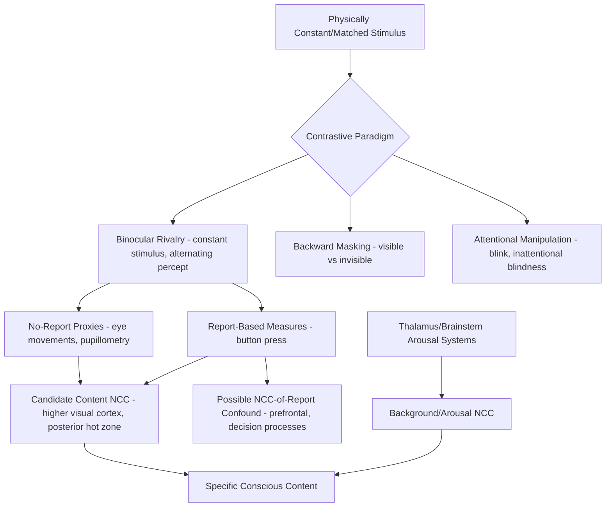

## Neural Correlates of Consciousness

### Overview

The neural correlates of consciousness (NCC) research program, a term and methodological framework substantially developed and popularized by Francis Crick and Christof Koch beginning in the 1990s, seeks to identify the minimal set of neural mechanisms and events jointly sufficient for the occurrence of any specific conscious experience. The NCC approach is explicitly agnostic (or at least methodologically neutral) with respect to grand theoretical frameworks such as Global Workspace Theory or Integrated Information Theory, instead prioritizing careful empirical isolation of brain states, regions, and dynamics that reliably track the presence, absence, or specific content of conscious experience, largely through rigorous experimental contrast between matched conscious and unconscious conditions.

### Defining the NCC: Conceptual Framework

**Key Points**

- **Formal definition (Chalmers)**: an NCC is the minimal neural system N such that the activity of N is jointly sufficient, under conditions C, for a specific conscious experience — emphasizing both minimality (not the entire brain, but the specific mechanism actually responsible) and sufficiency (given appropriate background conditions).
- **Content NCC vs. full/background NCC**: an important methodological and conceptual distinction between the neural correlates of the *specific content* of an experience (e.g., what makes a particular color or face experience occur, as opposed to a different one) versus the neural correlates of the *background state* of consciousness itself (i.e., what makes an organism conscious at all, as opposed to being in dreamless sleep, coma, or under general anesthesia) — these two questions, though related, require distinct experimental approaches and are sometimes conflated in less careful discussions of the field.
- **The "easy problems" versus the "hard problem" (Chalmers)**: NCC research is explicitly aimed at the tractable, empirical "easy problems" of consciousness (identifying mechanisms that correlate with and causally produce specific conscious states) rather than directly addressing the further, more contested "hard problem" of why any physical process should be accompanied by subjective experience at all — a distinction important for understanding the scope and limits of what NCC findings can, in principle, establish.
- Correlation is explicitly distinguished from causation and from full theoretical explanation: identifying a robust NCC does not by itself explain *why* that particular neural activity gives rise to experience, which remains the deeper theoretical target of frameworks such as GNWT and IIT.

### The Contrastive Analysis Methodology

**Key Points**

- The dominant empirical strategy in NCC research is **contrastive analysis**: comparing brain states or activity patterns across conditions that are matched as closely as possible on external stimulus properties but differ in whether the stimulus is consciously perceived, using the resulting neural differences to isolate candidate correlates.
- **Binocular rivalry**: when two different images are presented separately to each eye, conscious perception spontaneously and unpredictably alternates between the two images every few seconds despite constant, unchanging physical stimulation — providing a powerful paradigm in which the physical stimulus is held constant while conscious content varies, allowing isolation of neural activity that tracks perceptual content rather than mere stimulus presence.
- **Backward masking**: a target stimulus is rendered subjectively invisible by a rapidly following masking stimulus, allowing comparison of neural responses to physically identical (or matched) stimuli that are consciously perceived versus not.
- **Bistable perception paradigms (e.g., Necker cube, ambiguous figures)**: similarly hold the stimulus constant while perceptual/conscious interpretation spontaneously alternates, used analogously to binocular rivalry.
- **Attentional manipulation paradigms (inattentional blindness, attentional blink)**: demonstrate that even fully visible, unmasked, and otherwise consciously perceptible stimuli can fail to reach awareness under conditions of divided or engaged attention, used to dissociate attention-related from purely perceptual-content-related neural correlates.

### Key Candidate Neural Correlates and Regions

- **Primary visual cortex (V1)**: an important historical point of contention — some early binocular rivalry studies suggested V1 activity tracks the physical stimulus rather than perceptual dominance, while other studies found at least partial modulation by perceptual state, leading to an ongoing and only partially resolved debate about whether V1 activity is itself part of the visual NCC or merely a necessary enabling condition. [Unverified: the precise role of V1 in the content NCC for visual consciousness remains genuinely disputed, with different studies and methodologies yielding somewhat divergent conclusions.]
- **Higher-order visual areas (inferotemporal cortex, fusiform regions)**: generally show stronger and more consistent tracking of perceptual/conscious content (e.g., face-selective regions' activity correlating with perceived face identity during rivalry) compared to earlier visual areas, consistent with a general trend of increasing correlation with conscious content along the visual processing hierarchy.
- **Posterior "hot zone" (parietal-temporal-occipital junction)**: proposed by IIT-aligned researchers as a primary content NCC region, supported by lesion and stimulation evidence linking damage in this region to specific losses of conscious content.
- **Prefrontal-parietal frontoparietal network**: proposed by GNWT-aligned researchers as necessary for conscious access/report, though a significant methodological critique (raised prominently in recent years) argues that many studies purporting to show prefrontal involvement in the "full" NCC may actually be measuring the neural correlates of *reporting* consciousness (i.e., processes related to verbal report, decision-making, and metacognitive judgment) rather than consciousness itself — the so-called **"NCC versus NCC of report"** confound.
- **Thalamus, particularly intralaminar and centromedian nuclei**: implicated in maintaining the background state of consciousness (arousal/wakefulness) via widespread thalamocortical projections, distinguished from cortical regions more associated with the specific content of experience.
- **Claustrum**: a thin, sheet-like structure with extensive reciprocal connections to nearly all cortical regions, proposed by some researchers (notably Crick and Koch in a late and speculative proposal) as playing a coordinating "conductor"-like role in binding/synchronizing conscious experience, though this remains a more speculative and less thoroughly tested proposal compared to cortical NCC candidates. [Inference: the claustrum-binding hypothesis remains a specific, influential but still largely untested speculative proposal rather than an empirically well-established NCC finding.]

### Circuit Diagram (svg_diagram)

<svg xmlns="http://www.w3.org/2000/svg" viewBox="0 0 900 560" font-family="Helvetica, Arial, sans-serif">
<text x="450" y="30" text-anchor="middle" font-size="20" font-weight="bold" fill="#1a1a1a">NCC Candidate Regions: Content vs. Background vs. Report (svg_diagram)</text>
<rect x="40" y="90" width="250" height="110" rx="10" fill="#dce8f7" stroke="#3b6ea5" stroke-width="1.5" />
<text x="165" y="112" text-anchor="middle" font-size="13" font-weight="bold">Background/Arousal NCC</text>
<text x="165" y="135" text-anchor="middle" font-size="12">Thalamus (intralaminar/</text>
<text x="165" y="151" text-anchor="middle" font-size="12">centromedian nuclei)</text>
<text x="165" y="170" text-anchor="middle" font-size="12">Brainstem arousal systems</text>
<text x="165" y="188" text-anchor="middle" font-size="11">(sets whether conscious at all)</text>
<rect x="330" y="90" width="250" height="110" rx="10" fill="#f7ead1" stroke="#b5822c" stroke-width="1.5" />
<text x="455" y="112" text-anchor="middle" font-size="13" font-weight="bold">Content NCC</text>
<text x="455" y="135" text-anchor="middle" font-size="12">Higher-order visual cortex</text>
<text x="455" y="151" text-anchor="middle" font-size="12">Posterior "hot zone"</text>
<text x="455" y="170" text-anchor="middle" font-size="12">(parietal-temporal-occipital)</text>
<text x="455" y="188" text-anchor="middle" font-size="11">(determines what is experienced)</text>
<rect x="620" y="90" width="250" height="110" rx="10" fill="#f5cccc" stroke="#a03030" stroke-width="1.5" />
<text x="745" y="112" text-anchor="middle" font-size="13" font-weight="bold">NCC of Report (confound)</text>
<text x="745" y="135" text-anchor="middle" font-size="12">Prefrontal cortex</text>
<text x="745" y="151" text-anchor="middle" font-size="12">Decision/metacognitive</text>
<text x="745" y="170" text-anchor="middle" font-size="12">processes</text>
<text x="745" y="188" text-anchor="middle" font-size="11">(may reflect reporting, not experience)</text>
<rect x="330" y="260" width="250" height="70" rx="10" fill="#e3d7f5" stroke="#6b3fa0" stroke-width="1.5" />
<text x="455" y="285" text-anchor="middle" font-size="13">Claustrum</text>
<text x="455" y="302" text-anchor="middle" font-size="11">speculative binding/</text>
<text x="455" y="318" text-anchor="middle" font-size="11">coordination hub</text>
<line x1="290" y1="145" x2="330" y2="145" stroke="#444" stroke-width="1.5" marker-end="url(#arrow13)" />
<line x1="580" y1="145" x2="620" y2="145" stroke="#444" stroke-width="1.5" stroke-dasharray="5,3" marker-end="url(#arrow13)" />
<line x1="455" y1="200" x2="455" y2="260" stroke="#444" stroke-width="1.5" marker-end="url(#arrow13)" />

<text x="450" y="400" font-size="12" fill="#555">Dashed arrow: the "NCC vs NCC of report" confound — activity thought to reflect content</text>

<text x="450" y="418" font-size="12" fill="#555">or background consciousness may partly reflect downstream reporting/decision processes instead.</text>

</svg>

### The "No-Report" Paradigm Movement

**Example**

In a classic report-based binocular rivalry study, participants continuously press buttons to indicate which of two rival images currently dominates their perception, and neural activity is correlated with these reports. A key methodological critique is that button-pressing itself engages motor planning, decision-making, and working-memory maintenance of the reported percept, potentially contaminating the resulting neural correlate with processes unrelated to the perceptual experience itself. In response, "no-report" paradigms use physiological proxies of perceptual state that do not require active report — such as optokinetic nystagmus (reflexive eye movements that track the direction of a perceived moving pattern during rivalry) or pupillometry — allowing researchers to infer which percept is dominant without requiring the participant to explicitly report it, and thereby isolate content-related neural activity from confounding report-related processes.

**Key Points**

- No-report paradigms have produced findings that in some cases diverge from earlier report-based studies — notably, some no-report studies find substantially reduced or absent prefrontal cortex involvement in perceptual awareness compared to standard report-based paradigms, lending empirical weight to the "NCC of report" confound critique and posing a direct challenge to strong prefrontal-necessity claims associated with some readings of GNWT.
- This methodological development is widely regarded within the field as one of the most important recent advances in NCC research, substantially reshaping how findings from earlier decades of consciousness research are interpreted and motivating renewed, more carefully controlled empirical work. [Inference: while the no-report paradigm shift is broadly recognized as methodologically important, the ultimate interpretation of its findings — including exactly how much they revise prior prefrontal-cortex-related claims — remains an active area of ongoing empirical work and interpretive debate.]

### NCC Research in Altered and Pathological States

**Key Points**

- **General anesthesia**: studies using agents such as propofol have identified consistent reductions in long-range cortical connectivity (particularly frontoparietal and thalamocortical) and reduced signal complexity (as measured by tools like the Perturbational Complexity Index) as candidate correlates of anesthetic-induced loss of consciousness, alongside relatively preserved local sensory-evoked responses.
- **Sleep and dreaming**: NREM slow-wave sleep is associated with reduced complexity and increased "bistability" (tendency of cortical networks to fall into silent down-states) compared to wakefulness and REM sleep; REM sleep, despite behavioral unresponsiveness, shows complexity measures and some connectivity patterns closer to wakefulness, consistent with the subjective experience of vivid dreaming often reported upon REM awakening.
- **Disorders of consciousness (coma, vegetative state/unresponsive wakefulness syndrome, minimally conscious state)**: represent a critical clinical proving ground for NCC research, since these conditions dissociate wakefulness/arousal from the presence or richness of conscious content, motivating the development of objective, behavior-independent biomarkers (connectivity measures, PCI, EEG complexity metrics) to supplement or substitute for unreliable bedside behavioral assessment, which has a well-documented rate of misdiagnosis in this population.
- **Covert consciousness/cognitive-motor dissociation**: a notable and clinically significant finding wherein some behaviorally unresponsive patients (appearing vegetative by bedside examination) show fMRI or EEG evidence of following verbal commands (e.g., imagining playing tennis versus imagining navigating their home, producing dissociable neural activation patterns) despite the complete absence of observable behavioral response — providing some of the most striking and clinically consequential NCC-related findings, directly informing diagnosis, prognosis, and end-of-life care decisions in disorders of consciousness.

### Circuit Summary Diagram

### Key Experimental Techniques

- **Binocular rivalry and bistable perception paradigms**: the primary tools for holding stimulus constant while conscious content varies.
- **No-report paradigms**: physiological proxies (optokinetic nystagmus, pupillometry, decoded fMRI activity) that infer perceptual state without requiring active report.
- **Backward/forward masking and continuous flash suppression**: rendering stimuli invisible while preserving matched physical input for contrastive comparison.
- **Perturbational Complexity Index (TMS-EEG)**: quantifying brain complexity as an objective, behavior-independent index of consciousness level.
- **fMRI command-following paradigms in disorders of consciousness**: detecting covert consciousness/cognitive-motor dissociation in behaviorally unresponsive patients.
- **Intracranial recordings in neurosurgical patients**: providing high-resolution spatiotemporal data on candidate NCC regions and their timing relative to conscious report.

### Conclusion

Neural correlates of consciousness research provides the essential empirical foundation upon which higher-level theoretical frameworks such as Global Workspace Theory and Integrated Information Theory are built and tested, using rigorous contrastive methodologies — binocular rivalry, masking, and increasingly no-report paradigms — to isolate the specific neural mechanisms that track the presence, absence, and content of conscious experience. This research has identified converging candidate regions including higher-order visual cortex and the posterior "hot zone" for content-related consciousness, thalamic and brainstem arousal systems for background consciousness, while simultaneously exposing an important methodological confound between the neural correlates of consciousness itself and the neural correlates of merely reporting consciousness, a distinction with direct and consequential implications for both theory adjudication and clinical practice in disorders of consciousness, including the striking phenomenon of covert consciousness in behaviorally unresponsive patients.

**Related Topics**

- Global Workspace Theory and the prefrontal-parietal ignition account
- Integrated Information Theory and the posterior cortical hot zone
- Perturbational Complexity Index and objective consciousness biomarkers
- Disorders of consciousness: vegetative state, minimally conscious state, and cognitive-motor dissociation
- Binocular rivalry and bistable perception as experimental tools
- Anesthesia mechanisms and graded loss of consciousness
- The hard problem of consciousness and philosophy of mind
- Sleep, dreaming, and state-dependent conscious experience