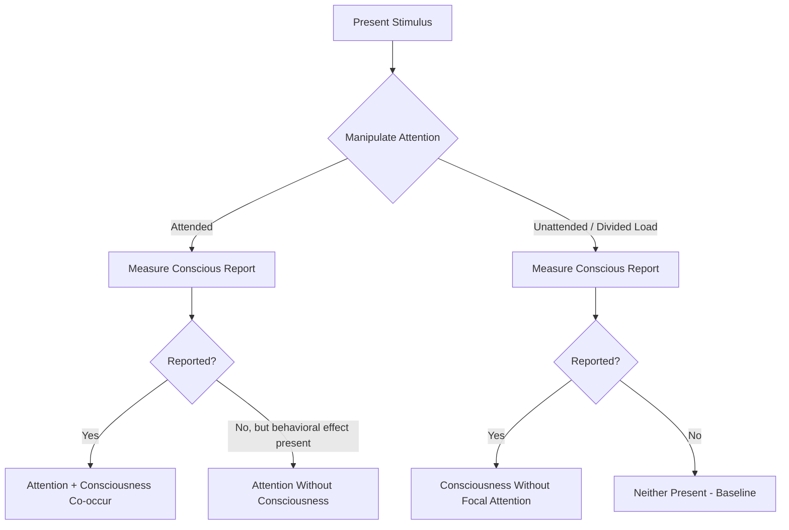

## Attention and Consciousness Dissociations

### Conceptual Distinction

Attention and consciousness are often conflated in everyday language but are treated as theoretically and empirically separable constructs in cognitive neuroscience. **Attention** is generally defined as a selective processing mechanism that prioritizes certain information (a location, feature, object, or task) for enhanced neural processing, typically at the expense of unattended information. **Consciousness**, in this context typically referring to phenomenal awareness, is the subjective experience of a stimulus or mental state — the presence of "something it is like" to perceive it. The dissociation research program in this area asks whether attention is necessary and/or sufficient for conscious perception, and vice versa, using experimental paradigms designed to manipulate one construct while holding the other constant or measuring it independently.

### Four Logical Possibilities

A useful organizing framework, most closely associated with the influential review by Koch and Tsuchiya (2007), lays out four logically distinct relationships that experimental evidence has been marshalled to support:

1. Attention without consciousness (attended but unconscious processing)
2. Consciousness without attention (conscious perception of unattended stimuli)
3. Attention and consciousness that co-occur and interact (the conventional default assumption)
4. Neither attention nor consciousness present (baseline unattended, unconscious processing)

The existence of well-supported evidence for possibilities (1) and (2) is the central empirical basis for treating attention and consciousness as dissociable rather than identical processes.

### Evidence for Attention Without Consciousness

**Subliminal Priming**

Stimuli presented below the threshold of conscious detection (e.g., via brief presentation combined with pattern masking) can nonetheless influence subsequent behavior, such as speeding responses to a related target word, demonstrating that stimulus processing — and in some paradigms, attentional selection of that stimulus — can occur without accompanying conscious report.

**Attentional Effects in Blindsight**

Patients with blindsight, resulting from damage to primary visual cortex (V1), report no conscious visual experience in the affected visual field yet can perform above chance on forced-choice tasks (e.g., localizing or discriminating a stimulus) when guessing. **[Inference]** Some studies have reported that visual attention can be captured by, or directed toward, stimuli in the blind field despite the complete absence of reported conscious awareness, which has been interpreted as evidence that spatial attention can operate on unconsciously processed information; however, given the rarity of this patient population, findings are based on comparatively small samples and should be treated with appropriate caution regarding generalizability.

**Attentional Capture Without Awareness (Masked Cueing Paradigms)**

Studies using masked peripheral cues (a cue presented and then rapidly masked so it is not consciously perceived) have shown that such cues can still produce measurable attentional cueing effects (faster responses to subsequently presented targets at the cued location), suggesting that at least some forms of spatial attentional orienting do not require conscious perception of the attention-capturing stimulus itself.

### Evidence for Consciousness Without (Focal) Attention

**Gist Perception Under Attentional Load**

Work by Li, VanRullen, Koch, and Perona (2002) demonstrated that observers could accurately report the presence or category of a briefly flashed natural scene (e.g., whether it contained an animal) even while performing a concurrent, attentionally demanding central task, suggesting that at least coarse ("gist") scene perception can proceed, and reach a reportable conscious state, with minimal focal attentional resources.

**Iconic Memory and Partial Report**

Sperling's (1960) classic partial-report paradigm demonstrated that observers retain a rich, briefly persisting visual representation (iconic memory) of a whole display, from which any cued subset can be reported, even though only a small number of items can be attended and reported in a whole-report condition. **[Inference]** This has been interpreted by some theorists as evidence that a form of conscious (or "phenomenal") representation of the entire display briefly exists prior to and independent of the focal attentional selection required for explicit report, though this interpretation — sometimes referred to as "overflow" — remains actively debated, with alternative accounts proposing that the rich pre-report representation reflects a fragile, low-resolution form of processing rather than genuine full phenomenal consciousness.

**Peripheral Awareness Outside the Attentional Spotlight**

Everyday introspective reports of a diffuse, low-resolution awareness of the visual periphery, outside the current focus of attention, are frequently cited as informal support for the possibility of consciousness without focal attention, although this line of evidence is more difficult to operationalize rigorously than laboratory paradigms.

### Contrasting Theoretical Positions

| Position | Core Claim | Representative Framing |
| --- | --- | --- |
| Attention is necessary for consciousness | No conscious perception without at least some attentional selection | Prinz's AIR (Attended Intermediate Representation) theory |
| Attention and consciousness are doubly dissociable | Each can occur without the other, via distinct (though interacting) neural mechanisms | Koch and Tsuchiya (2007) |
| Attention modulates but does not create consciousness | Attention regulates the content and clarity of an independently arising conscious state | Global Workspace-adjacent framings |

**[Speculation]** The question of whether any degree of attentional selection is a strict logical or neurobiological prerequisite for consciousness, versus attention merely enhancing or degrading an independently possible conscious state, remains unresolved in the field, and reasonable researchers holding access to the same body of evidence continue to draw different theoretical conclusions from it.

### Relevant Neural Substrates

- **Frontoparietal attention networks** (dorsal and ventral attention networks, including frontal eye fields, intraparietal sulcus, and temporoparietal junction) are consistently implicated in top-down and bottom-up attentional control.
- **Posterior "hot zone"** (posterior cortical regions including parietal, temporal, and occipital cortex) has been proposed by some theorists (e.g., proponents of Integrated Information Theory) as sufficient for certain conscious contents even with reduced frontal/attentional engagement, in contrast to frameworks such as Global Workspace Theory that emphasize a broader frontoparietal broadcast as necessary for conscious access.
- This anatomical debate is closely tied to, but not identical with, the attention-consciousness dissociation question, since it concerns which brain regions instantiate conscious content versus which instantiate attentional selection.

### Experimental Paradigm Logic

### Diagram: Dissociation Space (svg_diagram)

<svg xmlns="http://www.w3.org/2000/svg" viewBox="0 0 800 420">
<text x="400" y="25" text-anchor="middle" font-size="16" font-weight="bold" fill="#1a1a1a">Attention x Consciousness Dissociation Space (svg_diagram)</text>
<line x1="100" y1="350" x2="700" y2="350" stroke="#333" stroke-width="1.5" />
<line x1="100" y1="350" x2="100" y2="60" stroke="#333" stroke-width="1.5" />
<text x="400" y="385" text-anchor="middle" font-size="11">Attention (Low to High)</text>
<text x="40" y="205" text-anchor="middle" font-size="11" transform="rotate(-90 40,205)">Consciousness (Low to High)</text>
<rect x="120" y="80" width="250" height="130" fill="#fce8e6" stroke="#c0392b" />
<text x="245" y="140" text-anchor="middle" font-size="10">High Attention</text>
<text x="245" y="155" text-anchor="middle" font-size="10">Low Consciousness</text>
<text x="245" y="175" text-anchor="middle" font-size="9">(masked cueing, blindsight capture)</text>
<rect x="430" y="230" width="250" height="100" fill="#eaf2fb" stroke="#2b6cb0" />
<text x="555" y="270" text-anchor="middle" font-size="10">Low Attention</text>
<text x="555" y="285" text-anchor="middle" font-size="10">High Consciousness</text>
<text x="555" y="300" text-anchor="middle" font-size="9">(gist perception, iconic memory)</text>
<rect x="430" y="80" width="250" height="130" fill="#eafaf1" stroke="#1e8449" />
<text x="555" y="140" text-anchor="middle" font-size="10">High Attention</text>
<text x="555" y="155" text-anchor="middle" font-size="10">High Consciousness</text>
<text x="555" y="175" text-anchor="middle" font-size="9">(conventional focal perception)</text>

<text x="400" y="410" text-anchor="middle" font-size="10" fill="#555">Off-diagonal cells constitute the empirical basis for treating the two constructs as dissociable.</text>

</svg>

### Example: A Concrete Dissociation Experiment

**Example**

A representative masked-cueing paradigm demonstrating attention without consciousness:

1. A brief peripheral cue (e.g., 16 ms) is presented at one of two locations, immediately followed by a pattern mask, rendering the cue subjectively invisible (verified via a separate forced-choice detection task showing chance-level performance).
2. A target stimulus then appears at either the cued or an uncued location, and participants perform a simple discrimination task on it.
3. Response times are faster for targets appearing at the previously (unconsciously) cued location than the uncued location, despite participants reporting no awareness of the cue itself.
4. **Interpretation**: the spatial location of the invisible cue nonetheless captured and reallocated attentional resources, producing a measurable behavioral (attentional) effect entirely dissociated from conscious detection of the cueing stimulus.

**[Inference]** Such findings are widely replicated for simple, low-level visual cueing effects; the extent to which more complex, semantically rich forms of attentional selection can similarly operate entirely outside awareness is less consistently established across the literature.

### Conclusion

Attention and consciousness, while tightly coupled under most everyday conditions, are dissociable along at least two empirically supported dimensions: attentional selection can occur and produce measurable behavioral consequences without accompanying conscious report (as in masked cueing and some blindsight findings), and conscious perception of at least coarse stimulus properties can occur outside the current focus of attention (as in gist perception under attentional load and iconic memory overflow). These dissociations have motivated a family of theoretical positions differing in whether attention is treated as strictly necessary, merely modulatory, or genuinely independent of phenomenal consciousness, a question that remains an active area of theoretical and empirical investigation rather than a settled matter.

**Related Topics**

- Global Workspace Theory and Integrated Information Theory of consciousness
- Blindsight and residual visual function after V1 damage
- Iconic memory and the "overflow" debate in conscious perception
- Neural correlates of consciousness (NCC) research program
- Subliminal priming and unconscious processing
- Frontoparietal versus posterior cortical theories of conscious content
- Inattentional blindness and change blindness paradigms