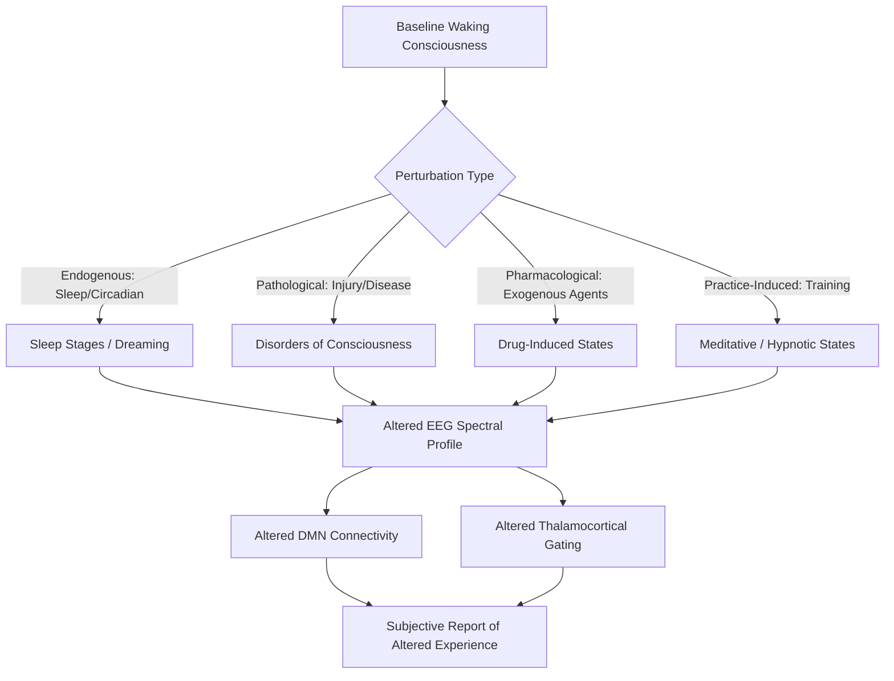

## Altered States of Consciousness

### Definition and Conceptual Framework

Altered states of consciousness (ASC) refer to any mental state that deviates measurably from a person's normal, alert, waking baseline in subjective experience, cognitive function, and/or neurophysiological activity. The term was popularized by Charles Tart (1969, 1972), who defined an ASC as a qualitative shift in the pattern of mental functioning such that the experiencer feels their consciousness is functioning distinctly differently from usual, not merely quantitatively (e.g., more or less alert) but structurally differently.

Key dimensions along which states are typically characterized include:

- **Arousal level**: ranging from coma/deep sleep to hyperarousal (panic, mania)
- **Awareness/responsiveness**: capacity to perceive, integrate, and report on internal and external stimuli
- **Self-referential processing**: sense of agency, body ownership, and narrative self-continuity
- **Perceptual fidelity**: degree of correspondence between subjective percepts and external reality

[Inference] There is no single agreed-upon neurobiological marker that universally defines "altered" states across all cases; researchers instead rely on converging behavioral, phenomenological, and neuroimaging criteria specific to each state category.

### Historical and Theoretical Background

Tart's discrete state approach proposed that consciousness operates in distinct, stable configurations ("d-SoCs") rather than along a single continuous dimension. This contrasted with earlier unidimensional arousal models (e.g., simple wake-sleep continua) by emphasizing qualitative reorganization of subsystems (perception, memory, emotion, sense of time).

Later theoretical frameworks reframed ASC research using formal neuroscience constructs:

- **Global Workspace Theory (GWT)** — Baars; altered states reflect changes in the "broadcasting" capacity of a global neuronal workspace that integrates and distributes information across cortical modules.
- **Integrated Information Theory (IIT)** — Tononi; consciousness level corresponds to a system's capacity for integrated information ($\Phi$), providing a quantitative (though contested) approach to comparing states.
- **Entropic Brain Hypothesis** — Carhart-Harris et al. (2014); proposes that the richness of conscious experience correlates with the entropy (unpredictability/diversity) of brain activity, with psychedelic states representing high-entropy "primary states" and normal waking consciousness representing a more constrained, low-entropy "secondary state" shaped by learning and reality-testing constraints.

### Neurophysiological Correlates: General Framework

Most ASC categories are characterized using a common toolkit of measures:

- **EEG spectral power**: relative power in delta (0.5–4 Hz), theta (4–8 Hz), alpha (8–12 Hz), beta (12–30 Hz), and gamma (30–100 Hz) bands
- **Functional connectivity**: correlation of BOLD signal (fMRI) or phase synchrony (EEG/MEG) between brain regions or networks
- **Default Mode Network (DMN) activity**: a set of midline and lateral parietal regions (medial prefrontal cortex, posterior cingulate cortex, angular gyrus) active during self-referential, mind-wandering, and autobiographical processing; DMN integrity is a recurring variable across nearly every ASC category
- **Thalamocortical dynamics**: the thalamus acts as a relay and gating structure; disruptions in thalamocortical loops are implicated in states ranging from sleep to anesthesia to disorders of consciousness

### Sleep and Dreaming States

Sleep is the most universally experienced and best-characterized ASC, organized into non-REM (NREM) and REM stages across ~90-minute ultradian cycles.

**NREM stages:**

- **N1**: transitional drowsiness; theta activity emerges; hypnagogic imagery may occur
- **N2**: sleep spindles (11–16 Hz bursts) and K-complexes appear, generated via thalamocortical circuits; represents the majority of total sleep time
- **N3 (slow-wave sleep)**: high-amplitude delta waves; associated with reduced consciousness, memory consolidation (particularly declarative memory via hippocampal-neocortical dialogue), and growth hormone release

**REM sleep:**

- Characterized by desynchronized, low-amplitude, mixed-frequency EEG resembling waking activity, muscle atonia (mediated by the sublaterodorsal nucleus/subcoeruleus and glycinergic/GABAergic inhibition of motor neurons), and rapid eye movements
- Vivid, narratively complex dreaming occurs predominantly (though not exclusively) in REM
- **Activation-Synthesis Hypothesis** (Hobson & McCarley, 1977): dreams arise from the forebrain's attempt to synthesize meaning from random pontine brainstem activation (PGO waves)
- **AIM model** (Hobson): three-dimensional state space of Activation, Input-output gating, and neuromodulation (aminergic/cholinergic ratio)
- Cholinergic systems (pedunculopontine and laterodorsal tegmental nuclei) drive REM onset while aminergic systems (locus coeruleus noradrenergic, raphe serotonergic) are suppressed — the "reciprocal interaction model"

**Lucid dreaming**: a hybrid state in which REM-typical physiology co-occurs with partial restoration of frontal executive function and metacognitive awareness. [Inference] Neuroimaging (Voss et al., 2009) suggests increased gamma-band activity and frontal/frontolateral EEG coherence during lucidity relative to standard REM, though sample sizes in this literature remain small.

### Pharmacologically Induced States

**Classic psychedelics (5-HT2A agonists: psilocybin, LSD, DMT, mescaline)**

- Primary mechanism: agonism at serotonin 5-HT2A receptors, particularly on layer V pyramidal neurons in cortex
- Neuroimaging findings (Carhart-Harris et al.): decreased activity and blood flow in DMN hub regions (medial prefrontal cortex, posterior cingulate cortex), decreased within-network integrity of major resting-state networks, and increased global functional connectivity/entropy ("desegregation" of normally modular networks)
- Subjective effects: ego dissolution, synesthesia, altered time perception, mystical-type experiences
- **Relaxed Beliefs Under Psychedelics (REBUS) model** (Carhart-Harris & Friston, 2019): psychedelics reduce the precision-weighting of high-level priors (beliefs) in a predictive processing hierarchy, allowing bottom-up sensory and affective information greater influence on conscious content

**Dissociatives (NMDA receptor antagonists: ketamine, PCP)**

- Mechanism: non-competitive antagonism of NMDA glutamate receptors, particularly on GABAergic interneurons, producing paradoxical cortical disinhibition
- Effects: dissociation from body/self (depersonalization, derealization), analgesia, at higher doses a dissociative anesthetic state ("K-hole")
- Distinct connectivity signature from classic psychedelics: increased frontal-parietal disconnection in some studies

**GABAergic/anesthetic agents (propofol, sevoflurane, benzodiazepines)**

- Mechanism: potentiation of inhibitory GABA-A receptor signaling
- Produces graded loss of consciousness correlating with breakdown of long-range thalamocortical and frontoparietal connectivity, and collapse of information integration/complexity (measured via the Perturbational Complexity Index, PCI; Casali et al., 2013)
- Used clinically as an operational model for reversible loss of consciousness in anesthesiology

**Stimulants and empathogens (amphetamines, MDMA)**

- Increase monoaminergic (dopamine, norepinephrine, serotonin) release and reduce reuptake
- Produce heightened arousal, euphoria, and (for MDMA specifically) prosocial/empathogenic effects linked to oxytocin release and amygdala reactivity reduction

### Meditative and Contemplative States

Meditation practices are heterogeneous but commonly categorized by attentional strategy:

- **Focused Attention (FA)** meditation: sustained attention on a single object (e.g., breath); associated with increased activity in dorsolateral prefrontal cortex and anterior cingulate cortex during attentional monitoring, with experienced practitioners showing reduced effortful engagement over time
- **Open Monitoring (OM)** meditation: non-reactive awareness of the full field of experience; associated with altered DMN activity and reduced mind-wandering-related self-referential processing
- **Non-dual/Loving-kindness practices**: associated with distinct patterns of frontal midline theta and gamma synchrony in some long-term practitioner studies

[Inference] Long-term meditation practice has been associated with structural changes (e.g., cortical thickness in insula and prefrontal regions) in several cross-sectional studies, though causal inference is limited by self-selection and the correlational nature of most such designs.

### Hypnosis

Hypnosis is operationalized as a state of focused attention and heightened suggestibility, typically induced via a structured induction procedure.

- Neuroimaging shows altered activity in the anterior cingulate cortex and functional decoupling between the dorsolateral prefrontal cortex (executive control) and networks involved in monitoring/attribution of agency, potentially explaining suggested involuntariness of hypnotic responses
- **Theories of hypnosis** are divided between "state" theories (hypnosis reflects a genuine altered neurocognitive state, e.g., dissociated control theory) and "non-state"/social-cognitive theories (hypnotic responses reflect role-enactment and expectation effects without requiring a qualitatively distinct state)
- [Unverified] The degree to which hypnotic susceptibility reflects stable trait-level neural differences (e.g., in fronto-parietal connectivity) versus contextual/motivational factors remains actively debated in the literature.

### Pathological and Clinical Altered States

**Disorders of consciousness** (distinguished by arousal and awareness):

- **Coma**: absence of both arousal and awareness; eyes closed, no sleep-wake cycles
- **Vegetative State/Unresponsive Wakefulness Syndrome (UWS)**: preserved arousal (sleep-wake cycles, eye-opening) but no behavioral evidence of awareness
- **Minimally Conscious State (MCS)**: inconsistent but reproducible evidence of awareness (e.g., visual tracking, purposeful movement)
- Diagnosis is complicated by covert awareness — some MCS/UWS patients show command-following activity on fMRI or EEG despite absent behavioral response (Owen et al., 2006; the "mental imagery" paradigm using motor vs. spatial navigation imagery)

**Seizure-related and other clinical states:**

- Absence seizures: brief lapses of awareness with generalized 3 Hz spike-wave EEG discharges, implicating thalamocortical oscillatory circuits
- Depersonalization/derealization disorder: persistent, non-substance-induced sense of detachment from self or environment
- Near-death experiences (NDEs): reported phenomenology (life review, tunnel/light perception, out-of-body sensations) has been linked in some hypotheses to REM intrusion, cerebral hypoxia/anoxia, and NMDA receptor dysregulation, though [Speculation] no single mechanistic account is broadly accepted as sufficient to explain the full phenomenological range reported.

### Sensory Deprivation and Induced States

- **Flotation-REST (Restricted Environmental Stimulation Therapy)**: minimizes exteroceptive sensory input; associated with reported reductions in anxiety and altered body-boundary perception, [Inference] plausibly via reduced sensory precision-weighting analogous to predictive-processing accounts of other ASCs
- **Ganzfeld procedure**: uniform, unstructured visual/auditory field; can induce hallucination-like perceptual effects, thought to arise from the brain's tendency to generate structure amid degraded sensory input (a demonstration of top-down perceptual inference)
- **Breathwork (e.g., holotropic breathwork)**: voluntary hyperventilation-induced hypocapnia altering cerebral blood flow and cortical excitability, associated with reported non-ordinary experiences

### Predictive Processing as a Unifying Framework

An influential contemporary approach frames consciousness, and its alterations, in terms of hierarchical predictive processing: the brain continuously generates top-down predictions about sensory causes, compares them against bottom-up prediction errors, and updates an internal generative model.

$$P(\text{cause} \mid \text{sensory data}) \propto P(\text{sensory data} \mid \text{cause}) \cdot P(\text{cause})$$

Under this framework:

- **Psychedelics** reduce the precision (confidence weighting) of high-level priors, allowing greater influence of raw sensory/affective signals (REBUS model)
- **Sleep/dreaming** may reflect a state where the generative model operates with minimal external sensory constraint, generating internally consistent but externally unconstrained percepts
- **Anesthesia** disrupts the hierarchical message-passing (particularly top-down feedback connections) required to integrate predictions across cortical levels
- **Meditation** may retrain the precision-weighting assigned to interoceptive versus exteroceptive and conceptual/self-referential predictions

[Inference] While predictive processing offers a parsimonious unifying vocabulary across otherwise disparate ASC categories, it remains a high-level theoretical framework whose specific quantitative predictions are still being empirically tested and refined across different ASC types.

### Measurement Approaches

| Method | What it Captures | Common ASC Application |
| --- | --- | --- |
| EEG spectral/coherence analysis | Oscillatory power and synchrony | Sleep staging, meditation, psychedelics |
| fMRI resting-state connectivity | Network-level integration/segregation | DMN changes across nearly all ASC categories |
| Perturbational Complexity Index (PCI) | Brain's capacity to integrate information following a perturbation (TMS-EEG) | Distinguishing wakefulness, sleep, anesthesia, disorders of consciousness |
| Phenomenological self-report scales | Subjective structure of experience | Altered States of Consciousness Rating Scale (5D-ASC), Mystical Experience Questionnaire |
| Behavioral/command-following paradigms | Residual awareness in unresponsive patients | Disorders of consciousness (active fMRI paradigms) |

### Key Points

- ASC is best understood as a family of qualitatively distinct configurations of arousal, awareness, and self-referential processing rather than a single phenomenon
- DMN activity, thalamocortical connectivity, and measures of neural complexity (e.g., PCI) are recurring — though not universal — correlates across sleep, pharmacological, pathological, and contemplative states
- Predictive processing and the entropic brain hypothesis offer competing but complementary unifying frameworks linking subjective phenomenology to measurable neural dynamics
- Clinical distinctions (e.g., UWS vs. MCS vs. covert awareness) carry direct diagnostic and ethical significance in disorders-of-consciousness populations

### Related Topics

- Predictive processing and the Bayesian brain hypothesis
- Default Mode Network: structure, function, and clinical relevance
- Neural correlates of consciousness (NCC) research program
- Global Workspace Theory vs. Integrated Information Theory
- Psychopharmacology of serotonergic and glutamatergic systems
- Sleep architecture and memory consolidation mechanisms
- Anesthesia mechanisms and depth-of-anesthesia monitoring
- Covert awareness detection in disorders of consciousness (active/passive fMRI and EEG paradigms)
- Phenomenology and qualia in philosophy of mind
- Metacognition and the neural basis of self-awareness