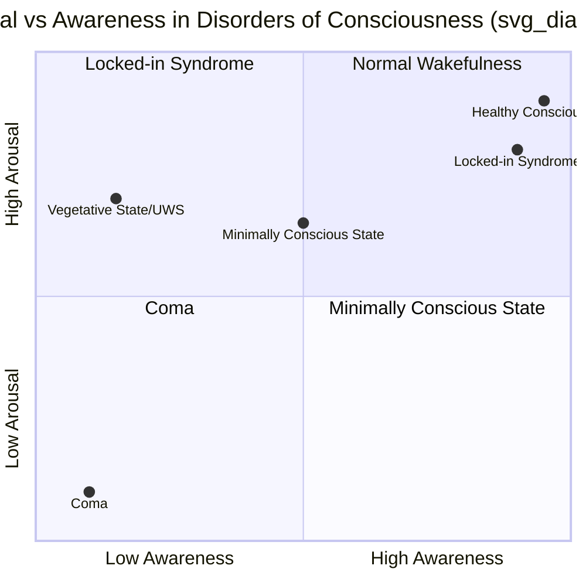

## Disorders of Consciousness

### Overview

Disorders of consciousness (DoC) are a spectrum of clinical conditions resulting from severe brain injury in which the normal relationship between wakefulness (arousal) and awareness (content) is disrupted. These conditions are distinguished along two independent axes: **arousal** (eye-opening, sleep-wake cycles, brainstem-mediated) and **awareness** (purposeful responsiveness to self and environment, cortically mediated). Understanding DoC requires integrating brainstem physiology, thalamocortical connectivity, network-level neuroscience, and clinical behavioral assessment.

### The Arousal-Awareness Framework

$$\text{Consciousness} = f(\text{Arousal}, \text{Awareness})$$

- **Arousal** is regulated primarily by the ascending reticular activating system (ARAS), originating in the brainstem (pontine and midbrain tegmentum) and projecting via the thalamus (intralaminar nuclei) and basal forebrain to the cortex.
- **Awareness** depends on the integrity and functional connectivity of widespread cortico-cortical and thalamocortical networks, particularly frontoparietal association cortex.

A useful heuristic: arousal is the "level" of consciousness (is the light switch on?), while awareness is the "content" of consciousness (what is the light illuminating?). Brain injury can dissociate these two dimensions, producing clinically distinct syndromes.

### Neuroanatomical Substrates

**Ascending Reticular Activating System (ARAS)**

- Originates in brainstem nuclei: pedunculopontine tegmental nucleus (PPT), laterodorsal tegmental nucleus (LDT), locus coeruleus (noradrenergic), raphe nuclei (serotonergic), and parabrachial complex.
- Two principal ascending routes: a dorsal route through the thalamus (intralaminar and midline nuclei) to diffusely activate cortex, and a ventral route through the hypothalamus and basal forebrain (cholinergic projections).
- Lesions to the ARAS or its thalamic relays are sufficient to produce coma even with an intact cortex, illustrating that arousal is a necessary substrate for awareness but not equivalent to it.

**Thalamocortical System**

- The **central thalamus** (intralaminar nuclei, particularly the central lateral nucleus) is critical for maintaining cortical arousal and has been a target for neuromodulatory interventions (e.g., central thalamic deep brain stimulation).
- Thalamocortical "gating" is thought to regulate whether sensory and internally generated signals reach the level of integrated, reportable awareness.

**Default Mode Network (DMN) and Frontoparietal Networks**

- Awareness content, particularly self-referential and environmental awareness, correlates with the functional integrity of the DMN (medial prefrontal cortex, posterior cingulate/precuneus, angular gyrus) and the frontoparietal executive network.
- Graded loss of consciousness across DoC correlates with graded disruption of DMN connectivity, as demonstrated in resting-state fMRI studies.

### Classification of Disorders of Consciousness

#### Coma

- **Definition:** Complete absence of both arousal and awareness. No eye-opening (spontaneous or to stimulation), no sleep-wake cycles, no purposeful behavior.
- **Pathophysiology:** Typically caused by bilateral cortical/subcortical damage or brainstem/ARAS lesions (e.g., traumatic brain injury, hypoxic-ischemic injury following cardiac arrest, brainstem stroke, or metabolic/toxic encephalopathy).
- **Duration:** By convention, coma is a time-limited state; it typically evolves within 2–4 weeks into death, an unresponsive wakefulness syndrome, a minimally conscious state, or (rarely) direct recovery of consciousness, as the brain either regains sleep-wake cycling or does not.
- **Key Points**
  - No eye-opening to any stimulus.
  - Glasgow Coma Scale (GCS) typically ≤8.
  - Reflexive brainstem responses (pupillary, corneal, oculocephalic) may be present or absent depending on lesion level and are used to localize brainstem injury.

#### Unresponsive Wakefulness Syndrome (UWS) / Vegetative State

- **Definition:** Return of arousal (sleep-wake cycles, spontaneous eye-opening) without any behavioral evidence of awareness of self or environment. The term "Unresponsive Wakefulness Syndrome" (UWS) was proposed in 2010 to replace "vegetative state," partly to reduce the pejorative connotation of the older term.
- **Pathophysiology:** Reflects preserved brainstem/ARAS function driving arousal cycles, combined with severe cortical or thalamocortical disconnection preventing integration of information into awareness. Diffuse axonal injury and thalamic damage are common substrates.
- **Behavioral Features**
  - Spontaneous eye-opening and sleep-wake cycles present.
  - Reflexive but non-purposeful movements (e.g., grimacing, roving eye movements) may occur.
  - No reproducible, purposeful response to command, no language comprehension, no visual pursuit that indicates awareness.
- **Diagnostic Criteria (adapted from established clinical guidelines)**
  1. No evidence of awareness of self or environment.
  2. No sustained, reproducible, purposeful, or voluntary behavioral response to visual, auditory, tactile, or noxious stimuli.
  3. No evidence of language comprehension or expression.
  4. Sleep-wake cycles present.
  5. Sufficiently preserved hypothalamic and brainstem autonomic functions to permit survival with medical/nursing care.
  6. Bowel and bladder incontinence.
  7. Variable preservation of cranial nerve and spinal reflexes.
- **Persistent vs. Permanent:** "Persistent" UWS refers to a state lasting beyond one month; "permanent" denotes a judgment about irreversibility, historically applied after 3 months (non-traumatic etiology) or 12 months (traumatic etiology) — though [Inference] these temporal cutoffs have been increasingly challenged as covert awareness detection methods (see below) reveal misdiagnosis rates.

#### Minimally Conscious State (MCS)

- **Definition:** Introduced by Giacino and colleagues in 2002, MCS describes severely altered consciousness with **minimal but clearly discernible behavioral evidence of self- or environmental awareness**, occurring inconsistently but reproducibly.
- **Pathophysiology:** Reflects partial preservation of thalamocortical and cortico-cortical connectivity sufficient for fragmentary integration of information, but insufficient for consistent, functional communication.
- **Subclassification**
  - **MCS-minus (MCS−):** Low-level behavioral evidence — visual pursuit, localization to noxious stimulation, contingent (non-reflexive) motor behaviors such as appropriate reaching, or simple automatic motor reactions (e.g., appropriate smiling/crying to emotional stimuli).
  - **MCS-plus (MCS+):** Higher-level behavioral evidence — command-following, intelligible verbalization, or non-functional (inconsistent) communication (yes/no responses that are not always accurate).
- **Emergence from MCS (eMCS):** Defined by the return of reliable functional communication (accurate yes/no responses across trials) and/or functional object use, marking the transition out of the DoC spectrum.
- **Key Points**
  - Behaviors must be reproducible or sustained long enough to distinguish them from reflexive activity, but may be inconsistent from examination to examination — a major source of diagnostic difficulty.
  - Prognosis for MCS is generally more favorable than UWS, though considerable heterogeneity exists.

#### Cognitive Motor Dissociation (CMD) / "Covert Awareness"

- **Definition:** A category identified through advanced neuroimaging or electrophysiology in patients who are behaviorally diagnosed as UWS or low-level MCS but who demonstrate willful, command-driven brain activity that cannot be detected at the bedside due to severe motor impairment.
- **Detection Paradigms**
  - **fMRI mental imagery task** (Owen et al., 2006): Patients are asked to imagine playing tennis (activating supplementary motor area) versus imagining navigating their home (activating parahippocampal gyrus, posterior parietal cortex). Willful, sustained, and appropriately differentiated activation patterns indicate command-following despite absent overt behavior.
  - **EEG-based command following:** Motor imagery tasks decoded via EEG (e.g., asking patients to imagine moving their right hand vs. toes) using machine-learning classifiers on sensorimotor rhythms.
  - **Auditory oddball / mismatch negativity (MMN) paradigms:** Assess pre-attentive and attentive auditory discrimination as a marker of residual cortical processing, though these are markers of processing rather than direct proof of willful awareness.
- **Clinical Significance:** [Unverified — figures vary across studies] Estimates from multiple independent cohorts suggest that roughly 15–20% of patients who appear behaviorally unresponsive show evidence of CMD on advanced testing, though exact prevalence depends on injury etiology, time since injury, and paradigm sensitivity. This has substantial implications for prognosis, family counseling, pain management, and end-of-life decision-making.

#### Locked-in Syndrome (LIS)

- **Important distinction:** LIS is **not** technically a disorder of consciousness in the arousal/awareness sense — it is a state of preserved consciousness with de-efferentation (near-total paralysis).
- **Pathophysiology:** Typically caused by a ventral pontine lesion (e.g., basilar artery occlusion) that interrupts corticospinal and corticobulbar tracts while sparing the ARAS (located more dorsally in the tegmentum) and, critically, sparing ascending sensory pathways and often vertical eye movement/blinking pathways (supranuclear oculomotor control).
- **Presentation:** Patients are fully awake and aware but quadriplegic and anarthric (unable to speak), typically retaining only vertical eye movement and blinking as a channel for communication.
- **Classification**
  - **Classic LIS:** Vertical eye movement and blinking preserved.
  - **Incomplete LIS:** Some additional voluntary movement remnants.
  - **Total LIS (TLS):** Complete immobility including loss of eye movement, eliminating all voluntary communication channels — an extreme case highlighting the ethical urgency of distinguishing LIS from UWS/MCS.
- **Key Points**
  - Frequently misdiagnosed as UWS at initial presentation because the paralysis masks intact awareness — historically one of the strongest arguments for rigorous, repeated behavioral assessment and neuroimaging-based verification.

### Diagnostic Tools and Assessment

**Standardized Behavioral Scales**

- **Coma Recovery Scale-Revised (CRS-R):** The current gold-standard bedside behavioral assessment, comprising six subscales (auditory, visual, motor, oromotor/verbal, communication, arousal), designed specifically to differentiate UWS from MCS and to track recovery trajectories.
- **Glasgow Coma Scale (GCS):** Widely used in acute settings (eye-opening, verbal response, motor response), but has limited resolution for distinguishing UWS from MCS in the chronic setting.
- **Full Outline of UnResponsiveness (FOUR) score:** An alternative to GCS designed to better capture brainstem reflexes and respiratory patterns, useful in intubated patients where verbal scoring is impossible.

**Neuroimaging**

- **Structural MRI:** Assesses lesion location/extent, particularly of the brainstem, thalamus, and corpus callosum (relevant to diffuse axonal injury).
- **Resting-state fMRI:** Assesses functional connectivity within networks such as the DMN; degree of DMN integrity correlates with level of consciousness across the DoC spectrum.
- **Task-based fMRI (active paradigms):** As described above for CMD detection.
- **PET (18F-FDG):** Measures cerebral glucose metabolism; global metabolic rate and specifically frontoparietal metabolism correlate with level of consciousness. A relative preservation of metabolism in a "consciousness network" (comprising precuneus/posterior cingulate, and lateral fronto-parietal cortices bilaterally) is associated with better prognosis.

**Electrophysiology**

- **Standard EEG:** Assesses background rhythms, reactivity to stimulation, and epileptiform activity; reactivity to external stimuli is a favorable prognostic sign.
- **Event-related potentials (ERPs):**
  - **P300:** Indexes attention and stimulus discrimination/updating; presence of P300 to the patient's own name is associated with better outcome.
  - **Mismatch negativity (MMN):** Indexes pre-attentive auditory change detection.
- **Perturbational Complexity Index (PCI):** Combines TMS (transcranial magnetic stimulation) with high-density EEG to measure the complexity of the brain's electrical response to a direct cortical perturbation. Derived from principles of Integrated Information Theory (IIT), PCI quantifies the brain's capacity for information integration and differentiation, and has demonstrated graded reductions from wakefulness → MCS → UWS → anesthesia → coma, providing an theory-informed, stimulus-independent marker of the "level" of consciousness.

$$\text{PCI} \propto \frac{\text{Algorithmic complexity of EEG response to TMS perturbation}}{\text{Number of activated cortical sources}}$$

### Comparative Summary Table

| Feature | Coma | UWS/Vegetative State | Minimally Conscious State | Locked-in Syndrome |
| --- | --- | --- | --- | --- |
| Eye-opening | Absent | Present (spontaneous) | Present | Present |
| Sleep-wake cycles | Absent | Present | Present | Present |
| Awareness of self/environment | Absent | Absent (behaviorally) | Minimal, inconsistent | Fully intact |
| Purposeful behavior | None | None (reflexive only) | Inconsistent but reproducible | Intact but severely limited output channel |
| Communication | None | None | Possibly non-functional (MCS+) | Preserved via eye movement/blink code |
| Primary lesion site | Bilateral cortex/ARAS | Cortical/thalamocortical disconnection with intact brainstem arousal | Partial cortico-thalamic preservation | Ventral pons (corticospinal/bulbar tracts) |
| Typical duration | Days to weeks (transitions) | Weeks to permanent | Weeks to permanent, or eMCS | Chronic, stable |

### Etiology

- **Traumatic brain injury (TBI):** Diffuse axonal injury is a hallmark mechanism, disrupting long-range white matter tracts connecting thalamus and cortex.
- **Hypoxic-ischemic injury:** Following cardiac arrest, produces watershed cortical injury and selective vulnerability of hippocampal, cortical layers III/V, and basal ganglia neurons; often associated with poorer prognosis than TBI-related DoC at equivalent severity.
- **Stroke:** Particularly brainstem (basilar artery territory) and bilateral thalamic infarcts.
- **Non-traumatic causes:** Encephalitis, toxic-metabolic encephalopathy, subarachnoid hemorrhage, and neurodegenerative end-stages.

[Inference] Etiology significantly influences prognosis, with traumatic DoC generally carrying a more favorable recovery trajectory than anoxic/hypoxic DoC, a pattern reflected in differing "permanence" timelines used clinically.

### Prognosis and Prognostic Markers

Favorable prognostic indicators [Inference/context-dependent — prognosis modeling is probabilistic and etiology-specific, not deterministic]:

- Younger age.
- Traumatic (vs. anoxic) etiology.
- Earlier emergence of MCS-level behaviors.
- Preserved brainstem reflexes and EEG reactivity.
- Presence of P300 response and preserved DMN connectivity on imaging.
- Detection of CMD/covert command-following.

Clinicians are cautioned against premature or overly deterministic prognostication, particularly within the first 28 days post-injury, given documented misdiagnosis rates (historical estimates in published case series range around 40% for UWS vs. MCS confusion, largely attributable to under-recognition of subtle MCS behaviors or motor impairments mimicking UWS) [Unverified — precise contemporary rates depend on assessment protocol and center expertise].

### Neuroethical Considerations

- **Misdiagnosis risk:** The behavioral overlap between UWS, low-level MCS, and (especially) LIS raises significant ethical stakes around end-of-life decisions, pain management, and resource allocation.
- **Pain and suffering:** Whether patients in UWS can experience pain is scientifically and ethically contested; current consensus generally holds that UWS patients, by definition, lack the cortical integration necessary for the conscious experience of pain, whereas MCS patients may retain some capacity for it — informing continued analgesic use in MCS.
- **Covert awareness and CMD:** The discovery of CMD has intensified debate over surrogate decision-making, right-to-die legislation, and the ethical obligation to use advanced diagnostics before withdrawing care.
- **Communication and autonomy:** For CMD and incomplete LIS patients, brain-computer interface (BCI) research aims to restore communication channels, directly bearing on preservation of patient autonomy.

### Emerging and Adjacent Research Directions

- **Central thalamic deep brain stimulation (DBS):** [Inference/investigational] Explored as a neuromodulatory approach to enhance arousal-network drive in select MCS patients; remains experimental and is not standard of care.
- **Amantadine:** The most substantial pharmacological evidence base exists for amantadine (a dopaminergic/NMDA-modulating agent), shown in randomized controlled trial data (Giacino et al., 2012) to accelerate the pace of functional recovery in patients with DoC following traumatic brain injury during the trial period, though effects on long-term ultimate outcome were less clear.
- **Non-invasive brain stimulation:** Transcranial direct current stimulation (tDCS) targeting left dorsolateral prefrontal cortex has shown [Unverified — mixed/inconsistent trial results across studies] transient behavioral improvements in some MCS cohorts.
- **Machine learning-based EEG classifiers:** Increasingly used to improve sensitivity of CMD detection at the bedside without requiring fMRI/PET infrastructure.

### Related Topics

- Ascending reticular activating system and brainstem arousal nuclei
- Default mode network and resting-state connectivity in altered consciousness
- Integrated Information Theory (IIT) and Global Neuronal Workspace Theory as frameworks for consciousness
- Anesthesia-induced unconsciousness as an experimental model for DoC
- Brain death and its differentiation from disorders of consciousness
- Neuroimaging biomarkers of consciousness (PCI, DMN connectivity, PET metabolism)
- Brain-computer interfaces for communication restoration in locked-in syndrome
- Ethical and legal frameworks for withdrawal of care in prolonged disorders of consciousness
- Coma Recovery Scale-Revised (CRS-R) administration and scoring in clinical practice
- Pediatric disorders of consciousness and developmental considerations