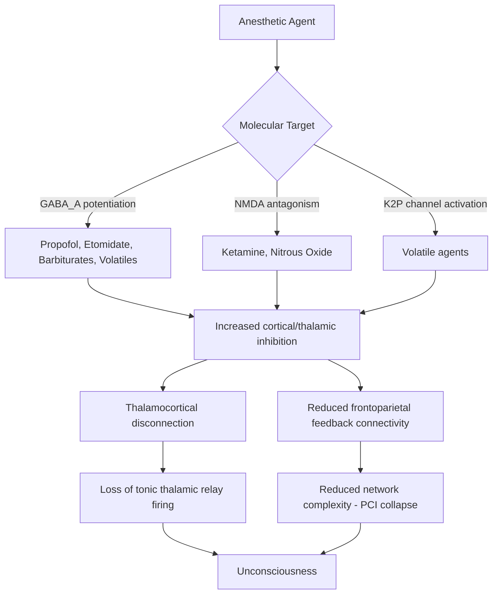

## Anesthesia and the Neural Basis of Unconsciousness

### Overview

General anesthesia is a pharmacologically induced, reversible state encompassing unconsciousness, amnesia, analgesia, and immobility. Unlike disorders of consciousness arising from structural injury, anesthetic unconsciousness is a controlled, titratable perturbation of neural systems, making it a powerful experimental model for probing the mechanisms of consciousness itself. Studying anesthesia allows researchers to causally manipulate consciousness while holding the underlying anatomy intact, distinguishing it from lesion-based studies of coma or vegetative states.

### Core Conceptual Distinction: Components of the Anesthetic State

- **Unconsciousness (hypnosis):** Loss of subjective experience and behavioral responsiveness.
- **Amnesia:** Failure to encode or consolidate memories of the perioperative period, mediated substantially by hippocampal and medial temporal lobe suppression.
- **Analgesia/antinociception:** Suppression of pain perception and autonomic responses to noxious stimuli, involving spinal and supraspinal mechanisms.
- **Immobility (areflexia):** Suppression of motor response to surgical stimulation, mediated largely at the spinal cord level rather than the brain.

[Inference] These four components are dissociable and mediated by at least partially distinct neural circuits and molecular targets — a key piece of evidence being that immobility can be achieved via spinal mechanisms even when supraspinal structures are less affected, as shown in decerebrate/spinalized animal preparations.

### Molecular Targets of Anesthetic Agents

**GABAergic Potentiation**

- Most intravenous anesthetics (propofol, etomidate, barbiturates) and volatile agents act primarily by potentiating **GABA_A receptors**, increasing chloride influx and enhancing inhibitory postsynaptic currents.
- This shifts the excitation-inhibition balance in cortical and subcortical circuits toward net inhibition, particularly affecting circuits with high GABA_A receptor density.

**NMDA Receptor Antagonism**

- Ketamine and nitrous oxide act primarily as **NMDA receptor antagonists**, blocking excitatory glutamatergic transmission. This produces a qualitatively distinct anesthetic state ("dissociative anesthesia") characterized by a different EEG signature and clinical presentation (e.g., preserved corneal/eye-opening reflexes, dream-like states) compared to GABAergic agents.

**Two-Pore-Domain Potassium Channels (K2P)**

- Volatile anesthetics (e.g., isoflurane, sevoflurane) also activate K2P background leak channels (e.g., TREK-1), hyperpolarizing neurons and reducing excitability independent of GABAergic mechanisms.

**Hyperpolarization-Activated Cyclic Nucleotide-Gated (HCN) Channels**

- Some agents modulate HCN channels in thalamocortical relay neurons, contributing to altered thalamic burst-firing patterns associated with unconsciousness.

$$I_{GABA_A} = g_{GABA_A} \times (V_m - E_{Cl^-})$$

Anesthetic potentiation increases $g_{GABA_A}$ (the GABA_A conductance), driving membrane potential $V_m$ closer to the chloride reversal potential $E_{Cl^-}$ and increasing inhibitory drive.

### Neural Circuit-Level Mechanisms

**Disruption of Arousal Nuclei**

- Anesthetics act on the same brainstem and hypothalamic arousal-promoting nuclei implicated in natural sleep: the ventrolateral preoptic nucleus (VLPO, GABAergic/galaninergic, sleep-promoting), locus coeruleus (noradrenergic), tuberomammillary nucleus (histaminergic), and orexinergic neurons of the lateral hypothalamus.
- [Inference/theoretical model] Propofol and related agents may act in part by activating VLPO neurons, engaging the same "flip-flop switch" circuitry that governs natural sleep-wake transitions, providing a mechanistic link between anesthetic and physiological unconsciousness — though anesthetic states show important EEG and neurochemical differences from natural sleep and should not be considered identical to it.

**Thalamocortical Disruption**

- A central and well-replicated finding across anesthetic agents (propofol, sevoflurane, ketamine) is disruption of **thalamocortical connectivity**, particularly reduced functional and effective connectivity between thalamus and frontal/parietal association cortex.
- Thalamic neurons shift from tonic firing (characteristic of wakefulness, supporting high-fidelity relay of sensory information) to burst firing (characteristic of reduced arousal states), degrading the fidelity of information transmission to cortex.

**Breakdown of Cortico-Cortical Connectivity and Information Integration**

- Anesthesia produces a marked reduction in **frontoparietal connectivity**, particularly in feedback (top-down) connections from frontal to sensory cortices, while feedforward (bottom-up) sensory processing may be relatively preserved at low-to-moderate doses.
- [Inference — supported by convergent but still-developing evidence] This asymmetric disruption of feedback connectivity is consistent with theories proposing that consciousness depends on recurrent, reentrant cortical processing rather than purely feedforward sensory transmission.
- Studies using **Perturbational Complexity Index (PCI)** — combining TMS with high-density EEG — demonstrate that anesthetic-induced unconsciousness is associated with a collapse in the brain's capacity to generate complex, differentiated responses to direct cortical perturbation, mirroring findings in coma and UWS.

**Loss of "Complexity" and Network Integration**

- EEG and MEG studies during anesthesia reveal increased low-frequency, high-amplitude slow-wave activity and a breakdown of long-range phase synchronization, alongside a spectral pattern often termed "anteriorization" of alpha rhythms with certain agents (notably propofol), reflecting altered thalamocortical alpha generators.
- Network-theoretic analyses show a shift from small-world, efficiently integrated network topology (balancing local specialization and global integration) toward more fragmented or randomly connected topology under anesthesia.

### Theoretical Frameworks Applied to Anesthesia Research

**Integrated Information Theory (IIT)**

- Proposes that consciousness corresponds to a system's capacity for integrated information ($\Phi$), requiring both differentiation (many distinct states) and integration (irreducibility to independent parts).
- Anesthetic-induced unconsciousness is interpreted as a reduction in the brain's effective $\Phi$, operationalized experimentally via PCI as a practical proxy measure.

**Global Neuronal Workspace Theory (GNWT)**

- Proposes that consciousness arises when information is "broadcast" widely across a distributed frontoparietal workspace, becoming available to multiple cognitive subsystems (memory, language, action planning).
- Under this framework, anesthetics are proposed to prevent local sensory information from achieving global workspace "ignition," despite relatively preserved local (unconscious) sensory processing — consistent with findings of preserved early evoked responses but abolished late (P3b-like) global broadcast signals under anesthesia.

**Entropic Brain / Network Fragmentation Hypothesis**

- [Inference/less consensus] Some models propose that reduced but non-zero neural signal diversity/entropy, rather than only loss of connectivity per se, is the more direct correlate of anesthetic unconsciousness, drawing parallels with reduced entropy signatures also observed in sleep and DoC.

### Neuroimaging and Electrophysiological Signatures

| Measure | Awake | Anesthetized (typical) |
| --- | --- | --- |
| EEG spectral pattern | Desynchronized, mixed frequency, prominent gamma/beta | Increased slow-wave (delta) power; agent-specific alpha changes (e.g., frontal alpha under propofol) |
| Thalamocortical connectivity | High, tonic firing mode | Reduced; shift to burst-firing mode |
| Frontoparietal effective connectivity | Strong bidirectional (especially top-down) | Selectively reduced top-down/feedback connectivity |
| PCI | High (~0.4–0.7 typical range) | Markedly reduced, overlapping with coma/UWS ranges |
| Cerebral metabolic rate (PET) | Baseline | Globally reduced, with disproportionate reductions in frontoparietal "consciousness network" |
| Network topology | Small-world, efficient integration | Fragmented, reduced long-range integration |

### Agent-Specific Considerations

- **Propofol:** Classic GABAergic anesthetic; produces characteristic frontal EEG alpha and slow-delta oscillations; strongly disrupts thalamocortical and frontoparietal connectivity in a dose-dependent manner.
- **Sevoflurane/Isoflurane (volatile agents):** Act via multiple targets (GABA_A, K2P channels); produce broadly similar large-scale connectivity disruption to propofol despite differing molecular profiles, supporting the idea of convergent circuit-level mechanisms despite divergent molecular targets.
- **Ketamine:** Produces a paradoxical EEG state with preserved or increased gamma power and can produce dissociative/psychedelic-like subjective phenomena at sub-anesthetic doses, despite behavioral unresponsiveness at anesthetic doses — a pattern that complicates simple "reduced activity = unconsciousness" models and instead suggests disorganized or non-integrated (rather than merely reduced) cortical activity as a contributing mechanism. [Inference] This dissociation is a key piece of evidence used to argue that unconsciousness is better characterized by loss of information integration than by simple reduction in overall neural activity.
- **Dexmedetomidine:** An alpha-2 adrenergic agonist acting via the locus coeruleus, producing a sedative state EEG- and behaviorally similar to natural non-REM sleep, useful for probing the overlap between anesthetic and physiological sleep circuitry.

### Anesthesia vs. Natural Sleep vs. Coma: Comparative Notes

- Anesthesia and non-REM sleep share overlapping neurochemical substrates (VLPO-mediated GABAergic/galaninergic inhibition of arousal nuclei) and some EEG similarities (slow-wave activity), but anesthesia produces a comparatively deeper and more sustained suppression of thalamocortical and cortico-cortical connectivity, and unlike sleep, does not exhibit the same cyclical alternation with REM-like states under steady-state dosing.
- Anesthesia is pharmacologically reversible and dose-titratable, in contrast to coma, which results from structural or diffuse metabolic injury; however, the endpoint electrophysiological signatures (reduced PCI, reduced frontoparietal connectivity) show substantial convergence across both states, supporting the use of anesthesia as an experimental model for understanding the loss of consciousness more broadly, including in pathological DoC.

### Practical/Clinical Relevance

- **Intraoperative awareness:** A rare but serious complication in which insufficient anesthetic depth allows partial preservation of consciousness (with or without explicit memory formation), motivating depth-of-anesthesia monitoring.
- **Depth-of-anesthesia monitoring:** Devices such as the Bispectral Index (BIS) derive a processed EEG-based index intended to estimate anesthetic depth; [Unverified/contested] the correlation between BIS values and true subjective unconsciousness is imperfect and agent-dependent, since BIS algorithms are primarily validated on GABAergic agents and behave atypically under ketamine or nitrous oxide.
- **PCI as an emerging bedside tool:** [Inference/investigational] Proposed as a theory-driven, more agent-independent alternative or complement to spectral EEG indices, though not yet in widespread routine clinical use.

### Example: Interpreting a Propofol EEG Transition

**Example**

As propofol infusion increases from sedative to anesthetic dose, a stereotyped EEG transition is often observed: initial frontal beta activation, followed by emergence of prominent frontal alpha oscillations (~8–12 Hz, "anteriorized alpha") coherent between frontal electrodes, and progressive increase in slow-delta power (<4 Hz) with loss of posterior alpha rhythm. This spatial reorganization of alpha rhythm (from posterior-dominant in wakefulness to frontal-dominant under propofol) is thought to reflect altered thalamocortical loop dynamics specific to GABAergic potentiation, and is a commonly cited example of an agent-specific electrophysiological signature used in both clinical monitoring and consciousness research.

### Related Topics

- Ascending reticular activating system and brainstem arousal nuclei
- Sleep-wake regulation and the flip-flop switch model (VLPO/orexin circuitry)
- Integrated Information Theory and Global Neuronal Workspace Theory
- Perturbational Complexity Index and TMS-EEG methodology
- Disorders of consciousness (coma, UWS, minimally conscious state)
- Intraoperative awareness and depth-of-anesthesia monitoring technology
- Thalamocortical circuit physiology and burst vs. tonic firing modes
- Ketamine and dissociative anesthesia as models of altered consciousness
- Default mode network disruption across altered states of consciousness