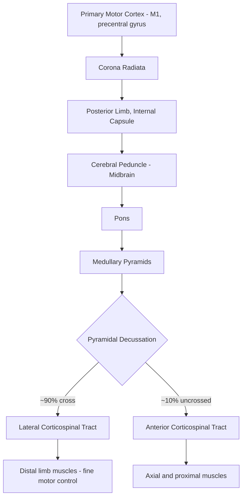

## Primary Motor Cortex and the Motor Homunculus

### Overview

The primary motor cortex (M1), located in the precentral gyrus (Brodmann area 4), is the principal cortical origin of voluntary movement commands. It exhibits a topographically organized representation of the body — the **motor homunculus** — in which different body parts are mapped onto distinct cortical territories, with area allocated in proportion to the fineness of motor control required rather than the physical size of the body part.

### Anatomical Localization

- **Location:** Precentral gyrus, immediately anterior to the central sulcus, forming the posterior bank of the frontal lobe's precentral gyrus.
- **Cytoarchitecture (Brodmann Area 4):** Characterized by the presence of unusually large pyramidal neurons in cortical layer V, known as **Betz cells**, among the largest neurons in the human cortex. M1 is also notable for having a poorly defined or absent layer IV (agranular cortex), consistent with its role as a primarily output/motor rather than input/sensory area.
- **Boundaries:** Bordered posteriorly by the central sulcus (separating it from primary somatosensory cortex, S1, in the postcentral gyrus) and anteriorly by premotor cortex and supplementary motor area (BA 6).

### The Corticospinal (Pyramidal) Tract

- M1 gives rise to a substantial proportion of fibers in the **corticospinal tract**, though M1 alone contributes roughly 30% of corticospinal fibers, with the remainder arising from premotor cortex, supplementary motor area, and primary somatosensory cortex.
- **Pathway:** Axons descend through the corona radiata, posterior limb of the internal capsule, cerebral peduncle (midbrain), and pons, then form the medullary pyramids.
- **Decussation:** Approximately 90% of corticospinal fibers cross (decussate) at the **pyramidal decussation** in the caudal medulla, forming the **lateral corticospinal tract**, which controls distal limb musculature (fine motor control of hands/fingers). The remaining ~10% continue uncrossed as the **anterior (ventral) corticospinal tract**, which typically crosses at the level of the spinal segment it innervates and primarily controls axial and proximal musculature.
- **Termination:** Fibers synapse either directly onto alpha motor neurons in the ventral horn (particularly prominent for hand/finger muscles, supporting fine independent digit control) or indirectly via spinal interneurons.

### The Motor Homunculus

**Historical Origin**

- First mapped by neurosurgeon **Wilder Penfield** in the 1930s–1950s at the Montreal Neurological Institute, using direct electrical stimulation of the exposed cortex in awake patients undergoing epilepsy surgery, who could verbally report or exhibit observable movements evoked by stimulation of specific cortical sites.
- Penfield and collaborator Edwin Boldrey published the resulting somatotopic maps, later popularized as the visual "homunculus" (Latin for "little man") — a distorted human figure whose body part sizes reflect cortical representation area rather than actual anatomical size.

**Somatotopic Organization**

- The homunculus is arranged along the precentral gyrus in a specific medial-to-lateral sequence:
  - **Medial** (on the medial surface, within the interhemispheric fissure): lower limb and foot representation.
  - **Dorsal/superior convexity:** trunk, hip.
  - **Mid-lateral convexity:** arm, hand, fingers (occupying a disproportionately large territory).
  - **Ventral/inferior lateral:** face, lips, tongue, and jaw (also disproportionately large).
- **Key Points**
  - Representation area is proportional to the density of motor units and the precision/complexity of movement required, not to muscle mass or limb size — hence the hand and mouth/lips occupy far more cortical territory than the trunk or leg, reflecting their role in fine motor tasks (dexterous finger movements, articulate speech).
  - This principle parallels the analogous distortion seen in the somatosensory homunculus (S1), where representation is proportional to receptor/innervation density rather than skin surface area.

**Illustration Note**

For a schematic coronal-section homunculus diagram, an SVG illustration is provided below depicting the relative allocation of cortical territory along the precentral gyrus (not anatomically precise, schematic only):

<svg xmlns="http://www.w3.org/2000/svg" viewBox="0 0 640 380" font-family="sans-serif">
<title>Motor Homunculus Along Precentral Gyrus (svg_diagram)</title>
<rect x="0" y="0" width="640" height="380" fill="#ffffff" />
<path d="M 60 320 Q 320 40 580 320" stroke="#333333" stroke-width="3" fill="none" />
<text x="320" y="20" text-anchor="middle" font-size="16" font-weight="bold">Motor Homunculus (svg_diagram) — Medial to Lateral along Precentral Gyrus</text>

<circle cx="90" cy="300" r="22" fill="#a8d5ba" stroke="#333" />
<text x="90" y="335" text-anchor="middle" font-size="12">Foot/Leg</text>
<text x="90" y="350" text-anchor="middle" font-size="10">(medial surface)</text>

<circle cx="180" cy="210" r="26" fill="#a8d5ba" stroke="#333" />
<text x="180" y="245" text-anchor="middle" font-size="12">Trunk/Hip</text>

<circle cx="260" cy="140" r="24" fill="#a8d5ba" stroke="#333" />
<text x="260" y="172" text-anchor="middle" font-size="12">Shoulder/Elbow</text>

<circle cx="330" cy="95" r="22" fill="#f4c76a" stroke="#333" />
<text x="330" y="125" text-anchor="middle" font-size="12">Wrist</text>

<circle cx="400" cy="70" r="42" fill="#f28e8e" stroke="#333" stroke-width="2" />
<text x="400" y="76" text-anchor="middle" font-size="13" font-weight="bold">Hand /</text>
<text x="400" y="92" text-anchor="middle" font-size="13" font-weight="bold">Fingers</text>
<text x="400" y="130" text-anchor="middle" font-size="10">(large territory)</text>

<circle cx="460" cy="95" r="26" fill="#f28e8e" stroke="#333" stroke-width="2" />
<text x="460" y="100" text-anchor="middle" font-size="12" font-weight="bold">Thumb</text>

<circle cx="510" cy="160" r="34" fill="#8ec6f2" stroke="#333" stroke-width="2" />
<text x="510" y="165" text-anchor="middle" font-size="12" font-weight="bold">Face</text>

<circle cx="545" cy="230" r="38" fill="#8ec6f2" stroke="#333" stroke-width="2" />
<text x="545" y="228" text-anchor="middle" font-size="12" font-weight="bold">Lips</text>
<text x="545" y="245" text-anchor="middle" font-size="10">(large territory)</text>

<circle cx="570" cy="290" r="24" fill="#8ec6f2" stroke="#333" />
<text x="570" y="295" text-anchor="middle" font-size="11">Jaw</text>

<circle cx="560" cy="335" r="26" fill="#8ec6f2" stroke="#333" stroke-width="2" />
<text x="560" y="340" text-anchor="middle" font-size="11" font-weight="bold">Tongue</text>

<text x="320" y="365" text-anchor="middle" font-size="11" font-style="italic">Circle size approximates relative cortical territory (not to anatomical scale)</text>

</svg>

### Functional Properties and Motor Coding

**Population Coding and Directional Tuning**

- Individual M1 neurons exhibit broad **directional tuning**, meaning each neuron fires maximally for a preferred movement direction but also fires (at lower rates) for a range of nearby directions, described mathematically by a cosine tuning function.
- Georgopoulos and colleagues demonstrated that the **population vector** — the vector sum of many individual neurons' preferred-direction contributions, weighted by their firing rates — accurately predicts the actual direction of an upcoming arm movement, even though no single neuron unambiguously encodes direction.

$$\vec{P}(t) = \sum_{i=1}^{n} w_i(t) \cdot \vec{C_i}$$

where $\vec{P}(t)$ is the population vector at time $t$, $\vec{C_i}$ is neuron $i$'s preferred direction, and $w_i(t)$ is a weighting term related to that neuron's firing rate.

**Complexity Beyond Simple Somatotopy**

- Although the homunculus is a useful pedagogical model, single-unit recording studies show substantial **overlap and interdigitation** of representations for different body parts, and individual M1 neurons often influence multiple muscles or joints rather than mapping one-to-one onto a single muscle — supporting a model in which M1 encodes movements or muscle synergies rather than a strict, discrete "piano-key" map of individual muscles.
- [Inference/still debated in current literature] Some evidence suggests M1 may represent higher-order movement parameters (direction, force, dynamics of the limb) integrated with lower-level muscle-specific output, rather than one exclusive coding scheme — this remains an active area of motor neuroscience research.

**Encoding of Force and Kinematics**

- M1 neuronal firing rates also correlate with movement parameters beyond direction, including force output, movement speed, and joint dynamics, indicating that M1 activity reflects a blend of kinematic and kinetic movement variables rather than a pure "command" signal alone.

### Cortical Motor Hierarchy: M1 in Context

| Region | Brodmann Area | Primary Role |
| --- | --- | --- |
| Primary Motor Cortex (M1) | BA 4 | Direct execution; largest single contributor to corticospinal output |
| Premotor Cortex (PMC) | BA 6 (lateral) | Movement planning, sensory-guided action selection, especially externally cued movements |
| Supplementary Motor Area (SMA) | BA 6 (medial) | Internally generated/self-initiated movement sequences, bimanual coordination |
| Posterior Parietal Cortex | BA 5, 7 | Sensorimotor transformation, spatial coding of targets for reaching/grasping |
| Primary Somatosensory Cortex (S1) | BA 1, 2, 3 | Provides critical proprioceptive/tactile feedback influencing M1 output |

### Clinical Correlates

- **Stroke affecting M1 or corticospinal tract:** Produces contralateral hemiparesis/hemiplegia, with the specific pattern of weakness reflecting the somatotopic location of the lesion (e.g., a lesion in the lateral convexity producing predominant arm/hand weakness).
- **Amyotrophic lateral sclerosis (ALS):** Progressive degeneration of both upper motor neurons (including Betz cells in M1) and lower motor neurons, producing a combination of spasticity (upper motor neuron signs) and flaccid weakness/fasciculations (lower motor neuron signs).
- **Jacksonian (focal) motor seizures:** Seizure activity originating in a discrete M1 site can produce a characteristic "march" of clonic movements that spreads across adjacent body parts, directly reflecting the mediolateral somatotopic sequence of the homunculus (e.g., seizure beginning in the hand and spreading to involve the face).
- **Cortical reorganization/plasticity:** Following amputation or peripheral nerve injury, M1 representations can reorganize over time, with adjacent body-part representations expanding into the deafferented region — a phenomenon studied extensively in relation to phantom limb phenomena. [Inference] The relationship between this cortical reorganization and phantom limb pain specifically remains actively debated, with some studies challenging the original "maladaptive plasticity" model.
- **Transcranial Magnetic Stimulation (TMS) mapping:** Non-invasive TMS can be used to map the motor cortex representation of specific muscles in humans by identifying stimulation sites producing motor-evoked potentials (MEPs) in target muscles, used clinically in pre-surgical planning and research contexts to study cortical excitability and plasticity.

### Example: Interpreting a Jacksonian March

**Example**

A patient develops a focal seizure beginning with rhythmic clonic jerking of the right thumb and index finger, which over roughly 30–60 seconds progressively spreads to involve the whole hand, then forearm, then upper arm and shoulder, without leg involvement. This progression is consistent with a seizure focus originating in the hand/finger region of the left M1 (given the disproportionately large, contiguous hand representation) with mediolateral spread along the precentral gyrus toward the more proximal upper-limb representation, illustrating the direct clinical relevance of homuncular somatotopy.

### Related Topics

- Premotor cortex and supplementary motor area in movement planning
- Corticospinal and corticobulbar tract anatomy and clinical lesions
- Population vector coding and Georgopoulos's directional tuning model
- Primary somatosensory cortex and the sensory homunculus
- Cortical plasticity and reorganization following deafferentation or amputation
- Transcranial magnetic stimulation (TMS) motor mapping methodology
- Upper motor neuron vs. lower motor neuron syndromes
- Basal ganglia and cerebellar contributions to motor control
- Brain-computer interfaces exploiting M1 population coding for prosthetic control