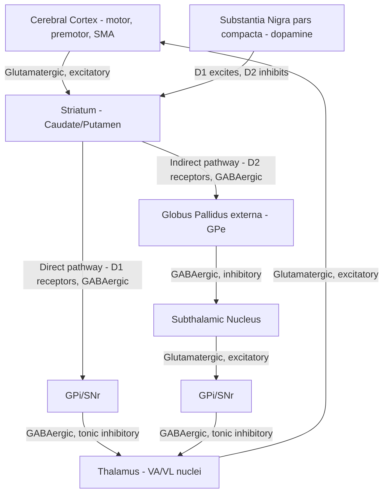

## Basal Ganglia Contributions to Movement

### Overview

The basal ganglia are a group of interconnected subcortical nuclei that do not project directly to the spinal cord but instead modulate movement indirectly by shaping cortical and brainstem motor output. Their principal computational role is commonly conceptualized as **action selection and gating** — facilitating desired movements while suppressing competing or unwanted motor programs — rather than generating movement commands themselves.

### Anatomical Components

**Core Nuclei**

- **Striatum** (input structure): composed of the **caudate nucleus** and **putamen** (together often called the "dorsal striatum" or, when considered as a functional unit, the "neostriatum"), plus the **nucleus accumbens** (ventral striatum, more associated with limbic/reward circuitry).
- **Globus pallidus:** divided into external segment (**GPe**) and internal segment (**GPi**); GPi serves as a principal output nucleus.
- **Substantia nigra:** divided into **pars compacta (SNc)**, the dopaminergic cell body region, and **pars reticulata (SNr)**, functionally analogous to GPi and serving as an additional output nucleus (particularly for oculomotor and orofacial circuits).
- **Subthalamic nucleus (STN):** a key excitatory (glutamatergic) node within the indirect pathway, located just below the thalamus.

**Functional Grouping**

- **Input nuclei:** Striatum (caudate, putamen, nucleus accumbens) — receives the majority of cortical afferents.
- **Output nuclei:** GPi and SNr — project to thalamus and brainstem, providing tonic inhibitory output.
- **Intrinsic nuclei:** GPe and STN — modulate signal flow between input and output stages.
- **Modulatory nucleus:** SNc — provides dopaminergic modulation critical for gating pathway balance.

### The Cortico-Basal Ganglia-Thalamocortical Loop

The basal ganglia are embedded within a large-scale loop: **cortex → striatum → (direct/indirect pathway processing) → output nuclei (GPi/SNr) → thalamus → back to cortex.** This loop is topographically organized into multiple parallel, largely segregated circuits (motor, oculomotor, associative/cognitive, and limbic loops), of which the motor loop is of primary relevance here.

### The Direct and Indirect Pathways

**Direct Pathway (Movement Facilitation)**

- Cortex excites striatal medium spiny neurons (MSNs) expressing **D1 dopamine receptors**.
- These D1-MSNs project directly (monosynaptically) to GPi/SNr via an inhibitory GABAergic projection.
- Since GPi/SNr are themselves tonically inhibitory to thalamus, inhibiting GPi/SNr **disinhibits** the thalamus, increasing thalamocortical excitatory drive back to cortex.
- **Net effect:** Direct pathway activation **facilitates** movement by releasing the thalamus (and downstream cortex) from tonic inhibition.

**Indirect Pathway (Movement Suppression)**

- Cortex excites a separate population of striatal MSNs expressing **D2 dopamine receptors**.
- These D2-MSNs project (via a polysynaptic route) first to GPe (inhibitory), which normally tonically inhibits STN.
- Striatal inhibition of GPe disinhibits STN, increasing STN's excitatory glutamatergic drive onto GPi/SNr.
- This increased excitation of GPi/SNr strengthens their tonic inhibitory output to thalamus, **suppressing** thalamocortical drive.
- **Net effect:** Indirect pathway activation **suppresses** movement (or competing motor programs) by reinforcing GPi/SNr inhibition of thalamus.

**Key Points**

- The direct and indirect pathways originate from largely distinct, molecularly segregated populations of striatal projection neurons (D1-expressing vs. D2-expressing MSNs), though [Inference — an area of active refinement in the literature] some degree of co-expression and pathway crosstalk has been reported, complicating the classical "two distinct pathway" model in certain contexts.
- The balance between direct (Go) and indirect (No-Go) pathway activity is thought to underlie selective facilitation of a desired movement while simultaneously suppressing competing or extraneous movements — a computational framework often summarized as "focused selection with surround inhibition."

### The Hyperdirect Pathway

- A third route: cortex projects **directly** to the STN (bypassing the striatum entirely), providing a fast, short-latency excitatory input that rapidly increases GPi/SNr output.
- **Functional significance:** [Inference/well-supported model] Proposed to provide a rapid, global "braking" signal that can suppress ongoing or planned movement very quickly — for example, in response to a stop-signal or unexpected salient stimulus — operating on a faster timescale than the direct/indirect pathway competition, and thought to be particularly relevant to response inhibition and impulse control.

### Dopaminergic Modulation

- **Substantia nigra pars compacta (SNc)** dopaminergic neurons project to the striatum (the nigrostriatal pathway) and differentially modulate the two pathways due to differing receptor pharmacology:
  - **D1 receptors** (direct pathway): Gs-coupled, dopamine binding **increases** D1-MSN excitability, **facilitating** the direct (Go) pathway.
  - **D2 receptors** (indirect pathway): Gi-coupled, dopamine binding **decreases** D2-MSN excitability, **suppressing** the indirect (No-Go) pathway.
- **Net effect of dopamine:** Because dopamine simultaneously facilitates the direct pathway and suppresses the indirect pathway, it shifts the overall balance toward movement facilitation. This dual, opposing-receptor mechanism is the pharmacological basis for the profound movement deficits seen when dopaminergic input is lost, as in Parkinson's disease.

$$\text{Net Thalamic Output} \propto (\text{Direct pathway inhibition of GPi}) - (\text{Indirect pathway excitation of GPi, via STN})$$

### Clinical Correlates: Hypokinetic and Hyperkinetic Disorders

**Parkinson's Disease (Hypokinetic)**

- **Pathophysiology:** Progressive degeneration of dopaminergic neurons in SNc, leading to striatal dopamine depletion.
- Loss of dopamine reduces D1-mediated facilitation of the direct pathway and removes D2-mediated suppression of the indirect pathway, producing a net shift toward **indirect pathway overactivity**.
- This results in excessive GPi/SNr inhibitory output to thalamus, suppressing thalamocortical drive and producing the cardinal hypokinetic features: bradykinesia, rigidity, resting tremor, and postural instability.
- **Key Points**
  - Classic cardinal signs: bradykinesia (slowness of movement initiation/execution), rigidity (increased resistance to passive movement, often "cogwheel" in quality), resting tremor (typically 4–6 Hz, "pill-rolling"), and postural instability.
  - Deep brain stimulation (DBS) of the STN or GPi is an established therapeutic intervention that [Inference — precise mechanism still debated] is thought to disrupt pathological oscillatory activity (notably excessive beta-band, ~13–30 Hz, synchronization observed in the STN-GPi circuit in Parkinson's disease) rather than simply "inhibiting" or "exciting" the targeted nucleus in a straightforward sense.

**Huntington's Disease (Hyperkinetic, early stage)**

- **Pathophysiology:** Early, preferential degeneration of **indirect pathway (D2-expressing) striatal neurons**.
- Loss of these neurons reduces indirect pathway inhibitory tone on STN, decreasing STN excitatory drive to GPi/SNr, reducing GPi/SNr output, and disinhibiting thalamus.
- **Net effect:** Excessive thalamocortical facilitation produces **chorea** — involuntary, irregular, dance-like movements — a hyperkinetic phenotype essentially opposite to Parkinsonian hypokinesia.
- [Inference/well-established disease progression pattern] As Huntington's disease progresses, direct pathway neurons also degenerate, and the clinical picture typically transitions from early chorea to later rigidity and bradykinesia resembling parkinsonism.

**Hemiballismus**

- **Pathophysiology:** Classically associated with lesions (often vascular/lacunar infarcts) of the **subthalamic nucleus**.
- Loss of STN excitatory drive to GPi reduces GPi inhibitory output, disinhibiting thalamus.
- **Net effect:** Violent, large-amplitude, flinging involuntary movements of the contralateral limbs — an extreme hyperkinetic presentation reflecting profound disinhibition of the thalamocortical motor circuit.

### Comparative Summary Table

| Disorder | Primary Pathology | Pathway Imbalance | Clinical Phenotype |
| --- | --- | --- | --- |
| Parkinson's disease | SNc dopaminergic neuron loss | Indirect pathway overactive relative to direct | Bradykinesia, rigidity, resting tremor (hypokinetic) |
| Huntington's disease (early) | Indirect pathway (D2) MSN degeneration | Direct pathway overactive relative to indirect | Chorea (hyperkinetic) |
| Hemiballismus | STN lesion | Loss of STN excitatory drive to GPi | Violent flinging limb movements (hyperkinetic) |

### Basal Ganglia and Action Selection: Beyond the Classic Model

- **Beyond simple movement gating:** Contemporary models emphasize the basal ganglia's role in **reinforcement learning** and **action selection under uncertainty**, with dopaminergic signals from SNc (and the closely related ventral tegmental area) proposed to encode a **reward prediction error** signal used to update the relative strength of cortico-striatal synapses via dopamine-dependent synaptic plasticity — linking basal ganglia circuitry to computational reinforcement learning frameworks (e.g., temporal difference learning models).
- **Vigor and movement invigoration:** [Inference/active research area] Some models propose that basal ganglia dopamine signals also modulate movement vigor (speed, effort) rather than purely binary "go/no-go" selection, based on findings that dopamine depletion affects movement speed/amplitude scaling in addition to initiation.
- **Beyond motor function:** Parallel basal ganglia loops (associative and limbic) are implicated in cognitive planning, habit formation, and motivated behavior, indicating the basal ganglia's contribution extends well beyond skeletomotor control alone.

### Example: Tracing a Voluntary Reaching Movement

**Example**

When a person voluntarily decides to reach for a cup, premotor and supplementary motor cortex activity converges on the striatum, engaging D1-expressing direct-pathway neurons corresponding to the specific reaching movement being selected. This disinhibits the corresponding thalamic channel, amplifying thalamocortical drive to M1 and facilitating execution of the intended reach, while indirect-pathway and hyperdirect-pathway activity concurrently suppress competing motor programs (e.g., reaching for a different object, or making an unintended movement), illustrating the "focused selection with surround suppression" model of basal ganglia function in a concrete voluntary action.

### Related Topics

- Dopaminergic reward prediction error and reinforcement learning models
- Deep brain stimulation mechanisms and target selection (STN vs. GPi)
- Primary motor cortex and the motor homunculus
- Cerebellar contributions to movement coordination and timing
- Thalamic nuclei (VA/VL) in motor loop relay function
- Pathophysiology and pharmacology of Parkinson's disease (levodopa, dopamine agonists)
- Beta-band oscillations and pathological synchrony in basal ganglia circuits
- Non-motor (associative and limbic) basal ganglia loops in cognition and motivation