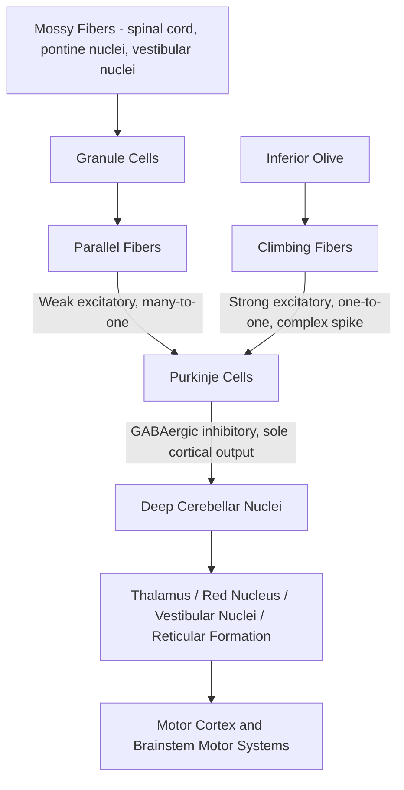

## Cerebellar Motor Learning

### Overview

The cerebellum ("little brain") is a densely packed, highly regular structure critical for the coordination, precision, and timing of movement, and — of particular relevance here — for a specific and well-characterized form of procedural learning: **motor learning** via error-driven adaptation of movement. Unlike the basal ganglia's role in action selection, the cerebellum's primary computational contribution is generating and continuously refining internal predictive models of movement dynamics, enabling smooth, accurate, well-timed motor output and adaptation to changing conditions.

### Gross Anatomy and Functional Subdivisions

**Anatomical Lobes**

- **Anterior lobe and posterior lobe:** Separated by the primary fissure; together comprise the majority of cerebellar cortex involved in limb and trunk motor coordination.
- **Flocculonodular lobe:** The phylogenetically oldest region ("archicerebellum"), critical for vestibulo-ocular reflex (VOR) adaptation and balance.

**Functional-Anatomical Zones**

- **Vestibulocerebellum** (flocculonodular lobe): Balance, eye movement control, VOR adaptation.
- **Spinocerebellum** (vermis and intermediate zones of anterior/posterior lobes): Receives spinal proprioceptive input; regulates axial and limb muscle tone and coordination, comparing intended vs. actual movement.
- **Cerebrocerebellum** (lateral hemispheres, phylogenetically newest, "neocerebellum"): Receives input via cortico-ponto-cerebellar pathways; involved in planning and timing of complex, skilled voluntary movement, and increasingly implicated in cognitive functions.

### Cerebellar Cortical Microcircuitry

The cerebellar cortex has a highly stereotyped, three-layered architecture repeated uniformly across its surface, a feature that has made it a favored model system for understanding cortical computation.

**Layers and Cell Types**

- **Molecular layer:** Contains parallel fibers (axons of granule cells), Purkinje cell dendritic trees, and inhibitory interneurons (stellate and basket cells).
- **Purkinje cell layer:** Contains **Purkinje cells**, the sole output neurons of the cerebellar cortex; large, highly branched GABAergic neurons that provide the exclusive inhibitory output from cerebellar cortex to the deep cerebellar nuclei.
- **Granule cell layer:** Contains **granule cells** (the most numerous neuron type in the brain by cell count) and Golgi cells (inhibitory interneurons).

**Two Principal Afferent Systems**

1. **Mossy fibers:** Originate from the spinal cord, brainstem (pontine nuclei relaying cortical input), and vestibular nuclei. Synapse onto granule cells in the granule layer; granule cell axons ascend into the molecular layer and bifurcate to form **parallel fibers**, which run parallel to the cerebellar folia and make excitatory synapses onto the dendritic trees of many Purkinje cells (each parallel fiber contacts many Purkinje cells, but with a relatively weak individual synaptic effect).
2. **Climbing fibers:** Originate exclusively from the **inferior olive** in the contralateral medulla. Each climbing fiber wraps extensively around the dendrites of a single Purkinje cell, forming an unusually powerful, one-to-one synaptic relationship, such that a single climbing fiber action potential triggers a large, characteristic **complex spike** in its target Purkinje cell (distinct from the simple spikes driven by parallel fiber input).

### The Marr-Albus-Ito Model of Cerebellar Learning

The dominant theoretical framework for cerebellar motor learning, developed independently by David Marr and James Albus in the early 1970s and substantially validated experimentally by Masao Ito, proposes that the cerebellum functions as a **supervised, error-driven learning machine**.

**Core Hypothesis**

- **Parallel fiber inputs to Purkinje cells** represent the vast contextual/sensorimotor "input space" (the current state of the movement and sensory context) — analogous to input features in a machine learning system.
- **Climbing fiber input** from the inferior olive functions as a **"teaching" or error signal**, carrying information about movement errors or unexpected sensory outcomes (a mismatch between predicted and actual sensory consequences of movement).
- When a climbing fiber complex spike occurs in close temporal association with parallel fiber activity onto the same Purkinje cell, this conjunction triggers a lasting weakening (**long-term depression, LTD**) of the co-active parallel fiber-Purkinje cell synapses.
- Over repeated trials, this error-driven, synapse-specific plasticity **adjusts the pattern of Purkinje cell output** in response to particular sensorimotor contexts, effectively "tuning" the cerebellar circuit to reduce the errors that originally triggered climbing fiber activity — a form of supervised learning at the synaptic level.

$$\Delta w_{PF \rightarrow PC} \propto - (\text{PF activity}) \times (\text{CF error signal, coincident in time})$$

**Cellular Mechanism of Parallel Fiber LTD**

- Coincident parallel fiber and climbing fiber activity produces large calcium influx into Purkinje cell dendritic spines (via climbing-fiber-driven dendritic depolarization combined with parallel-fiber-activated mGluR1 signaling), triggering a signaling cascade (involving protein kinase C, among other components) that internalizes AMPA receptors at the co-active parallel fiber synapses, producing a persistent reduction in synaptic efficacy — this is **cerebellar LTD**, distinct in mechanism from the more commonly discussed hippocampal NMDA-receptor-dependent LTP.
- [Inference/area of ongoing research] While parallel fiber LTD is the most extensively studied plasticity mechanism, current understanding recognizes that multiple additional plasticity sites exist throughout the cerebellar circuit — including at parallel fiber-Purkinje cell synapses undergoing LTP, mossy fiber-granule cell synapses, and within the deep cerebellar nuclei themselves — indicating cerebellar motor learning is likely distributed across multiple sites rather than localized solely to the classically described cortical LTD mechanism.

### Classic Experimental Paradigms

**Vestibulo-Ocular Reflex (VOR) Adaptation**

- The VOR stabilizes gaze during head movement by generating compensatory eye movements equal and opposite to head movement, mediated by a relatively short three-neuron brainstem arc (vestibular afferent → vestibular nucleus → oculomotor neuron).
- When subjects wear magnifying or minifying lenses, the required VOR gain (ratio of eye movement to head movement) must change to maintain stable retinal images — the cerebellar flocculus is critical for this adaptive recalibration, with climbing fiber signals from the inferior olive carrying "retinal slip" (image movement error) information that drives the necessary gain adjustment via cerebellar LTD.
- This paradigm has served as one of the most rigorously validated demonstrations of the Marr-Albus-Ito model, as VOR gain change correlates with, and can be experimentally linked to, cerebellar synaptic plasticity.

**Eyeblink Conditioning**

- A classical (Pavlovian) conditioning paradigm in which a neutral conditioned stimulus (CS, e.g., a tone) is repeatedly paired with an unconditioned stimulus (US, e.g., a corneal air puff) that reflexively evokes an eyeblink; over training, the CS alone comes to elicit a well-timed, anticipatory conditioned eyeblink response (CR).
- Extensive lesion and physiology studies (notably by Richard Thompson and colleagues) established that the **cerebellum (specifically the interpositus nucleus of the deep cerebellar nuclei, and overlying cerebellar cortex) is necessary and sufficient for the acquisition, timing, and expression of the conditioned eyeblink response** — cerebellar lesions abolish the learned response and prevent new learning, while lesions elsewhere generally do not.
- The CS pathway (via mossy fibers, e.g., relaying tone information) and US pathway (via climbing fibers, relaying air-puff information from the inferior olive) converge precisely on the same cerebellar circuit elements required by the Marr-Albus-Ito framework, making eyeblink conditioning a well-established behavioral model for testing cerebellar plasticity mechanisms at a cellular level.

**Prism/Force-Field Reaching Adaptation**

- When reaching movements are perturbed by visual displacement (prism goggles) or by a robotic force field applied to the arm, movements initially show systematic errors, which progressively decrease with practice as the motor system adapts (an internal model recalibration), and — critically — produce **after-effects** in the opposite direction when the perturbation is removed, a signature of true internal model adaptation rather than simple strategic correction.
- Patients with cerebellar damage show impaired trial-by-trial adaptation in these paradigms (though they may retain some capacity for explicit, strategic compensation), supporting the cerebellum's role in the implicit, automatic component of motor adaptation specifically, as distinguished from explicit cognitive strategy use.

### The Cerebellum as an Internal Forward Model

A widely adopted computational framework, developed substantially by Daniel Wolpert, Mitsuo Kawato, and colleagues, proposes that the cerebellum implements an **internal forward model** — a neural circuit that predicts the sensory consequences of a planned motor command before sensory feedback actually arrives.

**Functional Logic**

- Motor commands are inherently slow to produce sensory feedback (due to neural and biomechanical transmission delays), which would make purely feedback-driven control too sluggish for fast, coordinated movement.
- A forward model uses an efference copy of the outgoing motor command to generate a **predicted sensory consequence**, which can be compared, in real time, against actual incoming sensory feedback.
- Discrepancies between predicted and actual sensory outcomes constitute a **sensory prediction error**, hypothesized to be conveyed via climbing fiber input from the inferior olive, driving cerebellar circuit adaptation to improve the accuracy of future predictions.
- [Inference/influential but not universally settled model] This forward-model framework is widely used to interpret cerebellar contributions to smooth, feedforward, well-coordinated movement, and is also invoked in explaining cerebellar contributions to distinguishing self-generated sensations (e.g., why we cannot tickle ourselves) from externally generated ones, though the precise algorithmic implementation in cerebellar circuitry remains an active area of computational neuroscience research.

### Deep Cerebellar Nuclei: The Output Stage

- **Dentate nucleus:** Largest and most lateral; receives input primarily from cerebrocerebellum (lateral hemispheres); projects via the superior cerebellar peduncle to contralateral thalamus (ventral lateral nucleus) and onward to motor and premotor cortex; also implicated in cognitive/planning functions given its cerebrocerebellar input.
- **Interposed nuclei** (globose and emboliform): Receive input from spinocerebellum; project to red nucleus and thalamus; central to limb coordination and, notably, the interpositus nucleus specifically is the critical site for eyeblink conditioning memory storage.
- **Fastigial nucleus:** Most medial; receives input from vermis (spinocerebellum); projects to vestibular nuclei and reticular formation; involved in axial/postural control and balance.
- **Key Points**
  - All deep cerebellar nuclei receive convergent excitatory input from mossy fiber/climbing fiber collaterals and inhibitory input from Purkinje cells, positioning them as an integration site where cortical (Purkinje) inhibitory output is combined with ongoing excitatory afferent drive — this convergence is itself now recognized as a plasticity site contributing to long-term motor memory storage, complementing cortical LTD.

### Cerebellar Ataxia: Clinical Correlates of Impaired Motor Coordination

- **Dysmetria:** Errors in the distance, speed, or force of movement (overshooting or undershooting a target).
- **Intention tremor:** Tremor that worsens as a limb approaches its target, in contrast to the resting tremor of Parkinson's disease.
- **Dysdiadochokinesia:** Impaired ability to perform rapid alternating movements (e.g., rapid pronation-supination of the forearm).
- **Gait ataxia:** Wide-based, unsteady gait, often with midline (vermal) cerebellar lesions specifically.
- **Dysarthria:** Scanning, irregular speech pattern, when cerebellar circuits controlling articulation are affected.
- [Inference] These signs are generally attributed to loss of the cerebellum's predictive, feedforward coordinating function, forcing movement to rely more heavily on slower, error-prone feedback correction — consistent with the forward-model framework described above, though this remains a functional interpretation rather than a directly observed mechanism in every case.

### Example: Adaptation to a Novel Force Field

**Example**

A subject reaching to a target while holding a robotic manipulandum that applies a velocity-dependent lateral force initially produces curved, erroneous reaching trajectories. Over dozens of repeated trials, trajectories progressively straighten as the motor system learns to anticipate and counteract the force — reflecting updating of an internal forward model, presumably supported by cerebellar climbing-fiber error signals and associated plasticity. When the force field is unexpectedly removed, the subject's initial reaches curve in the *opposite* direction (an after-effect), directly demonstrating that true predictive recalibration occurred, rather than the subject having merely learned a conscious compensatory strategy — a hallmark experimental signature distinguishing implicit cerebellar-dependent adaptation from explicit strategic correction.

### Related Topics

- Vestibulo-ocular reflex circuitry and gain adaptation
- Classical (Pavlovian) conditioning and eyeblink conditioning circuitry
- Basal ganglia contributions to movement and action selection
- Primary motor cortex and corticospinal output
- Efference copy and sensory prediction in motor control
- Cerebellar ataxia syndromes and localization of cerebellar lesions
- Long-term depression (LTD) vs. long-term potentiation (LTP) as complementary plasticity mechanisms
- Computational motor control models (optimal feedback control, internal forward/inverse models)