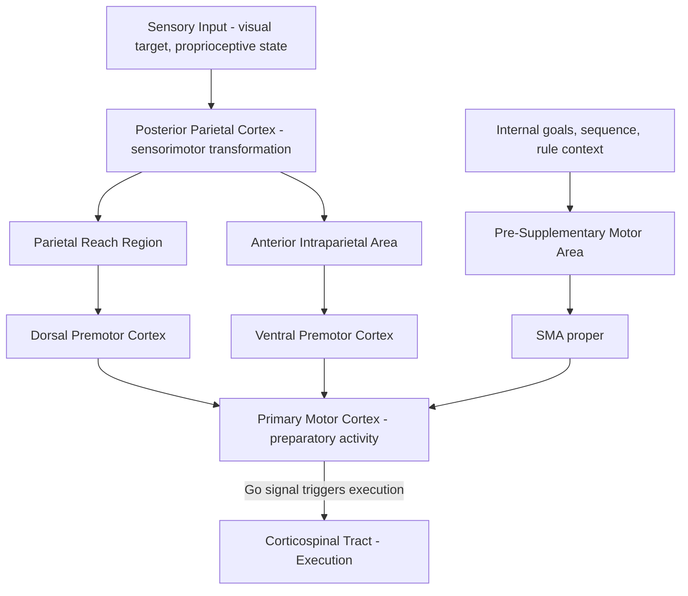

## Motor Planning and Preparation

### Overview

Motor planning and preparation refer to the neural processes occurring **before** movement onset, during which the nervous system selects a movement goal, computes an appropriate motor plan (trajectory, timing, force, effector selection), and configures relevant neural circuits into a preparatory state so that execution can proceed rapidly and accurately upon a "go" signal. This preparatory phase is now understood not merely as a passive delay period, but as an active computational stage with distinct, measurable neural signatures.

### Key Cortical Substrates

**Premotor Cortex (PMC, lateral BA 6)**

- Primarily involved in **externally cued** movement selection — choosing and preparing movements based on sensory (especially visual) information about the environment.
- Dorsal premotor cortex (PMd) is particularly implicated in visuomotor transformations for reaching, integrating visual target location with the current limb configuration to specify an appropriate movement plan.
- Ventral premotor cortex (PMv) is more associated with grasp shaping and hand-object interactions, and contains neurons responsive to the visual properties (size, shape, orientation) of graspable objects.

**Supplementary Motor Area (SMA, medial BA 6)**

- Primarily involved in **internally generated**, self-initiated movement, particularly for sequences and movements not directly triggered by an external cue.
- Contains a rostral subdivision, the **pre-supplementary motor area (pre-SMA)**, implicated in more abstract, higher-order aspects of action planning (e.g., switching between response rules, sequence planning), and a caudal subdivision (SMA proper), more directly linked to movement execution and simple motor sequencing.
- Classic lesion and stimulation studies (e.g., Penfield's work identifying the SMA, and later work on the "urge to move") link SMA activity to the subjective sense of intending or initiating voluntary action.

**Posterior Parietal Cortex (PPC)**

- Critical for the **sensorimotor transformation** of sensory (particularly visual and proprioceptive) target information into an appropriate frame of reference for motor planning — converting, for example, a retinally coded visual target location into a body-centered or effector-centered coordinate frame usable for reaching.
- Specific subregions show effector-specific planning activity: the **parietal reach region (PRR)** for arm reaching, and the **anterior intraparietal area (AIP)** for grasp-related hand shaping, illustrating a degree of parallel, effector-specific planning circuitry.

**Primary Motor Cortex (M1)**

- Although traditionally considered primarily an execution structure, M1 also exhibits substantial **preparatory activity** prior to movement onset, particularly in tasks with instructed delay periods, indicating that planning and execution processes are not strictly segregated by anatomical stage but instead reflect a graded computational transition within overlapping circuitry.

### Preparatory Neural Activity: Single-Neuron and Population Evidence

**Instructed-Delay Paradigms**

- Experimental paradigms in which a cue specifying the upcoming movement (e.g., target direction) is presented, followed by an enforced delay period, followed by a "go" signal triggering movement execution, have been central to characterizing preparatory activity.
- During the delay period, many neurons in PMd, SMA, and M1 show sustained, direction-tuned firing rate changes that predict the direction, and sometimes other parameters, of the upcoming movement — before any movement or EMG activity occurs — providing direct single-neuron evidence of a genuine "preparatory" neural state distinct from execution.

**The "Optimal Subspace" / Preparatory Population Dynamics Model**

- Contemporary population-level analyses (notably work from Krishna Shenoy, Mark Churchland, and colleagues) propose that motor preparation involves neural population activity moving to and settling into an appropriate **initial state** within a high-dimensional neural activity space — an "optimal subspace" from which the subsequent movement-generating dynamics can unfold correctly.
- Under this framework, preparatory activity is not simply a scaled-down or partial version of the eventual movement command, but rather serves to set the correct initial conditions for a subsequent, largely autonomous, dynamical process in motor cortex that generates the time-varying muscle activation pattern during actual movement execution.
- [Inference/an influential but still-developing systems neuroscience model] This dynamical-systems framing represents a significant conceptual shift from earlier "static population vector" or "movement parameter encoding" models of motor cortex, though the two frameworks are not mutually exclusive and are actively being integrated in current research.

**Output-Null vs. Output-Potent Dimensions**

- A key related finding: population activity during the preparatory period tends to reside in dimensions of neural state space that do **not** directly drive muscle output ("output-null" dimensions), allowing extensive preparatory computation to occur without triggering premature movement.
- At the "go" signal, population activity transitions into "output-potent" dimensions that do drive downstream muscle activation, triggering the movement itself.
- [Inference] This output-null/output-potent distinction offers a candidate circuit-level explanation for how the motor system can prepare a movement extensively (and even change the plan) without executing it prematurely, addressing a long-standing question of how "planning" and "doing" can be computationally separated within largely overlapping neural populations.

### Behavioral and Electrophysiological Correlates in Humans

**Reaction Time and Preparatory State**

- Reaction time (RT) — the interval between a go signal and movement onset — is influenced by the degree to which preparatory processes have been completed prior to the go signal; well-prepared movements (e.g., following a valid advance cue) show shorter RTs than unprepared or ambiguous ones.
- **Lateralized Readiness Potential (LRP):** An EEG-derived signal reflecting asymmetric preparatory activity over motor cortex contralateral to the responding hand, used as an electrophysiological marker of response preparation and selection, even before overt movement or explicit awareness of the response choice.

**Bereitschaftspotential (Readiness Potential, RP)**

- A slow, negative-going EEG potential recordable over midline central/frontal electrodes (associated with SMA activity) that begins to build up over roughly one to two seconds **before** self-initiated voluntary movement, first described by Kornhuber and Deecke in the 1960s.
- Famously employed in the **Libet experiments** (1980s), which reported that RP onset preceded subjects' conscious reported intention to move ("W-time") by several hundred milliseconds, a finding widely discussed in debates concerning free will and the neural timing of conscious intention.
- [Unverified/heavily contested interpretation] The interpretation of the Libet paradigm remains a matter of substantial ongoing scientific and philosophical debate; more recent work (e.g., using EEG/fMRI decoding approaches by Soon and colleagues, and subsequent replications and critiques) has both extended and challenged aspects of the original interpretation, including questions about whether RP reflects a specific decision process versus generic, spontaneous neural fluctuations that stochastically bias the timing of an already-planned action. This is a topic of active, unresolved methodological and theoretical debate rather than settled fact.

### Motor Sequence Planning

- The **pre-SMA and SMA** are particularly implicated in the planning of movement **sequences**, with pre-SMA activity associated with encoding sequence structure/rank order and switching between learned motor sequences.
- Chunking: With practice, sequences of individual movements can become integrated into a single, more efficiently executed "motor chunk," a process associated with a shift in relative engagement from pre-SMA/associative circuits toward more automatized SMA-proper/basal ganglia-dependent execution circuits. [Inference — general consensus model, though the precise neural signature of chunking remains an active research area] This shift is often cited as a neural correlate of skill automatization with extended practice.

### Motor Imagery and Covert Planning

- **Motor imagery** — mentally simulating a movement without executing it — engages substantially overlapping neural circuitry with actual motor planning and preparation, including premotor cortex, SMA, and posterior parietal cortex, though typically with attenuated or absent M1/corticospinal output (allowing simulation without actual movement).
- This overlap is the basis for the fMRI mental-imagery paradigms used to detect covert command-following in disorders of consciousness (e.g., imagined tennis-playing tasks), directly linking motor planning circuitry to consciousness research.
- [Inference] The degree of overlap between imagined and executed movement circuitry is generally taken as evidence for a shared underlying planning/preparation substrate, though some differences in activation magnitude and precise network engagement between imagined and executed movement have been reported across studies.

### Clinical and Applied Relevance

- **Apraxia:** Damage to parietal or premotor planning circuits (frequently left-hemisphere dominant for skilled/sequential movement in right-handed individuals) can produce **apraxia** — an impairment in the planning or sequencing of skilled, purposive movement despite intact basic motor and sensory function, illustrating a clinically important dissociation between movement planning and movement execution capacity.
- **Parkinson's disease and preparatory deficits:** [Inference — consistent with broader models of basal ganglia contribution to movement initiation] Some studies suggest that Parkinsonian bradykinesia partly reflects impaired transition from a preparatory to an execution state (i.e., difficulty in the basal ganglia-mediated "release" of a prepared motor plan) rather than solely a deficit in generating the movement itself, though the precise contribution of preparatory versus execution-stage deficits remains actively studied.
- **Brain-computer interfaces (BCIs):** Preparatory activity in PMd and M1 is directly exploited by intracortical BCI systems, which decode planned movement direction/target from preparatory-period neural activity to control external effectors (e.g., robotic arms, computer cursors) in paralyzed patients, representing a direct translational application of population-level motor preparation research.

### Example: Instructed-Delay Reaching Task

**Example**

In a classic instructed-delay center-out reaching task, a monkey is shown a target light indicating the required reach direction, but must withhold movement during a variable delay period until a subsequent "go" cue. Recordings from PMd during the delay period reveal directionally tuned, sustained firing that reliably predicts the upcoming reach direction well before the go cue or any EMG onset. Population-level analyses show that neural activity during this delay period settles into a specific, direction-dependent preparatory state (an "optimal initial condition") within an output-null subspace; at the go cue, activity transitions rapidly into an output-potent subspace, generating the muscle activation pattern that produces the observed reach — a widely cited empirical demonstration of the preparatory dynamical-systems framework.

### Related Topics

- Primary motor cortex and the motor homunculus
- Basal ganglia contributions to movement initiation and gating
- Bereitschaftspotential and the neuroscience of volition/free will debates
- Dynamical systems models of motor cortex population activity
- Apraxia and disorders of skilled movement planning
- Motor imagery and its use in detecting covert awareness (disorders of consciousness)
- Brain-computer interfaces and intracortical movement decoding
- Posterior parietal cortex and sensorimotor coordinate transformations