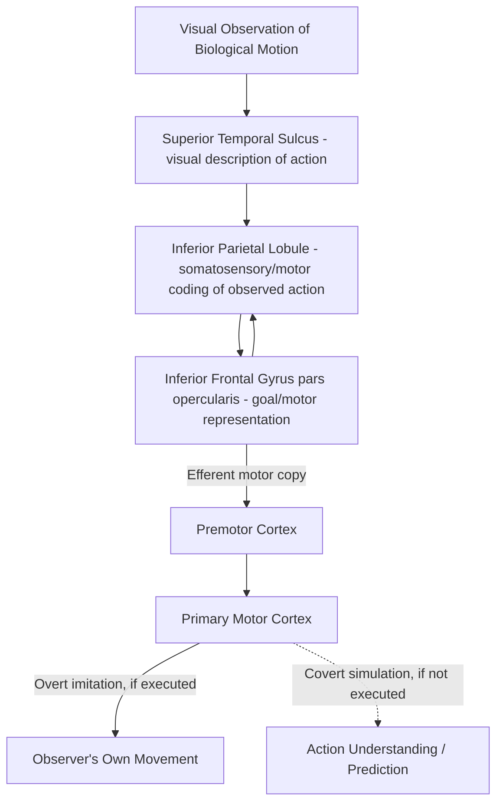

## Action Observation and Imitation

### Overview

Action observation and imitation refer to the neural and cognitive processes by which an observer perceives another individual's movement and, in some cases, translates that observed action into a corresponding motor output of their own. This domain sits at the intersection of perception and action, and is closely associated with the discovery and subsequent extensive study of **mirror neurons** — cells that fire both when an individual performs an action and when they observe the same or a similar action performed by another.

### Mirror Neurons: Discovery and Core Properties

**Discovery**

- Mirror neurons were first identified in the early 1990s by Giacomo Rizzolatti and colleagues at the University of Parma, recording single neurons in area **F5** of the macaque premotor cortex, initially during studies of grasping-related motor neurons.
- The unexpected finding: certain F5 neurons that discharged when the monkey performed a specific goal-directed hand action (e.g., precision grip to pick up food) also discharged when the monkey merely **observed** an experimenter performing the same or a similar action, without any movement by the monkey itself.

**Core Properties (as characterized in macaque studies)**

- **Congruence:** Many mirror neurons show a close correspondence between the observed action that drives their visual response and the executed action that drives their motor response (e.g., a neuron responsive to observing precision grip also discharges during the monkey's own precision grip); however, the degree of congruence varies, with some neurons showing broader ("broadly congruent") rather than strict correspondence.
- **Goal-directedness:** Mirror neuron responses in macaque studies were typically found to depend on the presence of a genuine goal-directed action toward an object; mimicked hand movements without a target object, or observation of the action pantomimed without an actual object present, often failed to activate these neurons as strongly — supporting the interpretation that these neurons encode the *goal* or purpose of an action rather than its low-level kinematics alone.
- **Modality-generality (in some neurons):** Some mirror neurons in macaque studies (termed "audiovisual mirror neurons") also respond to the characteristic **sound** of an action (e.g., paper tearing) even without visual observation, suggesting representation of the action at a relatively abstract, effector/modality-independent level.

### The Putative Human Mirror Neuron System (MNS)

**Key Regions Implicated**

- **Inferior frontal gyrus (IFG, pars opercularis)** — considered a likely human homologue of macaque area F5.
- **Inferior parietal lobule (IPL)**, particularly the anterior supramarginal gyrus — considered analogous to macaque parietal areas (e.g., PF/PFG) that are reciprocally connected with F5 and also show mirror-like properties in monkeys.
- **Superior temporal sulcus (STS)** — provides visual input regarding observed biological motion to the frontoparietal mirror circuit, though STS itself is generally considered a visual, not motor, region, and thus not typically classified as containing "mirror neurons" in the strict sense despite its close functional association with the system.

**Methodological Caveats and Ongoing Debate**

- [Unverified/actively contested] Direct single-neuron evidence for mirror neurons in humans is limited to a small number of intracranial recording studies conducted in surgical epilepsy patients (e.g., work by Mukamel and colleagues, 2010), given the rarity of opportunities for invasive single-unit recording in humans; the majority of evidence for a human "mirror neuron system" comes from indirect measures — fMRI activation overlap between action observation and execution, TMS-induced motor-evoked potential (MEP) facilitation during observation, and EEG mu-rhythm suppression — each of which has more limited spatial/causal specificity than single-neuron recording.
- There has been substantial scientific debate (notably associated with critiques from Gregory Hickok and others) regarding the extent to which mirror neuron activity is genuinely necessary for action *understanding* (as opposed to being a downstream correlate of action observation with a less central causal role), and regarding the reliability and interpretation of some influential early behavioral and clinical claims (e.g., broad claims linking mirror neuron dysfunction to autism spectrum disorder) that were popular in the 2000s but have received a more mixed and cautious reception in subsequent, more rigorous research.
- [Inference] Current consensus in much of the field favors a more measured view: mirror-like fronto-parietal activity is a robust and replicable phenomenon relevant to action perception, but its precise causal contribution to complex social cognition (e.g., theory of mind, empathy, language evolution) — claims that were prominent in early popular accounts — remains considerably more uncertain and is treated with greater caution in current scientific literature than in earlier, more speculative extensions of the theory.

### Theoretical Frameworks for Action Understanding

**Direct-Matching / Simulation Theory**

- Proposes that observers understand others' actions by directly mapping the visually perceived action onto their own motor repertoire ("matching" the observed action to an internal motor representation of that same action), providing understanding "from the inside" via motor simulation rather than purely through visual/cognitive inference.
- This view draws on Rizzolatti and Vittorio Gallese's original interpretive framework, and is conceptually related to broader **simulation theory** accounts of social cognition and theory of mind (the idea that we understand others' mental states partly by simulating them using our own cognitive/motor machinery).

**Predictive Coding / Active Inference Accounts**

- [Inference/an increasingly influential alternative or complementary framework] More recent computational accounts frame action observation within a predictive coding framework, proposing that the motor system generates top-down predictions about the likely trajectory and goal of an observed action, with mismatches between predicted and observed kinematics generating prediction-error signals that refine ongoing action interpretation — conceptually related to internal forward-model frameworks used in motor control research more broadly.

### Motor Resonance and Corticospinal Excitability

- **TMS studies of motor resonance:** Single-pulse TMS applied to motor cortex during action observation reliably produces increased motor-evoked potential (MEP) amplitude in muscles that would be involved in performing the observed action, an effect termed **motor resonance**, generally interpreted as reflecting covert activation of the observer's motor system congruent with the observed movement.
- **Mu-rhythm suppression:** EEG/MEG studies show that sensorimotor **mu rhythm** (roughly 8–13 Hz, recorded over central electrodes) — which is suppressed during actual movement execution — is also suppressed (though generally to a lesser degree) during action observation, used as a further (though less spatially specific) electrophysiological index of mirror-system engagement.

### Imitation: From Observation to Overt Reproduction

**Key Distinction: Emulation vs. Imitation**

- **Emulation:** Reproducing the *outcome/goal* of an observed action without necessarily copying the specific means or movement kinematics used to achieve it.
- **Imitation (true imitation):** Reproducing both the goal *and* the specific means/kinematics of an observed action, considered by many researchers a more cognitively demanding and, in comparative cognition research, a less widely distributed capacity across species than goal emulation.
- [Inference — an active area of comparative cognition research] The degree to which non-human primates and other species are capable of true imitation (as opposed to emulation or simpler forms of social learning like stimulus enhancement) remains genuinely debated, with humans generally considered to show a markedly enhanced and more flexible capacity for high-fidelity imitation compared to other species.

**The Associative Sequence Learning (ASL) Model**

- Proposed by Cecilia Heyes as an alternative to a purely "innate mirror neuron" account of imitation, the ASL model proposes that the sensorimotor associations underlying mirror-like matching (linking the sight of an action to the corresponding motor program) are substantially **learned through correlated sensorimotor experience** during development (e.g., seeing one's own hand move while simultaneously executing the movement) rather than being an innate, hard-wired system.
- [Inference/genuinely contested] This developmental/associative-learning account and the more "innate, evolutionarily specialized" account of mirror neuron origins represent an ongoing theoretical debate in the field, rather than a settled matter, with evidence and arguments offered on both sides.

**Neural Circuitry Distinguishing Imitation from Simple Observation**

- Overt imitation, compared with passive observation alone, engages additional circuitry beyond the core frontoparietal mirror system, including more extensive recruitment of pre-SMA/SMA (for translating an observed action into a self-generated motor plan) and regions implicated in self-other distinction (e.g., temporoparietal junction), reflecting the additional computational demands of converting perceived action into a matched motor output of one's own, as opposed to merely representing or understanding the observed action.

### Developmental Considerations

- Some studies have reported apparent imitative behaviors (e.g., neonatal tongue protrusion in response to an adult model) in very young infants, historically cited as evidence for an innate imitative capacity present from birth; however, [Unverified/contested] the reliability, generalizability, and interpretation of these classic neonatal imitation findings have been challenged by subsequent, more rigorously controlled and larger-scale replication studies, and the topic remains a matter of active empirical and methodological debate in developmental psychology rather than settled consensus.
- Imitation capacity develops substantially across infancy and childhood and is considered an important mechanism supporting the acquisition of culturally transmitted skills, tool use, and language-related gestures.

### Clinical and Applied Relevance

- **Autism spectrum disorder (ASD):** Early influential hypotheses proposed a specific deficit in mirror neuron system function as a unifying explanation for social-cognitive difficulties in ASD ("broken mirror" hypothesis); [Unverified/largely superseded] subsequent, more rigorous studies have generally failed to find consistent, specific mirror-system deficits across the ASD population, and this simple "broken mirror" account is now considered by much of the field to be an oversimplification not well supported by the accumulated evidence, though action-observation and imitation research in ASD continues in more nuanced forms.
- **Stroke rehabilitation — Action Observation Therapy (AOT):** Structured therapeutic protocols in which stroke patients repeatedly observe video demonstrations of a specific motor task before physically practicing it themselves, intended to engage mirror-system/motor-resonance mechanisms to prime and potentially enhance subsequent motor relearning; [Inference — supported by a number of clinical trials though with variable effect sizes across studies] AOT has shown clinically meaningful benefit in several randomized studies of upper-limb motor recovery post-stroke, though effect sizes and optimal protocol parameters vary across the literature.
- **Apraxia:** Given the overlap between planning one's own action and understanding/imitating observed actions, some forms of apraxia are associated with impaired imitation of gestures, providing a further clinical link between action-execution and action-observation circuitry.

### Example: Interpreting a Motor Resonance Experiment

**Example**

In a typical TMS motor-resonance experiment, a participant watches a video of a hand grasping a coffee cup using a precision grip (thumb-index finger opposition) while single-pulse TMS is delivered over the hand area of the participant's left M1, and MEPs are recorded from the participant's right hand muscles. The finding that MEP amplitude specifically increases in the muscles that would be used to perform a precision grip (relative to a control condition involving observation of a whole-hand grasp, or a static image of the same scene) is interpreted as evidence for motor resonance — covert engagement of the observer's own motor system in a manner specific to the observed action's precise kinematic/effector demands, consistent with (though not definitive proof of) mirror-system engagement.

### Related Topics

- Discovery and properties of mirror neurons in macaque area F5
- Theory of mind and simulation theory in social cognition
- Motor planning and preparation circuitry (premotor cortex, SMA)
- Action Observation Therapy in stroke rehabilitation
- Autism spectrum disorder and social-cognitive neuroscience
- Predictive coding and internal forward models in perception-action coupling
- Developmental origins of imitation and social learning
- Biological motion perception and the superior temporal sulcus