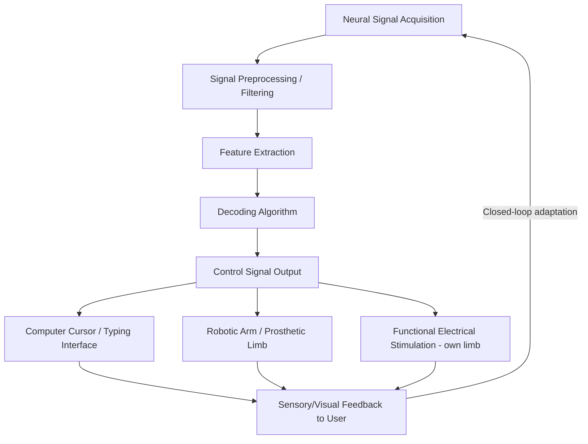

## Brain Computer Interfaces for Motor Restoration

### Overview

Brain-computer interfaces (BCIs) for motor restoration are systems that record neural activity directly related to intended movement and translate ("decode") that activity into control signals for external effectors — computer cursors, robotic arms, communication interfaces, or, in some approaches, the person's own paralyzed limb via functional electrical stimulation. BCIs are of particular relevance to individuals with severe paralysis (e.g., from spinal cord injury, ALS, brainstem stroke, or locked-in syndrome) in whom the cortical circuitry generating motor intent remains intact but the pathway to the periphery is disrupted.

### The Core BCI Pipeline

Every motor BCI system, regardless of recording modality, follows a common conceptual pipeline:

- **Signal acquisition:** The neural recording modality (see below), determining spatial resolution, signal bandwidth, invasiveness, and longevity.
- **Feature extraction:** Common features include single/multi-unit spike rates (invasive), local field potential power in specific bands, or EEG spectral/spatial patterns (non-invasive) such as sensorimotor mu/beta rhythm modulation.
- **Decoding algorithm:** Maps extracted neural features onto an intended movement parameter (e.g., cursor velocity, reach target, individual finger movements, or phonemes/letters for communication-focused BCIs). Approaches range from linear models (e.g., Kalman filters, a long-standing standard in cursor-control BCIs) to modern recurrent neural network and deep-learning decoders.
- **Closed-loop feedback:** Real-time sensory feedback (typically visual) allows the user to adjust their neural output based on observed effector performance, a critical determinant of BCI learning and long-term performance improvement.

### Recording Modalities

**Non-Invasive: Scalp EEG**

- Records summed post-synaptic potentials through the skull and scalp; offers no surgical risk and is widely used in rehabilitation research (e.g., motor-imagery BCI training for stroke).
- **Key Points**
  - Lower spatial resolution and signal-to-noise ratio compared to invasive approaches, generally limiting EEG-BCI to relatively low-dimensional control (e.g., binary or few-class motor-imagery classification, cursor control along one or two axes) rather than fine, high-degree-of-freedom movement control.
  - Commonly exploits **event-related desynchronization/synchronization (ERD/ERS)** of the sensorimotor mu (~8–13 Hz) and beta (~13–30 Hz) rhythms during actual or imagined movement.
  - Predominant modality in stroke motor rehabilitation BCI research, generally used to drive closed-loop training paradigms (motor-imagery BCI paired with functional electrical stimulation or robotic assistance) intended to promote neuroplasticity and motor relearning, rather than for direct real-time device control outside the clinic.

**Semi-Invasive: Electrocorticography (ECoG) and Endovascular Approaches**

- **ECoG:** Electrode arrays placed directly on the cortical surface (subdural or epidural), typically requiring a craniotomy but not penetrating brain tissue; offers substantially better spatial resolution and signal bandwidth than scalp EEG while avoiding some risks of intracortical penetration.
- **Endovascular stent-electrode arrays (e.g., Synchron's Stentrode):** A stent-mounted electrode array is delivered via the jugular vein and deployed within a blood vessel (the superior sagittal sinus) adjacent to motor cortex, avoiding open-brain surgery or craniotomy entirely. The procedure is performed by an interventional neuroradiologist without craniotomy or piercing of brain tissue. [Inference] The trade-off of this approach is generally understood to be lower spatial resolution/signal fidelity relative to direct intracortical recording, in exchange for a substantially reduced surgical risk profile. [everything-pr](https://everything-pr.com/can-twitter-bring-brain-powered-tech-to-the-masses)

**Fully Invasive: Intracortical Microelectrode Arrays**

- Penetrating microelectrode arrays (e.g., the Utah array used by Blackrock Neurotech-affiliated academic BCI programs, and Neuralink's thread-based N1 implant) are inserted directly into cortical tissue, typically targeting the hand/arm area of M1 or, for speech-focused systems, ventral premotor/speech-motor cortex.
- Offers the highest spatial and temporal resolution among current approaches, enabling decoding of individual finger movements, complex reach trajectories, and — in speech-BCI applications — attempted-speech-related neural activity for text or synthesized voice output.
- Neuralink's N1 implant contains over a thousand electrodes and is surgically inserted by a custom robotic system. [timewell](https://timewell.jp/en/columns/neuralink-precision-neuroscience-synchron-blackrock-neurotech)

### Current Clinical Landscape (as of 2026)

[Note: this is a fast-moving translational field; figures below reflect recent public reporting and should be expected to change further.]

- **Neuralink (N1 implant, intracortical):** By late January 2026, Neuralink announced 21 participants in its "Two Years of Telepathy" update, with active PRIME (cursor/device control), CONVOY (assistive robotic arm control), and Voice (speech decoding) studies. Reported performance metrics include thought-to-text typing speeds around 40 words per minute and roughly 15 minutes to achieve basic cursor control post-implantation, with the Voice study targeting substantially higher, conversational-speed decoding as a longer-term goal. [Unverified — company-reported figures, not yet independently peer-reviewed at the time of this account] Musk stated Neuralink plans to move toward high-volume production and near-fully automated surgery during 2026. [Brain-Computer Interface: Billionaires (and a Trillionaire) Race to Create Cyborgs +2](https://brain2mind.substack.com/p/brain-computer-interface-billionaires)
- **Synchron (Stentrode, endovascular):** Synchron's endovascular Stentrode has produced consistent real-world results across a new INTENT trial focused on ALS patients, with long-term data now including patients living with implants for up to five years, and the system achieving native thought-based control of Apple devices via Bluetooth. Synchron's COMMAND study reported no device-related serious adverse events across six participants over twelve months, and in January 2026 introduced a system integrating AI processing with Apple Vision Pro, allowing an ALS patient to control a tablet by thought. [Substack](https://brain2mind.substack.com/p/brain-computer-interface-billionaires)[simplify](https://simplify.jobs/c/Syncron)
- **Blackrock Neurotech:** Continues as a long-standing academic-research-oriented BCI hardware provider (notably the Utah array), with reported findings including an ALS patient regaining speech output via a Blackrock Neurotech text-to-speech brain implant. [thedailystar](https://tds-images.thedailystar.net/tags/brain-chip-implant)
- **Precision Neuroscience:** Received FDA clearance in April 2025 for a thin-film "brain film" surface electrode device specifically targeting communication applications for ALS patients. [simplify](https://simplify.jobs/c/Syncron)
- **Emerging ultra-high-density devices:** Researchers from Columbia, Stanford, and the University of Pennsylvania unveiled an ultra-thin implant (BISC) packing 65,536 electrodes into roughly 3 cubic millimeters, designed to sit in the space between brain and skull. [Unverified — early-stage device, not yet in reported human clinical use at the time of this account] [simplify](https://simplify.jobs/c/Syncron)

[Inference — appropriate epistemic caveat for this domain] Given the pace of announcements in this sector, specific patient counts, performance benchmarks, and regulatory statuses should be treated as a snapshot subject to rapid change, and readers seeking current figures should consult primary company/FDA/clinicaltrials.gov sources directly.

### Decoding Algorithms and Computational Approaches

- **Linear decoders (Kalman filter, Wiener filter):** Historically the dominant approach for translating multi-unit firing rates into continuous cursor or reach-trajectory kinematics; valued for computational simplicity, interpretability, and robustness with relatively modest training data requirements.
- **Population vector-based decoding:** Draws directly on the Georgopoulos framework of directionally tuned M1 neurons (see Primary Motor Cortex reference material), summing weighted directional preferences across the recorded neural population to estimate intended movement direction.
- **Recurrent neural network (RNN) and deep-learning decoders:** Increasingly used, particularly for higher-dimensional control problems (individual finger/joint decoding, speech decoding from attempted articulation), offering improved accuracy for complex, nonlinear neural-to-kinematic mappings at the cost of requiring larger training datasets and more complex calibration.
- **Speech/handwriting decoding:** A distinct and rapidly advancing sub-application in which intracortical or ECoG signals recorded during attempted speech or attempted handwriting movements are decoded directly into text, bypassing the need for movement-based cursor/typing control entirely; this line of work has been extended by combining EEG signals with camera-based AI systems, improving BCI performance on tasks like cursor control and robotic arm manipulation for users including individuals paralyzed from the waist down. [simplify](https://simplify.jobs/c/Syncron)

### Non-Invasive Motor-Imagery BCI for Neurorehabilitation

A distinct clinical application (separate from direct device-control BCIs) uses non-invasive, typically EEG-based motor-imagery BCIs as a **therapeutic tool** to promote motor recovery after stroke or incomplete spinal cord injury, rather than as a permanent assistive control interface.

**Mechanistic Rationale**

BCI decoding of movement-related neural signals and closed-loop feedback between central and peripheral systems is proposed to enhance corticospinal tract excitability, induce neuroplasticity, and alleviate postoperative or post-injury muscle inhibition and dysfunction caused by insufficient central motor drive. The typical closed-loop design pairs detected motor-imagery-related EEG changes (e.g., mu/beta ERD) with **contingent feedback** — functional electrical stimulation of the target muscle, robotic-assisted movement, or visual feedback — timed to coincide with the patient's neural attempt, intended to reinforce Hebbian-style strengthening of residual corticospinal pathways. [PubMed](https://pubmed.ncbi.nlm.nih.gov/42642203/)

**Clinical Evidence Base**

- A systematic review and meta-analysis found that a large randomized controlled trial in ischemic stroke (n≈296) showed BCI rehabilitation training added to standard rehabilitation produced significantly greater upper-limb motor improvement (Fugl-Meyer Assessment) than control at one month, with similar adverse-event rates. A separate 2025 randomized trial comparing motor-imagery-plus-motor-attempt BCI intervention to control in ischemic stroke found greater Fugl-Meyer improvement alongside evidence of neuroplastic changes in brain activation and connectivity in the BCI group. [nih](https://www.ncbi.nlm.nih.gov/pmc/articles/PMC12620597/)[nih](https://www.ncbi.nlm.nih.gov/pmc/articles/PMC12620597/)
- In orthopedic rehabilitation contexts (e.g., following anterior cruciate ligament reconstruction), available evidence indicates motor-imagery-based BCI training can improve quadriceps voluntary activation rate and reduce postoperative muscle strength loss. [PubMed](https://pubmed.ncbi.nlm.nih.gov/42642203/)
- A small exploratory trial in patients with incomplete spinal cord injury reported that visually induced motor-imagery BCI training was safe and well tolerated, with no adverse events observed, providing preliminary evidence toward understanding mechanisms of BCI-supported functional recovery. [PubMed Central](https://pmc.ncbi.nlm.nih.gov/articles/PMC12909217/)
- [Inference — explicitly noted as an open question in the reviewed literature] Despite this growing evidence base, the overall clinical efficacy of BCI-based rehabilitation for functional motor recovery remains actively debated within the field, and effect sizes, optimal protocol parameters, and long-term functional (versus purely impairment-scale) benefits continue to be studied. [nih](https://www.ncbi.nlm.nih.gov/pmc/articles/PMC12620597/)

**Combination with Neuromodulation**

Recent work has explored combining BCI technology with transcranial electrical stimulation (tES), a non-invasive neuromodulation technique that can promote neuroplasticity by regulating cortical excitability, as a synergistic strategy to enhance neural remodeling in the central nervous system. [Inference] This combined approach represents an emerging, increasingly studied direction within neurorehabilitation research rather than an established standard-of-care protocol at present. [PubMed Central](https://pmc.ncbi.nlm.nih.gov/articles/PMC12948526/)

### Comparative Summary of Motor BCI Approaches

| Modality | Invasiveness | Spatial Resolution | Typical Application | Surgical Risk |
| --- | --- | --- | --- | --- |
| Scalp EEG | Non-invasive | Low | Motor-imagery rehab training, basic communication | None |
| Endovascular (Stentrode) | Semi-invasive (vascular) | Moderate | Communication/device control for paralysis, ALS | Low (no craniotomy) |
| ECoG | Semi-invasive (subdural/epidural) | Moderate-high | Research, some communication applications | Moderate (craniotomy) |
| Intracortical microelectrode array | Fully invasive | High | High-DOF cursor/robotic arm control, speech decoding | Higher (penetrating implant) |

### Key Design and Translational Challenges

- **Signal stability and longevity:** Intracortical recordings can degrade over time due to glial scarring/encapsulation around penetrating electrodes and micro-motion relative to brain tissue; endovascular and surface approaches generally trade some signal fidelity for improved long-term stability, though [Inference] direct long-term comparative data across modalities remains limited given the relative recency of large-scale human deployment.
- **Decoder recalibration:** Neural representations can drift over days to months, requiring periodic decoder recalibration; adaptive/self-recalibrating decoding algorithms are an active area of engineering research aimed at reducing this burden.
- **Degrees of freedom vs. training burden:** Higher-dimensional control (individual finger movements, full-arm reach-and-grasp) generally requires richer neural feature sets (favoring invasive recording) and more extensive decoder training/calibration than simpler binary or low-dimensional control schemes.
- **User burden and daily usability:** Beyond raw decoding accuracy, translational success depends heavily on ease of donning/setup (particularly relevant for non-invasive EEG systems, which require electrode-scalp preparation), system reliability across a full day of use, and integration with existing consumer technology ecosystems — a factor explicitly emphasized by device makers pursuing native compatibility with existing consumer hardware and software platforms.

### Example: A Closed-Loop Motor-Imagery Stroke Rehabilitation Session

**Example**

A stroke patient with residual right hand weakness dons an EEG cap and is cued to imagine repeatedly opening and closing their paretic hand. The BCI system detects contingent mu/beta rhythm desynchronization over the (ipsilesional or contralesional, depending on protocol) sensorimotor cortex corresponding to the imagined movement and, upon detecting a sufficiently strong and appropriately timed signal, triggers functional electrical stimulation of the wrist/finger extensor muscles, producing an actual, therapist-observable hand-opening movement time-locked to the patient's neural attempt. Repeated across many trials and sessions, this closed-loop pairing is intended to reinforce residual corticospinal pathways and support functional motor recovery beyond what standard physical therapy alone would produce — illustrating the therapeutic (rather than permanent assistive-device) application of motor BCI technology.

### Related Topics

- Primary motor cortex population coding and its exploitation in cursor/reach decoding
- Motor planning and preparatory neural activity as a BCI decoding target
- Neuroplasticity mechanisms underlying BCI-assisted stroke and spinal cord injury rehabilitation
- Locked-in syndrome and communication-restoration BCI applications
- Ethical and regulatory considerations in invasive neurotechnology (data privacy, informed consent, long-term device stewardship)
- Speech and handwriting decoding from motor and premotor cortical signals
- Functional electrical stimulation and hybrid neuroprosthetic systems
- Signal processing and machine learning methods for neural decoding (Kalman filtering, recurrent neural networks)