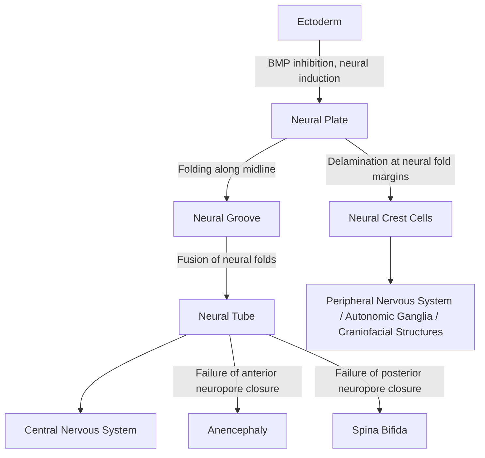

## Prenatal Brain Development

### Overview

Prenatal brain development is the sequential process by which the human central nervous system is constructed from a sheet of undifferentiated ectoderm into a functionally organized organ, spanning conception through birth. This process is characterized by a series of overlapping but developmentally ordered stages — neural induction, neurulation, neural proliferation, migration, and initial circuit formation — that must proceed with precise spatial and temporal coordination, making the prenatal period a window of profound developmental plasticity and vulnerability.

### Neural Induction and Neurulation (Weeks 3–4)

**Neural Induction**

- Occurs during the third gestational week, when signals from the underlying **notochord** (a transient midline mesodermal structure) induce the overlying ectoderm to differentiate into **neuroectoderm**, forming the **neural plate**.
- Key molecular signaling: Bone morphogenetic protein (BMP) inhibition (via molecules such as noggin, chordin, and follistatin secreted by the underlying organizer tissue) is a central mechanism permitting ectodermal cells to adopt a neural, rather than epidermal, fate — the so-called "default model" of neural induction.

**Neurulation**

- The neural plate folds along its midline to form the **neural groove**, which subsequently closes dorsally to form the hollow **neural tube**, the precursor to the entire central nervous system.
- Neural tube closure begins at a mid-cervical level and proceeds bidirectionally (rostrally and caudally) in a "zippering" fashion; the anterior (cranial) neuropore closes around day 24–26, and the posterior (caudal) neuropore closes around day 26–28.
- **Neural crest cells**, delaminating from the dorsal margins of the neural tube during closure, migrate extensively throughout the embryo to form the peripheral nervous system (sensory and autonomic ganglia), among other non-neural derivatives (e.g., melanocytes, portions of the craniofacial skeleton).
- **Clinical correlate:** Failure of neural tube closure produces **neural tube defects**; failure of anterior neuropore closure results in **anencephaly** (incompatible with life), while failure of posterior neuropore closure results in **spina bifida** (of variable severity depending on the extent and level of the defect). Adequate maternal **folate (folic acid)** intake before and during early pregnancy is a well-established, evidence-based intervention shown to reduce neural tube defect risk, which is the basis for public health folic acid supplementation and food fortification recommendations.

### Regionalization and Vesicle Formation (Weeks 4–5)

- The rostral end of the neural tube expands and subdivides into three **primary brain vesicles**: the **prosencephalon** (forebrain), **mesencephalon** (midbrain), and **rhombencephalon** (hindbrain).
- By approximately week 5, these further subdivide into **five secondary brain vesicles**:
  - Prosencephalon → **telencephalon** (cerebral hemispheres, basal ganglia) and **diencephalon** (thalamus, hypothalamus, retina).
  - Mesencephalon → remains as the **mesencephalon** (midbrain).
  - Rhombencephalon → **metencephalon** (pons, cerebellum) and **myelencephalon** (medulla oblongata).
- **Molecular patterning:** Regional identity along the anterior-posterior axis is established substantially by graded expression of transcription factor families, notably **Hox genes** in the hindbrain/spinal cord and other homeodomain transcription factors (e.g., Otx2, Gbx2) establishing the midbrain-hindbrain boundary; dorsoventral patterning within the neural tube is substantially governed by opposing gradients of **Sonic hedgehog (Shh)**, secreted ventrally from the notochord and floor plate, and **BMP/Wnt signaling**, secreted dorsally from the roof plate/overlying ectoderm.

$$\text{Neural fate} = f(\text{position along dorsoventral gradient of Shh vs. BMP/Wnt})$$

### Neural Proliferation and Neurogenesis (Weeks 5–20+)

- The walls of the neural tube contain a proliferative **ventricular zone (VZ)**, populated by **neural stem/progenitor cells (radial glia)**, which undergo repeated rounds of division to generate the enormous number of neurons required for the mature brain.
- **Interkinetic nuclear migration:** A hallmark feature of VZ progenitor cells, in which the nucleus migrates up and down within the elongated progenitor cell body in synchrony with the cell cycle — DNA synthesis (S phase) occurring near the outer (basal) surface and mitosis (M phase) occurring at the inner (ventricular/apical) surface.
- **Symmetric vs. asymmetric division:** Early in neurogenesis, progenitor divisions are predominantly **symmetric**, expanding the progenitor pool; as neurogenesis proceeds, an increasing proportion of divisions become **asymmetric**, producing one self-renewing progenitor and one differentiating neuron (or intermediate progenitor), a shift that is critical for balancing progenitor pool expansion against the ultimate production of postmitotic neurons.
- **Peak human cortical neurogenesis** occurs roughly between gestational weeks 8 and 20, generating the vast majority of cortical excitatory neurons destined for the six-layered neocortex.
- [Inference — order of magnitude, not intended as a precise figure] The human cortex is estimated to contain on the order of tens of billions of neurons, the great majority of which are generated during this prenatal neurogenic window, underscoring the scale and precision required of the underlying proliferative process.

### Neuronal Migration (Weeks ~8–24)

**Radial Migration and the Radial Glial Scaffold**

- Newly generated cortical excitatory neurons migrate outward from the ventricular zone toward the pial surface, guided by the elongated processes of **radial glial cells**, which span the full thickness of the developing cortical wall and serve a dual role as neural stem cells and as a physical migratory scaffold.
- Cortical neurons migrate via **somal translocation** (early in development, when the cortical wall is still relatively thin) and, later, via **locomotion along radial glial fibers** (once the cortical wall thickens substantially), moving from deep to increasingly superficial layers.

**The "Inside-Out" Pattern of Cortical Lamination**

- A defining and well-established principle of mammalian cortical development: neurons destined for the **deepest cortical layers** (layer VI, then V) are generated and migrate first, while neurons destined for **progressively more superficial layers** (layer IV, then II/III) are generated and migrate later, passing by earlier-arriving neurons to take up more superficial positions.
- This inside-out sequence means that the six-layered laminar structure of the mature neocortex is built up in a temporally ordered fashion, with birth-date closely predicting eventual laminar position — a principle established through classic birth-dating (radioactive/tritiated thymidine, and later BrdU) labeling studies.

**Tangential Migration**

- In contrast to radial (excitatory neuron) migration, cortical **inhibitory interneurons** are generated in a distinct proliferative zone — predominantly the **ganglionic eminences** of the subpallium (particularly the medial and caudal ganglionic eminences) — and migrate **tangentially** (perpendicular to the radial glial scaffold) over substantial distances to reach their final cortical destinations, where they subsequently integrate radially into the appropriate layer.
- [Inference — well-supported by extensive rodent and increasingly human developmental data] This dual-origin model (pallial origin for excitatory projection neurons, subpallial origin with tangential migration for inhibitory interneurons) is now a well-established principle of cortical interneuron development, though species differences in the relative contribution of different progenitor zones (e.g., a proportionally larger human outer subventricular zone) are an active area of comparative developmental neuroscience research.

**Clinical Correlates of Migration Disorders**

- **Lissencephaly ("smooth brain"):** Severe migration disorder resulting in absent or markedly reduced cortical gyration, associated with mutations in genes regulating radial glial scaffold integrity and neuronal motility (e.g., LIS1, DCX).
- **Heterotopia:** Ectopic clusters of neurons that fail to complete migration and become lodged in abnormal locations (e.g., periventricular nodular heterotopia), often associated with epilepsy.
- **Polymicrogyria:** Excessive, abnormally small gyral folding, thought to reflect disruption occurring somewhat later in the migration/early cortical organization process.

### The Transient Subplate and Preplate

- Prior to the arrival of the first migrating cortical neurons, the earliest-generated neurons form a transient structure called the **preplate**, which is subsequently split by the arrival of later-migrating neurons into a superficial **marginal zone** (which will become cortical layer I) and a deep **subplate**.
- The **subplate** is a transient but functionally important structure that serves as an early "waiting compartment" for thalamocortical afferent axons before they establish their final synaptic connections in the cortical plate proper, and is implicated in the establishment and refinement of early cortical circuitry; the subplate substantially regresses (undergoing programmed cell death) after birth, though vestiges persist into adulthood as the cortical layer VIb/interstitial white matter neurons. [Inference] Disruption of the subplate, particularly relevant in the context of preterm birth (when subplate neurons are still numerous and functionally active), has been proposed as a contributing mechanism in some preterm-associated neurodevelopmental impairments, though this remains an active area of research rather than fully established mechanism.

### Cortical Arealization

- Beyond laminar (layer) organization, the cortical sheet must also be parceled into distinct functional/cytoarchitectonic **areas** (e.g., primary visual, somatosensory, motor cortex) arranged appropriately across its two-dimensional surface — a process termed **arealization**.
- **Protomap hypothesis:** Proposes that intrinsic molecular gradients within the proliferative ventricular zone itself (graded expression of transcription factors such as Pax6, Emx2, Coup-TF1, and Sp8) pre-pattern the eventual arealization of the cortex, independent of extrinsic thalamic input.
- **Protocortex hypothesis:** Proposes that cortical areal identity is substantially shaped by extrinsic input, particularly patterned activity arriving from thalamocortical afferents.
- [Inference/current consensus] Current understanding generally integrates both models: intrinsic molecular gradients establish a coarse initial arealization "protomap," which is subsequently refined and sharpened by activity-dependent thalamocortical input — rather than either mechanism operating in isolation.

### Synaptogenesis, Programmed Cell Death, and Early Circuit Formation

- **Synaptogenesis** begins prenatally, with initial synapse formation detectable from around mid-gestation onward, though the most dramatic increases in synaptic density occur postnatally (see related postnatal development topics).
- **Programmed neuronal cell death (apoptosis):** A substantial proportion of neurons generated during prenatal neurogenesis — [Inference — commonly cited range, precise figures vary by region/species and study methodology] often cited as up to roughly half in some regions/species — undergo apoptosis, thought to reflect a competitive process in which neurons that fail to establish adequate target-derived trophic support (e.g., neurotrophins such as BDNF, NGF, acting via a "neurotrophic hypothesis" framework originally elaborated from peripheral nervous system studies) are eliminated, serving to match neuron number appropriately to target field size and refine emerging circuitry.
- **Early spontaneous activity:** Prior to the onset of sensory experience, the developing nervous system generates its own **spontaneous, patterned electrical activity** (e.g., retinal waves in the visual system, spontaneous activity in the developing cochlea and spinal cord), which plays a documented instructive role in refining early circuit topography (e.g., eye-specific segregation of retinogeniculate projections) even before sensory-driven, experience-dependent refinement becomes dominant postnatally.

### Timeline Summary Table

| Gestational Window | Primary Process |
| --- | --- |
| Weeks 3–4 | Neural induction, neurulation, neural tube closure |
| Weeks 4–5 | Primary and secondary brain vesicle formation, early regional patterning |
| Weeks 5–20+ | Peak neural proliferation/neurogenesis (ventricular zone) |
| Weeks ~8–24 | Radial and tangential neuronal migration; inside-out cortical lamination |
| Mid-gestation onward | Onset of synaptogenesis, subplate-mediated thalamocortical waiting period |
| Throughout | Ongoing programmed cell death and progressive circuit refinement, continuing substantially into the postnatal period |

### Environmental and Teratogenic Influences

- **Prenatal alcohol exposure:** Associated with fetal alcohol spectrum disorders, with proposed mechanisms including disrupted neural progenitor proliferation, migration, and increased apoptosis, though [Inference] precise dose-timing-outcome relationships remain an active area of research given substantial individual variability in observed effects.
- **Maternal infection/inflammation:** Maternal immune activation during critical windows of prenatal development has been associated in epidemiological and animal-model research with altered offspring neurodevelopmental trajectories; [Inference/actively researched, not fully mechanistically established in humans] proposed mechanisms include inflammatory cytokine signaling affecting progenitor proliferation and migration, though direct causal mechanistic evidence in human prenatal development remains more limited than in animal models.
- **Folate status:** As above, robustly linked to neural tube defect risk, representing one of the most well-established environmental-nutritional influences on prenatal CNS development.
- **Preterm birth:** Interrupts prenatal neurodevelopmental processes (ongoing neurogenesis, migration, subplate function, and early synaptogenesis) at a stage when they would normally continue in utero, and is a well-established risk factor for a range of neurodevelopmental impairments — an important clinical intersection between prenatal developmental neuroscience and neonatal/pediatric outcomes.

### Example: Interpreting a Cortical Migration Birth-Dating Experiment

**Example**

In a classic birth-dating experiment, a radioactive DNA label (tritiated thymidine) is administered to a pregnant animal at a specific gestational timepoint, permanently labeling any neural progenitor cell undergoing its final S-phase (and hence "born") at that moment. Examining the offspring's mature cortex reveals that neurons labeled at an early gestational timepoint are found predominantly in deep cortical layers (V–VI), while neurons labeled at a later gestational timepoint are found predominantly in superficial layers (II–III) — direct experimental demonstration of the inside-out migration principle, and one of the foundational pieces of evidence establishing birth-date as a strong predictor of eventual cortical laminar position.

### Related Topics

- Neural tube defects and folate-related prevention strategies
- Radial glia biology and the ventricular/subventricular zone
- Cortical interneuron origins and tangential migration
- Postnatal synaptic pruning and activity-dependent circuit refinement
- Fetal alcohol spectrum disorders and prenatal teratogen exposure
- Preterm birth and neurodevelopmental outcome
- Cortical arealization and the protomap/protocortex debate
- Programmed cell death and neurotrophic factor signaling in the developing nervous system