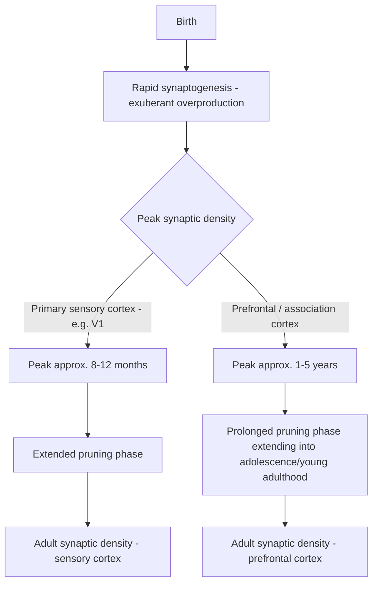

## Synaptogenesis and Pruning Across Childhood

### Overview

Postnatal brain development is characterized by two opposing but complementary processes operating on overlapping but region-specific timescales: an initial period of **exuberant synaptogenesis**, in which synaptic density substantially exceeds adult levels, followed by a prolonged period of **synaptic pruning**, in which excess synapses are selectively eliminated. This overproduction-then-elimination pattern, rather than simple linear synapse addition, is now understood as a core organizing principle of experience-dependent brain maturation, with pruning timelines varying substantially and systematically across different cortical regions.

### Synaptogenesis: Overproduction Dynamics

**Onset and Trajectory**

- Synaptogenesis begins prenatally (see prenatal brain development) but accelerates dramatically after birth, with synaptic density in most cortical regions rising well above eventual adult levels during infancy and early childhood before subsequently declining.
- Peak synaptic density and its timing vary substantially by cortical region — a key finding established through classic quantitative electron-microscopy studies (notably by Peter Huttenlocher and colleagues) of human postmortem tissue across the lifespan.

**Regional Variation in Peak Timing**

- **Primary visual cortex (V1):** Synaptic density rises rapidly after birth, peaking at roughly 8 months to 1 year of age, at a level substantially exceeding the eventual adult density, before beginning to decline.
- **Prefrontal cortex (particularly dorsolateral and other association regions):** Synaptic density rises more gradually and peaks considerably later than primary sensory cortex — classic estimates place peak synaptic density in human prefrontal cortex at approximately 1–5 years of age, with the subsequent elimination phase extending over a markedly protracted timescale.
- [Inference/well-established general principle from this and related developmental imaging literature] This differential timing — primary sensory and motor regions maturing earliest, followed by higher-order association and prefrontal regions maturing latest — reflects a broader hierarchical, "back-to-front" pattern of cortical maturation that has since been corroborated by structural MRI studies of gray matter volume/thickness across childhood and adolescence.

### Synaptic Pruning: Elimination Dynamics

**General Principle**

- Following the peak overproduction period, synaptic density progressively declines toward adult levels through the selective elimination of a substantial proportion of synapses formed during the exuberant phase — [Inference — commonly cited approximate figures from classic morphometric studies, precise percentages vary by region and study] with some regions estimated to lose on the order of 40–50% of peak synaptic density by adulthood.
- Pruning is not random or uniform but is substantially **activity-dependent**: synapses that are consistently and reliably active (i.e., participate in functionally meaningful, experience-driven circuit activity) tend to be preferentially retained, while relatively inactive or less-functionally-integrated synapses tend to be preferentially eliminated — a competitive process often summarized by the Hebbian-inspired heuristic "cells that fire together wire together," with weakly or asynchronously active connections comparatively disfavored.

**Regional and Temporal Course of Pruning**

- **Sensory and motor cortices:** Pruning proceeds relatively early, largely completing during childhood, broadly consistent with the earlier closure of sensory critical/sensitive periods (see related critical period topics).
- **Prefrontal cortex:** Pruning proceeds over a markedly protracted timescale, with substantial evidence — from both classic postmortem morphometry and, more prominently in recent decades, longitudinal structural MRI studies of gray matter volume and cortical thickness — indicating that prefrontal synaptic/structural refinement continues throughout adolescence and into the mid-to-late twenties, corresponding to the well-documented protracted maturation of executive function, impulse control, and other prefrontally mediated cognitive capacities across this developmental window.

### Cellular and Molecular Mechanisms of Pruning

**Synapse Elimination Mechanisms**

- Synaptic pruning is now understood to involve active, regulated elimination processes rather than passive synapse decay, with several convergent mechanisms implicated by contemporary molecular and cellular neuroscience research:
  - **Microglial-mediated synaptic pruning:** Microglia, the resident immune cells of the central nervous system, have been shown (substantially through rodent visual system studies) to physically engulf and eliminate weak or inappropriately connected synapses via a process resembling phagocytosis.
  - **Complement system involvement:** Complement cascade proteins (notably **C1q** and **C3**, components more classically associated with peripheral immune opsonization) have been shown to "tag" weaker or less active synapses, marking them for subsequent microglial-mediated elimination — a striking example of immune-system molecular machinery being repurposed for a CNS developmental function.
  - **Astrocyte involvement:** Astrocytes have also been implicated in synapse elimination via phagocytic and related mechanisms, operating in a manner that may act in parallel with or complementary to microglial pruning pathways.
- [Inference — this molecular mechanistic work is substantially derived from rodent (particularly mouse visual system) studies] The extent to which these specific molecular pruning mechanisms (complement-tagging, microglial engulfment) generalize precisely to human cortical development, including the marked prefrontal-cortex protraction described above, remains an area of ongoing translational research rather than fully established fact in humans specifically.

$$\text{Synapse retention probability} \propto \text{Activity-dependent strengthening} - \text{Complement-tagged microglial elimination}$$

### Structural MRI Correlates Across Childhood and Adolescence

- Longitudinal structural MRI studies (notably large cohort work led by Jay Giedd and colleagues, among others) have documented that cortical **gray matter volume/thickness** follows an inverted-U trajectory across childhood and adolescence in many cortical regions — rising through childhood, peaking around puberty (with some regional and sex-related variation in exact peak timing), and subsequently declining through adolescence into young adulthood.
- This gray matter decline is widely interpreted as reflecting, at least in part, ongoing synaptic pruning (alongside other contributing processes such as continued myelination, which can itself affect gray/white matter volumetric estimates on MRI), consistent with and extending the classic postmortem morphometric findings to a much larger, longitudinally trackable population.
- **"Back-to-front" (or "last in, first out" in terms of maturational sequence) pattern:** Structural MRI studies broadly corroborate a pattern in which primary sensory and motor cortices reach mature gray-matter profiles earliest, association cortices mature at an intermediate stage, and higher-order prefrontal and lateral temporal association regions mature last, generally consistent with the region-specific pruning timelines established by earlier postmortem morphometric work.

### Functional Significance: Why Overproduction-Then-Elimination?

- **Key Points**
  - Overproduction of synapses is thought to provide the developing brain with a broad, initially imprecise scaffold of connectivity that can subsequently be refined by experience, rather than requiring the genome to specify every precise adult synaptic connection directly — a strategy that leverages activity-dependent selection to sculpt circuitry appropriate to the individual's specific developmental environment and experience.
  - This framework helps explain the existence of **sensitive/critical periods**: windows during which experience-dependent activity has an outsized influence on which synapses are retained versus eliminated, after which circuit architecture becomes comparatively more stable and less amenable to large-scale experience-driven reorganization (see related critical period topics for detailed treatment of ocular dominance plasticity and analogous systems).
  - [Inference] The protracted prefrontal pruning/maturation timeline is frequently cited as a plausible contributing neurobiological factor underlying the extended developmental trajectory of executive function, cognitive control, and risk-related decision-making across adolescence, though the precise causal relationship between specific structural maturational metrics and specific cognitive/behavioral capacities remains an area of active, and appropriately cautious, ongoing research rather than a fully established one-to-one mapping.

### Clinical and Developmental Correlates

- **Excessive or insufficient pruning as a candidate mechanism in neurodevelopmental/psychiatric conditions:** [Inference/genuinely contested and actively researched, not settled] Some research programs have proposed that dysregulated synaptic pruning — either excessive pruning or insufficient pruning — may contribute to the pathophysiology of certain neurodevelopmental and psychiatric conditions, including autism spectrum disorder (where some studies have reported findings consistent with reduced pruning/relatively preserved excess synaptic density in some cortical samples) and schizophrenia (where some research, including work implicating complement system genetic variants such as C4, has proposed a role for excessive or dysregulated pruning, particularly given the characteristic adolescent/young-adult onset of schizophrenia coinciding with the period of maximal prefrontal pruning). These remain active, and in several respects still-debated, hypotheses in the current literature rather than fully established, mechanistically confirmed disease models.
- **Sensory deprivation and pruning:** Consistent with the activity-dependent model of pruning, sensory deprivation during relevant developmental windows (e.g., congenital cataract affecting early visual input) can result in atypical patterns of synaptic retention/elimination in the affected sensory pathway, contributing to lasting functional deficits if the deprivation occurs during or persists through the relevant sensitive period.

### Comparative Summary Table

| Feature | Primary Sensory Cortex (e.g., V1) | Prefrontal / Association Cortex |
| --- | --- | --- |
| Approximate peak synaptic density | ~8–12 months | ~1–5 years |
| Pruning completion (approximate) | Substantially complete in childhood | Continues through adolescence into the mid-to-late 20s |
| Structural MRI gray matter peak | Earlier | Later (often peri-pubertal or later) |
| Primary driver of retention | Sensory experience-driven activity | Complex, experience- and cognitively-driven activity across an extended developmental window |
| Associated sensitive/critical period | Relatively well-defined, earlier-closing | Less sharply defined, more protracted |

### Example: Interpreting a Postmortem Synaptic Density Study

**Example**

In the classic Huttenlocher morphometric studies, electron-microscopic quantification of synaptic density in human postmortem prefrontal cortex tissue from individuals who died at different ages reveals a characteristic trajectory: synaptic density in infancy/early childhood specimens substantially exceeds that observed in adult specimens, with the decline occurring gradually and remaining incomplete even in specimens from older adolescents, only reaching a stable adult plateau in specimens from individuals in their twenties. This pattern — overproduction well beyond eventual adult levels followed by a slow, protracted decline specifically in prefrontal (as opposed to earlier-maturing sensory) cortex — is a foundational empirical basis for the widely cited claim that prefrontal cortical maturation continues into early adulthood.

### Related Topics

- Prenatal brain development and early synaptogenesis onset
- Critical/sensitive periods and ocular dominance plasticity
- Adolescent brain development and protracted prefrontal maturation
- Microglial and complement-mediated synaptic pruning mechanisms
- Structural MRI methods for tracking developmental brain trajectories
- Neurodevelopmental hypotheses of autism spectrum disorder and schizophrenia
- Experience-dependent plasticity and activity-dependent circuit refinement
- Executive function development across childhood and adolescence