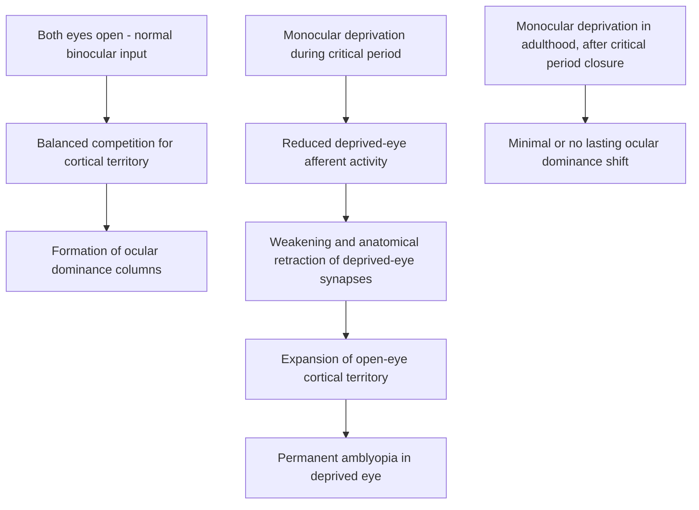

## Critical and Sensitive Periods

### Overview

Critical and sensitive periods are developmental time windows during which the nervous system is unusually responsive to specific patterns of experience, such that experience occurring within that window exerts a disproportionate and often lasting influence on the resulting neural circuitry and behavior, compared to the same experience occurring outside the window. This concept, established through decades of foundational work in visual system development and extended across numerous sensory, motor, and cognitive domains, provides a central organizing framework for understanding both normal experience-dependent development and the developmental consequences of atypical or deprived early experience.

### Terminological Distinction: Critical vs. Sensitive Periods

- **Critical period:** Historically used to denote a developmental window with a sharply defined onset and offset, outside of which the relevant experience-dependent plasticity is essentially absent and the resulting deficit, if experience is missing during the window, is considered largely irreversible.
- **Sensitive period:** A somewhat broader and increasingly preferred term in contemporary developmental neuroscience, denoting a window during which the nervous system shows *heightened* (but not absolute or exclusively time-limited) responsiveness to relevant experience — allowing for the possibility of a more gradual onset/offset, and for some degree of residual plasticity or partial recovery outside the window under certain conditions.
- [Inference/reflects a genuine shift in the field] Contemporary usage increasingly favors "sensitive period" as the more empirically accurate and generally applicable term, reflecting accumulated evidence that many developmental windows show graded rather than strictly all-or-none plasticity profiles, though "critical period" remains in widespread use, including for some systems (e.g., certain aspects of monocular deprivation effects) where the window's boundaries and consequences are comparatively sharply defined.

### The Foundational Model: Ocular Dominance Plasticity

**Historical Discovery**

- The paradigmatic experimental model for critical period research was established by David Hubel and Torsten Wiesel (whose broader work on visual cortex organization earned a Nobel Prize) through studies of **monocular deprivation** in kittens during the 1960s–1970s.
- **Key experimental finding:** Suturing one eye closed in a kitten during a specific early postnatal window produces a dramatic and largely permanent shift in the ocular dominance of primary visual cortex (V1) neurons — a substantial majority of V1 neurons come to be driven almost exclusively by the open (non-deprived) eye, with correspondingly severe and lasting visual impairment in the deprived eye upon reopening, despite the deprived eye's retina and optic pathway being structurally normal.
- **Critically:** The same monocular deprivation manipulation performed in an adult animal, after the critical period has closed, produces little or no lasting shift in ocular dominance or visual impairment, directly demonstrating that the *timing* of the deprivation relative to the developmental window, not merely the deprivation itself, determines the functional outcome.

**Neural Mechanism: Competitive Synaptic Refinement**

- Ocular dominance columns — alternating stripes of cortical territory in V1 responsive predominantly to one eye or the other — form through an activity-dependent competitive process in which thalamocortical afferents from the two eyes compete for cortical synaptic territory.
- Monocular deprivation during the critical period disrupts this competition: inputs from the deprived eye are weakened and their cortical territory reduced, while inputs from the non-deprived eye are correspondingly strengthened and expand their territory — an outcome widely interpreted through a Hebbian-style framework in which correlated (open-eye) pre- and postsynaptic activity strengthens synapses, while relatively uncorrelated or reduced (deprived-eye) activity results in synaptic weakening and eventual anatomical retraction of deprived-eye geniculocortical afferents.

### Molecular and Cellular Mechanisms Governing Critical Period Timing

**GABAergic Inhibitory Maturation**

- A substantial body of evidence, particularly from work by Takao Hensch and colleagues, indicates that the **maturation of GABAergic inhibitory circuitry** — particularly parvalbumin-expressing (PV+) fast-spiking interneurons — is a key trigger controlling critical period onset.
- Experimental manipulations that accelerate GABAergic maturation (e.g., pharmacological enhancement of GABA_A receptor function) can trigger premature critical period onset, while manipulations that impair GABAergic maturation can delay or prevent critical period onset, directly implicating inhibitory circuit maturation as a rate-limiting trigger rather than a mere correlate of the developmental window.

**Perineuronal Nets**

- **Perineuronal nets (PNNs)** — specialized, chondroitin-sulfate-proteoglycan-rich extracellular matrix structures that form around certain neurons (notably PV+ interneurons) — accumulate substantially around the time of critical period closure and are thought to physically and molecularly stabilize existing synaptic connections, thereby constraining further large-scale plasticity.
- Experimental degradation of PNNs (e.g., via enzymatic treatment with chondroitinase ABC) in adult animals has been shown to reopen ocular dominance plasticity in adult V1, providing strong causal evidence that PNN accumulation contributes actively to critical period closure rather than merely correlating with it.

**Myelin-Associated Inhibitory Factors**

- Myelin-associated proteins (e.g., Nogo-A and its receptor NgR) have also been implicated in constraining structural axonal/synaptic plasticity as myelination proceeds, providing an additional, partially independent mechanism contributing to the reduction of plasticity following critical period closure.

**Structural Stabilization**

- Beyond specific molecular brakes, ongoing processes of synaptic pruning and ongoing myelination (see related developmental topics) more generally reduce the structural malleability of established circuits over the course of the relevant developmental window, contributing to the overall closure of heightened plasticity.

### Sensitive Periods Across Domains

**Language Acquisition**

- A substantial body of behavioral and (to a lesser extent) neuroimaging evidence supports a sensitive period for **first-language phonological and grammatical acquisition**, with markedly better ultimate attainment (particularly for native-like phonology/accent, and for complex grammatical structures) in individuals exposed to language from early childhood compared to individuals with substantially delayed first exposure (e.g., studies of profoundly deaf individuals with delayed sign-language exposure, and studies of extreme deprivation cases).
- [Inference/genuinely and substantially debated] The precise boundaries, and even the existence of a single unified "critical period for language" (as opposed to multiple, domain-specific sensitive periods for phonology, syntax, and vocabulary with differing timelines), remains a matter of active empirical and theoretical debate; the classic "critical period hypothesis" as originally formulated by Eric Lenneberg has been substantially refined, and in some respects challenged, by subsequent research, including studies of second-language acquisition showing more graded, continuous age-related decline in ultimate attainment rather than a sharp cutoff.

**Filial Imprinting**

- Konrad Lorenz's classic ethological studies of **filial imprinting** in precocial birds (e.g., goslings) demonstrated a sharply time-limited sensitive period shortly after hatching, during which young birds rapidly and durably form a following/attachment response to a salient moving stimulus (normally the mother, but experimentally substitutable, famously, with Lorenz himself) — considered a classic, comparatively simple experimental model for sensitive-period learning, historically influential in shaping the broader critical period concept in developmental neuroscience and psychology.

**Auditory System and Cochlear Implantation**

- Congenital or early-onset severe hearing loss, if left uncorrected, disrupts auditory cortical development during a relevant sensitive period; clinical and research evidence indicates that **cochlear implantation performed earlier in a child's life** (particularly before roughly the first few years, with better outcomes generally associated with earlier implantation within that window) is associated with substantially better subsequent auditory and spoken-language outcomes compared to later implantation, providing an important translational/clinical parallel to the basic-science ocular dominance model.

**Attachment and Socioemotional Development**

- Evidence from severely depriving early institutional-care settings (notably extensively studied cohorts of children raised in profoundly deprived Romanian orphanages, followed longitudinally) indicates that the **duration and timing of early social/emotional deprivation** is strongly associated with the severity and persistence of subsequent socioemotional, cognitive, and (in some studies) structural/functional neural sequelae, with earlier removal from deprived conditions and placement into enriched caregiving environments (e.g., foster care) generally associated with more substantial, though frequently incomplete, recovery — providing an important, ethically constrained natural-experiment parallel to the sensory-deprivation critical period literature.
- [Inference] These findings are generally interpreted as consistent with a sensitive-period framework for early attachment and socioemotional circuit development, though the underlying neural mechanisms are considerably less precisely characterized in humans than the cellular/molecular mechanisms established for the visual system.

### Clinical Relevance: Amblyopia

- **Amblyopia** ("lazy eye") is the direct human clinical correlate of the experimental ocular dominance deprivation paradigm, typically arising from early childhood strabismus (misaligned eyes), anisometropia (unequal refractive error between the eyes), or other conditions causing unequal or degraded visual input to the two eyes during the relevant sensitive period.
- **Key Points**
  - Because amblyopia results from an active, competitive cortical process rather than solely from a peripheral optical problem, correcting the peripheral cause (e.g., glasses, strabismus surgery) alone is often insufficient if performed too late; **occlusion therapy (patching the stronger eye)** is a standard treatment intended to force renewed use of, and cortical representation for, the amblyopic eye, capitalizing on the residual plasticity available before/during sensitive period closure.
  - Treatment is generally substantially more effective when initiated earlier in childhood, consistent with the sensitive-period model, though [Inference — an area of clinically relevant ongoing research] some degree of treatment responsiveness has been documented even in older children and, to a more limited extent, adults, consistent with the graded (rather than strictly all-or-none) nature of sensitive period closure and motivating some interest in adjunctive approaches (e.g., perceptual learning-based therapies) aimed at partially reopening plasticity in older patients.

### Can Sensitive Periods Be Reopened? Translational Implications

- Given the mechanistic role of specific, identifiable molecular "brakes" on plasticity (GABAergic maturation, perineuronal nets, myelin-associated inhibitory signaling), a substantial line of contemporary research has explored pharmacological and other interventions aimed at **reopening adult plasticity** for therapeutic purposes.
- [Inference/promising but still substantially preclinical or early-stage] Approaches investigated in animal models include pharmacological modulation of GABAergic signaling, enzymatic degradation of perineuronal nets, and environmental enrichment paradigms, each shown in various rodent studies to reopen or enhance adult ocular dominance or related forms of plasticity; translation of these specific molecular approaches into established human clinical therapies remains, at present, considerably more limited than the extensive preclinical evidence base, and this should be regarded as an active and promising research direction rather than a settled clinical treatment paradigm.

### Comparative Summary Table

| System/Domain | Approximate Sensitive Period Timing (Human, where relevant) | Key Evidence Base |
| --- | --- | --- |
| Ocular dominance / binocular vision | Roughly first several years of life, tapering thereafter | Hubel & Wiesel monocular deprivation studies (animal); human amblyopia treatment outcomes |
| First-language phonology/grammar | Early childhood, with debated/graded extension into puberty | Deaf sign-language acquisition studies; second-language ultimate-attainment studies |
| Filial imprinting (non-human) | Narrow window shortly after hatching (precocial birds) | Lorenz's classic ethological studies |
| Auditory/spoken language (post-implant) | Earlier implantation (within first few years) generally superior | Cochlear implantation outcome studies |
| Attachment/socioemotional development | Early childhood, with degree of recovery related to deprivation duration | Institutionalized-care longitudinal cohort studies |

### Example: Interpreting a Reverse-Suture Experiment

**Example**

In a classic reverse-suture experiment, a kitten undergoes monocular deprivation of the right eye during the critical period, producing the expected cortical shift favoring the left (open) eye. If the suture is then switched — closing the previously open left eye and opening the previously deprived right eye — while the animal is still within the critical period, cortical ocular dominance can shift again, now favoring the newly opened right eye, demonstrating that the window remains genuinely open to renewed competitive plasticity. Performing the identical reverse-suture manipulation after critical period closure produces little or no further shift, providing a clean, within-subject demonstration that it is the developmental window itself — not simply cumulative visual experience — that governs the degree of achievable plasticity.

### Related Topics

- Synaptogenesis and pruning across childhood
- Ocular dominance columns and primary visual cortex organization
- Language acquisition and the critical period hypothesis
- Amblyopia diagnosis and occlusion therapy
- Perineuronal nets and GABAergic interneuron maturation
- Institutional deprivation and attachment neuroscience (Romanian orphanage studies)
- Adult neuroplasticity and pharmacological approaches to reopening critical periods
- Cochlear implantation and auditory sensitive periods