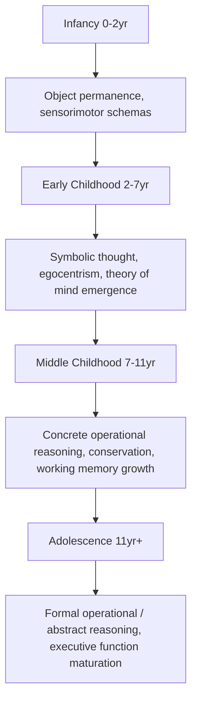

## Cognitive Milestones Across Development

### Overview

Cognitive development across childhood follows a broadly predictable, though individually variable, sequence in which increasingly sophisticated abilities in perception, memory, language, reasoning, and social cognition emerge in concert with the underlying neurodevelopmental processes described elsewhere in this chapter (synaptogenesis/pruning, myelination, critical periods). This topic integrates classic stage-based developmental psychology frameworks with the neural maturational substrates now understood to support them, while noting where classic stage theories have been substantially revised by subsequent research.

### Infancy (Birth to ~2 Years)

**Sensorimotor Development (Piagetian Framework)**

- Jean Piaget's **sensorimotor stage** (birth to approximately 2 years) describes infant cognition as organized around direct sensory and motor interaction with the environment, culminating in the development of **object permanence** — the understanding that objects continue to exist even when out of sight — classically assessed via the A-not-B task and visible/invisible displacement tasks.
- [Inference/well-established revision of the classic account] Subsequent research using more sensitive looking-time paradigms (violation-of-expectation methods, pioneered substantially by Renée Baillargeon and colleagues) has demonstrated that infants show behavioral evidence consistent with rudimentary object permanence considerably earlier than Piaget's original object-search-based methodology suggested, indicating that Piaget's stage timelines, while a useful organizing framework, understated infants' early competencies as measured by less motorically demanding methods.

**Early Perceptual and Attentional Capacities**

- Newborns show a preference for face-like visual stimuli and for their mother's voice (established prenatally via auditory experience in utero), indicating some perceptual biases and learning are present from birth or shortly thereafter.
- **Habituation/dishabituation paradigms** are a foundational methodological tool for inferring infant perceptual and cognitive capacities: infants' looking time to a repeated stimulus decreases (habituates) with repeated exposure, and a subsequent increase in looking time (dishabituation) to a novel stimulus indicates the infant has discriminated the change, providing pre-verbal evidence of perceptual/conceptual categorization.

**Neural Substrates**

- Early infancy cognitive development corresponds to a period of rapid synaptogenesis (particularly pronounced in primary sensory cortices, peaking within the first year) and ongoing myelination, though — consistent with the protracted maturational timeline of prefrontal and association cortex described elsewhere in this chapter — circuits supporting more complex, flexible cognition remain substantially immature throughout this period.

### Early Childhood (~2–7 Years)

**Preoperational Stage (Piagetian Framework)**

- Piaget's **preoperational stage** describes a period marked by the emergence of **symbolic thought** (language, pretend play, mental representation) alongside characteristic reasoning limitations, including:
  - **Egocentrism:** Difficulty taking another person's visual or conceptual perspective, classically illustrated by the "three mountains task."
  - **Lack of conservation:** Difficulty understanding that a quantity (volume, number, mass) remains constant despite a change in appearance (e.g., failing to recognize that liquid poured into a differently shaped container retains the same volume).
  - **Centration:** Tendency to focus on a single salient perceptual feature of a situation while neglecting other relevant dimensions.
- [Inference/well-established revision] As with the sensorimotor stage, subsequent research using simplified or more ecologically valid task variants has shown that young children demonstrate at least partial competence with perspective-taking and quantity-related reasoning earlier than Piaget's original tasks suggested, again indicating that task demands (rather than purely underlying conceptual competence) substantially influenced Piaget's original stage-timing estimates.

**Emergence of Theory of Mind**

- **Theory of mind** — the understanding that other people hold beliefs, desires, and mental states that may differ from one's own and from objective reality — undergoes a well-documented developmental transition during this period.
- The **false-belief task** (classically, the Sally-Anne task) is the standard benchmark: children are asked to predict where a character will look for an object, given that the character holds a false belief about the object's location (having not witnessed it being moved). A robust and extensively replicated developmental finding is that most typically developing children begin passing explicit verbal false-belief tasks reliably around **age 4**, with clear individual and cross-cultural variability in exact timing.
- [Inference/well-supported but still-refined finding] Using non-verbal, looking-time-based false-belief paradigms, some studies have reported evidence consistent with earlier, implicit false-belief understanding in infants under 2 years of age; the relationship between this early implicit sensitivity and later explicit, verbally-assessed false-belief reasoning remains an active area of research and theoretical debate (e.g., regarding whether these reflect a single underlying capacity emerging gradually, or distinct systems).
- **Neural correlates:** Theory of mind reasoning in older children and adults reliably engages a specific network including the **temporoparietal junction (TPJ)**, **medial prefrontal cortex**, and **precuneus/posterior cingulate**, with developmental neuroimaging studies documenting age-related changes in the engagement and functional connectivity of this network across childhood.

**Language Development**

- Vocabulary and grammatical complexity expand dramatically across this period, including well-documented milestones such as the "vocabulary spurt" in the second year and increasingly complex, grammatically structured multi-word utterances, occurring within the still-open sensitive period for first-language acquisition (see related critical/sensitive period material).

### Middle Childhood (~7–11 Years)

**Concrete Operational Stage (Piagetian Framework)**

- Piaget's **concrete operational stage** describes the acquisition of logical reasoning abilities applied to concrete, tangible situations, including reliable success on conservation tasks, **classification** (grouping objects by shared properties, including hierarchical classification), and **seriation** (ordering objects along a quantitative dimension, e.g., by size).
- Reasoning at this stage remains tied to concrete, directly reasoned-about content rather than fully abstract or hypothetical propositions, a limitation addressed by the subsequent formal operational stage.

**Working Memory and Executive Function Growth**

- **Working memory capacity** (the ability to hold and manipulate information over short periods) shows substantial, well-documented linear growth across middle childhood, commonly assessed via span tasks (e.g., digit span, and more demanding complex span tasks requiring simultaneous storage and processing).
- **Executive functions** more broadly — including inhibitory control, cognitive flexibility/set-shifting, and planning — show continued substantial maturation across this period, generally attributed to ongoing structural and functional maturation of prefrontal cortex and its connections with parietal and subcortical (e.g., basal ganglia) regions, though this maturation continues well beyond middle childhood into adolescence and young adulthood (see below).

**Metacognition**

- Middle childhood also sees notable growth in **metacognition** — awareness and monitoring of one's own cognitive processes (e.g., recognizing when one does or doesn't understand something, or selecting an appropriate memory strategy) — supporting increasingly self-regulated, strategic learning and problem-solving.

### Adolescence (~11–Late Teens/Early 20s)

**Formal Operational Stage (Piagetian Framework)**

- Piaget's **formal operational stage** describes the emergence of **abstract, hypothetical, and systematic reasoning** — the capacity to reason about hypothetical possibilities not directly tied to concrete experience, to engage in systematic hypothesis-testing (e.g., in the classic pendulum problem, isolating and testing variables systematically), and to engage in higher-order abstract reasoning about concepts such as justice, morality, and identity.
- [Inference/genuinely and substantially contested] The universality and even the discrete "stage-like" nature of formal operational reasoning has been considerably more contested in subsequent research than earlier Piagetian stages; evidence indicates that many adults do not consistently demonstrate formal operational reasoning across all task domains, and that such reasoning appears to be considerably more dependent on domain-specific knowledge, education, and cultural/schooling context than Piaget's original universal-stage account proposed.

**Protracted Prefrontal Maturation and Executive Function**

- As detailed in related material on synaptic pruning and structural brain development, prefrontal cortex undergoes a markedly protracted structural and functional maturation extending through adolescence into the mid-to-late twenties, corresponding behaviorally to continued, gradual improvement in executive function, cognitive control, working memory capacity, and complex planning/decision-making across this age range.
- **Dual-systems / maturational-imbalance models:** A prominent, though [Inference/actively debated and refined] not uncontested, class of models in adolescent developmental neuroscience proposes that a relatively earlier-maturing subcortical/limbic "socioemotional" or reward-processing system (including regions such as the ventral striatum and amygdala) develops ahead of the more slowly maturing prefrontal "cognitive control" system, potentially contributing to characteristic adolescent patterns of heightened reward-sensitivity, risk-taking, and susceptibility to peer influence, particularly under conditions of emotional arousal. Critics of this framework have raised both empirical and methodological concerns (e.g., regarding the reliability of specific neuroimaging contrasts used to support it, and regarding the framework's tendency toward oversimplified binary "two systems" characterizations of what is likely more continuous, multi-system neurodevelopmental change), and this remains an area of genuinely active scientific debate rather than settled consensus.

**Social Cognition in Adolescence**

- Adolescence is also associated with continued refinement of more sophisticated social-cognitive capacities, including advanced perspective-taking, sensitivity to peer evaluation and social status, and — [Inference, an area of active research] — some evidence of continued functional and structural change within the theory-of-mind/mentalizing network (TPJ, medial prefrontal cortex) extending beyond the basic false-belief competency achieved in early childhood, supporting increasingly nuanced social reasoning about more complex, ambiguous, or emotionally laden social situations.

### Comparative Summary Table

| Developmental Period | Approximate Age | Piagetian Stage | Key Cognitive Milestones | Key Neural Correlates |
| --- | --- | --- | --- | --- |
| Infancy | 0–2 years | Sensorimotor | Object permanence, sensorimotor schemas | Rapid sensory cortex synaptogenesis |
| Early childhood | 2–7 years | Preoperational | Symbolic thought, theory of mind (false-belief ~age 4), language explosion | TPJ/mPFC network emergence; ongoing pruning |
| Middle childhood | 7–11 years | Concrete operational | Conservation, classification, working memory growth, metacognition | Continued prefrontal-parietal network maturation |
| Adolescence | ~11–20s | Formal operational (contested universality) | Abstract/hypothetical reasoning, executive function maturation, complex social cognition | Protracted prefrontal maturation; proposed subcortical-cortical maturational imbalance |

### Methodological Notes and Caveats

- **Key Points**
  - Classic Piagetian stage boundaries, while historically foundational and pedagogically useful as an organizing framework, have been substantially revised by subsequent research using more sensitive, less motorically/verbally demanding experimental paradigms — a recurring pattern across the sensorimotor, preoperational, and formal operational stages described above.
  - Individual variability in the timing of cognitive milestones is substantial and influenced by numerous factors including genetics, environmental enrichment, education, socioeconomic context, and cultural practices; the ages given throughout this reference represent commonly cited approximate benchmarks from the developmental literature rather than fixed, universal timepoints. [Inference] Substantial individual and cross-cultural variability around these approximate benchmarks should be assumed rather than treated as exceptional.
  - Structure-function correlations linking specific neural maturational metrics (e.g., prefrontal cortical thickness trajectories) to specific cognitive milestones are generally correlational in the developmental cognitive neuroscience literature rather than established as direct causal mechanisms, and should be interpreted with appropriate caution regarding the strength and specificity of any given structure-behavior link.

### Example: Interpreting a False-Belief Task Result

**Example**

In a standard Sally-Anne false-belief task, a child watches a puppet named Sally place a marble in a basket and then leave the room; while Sally is absent, a second puppet, Anne, moves the marble to a box. The child is then asked where Sally will look for the marble upon returning. A child who answers "the basket" (Sally's last known location, reflecting understanding that Sally holds a false belief) is credited with passing the task, while a child who answers "the box" (the marble's actual current location) is considered to be reasoning from their own privileged knowledge rather than representing Sally's distinct mental state. The well-replicated finding that most children shift from failing to reliably passing this task around age 4 is among the most robust benchmark findings in the developmental theory-of-mind literature, though, as noted above, non-verbal paradigms suggest some relevant sensitivity may be present considerably earlier in a more implicit form.

### Related Topics

- Synaptogenesis and pruning across childhood
- Critical and sensitive periods in development
- Theory of mind and the temporoparietal junction/medial prefrontal network
- Adolescent brain development and the dual-systems model debate
- Executive function development and prefrontal cortex maturation
- Piaget's stage theory and its contemporary revisions
- Working memory development and assessment methods
- Language acquisition milestones and sensitive periods