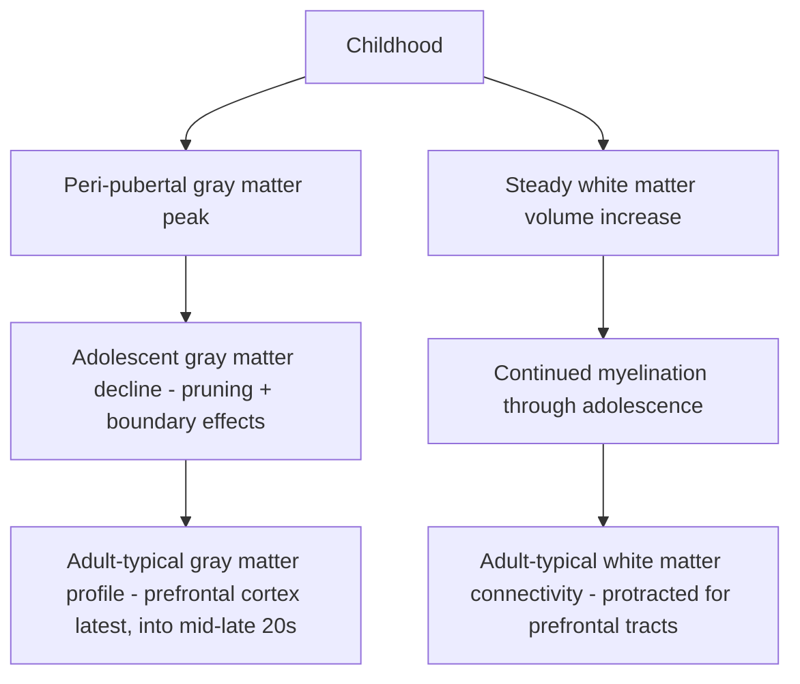

## Adolescent Brain Maturation

### Overview

Adolescence is a distinct neurodevelopmental period, spanning roughly the onset of puberty through the mid-to-late twenties, characterized by substantial ongoing structural and functional brain reorganization. Rather than representing simple continued "growth," adolescent brain maturation is now understood to involve a complex combination of continued gray matter refinement (pruning), progressive white matter maturation (myelination), and reorganization of large-scale functional network connectivity — occurring asynchronously across different brain systems in a manner that has motivated influential, though actively debated, models of adolescent behavior and risk-taking.

### Structural MRI Trajectories

**Gray Matter: Inverted-U Trajectory**

- Longitudinal structural MRI studies (notably large cohort work associated with Jay Giedd and colleagues at the NIMH, among numerous subsequent studies) have established that cortical **gray matter volume and thickness** follow a broadly inverted-U trajectory across childhood and adolescence: increasing through childhood, peaking around the time of puberty (with regional and some reported sex-related variation in exact peak timing), and subsequently declining through adolescence into young adulthood.
- This decline is widely interpreted as substantially reflecting ongoing **synaptic pruning** (see related material on synaptogenesis and pruning), though continued myelination at the gray-white matter boundary can also contribute to apparent gray matter volume reduction on structural MRI due to the way tissue boundaries are estimated, meaning the gray matter decline should not be interpreted as reflecting pruning alone.
- **Regional "back-to-front" (or "last in, first out") maturational sequence:** Primary sensory and motor cortices reach adult-like gray matter profiles earliest, followed by association cortices, with higher-order **prefrontal cortex** and lateral **temporal association cortex** generally showing the most protracted maturational timeline, not reaching adult-typical structural profiles until the mid-to-late twenties in many individuals.

**White Matter: Continued Myelination**

- In contrast to the inverted-U pattern of gray matter, **white matter volume** shows a comparatively steady, roughly linear increase across adolescence and into young adulthood, reflecting ongoing **myelination** of axonal tracts (see related material on myelination if covered elsewhere in this course).
- Diffusion tensor imaging (DTI) studies corroborate this pattern, showing continued increases in white matter tract organization/coherence metrics (e.g., fractional anisotropy) across major association and projection tracts throughout adolescence, with tracts connecting prefrontal cortex to subcortical and posterior cortical regions showing particularly protracted maturational timelines.

### Functional Network Reorganization

- Beyond structural change, resting-state and task-based fMRI studies document substantial reorganization of large-scale **functional connectivity** across adolescence, generally characterized by a shift from a more locally organized (short-range, anatomically proximal) connectivity pattern in childhood toward a more distributed, long-range, integrated network topology in adulthood.
- Specific large-scale networks implicated in this reorganization include the **default mode network** (implicated in self-referential and social cognition), **frontoparietal control network** (implicated in executive function and cognitive control), and **salience network** (implicated in detecting and orienting attention toward behaviorally relevant, including emotionally/socially salient, stimuli) — with continued adolescent refinement of the functional segregation and integration among these networks proposed as a substrate for improving executive control and self-regulation capacities.
- [Inference — an active area of network neuroscience research] The precise relationship between specific functional connectivity maturational metrics and specific behavioral/cognitive outcomes remains generally correlational rather than established as directly causal in the current literature.

### The Dual-Systems / Maturational Imbalance Model

**Core Proposal**

- A prominent framework in adolescent developmental neuroscience — associated substantially with researchers including Laurence Steinberg, B.J. Casey, and colleagues — proposes that adolescent behavior, particularly heightened risk-taking, sensation-seeking, and susceptibility to peer influence, reflects a developmental **mismatch or imbalance** between two neural systems maturing on different timescales:
  - A relatively **earlier-maturing subcortical/limbic "socioemotional" system** (including the ventral striatum, implicated in reward processing, and the amygdala, implicated in emotional/threat processing), which reaches adult-like reactivity relatively early in adolescence, potentially with a peri-pubertal peak in reward-related reactivity in some studies.
  - A more **slowly, protractedly maturing prefrontal "cognitive control" system** (particularly lateral and medial prefrontal cortex and its connections), which does not reach full adult-typical maturity until the mid-to-late twenties, as described above.
- Under this model, the temporal gap between an early-maturing, highly reactive reward/emotion system and a still-maturing regulatory prefrontal system is proposed to create a developmental window of heightened vulnerability to risk-taking, particularly under conditions of high emotional arousal, social/peer presence, or immediate reward availability — a pattern behaviorally distinct from either childhood (low reward-sensitivity paired with lower but still-immature cognitive control) or full adulthood (both systems mature).

**Evidence and Empirical Support**

- Behavioral studies (including classic simulated risk-taking tasks such as the Balloon Analogue Risk Task and driving-simulation studies) have found that adolescents show heightened risk-taking specifically under conditions involving peer observation/presence or emotionally arousing contexts, compared to more emotionally neutral or solitary decision-making contexts — a pattern broadly consistent with the dual-systems framework's emphasis on context-dependent (rather than uniformly elevated) adolescent risk-taking.
- fMRI studies have reported, in some but not all studies, heightened ventral striatal reward-related activation in adolescents relative to both children and adults under certain reward-anticipation task conditions, cited as neural support for the "earlier-maturing reward system" component of the model.

**Critiques and Ongoing Debate**

- [Inference/genuinely contested, appropriately flagged as an area of active scientific debate] The dual-systems framework has faced substantial critique on several grounds:
  - Some researchers argue the model oversimplifies what is more plausibly a continuous, multi-system developmental process into an overly binary "two systems" narrative, and that the specific neuroimaging contrasts used to support differential subcortical/prefrontal maturational timing have shown inconsistent replication across studies and analytic approaches.
  - Some large-scale and meta-analytic studies have found less consistent evidence for adolescent-specific hyper-reactivity of reward circuitry than the model's strongest claims would predict, with findings varying by task paradigm, specific reward type, and analytic method.
  - Critics have also raised concern that popularized versions of the dual-systems model have, at times, been applied to policy and legal contexts (e.g., juvenile justice) with a degree of confidence and mechanistic specificity that outpaces the underlying, still-actively-debated scientific evidence base.
- [Inference] Current scientific consensus is best characterized as viewing the dual-systems model as a genuinely influential and partially empirically supported organizing framework, while treating its specific claims about differential maturational timing and adolescent-specific neural hyper-reactivity as an active area of ongoing empirical refinement and debate rather than settled, uncontested fact.

### Puberty and Hormonal Influences

- The onset of puberty, driven by activation of the hypothalamic-pituitary-gonadal (HPG) axis and associated rise in gonadal steroid hormones (estrogens, testosterone) and adrenal androgens, is temporally associated with (and, in some models, proposed as a contributing causal driver of) several aspects of adolescent brain and behavioral change, including the peri-pubertal gray matter peak described above and proposed changes in reward-system reactivity.
- [Inference — genuinely complex and multi-causal] The relative contribution of pubertal hormonal signaling versus chronological/experiential age-related maturation to specific adolescent brain changes is difficult to fully disentangle in human studies (given that puberty and age are naturally correlated), and represents an active methodological and substantive challenge in the field, with some studies attempting to statistically dissociate pubertal stage from chronological age effects with partially convergent, partially still-debated findings.

### Cognitive and Behavioral Correlates

- **Continued executive function improvement:** Working memory, inhibitory control, planning, and cognitive flexibility all show continued, gradual improvement across adolescence into young adulthood, broadly paralleling the protracted structural/functional maturation of prefrontal-parietal control networks described above.
- **Peer influence and social sensitivity:** Adolescence is associated with heightened sensitivity to peer evaluation, social status, and social exclusion, with some fMRI studies reporting adolescent-specific patterns of neural response (e.g., in regions associated with social pain/rejection processing) to simulated social exclusion paradigms (e.g., the Cyberball task), though — consistent with the broader pattern of debate described above — the specificity and consistency of these neural findings across studies varies.
- **Sleep and circadian changes:** Puberty is associated with a well-documented shift toward later circadian sleep-wake preference ("night owl" tendency), a biologically-grounded change (rather than purely behavioral/social) that has informed public health and school-start-time policy discussions, representing a further domain of adolescent-specific neurobiological change beyond the cortical/subcortical systems emphasized in the dual-systems model.

### Clinical and Public Health Relevance

- **Onset of psychiatric conditions:** Adolescence and young adulthood represent the period of peak onset risk for numerous major psychiatric conditions, including mood disorders, anxiety disorders, psychotic disorders (e.g., schizophrenia), and substance use disorders; [Inference — widely discussed hypothesis, not established as a single confirmed mechanism] this epidemiological pattern has motivated substantial research interest in whether specific aspects of adolescent neurodevelopmental change (e.g., ongoing prefrontal circuit refinement, coincident with complement-mediated synaptic pruning processes discussed in related material) might contribute mechanistically to this vulnerability window, though establishing direct causal mechanistic links in humans remains a substantial ongoing research challenge.
- **Substance use vulnerability:** The adolescent brain's still-maturing reward and cognitive control circuitry has been proposed as a contributing factor in adolescents' documented heightened vulnerability to developing substance use disorders following early substance exposure, relative to initiation at a later, more neurodevelopmentally mature age, an area of active research relevant to substance use prevention policy.

### Example: Interpreting a Peer-Presence Risk-Taking Study

**Example**

In a classic dual-systems-motivated behavioral study, adolescents, and separately adults, complete a simulated driving task under two conditions: alone, or believing that peers are observing their performance via video link. Adolescents (but not adults, in the originally reported pattern) show substantially increased risky driving behavior (e.g., running yellow lights, closer following distances) specifically in the peer-observation condition relative to the alone condition, while showing comparable behavior to adults when alone. This context-dependent pattern — rather than adolescents being simply and uniformly more risk-prone across all situations — is a key piece of behavioral evidence cited in support of the dual-systems model's emphasis on socioemotional context (here, peer presence) as an amplifier of adolescent risk-related decision-making, though, as with the broader model, the consistency of this specific peer-presence effect across subsequent replication attempts and different risk-taking paradigms has been an area of continued empirical scrutiny.

### Related Topics

- Synaptogenesis and pruning across childhood
- Cognitive milestones across development and executive function maturation
- Puberty and hypothalamic-pituitary-gonadal axis neuroendocrinology
- Reward circuitry and ventral striatal function
- Psychiatric disorder onset epidemiology and neurodevelopmental vulnerability windows
- Default mode, frontoparietal, and salience network development
- Sleep and circadian rhythm changes across puberty
- Substance use disorder vulnerability and adolescent neurodevelopment