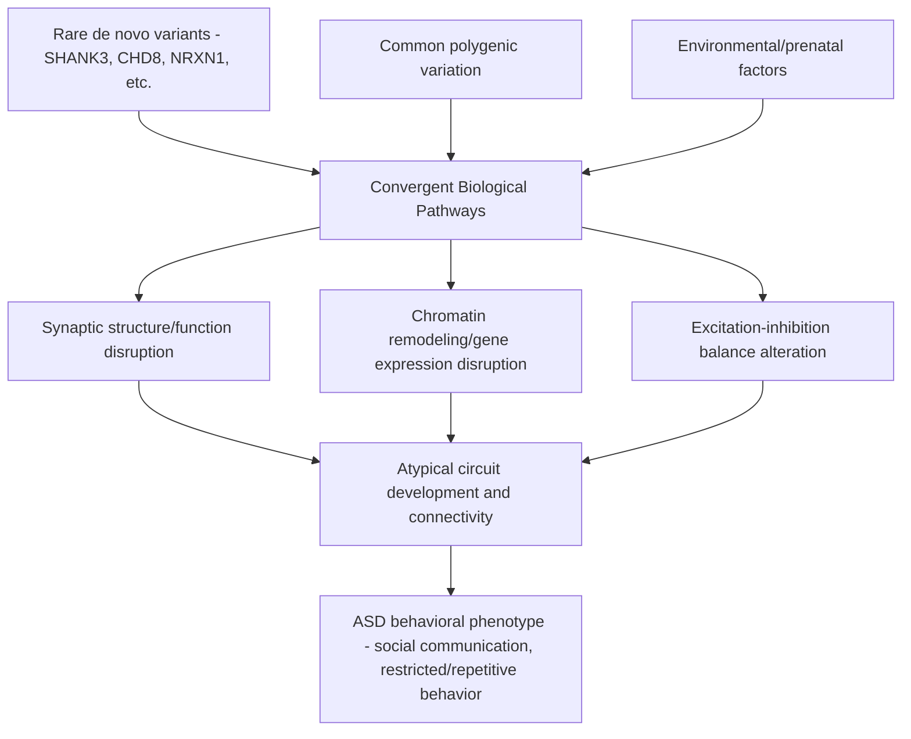

## Autism and Neurodevelopmental Disorders

### Overview

Neurodevelopmental disorders are a heterogeneous category of conditions characterized by atypical brain development that produces impairments in cognition, communication, social functioning, learning, and/or motor coordination, typically manifesting early in development and following a persistent course. **Autism spectrum disorder (ASD)** serves as this chapter's central case study given its extensive neuroscientific research base, while related conditions (ADHD, specific learning disorders, intellectual disability) share overlapping etiological and neurobiological themes worth situating alongside it.

### Autism Spectrum Disorder: Clinical Definition

**Diagnostic Framework (DSM-5-TR)**

- ASD is characterized by two core domains: (1) persistent deficits in **social communication and social interaction** across multiple contexts, and (2) **restricted, repetitive patterns of behavior, interests, or activities**, including sensory sensitivities/atypicalities.
- The "spectrum" designation reflects substantial heterogeneity in presentation severity, associated cognitive ability (ranging from intellectual disability to average or above-average intellectual functioning), language development, and co-occurring conditions.
- **Key Points**
  - Symptoms must be present in the early developmental period, though may not become fully apparent until social demands exceed capacity.
  - Diagnosis is behavioral/clinical (based on standardized instruments such as the ADOS and ADI-R, combined with clinical judgment), as no validated biomarker currently exists for routine clinical diagnosis.
  - Substantial and frequent co-occurrence with other conditions, notably ADHD, anxiety disorders, epilepsy, intellectual disability, and gastrointestinal symptoms.

### Genetic Architecture

**High Heritability, Substantial Genetic Heterogeneity**

- Twin and family studies consistently indicate substantial heritability for ASD (estimates in the range of roughly 60–90% in various twin study designs), among the highest heritability estimates in psychiatric/neurodevelopmental genetics, though [Inference — heritability estimates vary meaningfully by study design and population] precise figures vary across studies and methodologies.
- Genetic architecture is highly heterogeneous, encompassing:
  - **Rare, high-penetrance variants:** Including de novo copy number variants (CNVs) and de novo single-nucleotide variants in specific genes, many converging on biological pathways related to synaptic function, chromatin remodeling/gene expression regulation, and neuronal excitability. Well-characterized examples include genes such as *SHANK3*, *NRXN1*, *FMR1* (fragile X syndrome), *MECP2* (Rett syndrome, historically classified separately but genetically and phenotypically overlapping), and *CHD8*.
  - **Common genetic variation:** Genome-wide association studies (GWAS) indicate that a substantial portion of ASD heritability is attributable to the combined, polygenic effect of many common variants of small individual effect, similar to the polygenic architecture observed in other psychiatric conditions.
- [Inference/well-established general principle] This genetic heterogeneity — many distinct genetic routes converging on a broadly similar behavioral phenotype — is consistent with the framing of ASD as a final common behavioral pathway reachable through multiple distinct underlying etiological mechanisms, rather than a single unified disease process with one root cause.

**Convergent Biological Pathways**

- Despite genetic heterogeneity, many ASD-associated genes converge functionally on a relatively limited number of biological processes, prominently:
  - **Synaptic structure and function:** Genes affecting synapse formation, structure (e.g., *SHANK3*, *NRXN1*, *NLGN3/4*), and synaptic plasticity.
  - **Chromatin remodeling and transcriptional regulation:** Genes affecting broad gene-expression programs during neurodevelopment (e.g., *CHD8*, *ARID1B*).
  - **Excitation-inhibition (E/I) balance:** A prominent and influential theoretical framework proposes that many convergent ASD-associated genetic and molecular disruptions ultimately manifest as an altered balance between excitatory (glutamatergic) and inhibitory (GABAergic) neurotransmission within cortical circuits, potentially affecting circuit-level information processing and the sensory/social processing atypicalities characteristic of ASD.

### Neuroimaging and Neurobiological Findings

**Early Brain Overgrowth**

- A relatively well-replicated structural MRI finding across multiple independent cohorts is atypical **early brain overgrowth** in a subset of children later diagnosed with ASD — larger head circumference and/or brain volume in infancy/early toddlerhood relative to typically developing peers — followed by a deceleration such that overall brain size differences are less pronounced or absent by later childhood/adulthood.
- [Inference — an established but heterogeneous finding] This early overgrowth pattern is not universal across all individuals with ASD and represents one identified subtype/pattern within a heterogeneous condition rather than a defining, universal neurobiological signature of autism as a whole.

**Functional and Structural Connectivity**

- A substantial body of fMRI research has investigated large-scale functional connectivity differences in ASD, with findings historically summarized (though with meaningful inconsistency across specific studies) as a pattern of relative **long-range underconnectivity** (particularly involving frontal-posterior connections relevant to integrative, higher-order cognitive and social processing) combined with, in some studies, relative **local overconnectivity**.
- [Unverified/genuinely inconsistent across the literature] This "underconnectivity/overconnectivity" framework, while historically influential, has not been consistently replicated across all subsequent studies and analytic approaches, and current understanding treats it as one useful heuristic model among several rather than a definitively established, universal neurobiological signature — connectivity findings in ASD research show substantial heterogeneity related to age, specific brain networks examined, symptom severity, and methodological/analytic choices across studies.

**Social Brain Network Findings**

- Given the centrality of social communication differences to the ASD phenotype, substantial research has examined regions implicated in social cognition, including the **fusiform face area** (face processing), **superior temporal sulcus** (biological motion, gaze processing), **amygdala** (social-emotional salience), and the broader mentalizing/theory-of-mind network (temporoparietal junction, medial prefrontal cortex). Findings across these regions show some replicated atypicalities (e.g., some studies reporting reduced fusiform face area activation to faces in ASD) but also substantial heterogeneity and inconsistency across the broader literature, consistent with the general theme of biological heterogeneity underlying the behaviorally-defined ASD category.

### The "Broken Mirror" Hypothesis: A Cautionary Case Study

- An influential hypothesis proposed in the 2000s suggested that social-cognitive difficulties in ASD reflect a specific dysfunction of the **mirror neuron system** (see related material on action observation and imitation), sometimes termed the "broken mirror" hypothesis.
- [Unverified/largely superseded] Subsequent, more rigorous and better-controlled studies have generally failed to find consistent, specific mirror-neuron-system dysfunction across the ASD population, and this simple, unifying "broken mirror" account is now considered by much of the field to be an oversimplification not well supported by the accumulated evidence.
- This case is instructive as an example of how an initially compelling, mechanistically appealing hypothesis in developmental cognitive neuroscience can gain substantial early traction before more rigorous subsequent research substantially revises or discards it — a pattern relevant to interpreting other, currently still-active hypotheses in the field with appropriate epistemic caution.

### Environmental and Prenatal Factors

- Beyond genetics, a range of prenatal and perinatal factors have been associated with modestly increased ASD likelihood in epidemiological studies, including advanced parental age, certain prenatal medication exposures (e.g., valproate, an anticonvulsant with well-established teratogenic risk specifically including elevated ASD likelihood), and complications of pregnancy/birth; [Inference — the evidence base varies considerably across specific proposed factors] the strength of evidence and effect sizes vary considerably across different proposed environmental/prenatal risk factors, with some considerably better-established (e.g., valproate exposure) than others.
- **Vaccines are not a cause of autism.** This has been extensively investigated across numerous large, methodologically rigorous epidemiological studies and is not supported by the scientific evidence; this is included here explicitly given its historical and continued public prominence as a persistent, evidence-contradicted claim.

### Related Neurodevelopmental Disorders: Comparative Overview

**Attention-Deficit/Hyperactivity Disorder (ADHD)**

- Characterized by persistent patterns of inattention and/or hyperactivity-impulsivity impairing functioning; also substantially heritable, with polygenic architecture showing some overlap with ASD genetic risk.
- Neuroimaging findings include some replicated evidence of delayed cortical maturation trajectories (particularly prefrontal regions) relative to typically developing peers, and atypical structure/function of frontostriatal circuits implicated in executive function and response inhibition; dopaminergic signaling is centrally implicated given the well-established therapeutic efficacy of stimulant medications acting on dopamine/norepinephrine transporters.
- [Inference] Substantial co-occurrence between ASD and ADHD (a comorbidity historically under-recognized in diagnostic frameworks that formerly precluded dual diagnosis) suggests at least partially overlapping neurodevelopmental mechanisms, an active area of comparative neurodevelopmental research.

**Specific Learning Disorders (e.g., Dyslexia)**

- **Developmental dyslexia**, the most extensively studied specific learning disorder, is characterized by a specific, unexpected difficulty in accurate and/or fluent word reading despite adequate intelligence, educational opportunity, and sensory function.
- Substantial neuroimaging evidence implicates atypical structure and function of a left-hemisphere-dominant reading network, including left temporoparietal and occipitotemporal (including the "visual word form area") regions, alongside evidence for underlying phonological processing deficits as a core cognitive mechanism.

**Intellectual Disability**

- Characterized by significant limitations in both intellectual functioning (typically operationalized via standardized IQ assessment) and adaptive behavior, with onset during the developmental period; etiology is highly heterogeneous, spanning identifiable genetic syndromes (e.g., Down syndrome, fragile X syndrome), prenatal/perinatal insults, and, in a substantial proportion of cases, no currently identifiable specific cause.

**Fragile X Syndrome: A Single-Gene Model System**

- Caused by a trinucleotide (CGG) repeat expansion in the *FMR1* gene, resulting in silencing of the *FMR1* gene and loss of its protein product, FMRP, which normally regulates local, activity-dependent protein synthesis at synapses.
- Fragile X syndrome is the most common known single-gene cause of intellectual disability and is also one of the most common identifiable single-gene causes of ASD, providing an important genetically well-characterized model system for studying how a specific, well-understood molecular disruption (dysregulated synaptic protein synthesis, with downstream effects on synaptic structure and plasticity) can produce a complex neurodevelopmental/behavioral phenotype overlapping substantially with idiopathic ASD.

### Comparative Summary Table

| Condition | Core Features | Key Genetic/Neurobiological Themes |
| --- | --- | --- |
| Autism Spectrum Disorder | Social communication differences; restricted/repetitive behavior | High heterogeneity; synaptic, chromatin, and E/I balance convergence; heterogeneous connectivity findings |
| ADHD | Inattention, hyperactivity, impulsivity | Delayed cortical maturation; frontostriatal/dopaminergic circuit involvement |
| Developmental Dyslexia | Specific reading fluency/accuracy impairment | Left-hemisphere reading network; phonological processing deficits |
| Intellectual Disability | Global intellectual and adaptive functioning limitation | Highly heterogeneous etiology; identifiable syndromes plus idiopathic cases |
| Fragile X Syndrome | Intellectual disability, frequent ASD co-occurrence | Single-gene (*FMR1*) cause; disrupted activity-dependent synaptic protein synthesis |

### Clinical and Translational Considerations

- **Early identification and intervention:** Given the developmental plasticity and sensitive-period principles established elsewhere in this chapter, substantial clinical and research emphasis is placed on early identification of ASD and related neurodevelopmental conditions, with evidence supporting better outcomes generally associated with earlier initiation of appropriate behavioral/developmental intervention, broadly consistent with (though not a direct proof of) the general sensitive-period plasticity framework.
- **No single validated neurobiological biomarker:** Despite extensive neuroimaging and genetic research, ASD diagnosis remains behavioral/clinical rather than biomarker-based; [Inference] the substantial biological heterogeneity underlying the ASD behavioral category is a commonly cited explanation for why a single, universally applicable biomarker has proven difficult to establish, and represents an active and important direction for ongoing precision-medicine-oriented research (e.g., biologically informed subtyping efforts).

### Example: Interpreting a Fragile X Molecular Mechanism

**Example**

In fragile X syndrome, CGG repeat expansion beyond a critical threshold in the *FMR1* gene's promoter region triggers epigenetic silencing (via DNA methylation) of the gene, eliminating production of FMRP. Because FMRP normally acts to regulate (predominantly suppress) local, activity-dependent mRNA translation at synapses in response to metabotropic glutamate receptor (mGluR) activation, its loss results in excessive, unregulated local protein synthesis at synapses, producing structural and functional synaptic abnormalities (including immature-appearing dendritic spine morphology) that are proposed to underlie the intellectual disability and, in a substantial proportion of affected individuals, co-occurring ASD phenotype — illustrating, in a single well-characterized genetic model, the broader convergence-on-synaptic-mechanism theme that recurs across much of contemporary ASD molecular genetics research.

### Related Topics

- Synaptogenesis and pruning across childhood
- Excitation-inhibition balance and GABAergic interneuron development
- Action observation, imitation, and the mirror neuron system debate
- Theory of mind and the temporoparietal junction/medial prefrontal network
- Genetic architecture of psychiatric and neurodevelopmental conditions (polygenic risk, de novo variants)
- Fragile X syndrome and activity-dependent synaptic protein synthesis
- Early intervention approaches and developmental sensitive periods
- ADHD frontostriatal circuitry and dopaminergic pharmacology