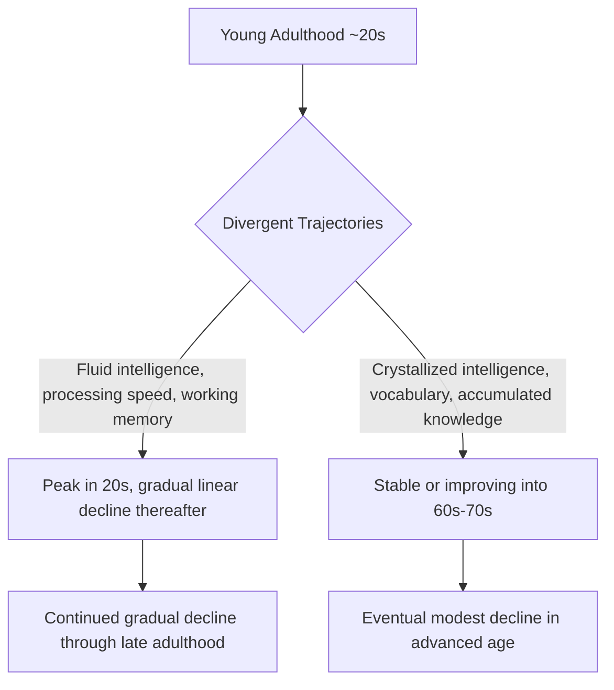

## Normal Cognitive Aging Trajectories

### Overview

Normal (non-pathological) cognitive aging refers to the pattern of cognitive change that occurs as a typical feature of advancing age, distinct from the pathological cognitive decline associated with neurodegenerative disease. A central and well-established organizing principle of this literature is that cognitive aging is **not uniform** across cognitive domains: certain abilities show gradual, measurable decline beginning relatively early in adulthood, while others remain stable or even continue to improve well into later life — a pattern most influentially captured by the distinction between fluid and crystallized intelligence.

### Fluid vs. Crystallized Intelligence: The Core Framework

**Fluid Intelligence (Gf)**

- Refers to the capacity for novel problem-solving, abstract reasoning, and processing information independent of prior specific knowledge or learned content.
- **Key Points**
  - Shows a relatively early peak (commonly cited in the young adult range, roughly the 20s) followed by a gradual, roughly linear decline across the remainder of adulthood, well documented across numerous large cross-sectional and longitudinal studies using standardized cognitive test batteries.
  - Component abilities showing this pattern include processing speed, working memory capacity, and certain aspects of executive function.

**Crystallized Intelligence (Gc)**

- Refers to accumulated knowledge, vocabulary, and learned skills/expertise acquired over the lifespan.
- **Key Points**
  - Remains stable or, in many studies, continues to show modest improvement well into the sixth or seventh decade of life before eventual, generally more modest, decline in very advanced age — a markedly different trajectory from fluid intelligence.
  - This distinction is a foundational and consistently replicated finding in lifespan cognitive aging research, originally systematized by Raymond Cattell and John Horn.

### Domain-Specific Trajectories

**Processing Speed**

- Among the most consistently and robustly documented age-related declines, with slowing detectable on simple and choice reaction time tasks beginning in early-to-middle adulthood and continuing progressively thereafter.
- **Processing speed theory** (associated substantially with Timothy Salthouse) proposes that generalized slowing of information processing may serve as a common underlying mechanism contributing to age-related decline across multiple, seemingly distinct cognitive domains (e.g., working memory, some aspects of episodic memory), since slower processing can limit the amount of information successfully encoded, manipulated, or retrieved within a given time window.

**Working Memory**

- Shows measurable age-related decline, particularly evident on tasks requiring simultaneous storage and active manipulation of information (complex span tasks) more so than on tasks requiring simple, passive information maintenance.
- [Inference — a widely cited explanatory contributor, among others, rather than a single complete account] Reduced processing speed and reduced ability to inhibit task-irrelevant information (see inhibitory control below) are both commonly proposed as contributing mechanisms underlying working memory decline in aging, alongside age-related changes in prefrontal cortical structure and function.

**Episodic Memory**

- Memory for specific, contextually-situated personal events (the "what, where, when" of an experience) shows a well-documented pattern of age-related decline, generally considered one of the more pronounced and consistently observed domains of decline in normal cognitive aging.
- **Encoding vs. retrieval deficits:** A substantial body of research has examined whether age-related episodic memory decline reflects primarily impaired encoding (initial formation of a memory trace) or impaired retrieval (subsequent recovery of a formed memory); [Inference/genuinely nuanced, evidence supports both contributing] evidence generally supports contributions from both processes, with some research suggesting older adults may particularly benefit from richer contextual/environmental retrieval support, consistent with at least a partial retrieval-based contribution alongside encoding-related changes.
- Semantic memory (general factual/conceptual knowledge, closely related to crystallized intelligence) is comparatively well-preserved relative to episodic memory across normal aging.

**Executive Function and Inhibitory Control**

- Some, though not all, aspects of executive function show age-related decline, including inhibitory control (the ability to suppress prepetent or task-irrelevant responses, commonly assessed via Stroop-type interference tasks) and cognitive flexibility/set-shifting.
- The **inhibitory deficit hypothesis** (associated substantially with Lynn Hasher and colleagues) proposes that reduced ability to inhibit irrelevant information from entering and being maintained in working memory is a key contributing mechanism underlying multiple aspects of cognitive aging, potentially explaining older adults' documented increased susceptibility to distraction and interference in various cognitive tasks.

**Attention**

- Selective and divided attention (particularly under conditions of high cognitive load or requiring rapid task-switching) show measurable age-related decline, while sustained attention (vigilance over extended periods) is comparatively better preserved in many studies.

**Language**

- Vocabulary and general language comprehension are comparatively well-preserved (consistent with the crystallized intelligence pattern), while **word-finding difficulties** (the frequently reported subjective experience of difficulty retrieving a specific known word, sometimes termed "tip-of-the-tongue" states) increase in frequency with normal aging despite generally preserved underlying vocabulary knowledge — an important dissociation between accessing versus possessing linguistic/semantic knowledge.

### Structural and Functional Neural Correlates of Normal Aging

**Structural Brain Changes**

- Normal aging is associated with a gradual, generalized reduction in total brain volume and cortical thickness, though the magnitude and regional pattern of this decline is not uniform: **prefrontal cortex** and the **hippocampus** show comparatively pronounced volumetric decline in many studies relative to other cortical regions, broadly consistent with the domain-specific pattern of cognitive decline described above (executive function/prefrontal-dependent processes and episodic memory/hippocampal-dependent processes being among the more affected domains).
- White matter integrity, assessed via diffusion tensor imaging, also shows age-related decline in many association and projection tracts, with frontal white matter tracts often showing comparatively pronounced age-related changes — consistent with a broader "frontal aging hypothesis" proposing that prefrontal-dependent cognitive functions are disproportionately vulnerable to normal age-related brain changes relative to other cognitive domains.

**Functional Reorganization: Compensatory Recruitment Models**

- A prominent and influential finding in functional neuroimaging studies of cognitive aging is that older adults frequently show **additional or more bilateral prefrontal activation** during cognitive task performance relative to younger adults performing the same task at an equivalent behavioral level — a pattern that has motivated several, partially overlapping theoretical frameworks:
  - **HAROLD model (Hemispheric Asymmetry Reduction in OLDer adults):** Proposed by Roberto Cabeza and colleagues, describes the commonly observed reduction in the hemispheric lateralization of prefrontal activity during cognitive tasks in older, relative to younger, adults.
  - **Compensation-related utilization of neural circuits hypothesis (CRUNCH):** Proposes that older adults recruit additional neural resources (including bilateral/additional prefrontal regions) at lower task difficulty levels than younger adults, in order to maintain equivalent task performance — with a proposed "crossover" point at higher task difficulty where older adults' compensatory capacity is exceeded and performance begins to decline relative to younger adults.
- [Inference/genuinely debated interpretation] Whether this additional/bilateral prefrontal recruitment in older adults represents successful, adaptive **compensation** (helping to maintain performance) or, alternatively, a less specific and less efficient pattern of neural recruitment (**dedifferentiation**, reflecting reduced neural specificity/efficiency with age rather than a beneficial compensatory response) remains an actively debated question in the cognitive aging neuroimaging literature, with evidence offered on both sides and likely some role for both processes depending on the specific task, brain region, and individual studied.

$$\text{Task Performance} = f(\text{Baseline neural resources}) + f(\text{Compensatory recruitment, up to a capacity limit})$$

### Individual Variability and Cognitive Reserve

- A defining feature of normal cognitive aging research is substantial **individual variability**: some older individuals ("successful agers" or "superagers" in some research terminology) show cognitive performance, and in some studies corresponding brain structural/functional profiles, comparable to individuals decades younger, while others show more pronounced age-typical decline.
- **Cognitive reserve** is an influential explanatory construct proposing that individual differences in educational attainment, occupational complexity, and ongoing cognitive/social engagement contribute to an individual's capacity to tolerate age-related (or pathological) brain changes while maintaining relatively preserved cognitive function — [Inference/well-supported epidemiological association, though the precise underlying neural mechanism remains an active research question] a construct with substantial epidemiological support (higher education/occupational complexity associated with later clinical manifestation of cognitive decline for a given degree of underlying brain pathology) but whose precise neurobiological substrate remains an active area of investigation.
- Lifestyle factors including physical exercise, cardiovascular health management, continued social engagement, and ongoing cognitive engagement/stimulation have each been associated in observational research with more favorable cognitive aging trajectories; [Inference — causal strength varies by factor and study design] the causal strength of these associations (as opposed to reflecting reverse causation or shared underlying confounds, e.g., healthier individuals both exercising more and aging more successfully cognitively for independent reasons) varies across the specific factors and studies, with cardiovascular risk factor management having a comparatively stronger causal evidence base (via randomized and quasi-experimental designs) than some other proposed lifestyle associations.

### Distinguishing Normal Aging from Pathological Decline

- **Key Points**
  - Normal cognitive aging is characterized by gradual, domain-selective decline (fluid > crystallized) that does not substantially interfere with independent daily functioning.
  - This is distinguished from **mild cognitive impairment (MCI)**, in which cognitive decline (commonly episodic memory) is greater than expected for age but does not yet meet criteria for dementia, and from dementia syndromes (e.g., Alzheimer's disease), in which cognitive decline is progressive and sufficiently severe to impair independent functioning.
  - [Inference] Distinguishing normal age-related memory changes (e.g., occasional word-finding difficulty, minor forgetfulness) from early pathological decline is a genuinely important and sometimes clinically challenging distinction, generally requiring consideration of the trajectory, severity, domain-specificity, and functional impact of the cognitive changes rather than any single test result in isolation.

### Comparative Summary Table

| Cognitive Domain | Typical Aging Trajectory | Key Notes |
| --- | --- | --- |
| Fluid intelligence / processing speed | Gradual linear decline from young adulthood | Among the most consistently documented declines |
| Crystallized intelligence / vocabulary | Stable or improving into 60s–70s | Markedly different trajectory from fluid intelligence |
| Working memory | Gradual decline, more pronounced for complex/manipulation-demanding tasks | Related to processing speed and inhibitory control changes |
| Episodic memory | Notable decline | Among more pronounced domains of decline; encoding and retrieval both implicated |
| Semantic memory | Well-preserved | Related to crystallized intelligence preservation |
| Executive function / inhibitory control | Decline in several subcomponents | Linked to prefrontal structural/functional changes |
| Sustained attention | Relatively well-preserved | Contrasts with selective/divided attention decline |

### Example: Interpreting a Cross-Sectional Aging Study

**Example**

A cross-sectional study administering both a vocabulary test (crystallized intelligence) and a processing-speed/working-memory battery (fluid intelligence) to adults spanning ages 20–80 typically finds that vocabulary scores remain flat or show slight improvement across this age range, while processing speed and working memory scores show a clear, roughly linear decline beginning in early-to-middle adulthood and continuing through the oldest age groups tested. This characteristic double dissociation — one domain stable/improving, the other steadily declining, within the same individuals and the same testing session — is among the most frequently replicated and pedagogically illustrative findings in the normal cognitive aging literature, directly demonstrating that "cognitive aging" is not a single unitary process but a set of domain-specific trajectories.

### Related Topics

- Mild cognitive impairment and early detection of pathological decline
- Alzheimer's disease neuropathology and biomarkers
- Cognitive reserve and lifestyle factors in successful aging
- Hippocampal and prefrontal structural changes across the lifespan
- HAROLD model and compensatory neural recruitment in aging
- Processing speed theory and generalized slowing accounts of cognitive aging
- Working memory architecture and age-related change
- Cardiovascular health and brain aging (vascular contributions to cognitive decline)