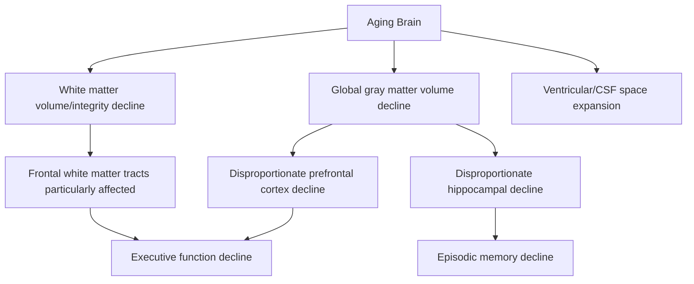

## Structural and Functional Brain Changes With Age

### Overview

Advancing age is associated with a well-characterized set of structural and functional brain changes, detectable through structural MRI, diffusion imaging, and functional neuroimaging, that provide the neurobiological substrate for the domain-specific cognitive aging trajectories described elsewhere in this chapter. These changes are graded and largely continuous across the adult lifespan (rather than reflecting a discrete late-life event) and show important regional and network-level selectivity, distinguishing typical brain aging from the more severe, progressive tissue loss characteristic of neurodegenerative disease.

### Gross Structural Volumetric Changes

**Global Brain Volume**

- Total brain volume shows a gradual, roughly accelerating decline across the adult lifespan, with numerous large cross-sectional and longitudinal MRI studies documenting measurable volume loss beginning in early-to-middle adulthood and continuing progressively into advanced age, alongside a corresponding compensatory expansion of cerebrospinal fluid-filled spaces (ventricles, sulcal spaces).
- **Key Points**
  - The rate of volume loss is not constant across the lifespan; several large longitudinal studies report an accelerating rate of decline in later decades of life relative to earlier adulthood.
  - Total brain volume decline is a useful but relatively coarse metric; regional patterns (below) provide considerably more specific and cognitively relevant information than global volume alone.

**Regional Selectivity: Prefrontal Cortex and Hippocampus**

- Volumetric decline is not uniform across brain regions. **Prefrontal cortex** (particularly lateral and dorsolateral subregions) and the **hippocampus** are consistently identified across the structural neuroimaging literature as showing disproportionately pronounced age-related volume/thickness decline relative to many other cortical and subcortical regions.
- This regional pattern is broadly consistent with, and provides part of the proposed structural basis for, the domain-selective pattern of cognitive aging described elsewhere in this chapter: executive function and working memory (prefrontal-dependent) and episodic memory (hippocampal-dependent) are among the more pronounced domains of cognitive decline in normal aging.
- **Relatively preserved regions:** Primary sensory cortices and some subcortical structures show comparatively more modest age-related volumetric change in many studies, consistent with the relative preservation of certain basic sensory and some cognitive functions (e.g., semantic memory, well-practiced skills) across normal aging.

### Cellular and Microstructural Contributors

**Neuronal Loss vs. Synaptic and Dendritic Change**

- [Inference/reflects an important revision from earlier assumptions in the field] Earlier models of brain aging assumed substantial, widespread neuronal loss (death of neurons) as the primary driver of volumetric decline; however, more recent stereological (unbiased cell-counting) studies have generally revised this view, indicating that outright neuronal loss in normal, non-pathological aging is considerably more modest and regionally restricted than earlier estimates suggested, with substantial volumetric decline instead attributable to a combination of factors including reduced neuronal size, reduced dendritic arborization/branching complexity, and reduced synaptic density/spine density — that is, changes in neuronal and synaptic *structure and connectivity* rather than large-scale neuronal death, in most cortical regions in typical (non-neurodegenerative) aging.
- **Key Points**
  - This distinction matters clinically and conceptually: the comparatively more limited outright neuronal loss in normal aging stands in contrast to the substantial neuronal loss characteristic of neurodegenerative conditions such as Alzheimer's disease, providing part of the neurobiological basis for distinguishing normal cognitive aging from pathological decline.

**White Matter Microstructural Changes**

- Diffusion tensor imaging (DTI) studies consistently document age-related decline in white matter microstructural integrity metrics (e.g., reduced fractional anisotropy, increased mean diffusivity), interpreted as reflecting age-related changes in myelin integrity and axonal organization.
- **Anterior-posterior gradient:** A frequently replicated regional pattern shows **frontal white matter tracts** exhibiting comparatively more pronounced age-related decline relative to posterior tracts, broadly paralleling (and potentially contributing mechanistically to) the disproportionate age-related change observed in prefrontal gray matter and prefrontal-dependent cognitive functions — sometimes discussed under a broader "anterior-to-posterior" or "frontal aging" gradient framework.
- **White matter hyperintensities:** Small-vessel-disease-related white matter lesions, visible as hyperintense signal on T2/FLAIR MRI sequences, increase in prevalence and extent with age and are associated with cardiovascular risk factors (hypertension, diabetes); [Inference — an important clinically relevant distinction] while extremely common in normal aging, more extensive white matter hyperintensity burden is also associated with increased risk of cognitive decline and is considered a marker of cerebral small vessel disease, situating it at an important intersection between "normal" age-related change and vascular contributions to cognitive impairment.

### Neurotransmitter System Changes

- **Dopaminergic system:** Substantial evidence indicates age-related decline in multiple markers of dopaminergic function, including dopamine D2/D3 receptor density and dopamine transporter availability, assessed via PET imaging studies; [Inference — a well-supported but not fully mechanistically settled association] this dopaminergic decline has been proposed as a contributing mechanism to some aspects of age-related cognitive decline, particularly in domains such as processing speed and working memory that are heavily dependent on prefrontal-striatal dopaminergic circuitry, though establishing precise causal contribution in humans remains methodologically challenging.
- **Other neurotransmitter systems:** Age-related changes have also been documented, to varying degrees of evidentiary strength, in cholinergic and serotonergic signaling, though the dopaminergic system has received the most extensive and consistent characterization in the context of normal cognitive aging specifically (as distinct from the more severe cholinergic depletion characteristic of Alzheimer's disease pathology).

### Functional Neuroimaging: Activity and Connectivity Changes

**Compensatory Recruitment Patterns**

- As detailed in related material on normal cognitive aging trajectories, task-based fMRI studies frequently document **additional or more bilateral prefrontal recruitment** in older adults relative to younger adults performing the same cognitive task at an equivalent behavioral level, formalized in frameworks such as the **HAROLD model** (hemispheric asymmetry reduction in older adults) and the **CRUNCH** (compensation-related utilization of neural circuits hypothesis) framework.
- Whether this pattern reflects genuine adaptive compensation or a less specific, less efficient pattern of neural recruitment (dedifferentiation) remains an actively debated question in the field, as detailed in the companion material on normal cognitive aging trajectories.

**Default Mode Network Changes**

- The **default mode network (DMN)** — a network of interconnected regions (medial prefrontal cortex, posterior cingulate/precuneus, angular gyrus, among others) most active during rest and self-referential cognition, and which characteristically deactivates during externally-focused, attention-demanding tasks — shows well-documented age-related alteration.
- Older adults frequently show **reduced DMN internal functional connectivity** (weaker coupling among DMN regions) and, in many studies, **reduced task-related DMN deactivation** (a failure to suppress DMN activity as fully during demanding external tasks) relative to younger adults; [Inference — an actively researched functional significance] this reduced deactivation has been proposed in some studies as reflecting reduced neural efficiency or impaired attentional/network-switching capacity in aging, though — consistent with the broader compensation/dedifferentiation debate above — the precise functional and cognitive significance of these DMN changes remains an active area of research rather than fully settled.

**Network Dedifferentiation**

- Beyond changes within specific networks, a broader and closely related phenomenon termed **neural dedifferentiation** has been documented in aging: reduced functional specificity/distinctiveness of neural responses, both across different large-scale brain networks (reduced segregation between networks that are more clearly distinguishable in younger adults) and, at a finer grain, in category-specific sensory/perceptual cortical responses (e.g., reduced neural distinctiveness between responses to different visual object categories in occipitotemporal cortex).
- [Inference/an influential and increasingly well-supported framework, though mechanistic basis still under investigation] Dedifferentiation is proposed by some researchers as a candidate unifying mechanism potentially linking several distinct aging-related functional imaging findings (reduced hemispheric lateralization, reduced network segregation, reduced category-specific selectivity) under a single broader framework of reduced neural specificity with age, though this remains an active area of theoretical and empirical development rather than a fully established, singular mechanistic account.

### Vascular and Cerebrovascular Contributions

- Cerebral blood flow shows a gradual age-related decline in many studies, and cerebrovascular reactivity (the brain vasculature's capacity to appropriately adjust blood flow in response to changing metabolic demand or vascular challenge) is also reduced with advancing age.
- **Neurovascular coupling** — the mechanism by which local neural activity is matched by corresponding local increases in blood flow, the physiological basis underlying the BOLD signal exploited by fMRI — shows some evidence of age-related alteration, an important methodological consideration when interpreting fMRI-based functional aging studies, since altered neurovascular coupling could, in principle, contribute to apparent age differences in BOLD activation patterns independent of any underlying difference in genuine neural activity. [Inference — a genuine methodological caveat actively discussed in the field] This represents an important interpretive caveat for the fMRI-based aging literature more broadly, motivating some researchers to incorporate vascular-reactivity-controlling analytic approaches or complementary imaging modalities less dependent on the BOLD-vascular coupling assumption.

### Distinguishing Normal Structural Aging From Neurodegenerative Pathology

**Key Points**

- Normal age-related structural change is characterized by gradual, relatively modest, and broadly distributed (though regionally graded) volume/connectivity decline that does not typically produce the severe, progressive, and clinically impairing pattern characteristic of neurodegenerative disease.
- **Alzheimer's disease**, by contrast, is characterized by a more severe, progressive, and characteristically patterned pattern of atrophy — beginning classically in the medial temporal lobe (entorhinal cortex, hippocampus) and progressively extending to broader temporoparietal and, eventually, more widespread cortical involvement — substantially exceeding the degree and rate of hippocampal/medial-temporal change observed in normal cognitive aging.
- [Inference] The overlap in affected regions (hippocampus, prefrontal cortex both implicated in normal aging and in neurodegenerative disease, albeit to differing degrees and with differing progression patterns) is part of why distinguishing accelerated-but-still-normal aging from prodromal neurodegenerative disease can be genuinely challenging in individual clinical cases, generally requiring consideration of rate of change (via longitudinal imaging), regional pattern specificity, and corroborating biomarker/cognitive data rather than a single structural snapshot.

### Comparative Summary Table

| Feature | Typical Pattern in Normal Aging | Notes |
| --- | --- | --- |
| Global brain volume | Gradual decline, accelerating in later decades | Ventricular/CSF expansion compensates |
| Prefrontal cortex | Disproportionately pronounced decline | Linked to executive function decline |
| Hippocampus | Disproportionately pronounced decline (though less severe than in AD) | Linked to episodic memory decline |
| Cellular basis | Modest neuronal loss; primarily reduced dendritic/synaptic complexity | Revised from earlier "large-scale neuronal death" assumption |
| White matter | Declining microstructural integrity, frontal tracts disproportionately affected | Complements gray matter frontal-aging pattern |
| Dopaminergic markers | Declining receptor/transporter availability (PET studies) | Linked to processing speed/working memory decline |
| Default mode network | Reduced internal connectivity and task-related deactivation | Functional significance still actively researched |
| Neural specificity | Reduced category/network-level distinctiveness (dedifferentiation) | Candidate unifying functional framework |

### Example: Interpreting a Longitudinal Hippocampal Volume Study

**Example**

A longitudinal MRI study tracking hippocampal volume in cognitively healthy older adults over a decade typically finds a gradual, roughly linear rate of volume decline (on the order of a small percentage per year, though exact rates vary across studies and measurement methods) in the great majority of participants, consistent with typical aging. A subset of participants, however, shows a substantially steeper rate of hippocampal volume decline over the same follow-up period, and in many such studies this steeper-decline subgroup shows a disproportionately elevated subsequent risk of progression to mild cognitive impairment or Alzheimer's disease — illustrating how longitudinal rate of structural change, rather than a single cross-sectional volume measurement, provides more clinically informative discrimination between typical aging and incipient neurodegenerative pathology.

### Related Topics

- Normal cognitive aging trajectories and domain-specific decline patterns
- Alzheimer's disease neuropathology and biomarkers
- Mild cognitive impairment as a transitional clinical state
- Default mode network organization and function
- Dopaminergic signaling and prefrontal-striatal circuitry in cognitive aging
- Cerebral small vessel disease and vascular contributions to cognitive impairment
- HAROLD model and neural dedifferentiation frameworks
- Diffusion tensor imaging methodology for white matter assessment