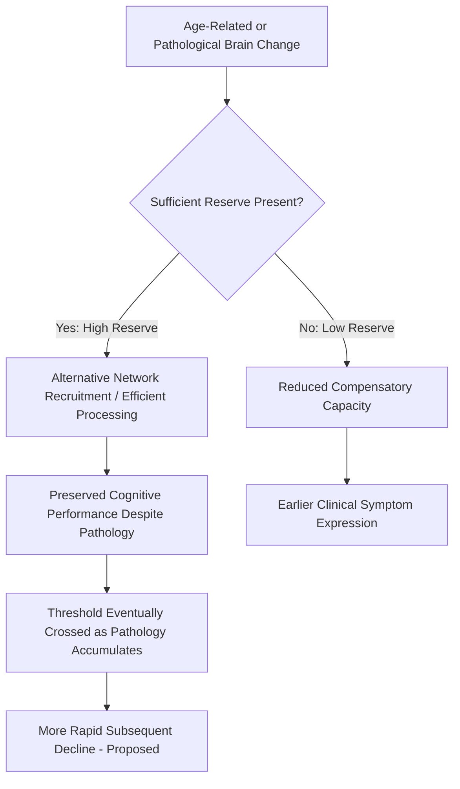

## Cognitive Reserve and Compensation

### Definition and Foundational Observation

Cognitive reserve refers to the theoretical construct explaining why individuals with similar degrees of age-related, pathological, or injury-related brain change (e.g., neurodegeneration, white matter lesions, atrophy) can show markedly different levels of cognitive and functional impairment. The concept originated from clinicopathological studies in which some individuals with substantial Alzheimer's disease neuropathology at autopsy had shown minimal or no clinical dementia symptoms during life, indicating that the relationship between brain pathology and clinical expression is not fixed but is moderated by other factors.

Stern's influential framework (2002, updated 2009) distinguishes:

- **Brain reserve**: a passive, largely structural concept referring to individual differences in raw neural resources (brain volume, synapse or neuron count), analogous to a threshold model in which greater baseline capacity delays the point at which pathology-driven loss crosses a clinical threshold.
- **Cognitive reserve**: an active concept referring to individual differences in the efficiency, flexibility, or capacity of cognitive processing networks, such that some individuals can sustain a given level of function despite equivalent brain damage by using alternative cognitive strategies or recruiting compensatory neural networks more effectively.

### Neural and Compensatory Mechanisms

**Neural Reserve**

Refers to pre-existing individual differences in the efficiency or capacity of brain networks used for a given task, present even in the absence of pathology, allowing more resilient performance under increasing task demand or early pathological burden.

**Neural Compensation**

Refers to the active recruitment of alternative neural networks or strategies not typically used by healthy young adults to perform a task, engaged specifically in response to pathology or age-related decline as a way of maintaining performance level. This is commonly observed as additional or more bilateral prefrontal cortical activation in older adults performing memory tasks, relative to younger adults' more focal, often lateralized activation patterns.

**[Inference]** The distinction between neural reserve and neural compensation is conceptually important but can be difficult to establish unambiguously in a single cross-sectional neuroimaging study, since both can produce similar-looking additional or altered activation patterns; longitudinal or task-manipulation designs are generally considered necessary to distinguish a pre-existing efficient network (reserve) from a genuinely new compensatory recruitment pattern.

### Key Proxy Measures of Cognitive Reserve

Because cognitive reserve is a theoretical construct rather than a directly observable brain property, research operationalizes it through proxy variables associated across large epidemiological studies with reduced clinical expression of pathology:

- **Educational attainment**: one of the most consistently replicated proxies; higher formal education is associated with reduced dementia risk and delayed clinical symptom onset for a given degree of underlying pathology.
- **Occupational complexity**: jobs involving greater complexity of work with data, people, or novel problem-solving are associated with greater apparent reserve.
- **Bilingualism**: several studies report a later average age of dementia symptom onset in lifelong bilingual individuals compared to monolinguals with comparable pathology, hypothesized to reflect reserve built through sustained executive control demands of managing two language systems. **[Inference]** This bilingualism-reserve association, while widely cited, has produced some inconsistent replications across different populations and study designs, and the field has not fully resolved the extent to which it reflects a causal cognitive mechanism versus confounding socioeconomic or lifestyle factors correlated with bilingual status in specific samples studied.
- **Leisure and social engagement**: participation in cognitively, physically, and socially stimulating activities across the lifespan is associated with better cognitive outcomes in aging, though the causal direction (engagement building reserve versus early subclinical decline reducing engagement) is a persistent methodological concern in this literature.
- **Estimated premorbid IQ**: often used as a composite proxy for lifetime cognitive engagement and reserve capacity.

### The Threshold Model

A widely used schematic model frames cognitive reserve as raising the amount of pathological burden required before clinical symptoms cross a detectable threshold:

$$\text{Clinical Impairment} = f(\text{Pathology} - \text{Reserve})$$

Under this framework, individuals with high reserve can accumulate substantially more pathology before crossing the symptomatic threshold, but once the threshold is crossed, their subsequent clinical decline may occur more rapidly, since their compensatory mechanisms are already being maximally utilized and have less additional capacity to draw upon. **[Inference]** This "steeper decline after threshold crossing" prediction is a commonly cited implication of high-reserve individuals in the clinical and research literature, though the precise shape and universality of this post-threshold trajectory across different underlying pathologies remains an area of ongoing empirical investigation rather than a uniformly established finding.

### Reserve, Resilience, and Related Terminology

The field has increasingly distinguished related but non-identical constructs:

- **Cognitive reserve**: capacity to maintain cognitive performance despite pathology (cognitive-level construct).
- **Brain reserve**: structural/anatomical capacity (structural-level construct).
- **Brain maintenance**: the relative absence of age-related pathology or structural change itself, as opposed to the ability to tolerate pathology once present — some individuals age with comparatively little pathology accumulation in the first place, a distinct phenomenon from reserve.
- **Resilience**: sometimes used as an umbrella term encompassing all mechanisms (reserve, maintenance, compensation) that support better-than-expected cognitive outcomes given a specific level of risk or pathology.

### Comparative Summary Table

| Construct | Level | Core Idea |
| --- | --- | --- |
| Brain reserve | Structural | More neurons/synapses/volume delays symptom threshold |
| Cognitive reserve | Functional/cognitive | More efficient or flexible processing delays symptom threshold |
| Neural compensation | Functional/cognitive | Active recruitment of alternative networks under pathological load |
| Brain maintenance | Structural | Relative avoidance of pathology accumulation altogether |

### Neuroimaging Signatures Associated with Reserve

- Older or high-pathology individuals with preserved cognitive performance often show increased prefrontal cortical activation (frequently bilateral, whereas younger adults show more unilateral activation), interpreted as compensatory recruitment (captured in models such as HAROLD — Hemispheric Asymmetry Reduction in OLDer adults, Cabeza).
- Higher educational attainment has been associated in some studies with more efficient (lower-magnitude, more focal) task-related activation for a given performance level, consistent with the "efficiency" component of the cognitive reserve concept, rather than simply more activation overall.
- **[Inference]** The relationship between reserve proxies and specific activation patterns (increased versus more efficient/reduced activation) is not fully unified across the literature, and different studies emphasize different signatures depending on task type, pathology severity, and the specific reserve proxy examined.

### Compensation Recruitment Pathway

### Diagram: Threshold Model of Reserve (svg_diagram)

<svg xmlns="http://www.w3.org/2000/svg" viewBox="0 0 800 380">
<text x="400" y="25" text-anchor="middle" font-size="16" font-weight="bold" fill="#1a1a1a">Threshold Model of Cognitive Reserve (svg_diagram)</text>
<line x1="80" y1="320" x2="720" y2="320" stroke="#333" stroke-width="1.5" />
<line x1="80" y1="320" x2="80" y2="60" stroke="#333" stroke-width="1.5" />
<text x="400" y="355" text-anchor="middle" font-size="11">Pathology Burden Over Time</text>
<text x="35" y="190" text-anchor="middle" font-size="11" transform="rotate(-90 35,190)">Cognitive Function</text>
<line x1="80" y1="120" x2="720" y2="120" stroke="#c0392b" stroke-width="1" stroke-dasharray="5,4" />
<text x="730" y="124" font-size="9" fill="#c0392b">Symptom threshold</text>
<path d="M80,90 L400,100 L500,280 L600,320" fill="none" stroke="#2b6cb0" stroke-width="2.5" />
<text x="150" y="80" font-size="10" fill="#2b6cb0">High Reserve</text>
<path d="M80,110 L250,180 L350,320" fill="none" stroke="#1e8449" stroke-width="2.5" />
<text x="150" y="200" font-size="10" fill="#1e8449">Low Reserve</text>

<text x="400" y="370" text-anchor="middle" font-size="10" fill="#555">High-reserve individuals maintain function longer but may decline more steeply once the threshold is crossed.</text>

</svg>

### Example: Applying the Concept to a Clinical Presentation

**Example**

Two patients present with radiologically similar, moderate hippocampal atrophy and amyloid burden on imaging:

- **Patient A**: 16 years of formal education, career as a practicing attorney, bilingual, socially and cognitively active in retirement. Presents with only mild subjective memory complaints and normal performance on standard neuropsychological testing.
- **Patient B**: 8 years of formal education, career in a low-complexity routine occupation, monolingual, socially isolated in retirement. Presents with clinically significant memory impairment meeting criteria for mild cognitive impairment.

**Interpretation**: despite comparable underlying pathology, Patient A's higher estimated cognitive reserve is hypothesized to account for the discrepancy in clinical expression, illustrating why brain pathology alone is an incomplete predictor of clinical cognitive status.

**[Inference]** This vignette illustrates the general logic of the cognitive reserve construct as applied in clinical and research settings; in any individual case, numerous other factors (vascular health, genetic risk such as *APOE* genotype, undiagnosed comorbid conditions) also contribute substantially to clinical presentation and cannot be fully accounted for by reserve proxies alone.

### Conclusion

Cognitive reserve and its associated compensatory mechanisms provide an explanatory framework for the frequently observed mismatch between measured brain pathology and clinical cognitive outcome in aging and neurodegenerative disease. The construct is operationalized through proxies such as education, occupational complexity, bilingualism, and lifestyle engagement, and is thought to be implemented neurally through both pre-existing efficient network organization (neural reserve) and actively recruited alternative processing strategies under pathological load (neural compensation). While robustly supported at the population level across numerous epidemiological studies, the precise neural mechanisms, the boundaries between related constructs (brain maintenance, resilience), and the causal status of several key proxy variables remain active areas of ongoing research.

**Related Topics**

- HAROLD model and hemispheric asymmetry reduction in aging
- Bilingualism and executive control across the lifespan
- APOE genotype and Alzheimer's disease risk
- Brain maintenance versus reserve as distinct aging trajectories
- Longitudinal cohort designs in dementia epidemiology
- Neuroimaging biomarkers of preclinical Alzheimer's disease
- Lifestyle interventions and dementia risk reduction