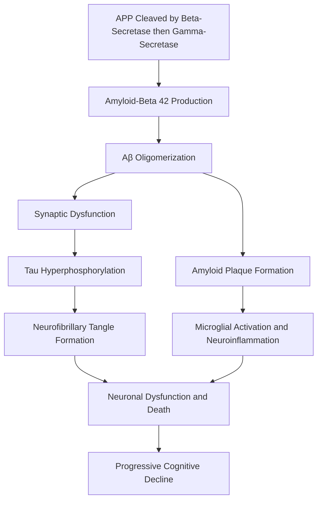

## Alzheimer's Disease Neurobiology

### Overview

Alzheimer's disease (AD) is a progressive neurodegenerative disorder and the most common cause of dementia, characterized neuropathologically by the accumulation of extracellular amyloid-beta plaques and intracellular neurofibrillary tangles composed of hyperphosphorylated tau protein, accompanied by synaptic loss, neuronal death, and progressive brain atrophy. Clinically, it typically presents with an insidious, gradually progressive decline beginning with episodic memory impairment and extending over years to affect language, visuospatial function, executive function, and eventually basic activities of daily living.

### The Amyloid Cascade Hypothesis

The **amyloid cascade hypothesis**, first formally articulated by Hardy and Higgins (1992), proposes that the accumulation of amyloid-beta (Aβ) peptide is the initiating event in AD pathogenesis, triggering a downstream cascade including tau pathology, neuroinflammation, synaptic dysfunction, and neuronal death.

**Amyloid Precursor Protein (APP) Processing**

Amyloid-beta is derived from proteolytic cleavage of the transmembrane amyloid precursor protein (APP) via two competing pathways:

- **Non-amyloidogenic pathway**: APP is cleaved by alpha-secretase within the Aβ sequence, precluding formation of intact Aβ peptide.
- **Amyloidogenic pathway**: APP is sequentially cleaved by beta-secretase (BACE1) and then gamma-secretase, releasing intact Aβ peptides, most notably Aβ40 (more abundant) and Aβ42 (more prone to aggregation and considered more pathogenic).

Aβ42 peptides aggregate progressively from soluble monomers to oligomers, protofibrils, and ultimately insoluble fibrils that accumulate as extracellular **amyloid plaques**, often with a dense fibrillar core surrounded by dystrophic neurites and activated glial cells.

**[Inference]** Soluble Aβ oligomers, rather than the mature insoluble plaques themselves, are increasingly regarded by many researchers in the field as the more directly synaptotoxic species, based on evidence that oligomer levels correlate more closely with cognitive impairment severity than total plaque burden in some studies; however, this remains an area of active investigation, and the relative pathogenic contribution of different Aβ aggregation states is not fully resolved.

### Tau Pathology

Tau is a microtubule-associated protein normally responsible for stabilizing axonal microtubules. In AD, tau becomes abnormally hyperphosphorylated, detaches from microtubules, and self-aggregates into paired helical filaments that accumulate as **neurofibrillary tangles (NFTs)** within neuronal cell bodies, and as neuropil threads within dendrites and axons.

- Unlike amyloid plaque distribution, which is relatively diffuse across the cortex from early disease stages, tau pathology follows a well-characterized, stereotyped spatial progression, formally described by the **Braak staging system**: beginning in the transentorhinal/entorhinal cortex, spreading to the hippocampus and limbic structures, and eventually involving widespread neocortical association areas in later stages.
- The regional progression of tau pathology correlates considerably more closely with the severity and pattern of clinical cognitive symptoms than amyloid plaque burden does, a key observation motivating research into tau as both a biomarker and therapeutic target.
- **[Inference]** The mechanism by which tau pathology spreads between anatomically connected brain regions is widely hypothesized to involve a "prion-like" cell-to-cell transmission of misfolded tau seeds along synaptically connected pathways, a hypothesis supported by considerable experimental evidence in animal models, though the complete mechanistic details of this process in human disease progression are still being characterized.

### Genetic Basis

**Autosomal Dominant (Early-Onset Familial) AD**

Rare mutations in three genes cause early-onset (often before age 65), autosomal dominantly inherited AD, together accounting for a small minority of total AD cases:

- ***APP*** (amyloid precursor protein): mutations alter APP processing to favor amyloidogenic cleavage or increase Aβ42 production.
- ***PSEN1*** (presenilin 1): the most common cause of familial AD; encodes the catalytic subunit of the gamma-secretase complex.
- ***PSEN2*** (presenilin 2): a rarer cause with a similar mechanism to *PSEN1*.

**Sporadic (Late-Onset) AD**

The vast majority of AD cases are sporadic and late-onset, with a complex, polygenic genetic architecture:

- ***APOE*** (apolipoprotein E) is the strongest known common genetic risk factor. The *APOE* ε4 allele is associated with increased risk and earlier age of onset in a dose-dependent manner (heterozygous and homozygous ε4 carriers show progressively higher risk), while the ε2 allele is associated with relatively reduced risk. **[Inference]** *APOE* ε4 is generally understood to influence risk partly through reduced efficiency of Aβ clearance, though *APOE* genotype is a probabilistic risk factor rather than a deterministic cause, and many ε4 carriers never develop AD while many non-carriers do.
- GWAS have identified dozens of additional common risk loci of smaller individual effect, implicating pathways including lipid metabolism, immune/microglial function, and endosomal trafficking.

### Synaptic and Network Dysfunction

Beyond the two hallmark protein aggregates, AD is characterized by extensive synaptic loss, which correlates more strongly with cognitive impairment severity in postmortem studies than either plaque or tangle burden alone. Proposed mechanisms include Aβ oligomer-induced disruption of NMDA and AMPA receptor trafficking, excitotoxicity from disrupted glutamate homeostasis, and mitochondrial dysfunction impairing synaptic energy supply.

Large-scale functional network disruption is also characteristic, particularly involving the **default mode network**, a set of interconnected regions (including posterior cingulate cortex, precuneus, and medial prefrontal cortex) that are typically active during rest and internally directed cognition. **[Inference]** Reduced default mode network connectivity and function is a consistently reported finding in AD and its prodromal stages using resting-state fMRI, and this network's substantial anatomical overlap with regions of earliest amyloid deposition has led some researchers to propose a mechanistic relationship between baseline network activity and regional vulnerability to amyloid accumulation, though the precise causal direction of this relationship remains a topic of ongoing research.

### Neuroinflammation

Activated **microglia** (the brain's resident immune cells) and **reactive astrocytes** are consistently found surrounding amyloid plaques and in regions of tau pathology. While microglial activation may initially serve a protective role by clearing amyloid, chronic activation is increasingly thought to contribute to a self-perpetuating cycle of neuroinflammation that exacerbates neuronal damage. Genetic risk loci identified through GWAS (e.g., *TREM2*, a microglial receptor gene) have reinforced the centrality of innate immune/microglial dysfunction in AD pathogenesis.

### Biomarkers and the Disease Continuum

Contemporary research frameworks (notably the NIA-AA "ATN" classification system) characterize AD along a biological continuum defined by biomarker evidence, independent of clinical symptom presence:

- **A**: Amyloid pathology (via PET imaging or CSF/plasma Aβ42/Aβ40 ratio)
- **T**: Tau pathology (via PET imaging or CSF/plasma phosphorylated tau)
- **N**: Neurodegeneration (via structural MRI atrophy, FDG-PET hypometabolism, or CSF total tau)

This framework formalizes the recognition that AD pathology can be present and detectable years to decades before the onset of clinically apparent cognitive symptoms (the "preclinical" stage), a concept with substantial implications for early intervention research.

### Comparative Summary Table

| Pathological Feature | Location | Correlation with Cognitive Symptoms | Spatial Progression Pattern |
| --- | --- | --- | --- |
| Amyloid-beta plaques | Extracellular | Weaker | Relatively diffuse, early widespread cortical involvement |
| Neurofibrillary tangles (tau) | Intracellular | Stronger | Stereotyped (Braak staging): entorhinal → hippocampal → neocortical |
| Synaptic loss | Synapse | Strongest | Regionally variable, tracks clinical symptom pattern closely |

### Amyloid Cascade Pathway

### Diagram: Braak Staging Progression of Tau Pathology (svg_diagram)

<svg xmlns="http://www.w3.org/2000/svg" viewBox="0 0 900 340">
<text x="450" y="25" text-anchor="middle" font-size="16" font-weight="bold" fill="#1a1a1a">Braak Staging: Tau Pathology Progression (svg_diagram)</text>
<circle cx="150" cy="180" r="70" fill="#fce8e6" stroke="#c0392b" stroke-width="1.5" />
<text x="150" y="175" text-anchor="middle" font-size="10">Stage I-II</text>
<text x="150" y="192" text-anchor="middle" font-size="9">Entorhinal/</text>
<text x="150" y="205" text-anchor="middle" font-size="9">Transentorhinal Cortex</text>
<circle cx="400" cy="180" r="80" fill="#fdf2e3" stroke="#b9770e" stroke-width="1.5" />
<text x="400" y="175" text-anchor="middle" font-size="10">Stage III-IV</text>
<text x="400" y="192" text-anchor="middle" font-size="9">Hippocampus and</text>
<text x="400" y="205" text-anchor="middle" font-size="9">Limbic Structures</text>
<circle cx="680" cy="180" r="95" fill="#eaf2fb" stroke="#2b6cb0" stroke-width="1.5" />
<text x="680" y="170" text-anchor="middle" font-size="10">Stage V-VI</text>
<text x="680" y="188" text-anchor="middle" font-size="9">Widespread Neocortical</text>
<text x="680" y="203" text-anchor="middle" font-size="9">Association Areas</text>
<line x1="220" y1="180" x2="320" y2="180" stroke="#333" stroke-width="1.5" marker-end="url(#arrow3)" />
<line x1="480" y1="180" x2="585" y2="180" stroke="#333" stroke-width="1.5" marker-end="url(#arrow3)" />
<text x="450" y="310" text-anchor="middle" font-size="10" fill="#555">Tau pathology spreads in a stereotyped anatomical sequence that correlates closely with symptom progression.</text>

</svg>

### Example: Linking Molecular Pathology to Clinical Presentation

**Example**

A typical clinical-pathological correspondence in sporadic late-onset AD:

1. **Preclinical stage**: amyloid PET or CSF biomarkers become abnormal years before symptom onset; entorhinal cortex tau pathology (Braak I-II) may already be present; patient is cognitively normal.
2. **Prodromal/MCI stage**: tau pathology extends into the hippocampus (Braak III-IV); patient develops measurable episodic memory impairment (particularly delayed recall deficits), consistent with hippocampal involvement, while other cognitive domains remain relatively preserved.
3. **Dementia stage**: tau pathology extends into neocortical association areas (Braak V-VI); patient develops additional deficits in language, visuospatial processing, and executive function, consistent with the spread of pathology beyond medial temporal structures.

**[Inference]** This staged correspondence represents a well-supported general pattern observed across large patient cohorts; individual patients can show substantial deviation from this typical sequence, including atypical presentations (e.g., posterior cortical atrophy or logopenic variant presentations) in which non-memory domains are affected earliest.

### Conclusion

Alzheimer's disease neurobiology centers on two hallmark, well-characterized protein aggregation processes — extracellular amyloid-beta plaques and intracellular tau neurofibrillary tangles — occurring within a broader context of synaptic dysfunction, neuroinflammation, and progressive network disruption, particularly of the default mode network. While the amyloid cascade hypothesis has historically organized much of the field's research and therapeutic development, the stronger correlation of tau pathology and synaptic loss with clinical symptom severity has increasingly shaped a more integrated view of disease mechanism. Genetic findings, from rare deterministic mutations in *APP*/*PSEN1*/*PSEN2* to the common risk-modifying *APOE* ε4 allele and dozens of GWAS-identified loci implicating immune and lipid metabolism pathways, further underscore that AD is best understood as a biologically heterogeneous disease process rather than a single unified molecular cascade.

**Related Topics**

- Amyloid precursor protein processing and secretase enzymology
- Braak staging system and tau pathology spread mechanisms
- APOE genotype and lipid metabolism in AD risk
- ATN biomarker framework and preclinical Alzheimer's disease
- Default mode network disruption in neurodegenerative disease
- TREM2 and microglial contributions to neuroinflammation
- Cognitive reserve and clinicopathological discordance in dementia