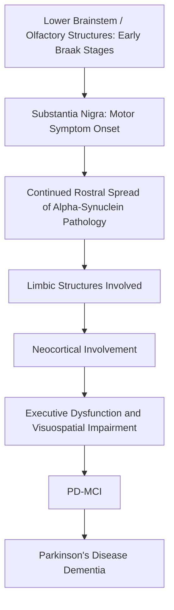

## Parkinson's Disease and Cognition

### Overview

Parkinson's disease (PD) is classically characterized as a movement disorder, defined by the cardinal motor features of bradykinesia, resting tremor, rigidity, and postural instability, arising primarily from degeneration of dopaminergic neurons in the substantia nigra pars compacta. However, PD is now widely recognized as a multi-system neurodegenerative disorder with substantial and clinically significant non-motor manifestations, among which cognitive impairment is one of the most functionally important, ranging from subtle deficits detectable at diagnosis to a high cumulative risk of frank dementia over the disease course.

### Core Neuropathology Relevant to Cognition

**Dopaminergic Contribution**

While the nigrostriatal dopaminergic pathway is central to PD's motor symptoms, the **mesocortical dopaminergic pathway** (from the ventral tegmental area to prefrontal cortex) also degenerates, contributing to the executive dysfunction that is often the earliest and most prominent cognitive feature of PD, particularly affecting frontostriatal circuit-dependent processes.

**Alpha-Synuclein Pathology (Lewy Body/Lewy Neurite Pathology)**

The defining histopathological hallmark of PD is the intracellular accumulation of misfolded **alpha-synuclein** protein into Lewy bodies and Lewy neurites.

- The **Braak staging scheme for PD** (distinct from the Braak scheme for Alzheimer's tau pathology) proposes a stereotyped caudal-to-rostral progression of alpha-synuclein pathology, beginning in the lower brainstem and olfactory structures, ascending through the substantia nigra (where motor symptoms typically emerge), and eventually reaching limbic and neocortical regions in later stages.
- **[Inference]** The progressive spread of alpha-synuclein pathology into limbic and cortical regions in later Braak stages is widely regarded as the principal neuropathological substrate underlying the emergence of cognitive impairment and dementia in PD, though the correspondence between Braak stage and clinical cognitive status is not perfectly deterministic at the individual patient level, and some degree of clinicopathological discordance is observed, analogous to findings in Alzheimer's disease research.

**Non-Dopaminergic Neurotransmitter Involvement**

Cognitive impairment in PD is not attributable to dopaminergic loss alone:

- **Cholinergic system**: degeneration of the nucleus basalis of Meynert and other cholinergic nuclei is prominent in PD, particularly in patients who develop dementia, and cholinergic deficits are thought to contribute substantially to attentional and memory impairment, distinguishing PD-related cognitive decline mechanistically from purely dopaminergic dysfunction.
- **Noradrenergic system**: degeneration of the locus coeruleus is also commonly observed and may contribute to attentional and arousal-related cognitive symptoms.

### Cognitive Profile

**Executive Dysfunction**

Executive dysfunction is typically the earliest and most characteristic cognitive domain affected, reflecting disruption of frontostriatal circuits. This includes impairments in:

- Set-shifting and cognitive flexibility
- Planning and problem-solving
- Working memory
- Response inhibition

**Bradyphrenia**

A generalized slowing of cognitive processing speed, often described as a hallmark feature distinguishing PD-related cognitive change from the more circumscribed episodic memory impairment characteristic of Alzheimer's disease.

**Visuospatial Impairment**

Visuospatial and visuoperceptual deficits are common and, notably, tend to be a stronger predictor of subsequent progression to dementia than executive dysfunction alone in several longitudinal cohort studies.

**Memory**

Memory impairment in PD, particularly early in the disease course, tends to reflect a retrieval-based deficit (difficulty spontaneously accessing stored information) rather than a storage/encoding deficit, distinguishing it from the profile typically seen in Alzheimer's disease; PD patients often show substantial improvement with cued recall or recognition testing formats, whereas encoding-deficit memory disorders do not benefit as much from these formats.

### Mild Cognitive Impairment and Dementia in PD

Formal diagnostic criteria (Movement Disorder Society Task Force) distinguish:

- **PD-MCI (Parkinson's disease with mild cognitive impairment)**: measurable cognitive decline in one or more domains that does not yet significantly impair functional independence.
- **PDD (Parkinson's disease dementia)**: cognitive decline severe enough to impair activities of daily living, typically emerging, by diagnostic convention, more than one year after the onset of motor symptoms (a criterion used to distinguish PDD from Dementia with Lewy Bodies, discussed below).

**[Inference]** Cumulative dementia risk in PD increases substantially with disease duration, and multiple longitudinal cohort studies report that a majority of PD patients who survive long enough eventually develop dementia; however, exact cumulative incidence figures vary meaningfully across studies depending on cohort characteristics, follow-up duration, and diagnostic criteria used, so specific percentage estimates should be treated as approximate rather than fixed values.

### Relationship to Dementia with Lewy Bodies (DLB)

PDD and DLB share the same underlying alpha-synuclein pathology and substantially overlapping clinical features (including fluctuating cognition, visual hallucinations, and parkinsonism), and are often conceptualized as existing on a single "Lewy body dementia" spectrum rather than as entirely distinct diseases. The primary clinical distinction is conventionally based on the temporal sequence of symptom onset:

- If dementia onset occurs before or within one year of motor symptom onset, DLB is diagnosed.
- If dementia onset occurs more than one year after established motor symptoms, PDD is diagnosed.

### Cortical and Subcortical Network Involvement

Cognitive impairment in PD reflects dysfunction across several distinguishable but interacting circuits:

- **Frontostriatal circuits**: dopaminergic depletion disrupts basal ganglia-thalamocortical loops connecting the striatum to prefrontal cortex, underlying core executive dysfunction.
- **Posterior cortical networks**: alpha-synuclein pathology and cholinergic deficits affecting posterior parietal and occipital regions are associated with the visuospatial impairments that predict dementia progression.
- **Default mode and attentional networks**: functional connectivity disruptions in these large-scale networks have been reported in PD-MCI and PDD, broadly paralleling, though not identical to, network disruption patterns described in Alzheimer's disease.

### Comparative Summary Table

| Feature | Parkinson's Disease Cognitive Profile | Typical Alzheimer's Disease Profile |
| --- | --- | --- |
| Earliest domain affected | Executive function | Episodic memory (encoding) |
| Memory deficit type | Retrieval deficit (improves with cues) | Encoding/storage deficit (limited cueing benefit) |
| Processing speed | Prominently slowed (bradyphrenia) | Relatively preserved early |
| Primary pathological protein | Alpha-synuclein | Amyloid-beta and tau |
| Key subcortical contribution | Dopaminergic, cholinergic, noradrenergic loss | Relatively less prominent early |

### Alpha-Synuclein Pathology Progression and Cognitive Consequence

### Diagram: Frontostriatal Circuit Disruption in PD (svg_diagram)

<svg xmlns="http://www.w3.org/2000/svg" viewBox="0 0 900 350">
<text x="450" y="25" text-anchor="middle" font-size="16" font-weight="bold" fill="#1a1a1a">Frontostriatal Circuit Disruption in Parkinson's Disease (svg_diagram)</text>
<rect x="100" y="80" width="180" height="60" rx="8" fill="#fdf2e3" stroke="#b9770e" />
<text x="190" y="115" text-anchor="middle" font-size="11">Prefrontal Cortex</text>
<rect x="360" y="80" width="180" height="60" rx="8" fill="#eafaf1" stroke="#1e8449" />
<text x="450" y="115" text-anchor="middle" font-size="11">Striatum</text>
<rect x="620" y="80" width="180" height="60" rx="8" fill="#eaf2fb" stroke="#2b6cb0" />
<text x="710" y="115" text-anchor="middle" font-size="11">Thalamus</text>
<rect x="360" y="220" width="180" height="60" rx="8" fill="#fce8e6" stroke="#c0392b" />
<text x="450" y="245" text-anchor="middle" font-size="11">Substantia Nigra</text>
<text x="450" y="262" text-anchor="middle" font-size="9">Dopaminergic Loss (X)</text>
<line x1="280" y1="110" x2="360" y2="110" stroke="#333" stroke-width="1.5" marker-end="url(#arrow4)" />
<line x1="540" y1="110" x2="620" y2="110" stroke="#333" stroke-width="1.5" marker-end="url(#arrow4)" />
<line x1="710" y1="140" x2="190" y2="140" stroke="#333" stroke-width="1.5" stroke-dasharray="4,3" marker-end="url(#arrow4)" />
<line x1="450" y1="220" x2="450" y2="140" stroke="#c0392b" stroke-width="1.5" stroke-dasharray="3,3" />
<text x="470" y="185" font-size="9" fill="#c0392b">Modulates</text>
<text x="450" y="320" text-anchor="middle" font-size="10" fill="#555">Loss of nigrostriatal dopaminergic modulation disrupts basal ganglia-thalamocortical loops underlying executive function.</text>

</svg>

### Example: Distinguishing PD Cognitive Profile from Alzheimer's

**Example**

A clinician evaluates two patients with memory complaints:

- **Patient with PD**: performs poorly on free recall of a word list but shows substantial improvement when given category cues or a recognition format (e.g., "was 'apple' on the list?"); also shows impaired performance on set-shifting tasks (e.g., Trail Making Test Part B) and slowed processing speed, but relatively intact recognition memory overall.
- **Patient with typical Alzheimer's disease**: performs poorly on free recall and shows little to no improvement with cueing or recognition formats, reflecting a genuine failure to encode information into storage rather than a retrieval access problem, with relatively later emergence of executive dysfunction.

**Interpretation**: the pattern of cueing benefit versus persistent failure with cues is a classic bedside neuropsychological heuristic for distinguishing a subcortical/frontostriatal memory profile (as in PD) from a cortical/hippocampal encoding-deficit profile (as in typical Alzheimer's disease), although **[Inference]** this heuristic reflects group-level tendencies observed across research cohorts and does not perfectly predict underlying pathology in every individual patient, particularly given the frequent co-occurrence of mixed pathology in older adults.

### Conclusion

Cognitive impairment in Parkinson's disease arises from a multi-system neuropathological process extending well beyond the nigrostriatal dopaminergic degeneration responsible for classic motor symptoms, involving mesocortical dopaminergic loss, cholinergic and noradrenergic degeneration, and the progressive rostral spread of alpha-synuclein pathology into limbic and neocortical regions. The resulting cognitive profile — characterized by early executive dysfunction, bradyphrenia, retrieval-based memory impairment, and visuospatial deficits that predict dementia risk — is mechanistically and clinically distinguishable from the encoding-deficit, memory-first profile typical of Alzheimer's disease, though the two conditions and their associated Lewy body/tau-amyloid pathologies frequently co-occur in older patients, complicating clean clinical categorization in practice.

**Related Topics**

- Alpha-synuclein pathology and Braak staging in Parkinson's disease
- Dementia with Lewy Bodies and the Lewy body dementia spectrum
- Frontostriatal circuitry and basal ganglia-thalamocortical loops
- Cholinergic contributions to cognition in neurodegenerative disease
- MDS Task Force diagnostic criteria for PD-MCI and PDD
- Differentiating cortical versus subcortical dementia profiles
- Deep brain stimulation and its cognitive side-effect profile