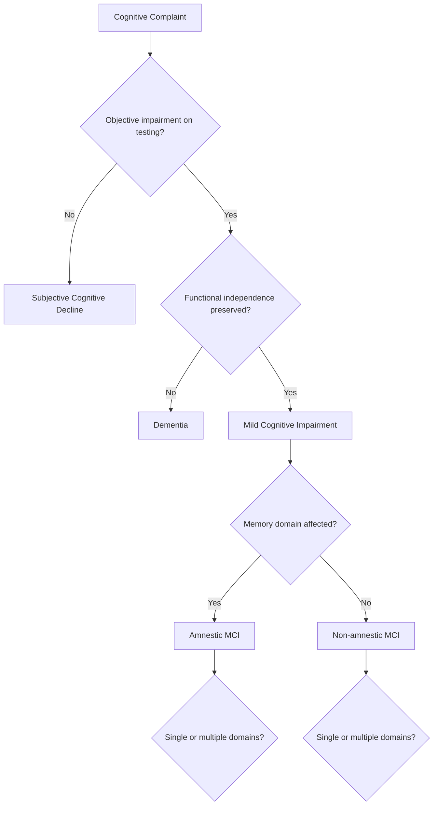

## Mild Cognitive Impairment

### Definition and Diagnostic Concept

Mild cognitive impairment (MCI) is a clinical syndrome characterized by cognitive decline greater than expected for an individual's age and education level, but which does not significantly interfere with activities of daily living and does not meet criteria for dementia. It occupies an intermediate zone between normal cognitive aging and dementia, most commonly Alzheimer's disease (AD).

MCI is best conceptualized as a transitional or at-risk state rather than a discrete disease entity. It has heterogeneous etiologies, meaning not all cases progress to dementia, and some individuals with MCI remain stable or even revert to normal cognition.

### Historical Development of the Concept

- Originally introduced by Reisberg and colleagues in the 1980s within the Global Deterioration Scale
- Refined and popularized by Ronald Petersen and the Mayo Clinic group in the late 1990s, who defined amnestic MCI as a precursor to Alzheimer's disease
- Later expanded to include non-amnestic subtypes, reflecting the recognition that cognitive decline preceding dementia is not limited to memory
- Incorporated into DSM-5 as "Mild Neurocognitive Disorder," aligning clinical psychiatric nomenclature with the neurological MCI construct

### Diagnostic Criteria (Petersen Criteria)

1. Cognitive concern, reported by patient, informant, or clinician
2. Objective evidence of impairment in one or more cognitive domains, typically 1 to 1.5 standard deviations below age- and education-matched norms
3. Preservation of independence in functional abilities
4. Absence of dementia (no significant impairment in social or occupational functioning)

**Key Points**

- The threshold of impairment is statistical, not absolute; cutoffs vary across studies and instruments
- Functional independence is preserved, though subtle inefficiencies (needing more time, relying on lists) may be present
- Diagnosis requires longitudinal or collateral information to distinguish decline from lifelong low performance

### Subtypes of MCI

MCI is classified along two axes: which domains are affected, and how many domains are affected.

#### By Domain Affected

- **Amnestic MCI (aMCI):** Memory is the primary or exclusive domain impaired; most strongly associated with progression to Alzheimer's disease
- **Non-amnestic MCI (naMCI):** Impairment in domains other than memory (language, executive function, visuospatial skills, attention); more heterogeneous in etiology, sometimes progressing to non-AD dementias such as frontotemporal dementia or dementia with Lewy bodies

#### By Number of Domains Affected

- **Single-domain MCI:** Only one cognitive domain is impaired
- **Multiple-domain MCI:** Two or more domains are impaired; associated with a higher risk of progression to dementia

This yields four combinatorial subtypes: amnestic single-domain, amnestic multiple-domain, non-amnestic single-domain, and non-amnestic multiple-domain.

### Etiological Classification

MCI is a syndrome, not a single disease, so underlying causes vary:

- **Neurodegenerative:** Alzheimer's disease pathology (amyloid plaques, tau tangles), Lewy body disease, frontotemporal lobar degeneration
- **Vascular:** Cerebral small vessel disease, silent infarcts, chronic hypoperfusion (often termed vascular cognitive impairment, no dementia, or VCIND)
- **Metabolic/Systemic:** Poorly controlled diabetes, thyroid dysfunction, vitamin B12 deficiency, chronic kidney or liver disease
- **Psychiatric:** Depression (sometimes termed "pseudodementia" when severe), anxiety, chronic sleep disorders such as obstructive sleep apnea
- **Iatrogenic:** Polypharmacy, anticholinergic burden, sedative-hypnotic use
- **Traumatic:** History of repeated mild traumatic brain injury

### Neurobiological Correlates

- **Structural imaging:** Hippocampal and entorhinal cortex atrophy on MRI, often milder than in AD but detectable via volumetric analysis
- **Molecular imaging:** Amyloid PET positivity is present in a substantial proportion of amnestic MCI cases; tau PET tracks more closely with symptom severity and progression
- **CSF biomarkers:** Reduced amyloid-beta 42, elevated total tau and phosphorylated tau are associated with higher conversion risk to AD
- **Functional connectivity:** Disruption of the default mode network, particularly reduced connectivity between the posterior cingulate cortex and hippocampus, is an early marker preceding overt atrophy
- **Synaptic dysfunction:** Considered an earlier pathophysiological event than frank neuronal loss, corresponding to the "mild" clinical presentation

$$\text{Amyloid cascade sequence: } A\beta \text{ accumulation} \rightarrow \text{synaptic dysfunction} \rightarrow \text{tau pathology} \rightarrow \text{neurodegeneration} \rightarrow \text{cognitive decline}$$

This sequence is a widely referenced model in AD-related MCI; the temporal ordering and causal weighting of each step remains an active area of research. [Inference]

### Neuropsychological Assessment

Standard batteries assess memory, language, executive function, attention, and visuospatial processing.

| Domain | Representative Tests |
| --- | --- |
| Episodic memory | Rey Auditory Verbal Learning Test, Logical Memory (WMS), California Verbal Learning Test |
| Executive function | Trail Making Test B, Wisconsin Card Sorting Test, verbal fluency |
| Language | Boston Naming Test, category fluency |
| Visuospatial | Rey-Osterrieth Complex Figure, clock drawing |
| Attention/processing speed | Trail Making Test A, Digit Span |
| Global screening | Montreal Cognitive Assessment (MoCA), Mini-Mental State Examination (MMSE) |

**Key Points**

- MoCA is generally more sensitive than MMSE for detecting MCI, particularly for executive and visuospatial deficits, because MMSE has ceiling effects in mildly impaired populations
- A single global screening score is insufficient for subtyping; domain-specific testing is required to classify amnestic versus non-amnestic presentations
- Serial testing over time strengthens diagnostic confidence by demonstrating a trajectory of decline rather than a single low score

### Differential Diagnosis

Conditions to rule out or account for before finalizing an MCI diagnosis include depression, delirium, medication effects, sleep disorders, sensory impairment (uncorrected hearing or vision loss confounding testing), and normal age-related cognitive change.

### Progression and Prognosis

- Annual conversion rate from amnestic MCI to Alzheimer's disease in specialty clinic populations is commonly cited around 10 to 15 percent per year, substantially higher than the roughly 1 to 2 percent annual incidence of dementia in the general elderly population [Unverified — rates vary considerably by population source (clinic-based vs. community-based), diagnostic criteria used, and follow-up duration]
- Not all MCI is progressive: a meaningful proportion of individuals, particularly in community-based samples, remain stable or revert to normal cognition on follow-up testing
- Reversion to normal cognition is more common in non-amnestic and single-domain presentations, and may reflect regression to the mean, treatment of a reversible contributor, or measurement variability
- Multiple-domain amnestic MCI carries the highest risk of progression to dementia among the subtypes

### Risk Factors

- **Non-modifiable:** Advancing age, APOE ε4 allele carriage, family history of dementia
- **Modifiable:** Hypertension, diabetes mellitus, physical inactivity, smoking, hearing loss, social isolation, low educational attainment, depression
- **Cognitive reserve:** Higher educational and occupational attainment is associated with delayed clinical manifestation of cognitive impairment for a given burden of underlying pathology, consistent with the cognitive reserve hypothesis

### Management Approach

There is no FDA-approved pharmacological treatment specifically indicated for MCI itself. Management centers on risk reduction, monitoring, and addressing modifiable contributors.

**Example**

A 68-year-old presents with word-finding difficulty noticed by their spouse over the past year, normal daily functioning, and a MoCA score of 22/30 with deficits isolated to delayed recall. Workup should include screening for depression, thyroid function, vitamin B12, sleep apnea symptoms, and medication review (particularly anticholinergics and benzodiazepines) before attributing the impairment to a neurodegenerative process. If reversible contributors are excluded, this presentation is consistent with amnestic single-domain MCI, warranting monitoring and risk-factor management rather than an immediate dementia diagnosis.

#### Non-pharmacological Interventions

- Aerobic exercise, which has the most consistent evidence among lifestyle interventions for cognitive benefit
- Cognitive training and cognitively stimulating activities
- Management of cardiovascular risk factors (blood pressure, glucose, lipids)
- Treatment of sleep disorders, particularly obstructive sleep apnea
- Correction of sensory deficits (hearing aids, vision correction)
- Social engagement and reduction of isolation
- Mediterranean-style or MIND diet patterns

#### Pharmacological Considerations

- Cholinesterase inhibitors (donepezil, rivastigmine, galantamine) have been studied in MCI populations but do not show consistent benefit in delaying conversion to dementia and are not routinely recommended for MCI alone
- Anti-amyloid monoclonal antibodies (e.g., lecanemab, donanemab) are approved for early symptomatic Alzheimer's disease, including MCI due to AD confirmed by biomarker evidence of amyloid pathology; use requires biomarker confirmation and carries risks such as amyloid-related imaging abnormalities (ARIA)
- Treatment of underlying reversible causes (thyroid replacement, B12 supplementation) when identified

### Monitoring and Follow-Up

- Reassessment at 6 to 12 month intervals is typical to track trajectory
- Longitudinal neuroimaging or biomarker testing may be used in specialty settings, particularly when considering disease-modifying therapy eligibility
- Caregiver and patient education regarding warning signs of progression to dementia (loss of functional independence, worsening in multiple domains) supports timely reassessment

### Illustrative Schematic: MCI in the Cognitive Aging Continuum (svg_diagram)

<svg xmlns="http://www.w3.org/2000/svg" viewBox="0 0 720 260">
<text x="360" y="24" text-anchor="middle" font-size="16" font-weight="bold" fill="#222">Cognitive Trajectory Continuum (svg_diagram)</text>
<line x1="40" y1="150" x2="680" y2="150" stroke="#333" stroke-width="2" />
<circle cx="80" cy="150" r="8" fill="#4a90d9" />
<text x="80" y="180" text-anchor="middle" font-size="12">Normal Aging</text>
<circle cx="280" cy="150" r="8" fill="#e8a33d" />
<text x="280" y="180" text-anchor="middle" font-size="12">Subjective Cognitive Decline</text>
<circle cx="480" cy="150" r="8" fill="#d9534f" />
<text x="480" y="180" text-anchor="middle" font-size="12">Mild Cognitive Impairment</text>
<circle cx="640" cy="150" r="8" fill="#7a2020" />
<text x="640" y="180" text-anchor="middle" font-size="12">Dementia</text>
<path d="M280 150 Q380 100 480 150" stroke="#888" stroke-width="1.5" fill="none" stroke-dasharray="4,3" />
<text x="380" y="95" text-anchor="middle" font-size="11" fill="#555">possible reversion</text>
<path d="M480 150 Q560 100 640 150" stroke="#888" stroke-width="1.5" fill="none" stroke-dasharray="4,3" />
<text x="560" y="95" text-anchor="middle" font-size="11" fill="#555">progression risk</text>
<path d="M480 158 Q380 210 280 158" stroke="#888" stroke-width="1.5" fill="none" stroke-dasharray="4,3" />
<text x="380" y="225" text-anchor="middle" font-size="11" fill="#555">possible reversion to SCD/normal</text>
</svg>

### Population and Public Health Considerations

- Prevalence of MCI in individuals aged 65 and older is commonly estimated in the range of 15 to 20 percent, though estimates vary by diagnostic criteria and population studied [Unverified — wide variation across epidemiological studies due to differing cutoffs and sampling]
- Prevalence increases with age and is influenced by educational attainment, cardiovascular risk burden, and genetic factors
- MCI represents a critical window for early intervention research, as pathological changes (particularly amyloid deposition) may begin a decade or more before clinical symptom onset

**Next Steps**

- Alzheimer's disease neuropathology (amyloid and tau cascade)
- Vascular cognitive impairment and vascular dementia
- Cognitive reserve and brain reserve theory
- Biomarker-based diagnostic frameworks (NIA-AA research framework)
- Neuropsychological test interpretation and normative data
- Disease-modifying anti-amyloid therapies and ARIA monitoring
- Depression versus dementia differential (pseudodementia)
- Sleep architecture changes and cognitive aging