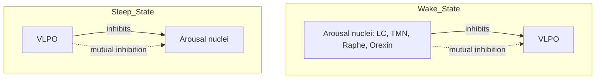

## Neural circuits regulating sleep and wakefulness

### Overview and Conceptual Framework

Sleep and wakefulness are actively generated and maintained states, controlled by discrete, mutually interacting neural circuits rather than passive consequences of sensory withdrawal or fatigue. Wakefulness is sustained by ascending arousal systems originating in the brainstem, hypothalamus, and basal forebrain; sleep is actively promoted by inhibitory circuits, primarily within the hypothalamus, that suppress those same arousal systems. State transitions are governed by mutually inhibitory circuit architecture that produces rapid, bistable switching between states.

### The Ascending Reticular Activating System (ARAS)

The ARAS is a network of brainstem and diencephalic nuclei that project diffusely to the thalamus and cortex, maintaining cortical activation and behavioral wakefulness.

- **Historical basis:** First characterized by Moruzzi and Magoun in 1949, who demonstrated that electrical stimulation of the brainstem reticular formation produced cortical arousal, while lesions produced coma-like states
- **Key components and neurotransmitters:**
  - Locus coeruleus (noradrenergic)
  - Dorsal and median raphe nuclei (serotonergic)
  - Laterodorsal and pedunculopontine tegmental nuclei (cholinergic)
  - Tuberomammillary nucleus of the hypothalamus (histaminergic)
  - Ventral periaqueductal gray (dopaminergic)
  - Basal forebrain (cholinergic and GABAergic)
  - Lateral hypothalamus (orexinergic/hypocretinergic and glutamatergic)

**Key Points**

- Two anatomically distinct ascending pathways exist: a dorsal pathway through the thalamus (innervating intralaminar and reticular thalamic nuclei) and a ventral pathway through the hypothalamus and basal forebrain directly to the cortex
- Damage to either pathway alone may produce incomplete arousal deficits, while combined damage produces profound impairment of consciousness, indicating partial redundancy in arousal maintenance

### Wake-Promoting Nuclei in Detail

| Nucleus | Neurotransmitter | Primary Role |
| --- | --- | --- |
| Locus coeruleus | Norepinephrine | Vigilance, attention, stress responsiveness; activity ceases during REM sleep |
| Dorsal raphe nucleus | Serotonin | Modulates arousal and mood; activity is state-dependent, highest in wake, reduced in NREM, minimal in REM |
| Tuberomammillary nucleus | Histamine | Promotes wakefulness; target of sedating antihistamines, explaining their somnolent side effects |
| Laterodorsal/pedunculopontine tegmental nuclei | Acetylcholine | Cortical activation in both wake and REM sleep |
| Lateral hypothalamus | Orexin/hypocretin | Stabilizes wakefulness, prevents inappropriate state transitions; loss causes narcolepsy type 1 |
| Basal forebrain | Acetylcholine, GABA | Cortical activation, attention, arousal |
| Ventral tegmental area | Dopamine | Contributes to motivated wakefulness and arousal |

### Sleep-Promoting Circuits

The **ventrolateral preoptic nucleus (VLPO)** of the hypothalamus is the principal sleep-promoting structure identified in mammalian sleep regulation.

- **Neurochemistry:** VLPO neurons release GABA and galanin, both inhibitory neurotransmitters
- **Projections:** VLPO sends inhibitory projections to nearly all major wake-promoting nuclei, including the tuberomammillary nucleus, locus coeruleus, raphe nuclei, and lateral hypothalamic orexin neurons
- **Activity pattern:** VLPO neurons are sleep-active, firing at their highest rates during NREM sleep and remaining largely quiescent during wakefulness
- **Median preoptic nucleus (MnPO):** Works alongside VLPO, contributing to sleep initiation, particularly in response to homeostatic sleep pressure

### The Flip-Flop Switch Model

Sleep-wake transitions are explained by a mutually inhibitory circuit motif between the VLPO and the ascending arousal nuclei, producing a bistable switch rather than a gradual, continuously variable transition.

- **Mechanism:** When arousal system activity dominates, it suppresses VLPO firing, reinforcing wakefulness; when VLPO activity dominates (driven by rising homeostatic sleep pressure and circadian signaling), it suppresses the arousal nuclei, reinforcing sleep
- **Functional significance:** This mutual inhibition creates a self-reinforcing, switch-like dynamic that avoids prolonged intermediate states, producing relatively rapid and stable transitions between wake and sleep
- **Clinical relevance:** Instability in this switch, most notably from loss of orexin-mediated stabilization, produces inappropriate and abrupt state transitions, as observed in narcolepsy

### Orexin/Hypocretin System as a Stabilizing Influence

- Orexin neurons, located exclusively in the lateral and posterior hypothalamus, project broadly throughout the ARAS and cortex
- Rather than initiating wakefulness directly, orexin functions primarily to reinforce and stabilize the wake state by exciting other arousal nuclei and biasing the flip-flop switch toward wakefulness
- Loss of orexin neurons (typically via autoimmune-mediated destruction) removes this stabilizing influence, resulting in the pathological intrusion of REM-associated phenomena (cataplexy, sleep paralysis, hypnagogic hallucinations) into wakefulness, characteristic of narcolepsy type 1

**Example**

In narcolepsy type 1, the destabilized flip-flop switch permits inappropriate transitions into REM-like states during wakefulness. Cataplexy, a sudden loss of muscle tone triggered by strong emotion, reflects intrusion of REM-atonia circuitry into an otherwise waking state, illustrating the functional consequence of losing orexinergic stabilization.

### REM Sleep-Generating Circuitry: The REM Flip-Flop

A separate, analogous mutually inhibitory circuit governs the switch between NREM and REM sleep, often described as a second flip-flop switch nested within overall sleep architecture.

- **REM-on populations:** Cholinergic neurons of the laterodorsal and pedunculopontine tegmental nuclei, along with glutamatergic neurons of the sublaterodorsal nucleus (also termed the subcoeruleus region)
- **REM-off populations:** Noradrenergic locus coeruleus neurons and serotonergic dorsal raphe neurons, which are maximally active in wake, reduced in NREM, and nearly silent during REM
- **Mutual inhibition:** REM-on and REM-off populations inhibit one another, producing the same bistable switching logic as the wake-sleep flip-flop, but operating on the timescale of the NREM-REM ultradian cycle

### Generation of REM Atonia

- The sublaterodorsal nucleus (SLD), a REM-on structure, sends descending glutamatergic projections to the ventromedial medulla and spinal cord
- These projections activate glycinergic and GABAergic inhibitory interneurons that hyperpolarize spinal alpha motor neurons, producing the profound skeletal muscle atonia characteristic of REM sleep
- **Clinical correlate:** Lesions or neurodegeneration affecting this pathway (implicated in early synucleinopathy) result in REM sleep behavior disorder, in which atonia fails and patients physically enact dream content

### Circadian Modulation of Sleep-Wake Circuits

- The suprachiasmatic nucleus (SCN) of the anterior hypothalamus functions as the master circadian pacemaker but does not directly generate sleep or wake states
- The SCN influences the sleep-wake flip-flop indirectly via multisynaptic projections, notably through the dorsomedial hypothalamic nucleus (DMH), which relays circadian timing signals to the VLPO (inhibitory influence) and to arousal-promoting lateral hypothalamic and orexin neurons (excitatory influence)
- This circuitry allows the circadian system to gate the timing of sleep propensity without being the direct executor of sleep initiation

$$\text{Sleep probability} = f(\text{Process S homeostatic drive}, \text{Process C circadian phase})$$

### Homeostatic Sleep Pressure and Circuit Integration

- **Adenosine** is a principal molecular mediator of homeostatic sleep pressure, accumulating in the basal forebrain and cortex during prolonged wakefulness as a byproduct of cellular energy metabolism (ATP breakdown)
- Adenosine acts on A1 receptors to inhibit wake-promoting basal forebrain cholinergic neurons and on A2A receptors to excite VLPO sleep-promoting neurons, biasing the flip-flop switch toward sleep as wake duration increases
- Caffeine acts as a competitive antagonist at adenosine receptors, which underlies its wake-promoting, sleep-delaying effects
- Other homeostatic sleep factors implicated include prostaglandin D2, interleukin-1, and growth hormone-releasing hormone, though adenosine has the most extensively characterized mechanistic role [Inference — the relative quantitative contribution of each factor to overall homeostatic drive in humans is not fully resolved]

### Integrated Circuit Summary Diagram (svg_diagram)

<svg xmlns="http://www.w3.org/2000/svg" viewBox="0 0 740 380">
<text x="370" y="24" text-anchor="middle" font-size="16" font-weight="bold" fill="#222">Sleep-Wake Regulatory Circuit Overview (svg_diagram)</text>
<rect x="40" y="50" width="180" height="60" rx="8" fill="#dce8f7" stroke="#2a6fb5" />
<text x="130" y="75" text-anchor="middle" font-size="12" font-weight="bold">SCN</text>
<text x="130" y="92" text-anchor="middle" font-size="10">Circadian pacemaker</text>
<rect x="280" y="50" width="180" height="60" rx="8" fill="#dce8f7" stroke="#2a6fb5" />
<text x="370" y="75" text-anchor="middle" font-size="12" font-weight="bold">DMH</text>
<text x="370" y="92" text-anchor="middle" font-size="10">Circadian relay</text>
<rect x="520" y="50" width="180" height="60" rx="8" fill="#f7e0dc" stroke="#b5502a" />
<text x="610" y="75" text-anchor="middle" font-size="12" font-weight="bold">Adenosine (Process S)</text>
<text x="610" y="92" text-anchor="middle" font-size="10">Homeostatic pressure</text>
<rect x="60" y="180" width="200" height="60" rx="8" fill="#e0f7dc" stroke="#3a8a2a" />
<text x="160" y="205" text-anchor="middle" font-size="12" font-weight="bold">VLPO / MnPO</text>
<text x="160" y="222" text-anchor="middle" font-size="10">Sleep-promoting (GABA/galanin)</text>
<rect x="480" y="180" width="220" height="60" rx="8" fill="#fdf0d5" stroke="#b58a2a" />
<text x="590" y="205" text-anchor="middle" font-size="12" font-weight="bold">ARAS + Orexin</text>
<text x="590" y="222" text-anchor="middle" font-size="10">Wake-promoting nuclei</text>
<rect x="270" y="300" width="200" height="60" rx="8" fill="#e6dcf7" stroke="#6a2ab5" />
<text x="370" y="325" text-anchor="middle" font-size="12" font-weight="bold">REM flip-flop</text>
<text x="370" y="342" text-anchor="middle" font-size="10">SLD (on) vs LC/Raphe (off)</text>
<line x1="130" y1="110" x2="150" y2="180" stroke="#333" stroke-width="1.5" marker-end="url(#arrow)" />
<line x1="370" y1="110" x2="590" y2="180" stroke="#333" stroke-width="1.5" marker-end="url(#arrow)" />
<line x1="610" y1="110" x2="590" y2="180" stroke="#333" stroke-width="1.5" marker-end="url(#arrow)" />
<line x1="610" y1="110" x2="180" y2="180" stroke="#333" stroke-width="1.5" marker-end="url(#arrow)" />
<line x1="260" y1="210" x2="480" y2="210" stroke="#333" stroke-width="1.5" stroke-dasharray="3,3" marker-end="url(#arrow)" />
<line x1="480" y1="222" x2="260" y2="222" stroke="#333" stroke-width="1.5" stroke-dasharray="3,3" marker-end="url(#arrow)" />
<line x1="590" y1="240" x2="420" y2="300" stroke="#333" stroke-width="1.5" marker-end="url(#arrow)" />
</svg>

### Clinical Correlations Summary

- **Narcolepsy type 1:** Loss of orexin neurons destabilizes the wake-sleep flip-flop switch
- **Insomnia:** Implicated hyperarousal models propose excessive activity in wake-promoting circuits or insufficient VLPO inhibitory output, though the precise circuit-level basis in humans remains an area of ongoing investigation [Inference]
- **REM sleep behavior disorder:** Dysfunction of the SLD-to-spinal atonia pathway; considered a prodromal marker for synucleinopathies
- **Coma and disorders of consciousness:** Result from bilateral damage to the ARAS or its thalamocortical projections, distinguishing arousal circuit failure from cortical processing failure
- **Sedative-hypnotic pharmacology:** Many sleep medications (benzodiazepines, Z-drugs) act via positive allosteric modulation of GABA-A receptors, enhancing the inhibitory output of sleep-promoting circuits including the VLPO

**Next Steps**

- Orexin/hypocretin system and narcolepsy pathophysiology in depth
- Suprachiasmatic nucleus and circadian pacemaker mechanisms
- REM sleep behavior disorder as a synucleinopathy biomarker
- Adenosine and other homeostatic sleep factors
- Pharmacology of sedative-hypnotics and their circuit targets
- Disorders of consciousness (coma, vegetative state, minimally conscious state)
- Thalamocortical circuits in arousal and consciousness