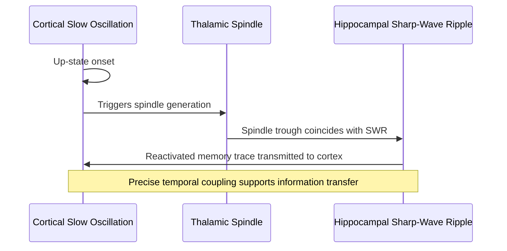

## Sleep-dependent memory consolidation

### Overview and Conceptual Framework

Sleep-dependent memory consolidation refers to the process by which newly acquired memories are stabilized, strengthened, reorganized, and integrated into long-term storage networks during sleep. Rather than being a passive period of neural quiescence, sleep is now understood as an active state during which the brain selectively reprocesses recently encoded information, transforming labile, hippocampus-dependent traces into more stable, cortically distributed representations.

This process is distinguished from simple time-dependent forgetting protection; sleep provides active, qualitatively distinct benefits beyond what equivalent time spent awake would provide, a distinction supported by studies controlling for elapsed time and interference.

### Historical Development

- Early 20th-century work by Jenkins and Dallenbach (1924) demonstrated that recall was better preserved after a period of sleep than after an equivalent period of wakefulness, attributed initially to reduced interference
- Mid-to-late 20th century research shifted toward an active-processing view following the discovery of distinct sleep stages and their differential neurophysiological signatures
- Late 20th and early 21st century work, notably by Born, Stickgold, Walker, and colleagues, established stage-specific and mechanism-specific contributions of NREM and REM sleep to different memory types
- Continued refinement has produced current models integrating systems consolidation, synaptic-level mechanisms, and neural replay phenomena

### Memory Systems and Stage-Specific Associations

Sleep-dependent consolidation effects differ according to memory type, which in turn map onto differential contributions from NREM and REM sleep.

| Memory Type | Associated Sleep Stage | Key Mechanism |
| --- | --- | --- |
| Declarative (episodic/semantic) | Slow-wave sleep (N3) | Hippocampal-neocortical dialogue, slow oscillation-spindle-ripple coupling |
| Procedural (motor skill) | N2 sleep spindles; some REM contribution | Spindle-mediated plasticity, possible REM-related refinement |
| Emotional memory | REM sleep | Amygdala-hippocampal-prefrontal reprocessing under reduced noradrenergic tone |
| Perceptual learning | REM and N2 | Cortical plasticity during REM; spindle involvement in N2 |

**Key Points**

- This mapping is a useful organizing heuristic but should not be treated as strictly categorical; multiple stages likely contribute to most memory types to varying degrees, and the relative weighting remains an active area of investigation [Inference]
- Total sleep time, sleep stage proportions, and the temporal placement of stages across the night (early sleep is SWS-rich, late sleep is REM-rich) are all experimentally manipulated in research paradigms to isolate stage-specific contributions

### Systems Consolidation Theory and the Hippocampal-Neocortical Dialogue

The dominant framework for declarative memory consolidation during sleep is the active systems consolidation hypothesis.

- **Initial encoding:** New declarative memories are rapidly encoded by the hippocampus, which binds distributed cortical representations into a coherent episodic trace
- **Consolidation process:** During slow-wave sleep, the hippocampus repeatedly reactivates recently encoded memory traces, which are progressively transferred to and integrated with neocortical networks for long-term storage
- **Outcome:** Memories become less dependent on the hippocampus over time and more reliant on distributed neocortical representations, a process that may unfold over days to years for autobiographical memories, though laboratory studies typically examine short-term consolidation over single nights

$$\text{Consolidation efficiency} \propto \text{coupling strength between SO, spindles, and ripples}$$

### The Triple Coupling Mechanism: Slow Oscillations, Spindles, and Ripples

A well-characterized electrophysiological mechanism underlying hippocampal-neocortical dialogue during SWS involves the precise temporal coordination of three oscillatory events:

- **Cortical slow oscillations (SOs):** Large-amplitude, less than 1 Hz oscillations alternating between cortical up-states (depolarized, neurons fire) and down-states (hyperpolarized, neural silence)
- **Thalamocortical sleep spindles:** 11-16 Hz oscillatory bursts generated by thalamic reticular nucleus circuitry, nested preferentially within the up-state of the slow oscillation
- **Hippocampal sharp-wave ripples (SWRs):** High-frequency (approximately 100-250 Hz) oscillatory events in the hippocampus, associated with reactivation of previously encoded neural firing sequences, occurring preferentially during spindle troughs

**Key Points**

- This nested coupling (SO up-state contains spindle, spindle contains or coincides with ripple) is proposed as the mechanistic substrate enabling coordinated information transfer from the hippocampus to the neocortex
- Experimentally disrupting this coupling, or artificially enhancing slow oscillations (e.g., via auditory closed-loop stimulation timed to the SO up-state), has been shown in several studies to modulate subsequent declarative memory performance, supporting a causal (not merely correlational) role [Inference — effect sizes and generalizability across memory types and populations vary across studies]

### Neural Replay

Neural replay refers to the reactivation, during sleep, of neuronal firing sequences that were originally active during a preceding waking experience, first extensively characterized in rodent hippocampal place cell recordings.

- **Temporal compression:** Replay sequences during sleep are often temporally compressed relative to the original waking experience, occurring on a much faster timescale
- **Directionality:** Replay can occur in the same temporal order as the original experience (forward replay) or in reverse order (reverse replay), with each proposed to serve distinct functional roles in memory consolidation and value-based learning
- **Human evidence:** Non-invasive studies using techniques such as magnetoencephalography and targeted memory reactivation paradigms provide indirect evidence consistent with replay-like processes in humans, though direct single-neuron recordings analogous to rodent studies are limited to rare clinical (e.g., intracranial epilepsy monitoring) contexts

### Synaptic Homeostasis Hypothesis (SHY)

An alternative, complementary framework proposed by Tononi and Cirelli addresses the role of sleep, particularly SWS, at the synaptic level.

- **Core proposal:** Wakefulness is associated with a net increase in synaptic strength across the brain as new information is encoded and experiences accumulate; slow-wave sleep then produces a global, proportional downscaling of synaptic strength
- **Functional rationale:** This downscaling is proposed to restore synaptic homeostasis, improve the signal-to-noise ratio of neural representations, and reduce the metabolic and spatial costs of ever-increasing synaptic strength, while preserving the relative differences between synapses that encode learned information
- **Relationship to consolidation:** SHY is often presented as complementary to, rather than contradictory with, active systems consolidation; downscaling of weaker, less relevant synapses may enhance the relative salience of consolidated, behaviorally important traces

**Key Points**

- SHY and active systems consolidation address different levels of analysis (synaptic-level renormalization versus systems-level information transfer) and are not mutually exclusive
- Evidence for SHY includes findings of increased synaptic markers and cortical excitability after wakefulness, with reduction following sleep, though the degree of "downscaling" uniformity across all synapse types remains debated [Inference]

### REM Sleep and Emotional Memory Processing

- REM sleep is characterized by a distinctive neurochemical profile: cholinergic activity is elevated, while noradrenergic and serotonergic ("aminergic") activity is markedly suppressed
- This "REM sleep amygdala-noradrenergic" model proposes that reduced noradrenergic tone during REM allows emotional memories to be reprocessed and reconsolidated with reduced physiological stress reactivity, potentially contributing to next-day emotional regulation and the "de-toning" of the affective charge associated with a memory while preserving its informational content
- Amygdala, hippocampus, and medial prefrontal cortex activity and connectivity patterns during REM sleep have been implicated in this process, based on neuroimaging studies conducted around sleep periods

**Example**

Participants shown emotionally negative images before a period containing REM sleep, compared to an equivalent waking interval, later show preserved recognition memory for the images alongside somewhat reduced subjective and physiological (e.g., skin conductance) emotional reactivity to them, illustrating a proposed dissociation between memory retention and emotional intensity attenuation attributable to REM-related processing. [Inference — findings vary depending on stimulus type, timing, and individual differences in sleep architecture]

### Procedural and Motor Skill Memory

- Motor sequence learning tasks (e.g., finger-tapping sequences) show performance gains following a night of sleep that exceed gains from an equivalent period of wakefulness, even without additional practice
- Sleep spindle density and slow-wave activity localized to task-relevant sensorimotor cortical regions have been correlated with the magnitude of overnight performance improvement
- Some findings suggest REM sleep may contribute additional refinement to procedural skills, though NREM spindle-related mechanisms appear to carry the more consistently replicated contribution across studies [Unverified — relative contributions vary by task type and study design]

### Targeted Memory Reactivation (TMR)

TMR is an experimental paradigm used to directly test and enhance sleep-dependent consolidation by re-exposing sleeping participants to sensory cues (commonly auditory or olfactory) that were associated with specific memories during prior waking encoding.

- **Method:** A cue (e.g., a specific sound) is paired with a to-be-learned item during waking encoding; the same cue is then covertly re-presented during subsequent slow-wave sleep, without waking the participant
- **Finding:** Cued memories often show enhanced retention relative to uncued memories from the same learning session, providing strong causal evidence that sleep-based reactivation processes are directly linked to consolidation outcomes rather than merely correlated with sleep stage
- **Applications:** Used experimentally to investigate the mechanistic basis of memory reactivation and explored as a potential tool in contexts such as fear extinction and rehabilitation, though clinical translation remains largely investigational [Unverified — real-world efficacy and durability of TMR-based interventions outside controlled laboratory settings is not firmly established]

### Illustrative Schematic: Oscillatory Coupling During SWS (svg_diagram)

<svg xmlns="http://www.w3.org/2000/svg" viewBox="0 0 740 260">
<text x="370" y="22" text-anchor="middle" font-size="15" font-weight="bold" fill="#222">Slow Oscillation-Spindle-Ripple Coupling (svg_diagram)</text>

<text x="30" y="70" font-size="11">Cortical SO</text>

<path d="M60,80 Q120,40 180,80 Q240,120 300,80 Q360,40 420,80 Q480,120 540,80 Q600,40 660,80" fill="none" stroke="`#2a6fb5`" stroke-width="2" />

<text x="30" y="130" font-size="11">Spindle</text>

<path d="M150,140 q5,-10 10,0 q5,10 10,0 q5,-10 10,0 q5,10 10,0 q5,-10 10,0 q5,10 10,0" fill="none" stroke="`#b58a2a`" stroke-width="1.5" />

<path d="M390,140 q5,-10 10,0 q5,10 10,0 q5,-10 10,0 q5,10 10,0 q5,-10 10,0 q5,10 10,0" fill="none" stroke="`#b58a2a`" stroke-width="1.5" />

<text x="30" y="190" font-size="11">Hipp. Ripple</text>

<path d="M155,200 q2,-6 4,0 q2,6 4,0 q2,-6 4,0 q2,6 4,0 q2,-6 4,0" fill="none" stroke="`#7a2aa0`" stroke-width="1.2" />

<path d="M395,200 q2,-6 4,0 q2,6 4,0 q2,-6 4,0 q2,6 4,0 q2,-6 4,0" fill="none" stroke="`#7a2aa0`" stroke-width="1.2" />

<line x1="140" y1="60" x2="140" y2="215" stroke="#999" stroke-width="1" stroke-dasharray="3,3" />
<line x1="380" y1="60" x2="380" y2="215" stroke="#999" stroke-width="1" stroke-dasharray="3,3" />
<text x="140" y="235" text-anchor="middle" font-size="10">SO up-state</text>
<text x="380" y="235" text-anchor="middle" font-size="10">SO up-state</text>
</svg>

### Sleep Deprivation and Consolidation Impairment

- Total or partial sleep deprivation following learning reliably impairs subsequent retention across multiple memory domains, consistent with an active, necessary role for post-encoding sleep rather than passive time-based stabilization
- Selective deprivation of specific stages (e.g., selective REM deprivation via awakening at REM onset) has been used to isolate stage-specific contributions, though such manipulations also produce compensatory changes in subsequent sleep architecture (REM rebound), complicating interpretation
- Sleep deprivation prior to encoding also impairs the hippocampus's capacity to effectively encode new information, indicating that sleep's role in memory extends beyond post-encoding consolidation to pre-encoding preparedness [Inference — encoding-stage effects are mechanistically distinct from consolidation-stage effects and should not be conflated]

### Clinical and Applied Relevance

- Sleep disturbances in conditions such as insomnia, obstructive sleep apnea, and depression are associated with impaired memory consolidation, consistent with disrupted sleep architecture affecting the mechanisms described above
- Aging is associated with reduced slow-wave activity and altered SO-spindle coupling, proposed as a contributing factor to age-related declarative memory decline, an area of active research relevant to conditions such as mild cognitive impairment
- Sleep-focused interventions (sleep extension, spindle-enhancing pharmacology, closed-loop auditory stimulation) are being explored as potential adjunctive approaches to support memory in both healthy aging and clinical populations, though most remain experimental rather than established clinical practice [Unverified]

**Next Steps**

- Systems consolidation theory in long-term memory more broadly
- Hippocampal place cells and sharp-wave ripple physiology
- Synaptic homeostasis hypothesis versus active systems consolidation debate
- Targeted memory reactivation methodology and applications
- Sleep changes in aging and their relationship to cognitive decline
- REM sleep neurochemistry and emotional regulation
- Closed-loop auditory stimulation techniques for slow-wave enhancement