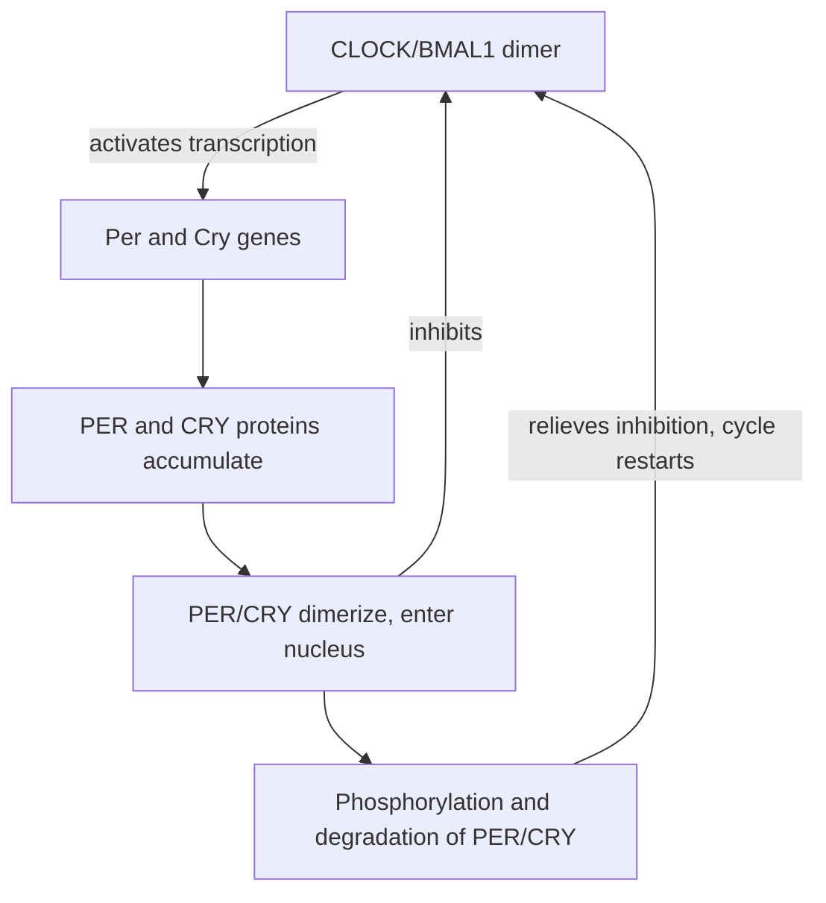
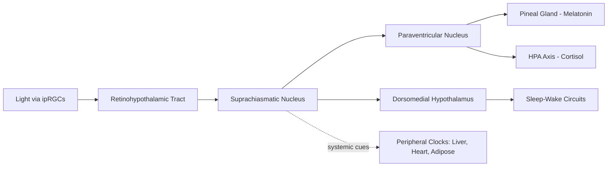

## Circadian rhythms and the suprachiasmatic nucleus

### Overview and Conceptual Framework

Circadian rhythms are endogenous, self-sustaining biological oscillations with a period of approximately 24 hours that regulate physiological, behavioral, and metabolic processes independent of external cues, though they are normally synchronized (entrained) to the environmental light-dark cycle. The suprachiasmatic nucleus (SCN) of the anterior hypothalamus functions as the master circadian pacemaker in mammals, coordinating the timing of peripheral oscillators throughout the body into a unified temporal program.

The term "circadian," from the Latin *circa diem* ("about a day"), reflects the defining feature that these rhythms persist even in the absence of external time cues (in constant darkness or constant light), with a free-running period typically close to, but not exactly, 24 hours in most individuals.

### Historical Development

- 18th century: Jean-Jacques d'Ortous de Mairan first demonstrated persistent daily leaf movement rhythms in plants kept in constant darkness, providing early evidence for an endogenous, rather than purely light-driven, oscillator
- 1960s-1970s: Behavioral and lesion studies established that circadian locomotor rhythms in rodents were abolished by destruction of the anterior hypothalamus
- 1972: Two independent research groups (Moore and Eichler; Stephan and Zucker) identified the suprachiasmatic nucleus as the specific structure necessary for circadian rhythmicity
- 1990: Ralph and colleagues demonstrated that SCN transplantation could restore circadian rhythmicity in SCN-lesioned animals, with the restored rhythm's period matching that of the donor tissue, providing definitive evidence that the SCN itself generates the rhythm rather than merely relaying it
- 1997 onward: Identification of core clock genes (Period, Cryptochrome, Clock, Bmal1) established the molecular transcription-translation feedback loop underlying cellular circadian oscillation
- 2017: The Nobel Prize in Physiology or Medicine was awarded to Hall, Rosbash, and Young for their discoveries of the molecular mechanisms controlling circadian rhythm, based substantially on Drosophila genetics

### Anatomy and Location of the SCN

- The SCN is a paired, bilaterally symmetric nucleus located in the anterior hypothalamus, directly above the optic chiasm, from which it derives its name
- Composed of approximately 10,000 to 20,000 neurons per side in humans, organized into functionally and anatomically distinct subregions
- **Core region (ventrolateral):** Receives direct retinal input; contains neurons expressing vasoactive intestinal peptide (VIP) and gastrin-releasing peptide (GRP); primarily involved in light entrainment
- **Shell region (dorsomedial):** Receives input predominantly from the core rather than directly from the retina; contains neurons expressing arginine vasopressin (AVP); more involved in sustaining and outputting the generated rhythm

**Key Points**

- Individual SCN neurons are themselves capable of autonomous oscillation, but synchronization among neurons within the nucleus (via intercellular coupling, particularly VIP signaling) is required to produce a coherent, robust tissue-level rhythm
- Loss of intercellular coupling (e.g., in VIP-deficient models) results in desynchronized, weak, or arrhythmic output despite individual cells retaining oscillatory capacity

### The Molecular Clock: Transcription-Translation Feedback Loop

At the cellular level, circadian rhythmicity is generated by an autoregulatory transcription-translation feedback loop (TTFL) present in nearly all SCN neurons (and, notably, in peripheral cells throughout the body).

**Core loop components:**

- **Positive limb:** CLOCK and BMAL1 proteins heterodimerize and act as transcription factors, binding E-box elements to activate transcription of *Period* (*Per1, Per2, Per3*) and *Cryptochrome* (*Cry1, Cry2*) genes
- **Negative limb:** PER and CRY proteins accumulate in the cytoplasm, dimerize, translocate to the nucleus, and inhibit their own transcription by suppressing CLOCK/BMAL1 activity
- **Degradation:** PER and CRY proteins are progressively degraded (regulated by kinases such as casein kinase 1 delta/epsilon, which phosphorylate PER and target it for degradation), relieving inhibition and allowing the cycle to restart

- **Stabilizing loops:** An auxiliary loop involving nuclear receptors REV-ERBα/β and RORα/β regulates *Bmal1* transcription, adding robustness and fine-tuning to the core 24-hour period
- **Period determination:** The approximately 24-hour period emerges from the cumulative delays in transcription, translation, post-translational modification, and degradation across this loop; mutations affecting any step (as in familial advanced sleep phase syndrome, linked to *PER2* and *CK1delta* mutations) can shorten or lengthen the free-running period

$$\tau \approx 24 \text{ hours (endogenous free-running period, individually variable, typically } 23.5\text{–}24.6 \text{ hours in humans)}$$

### Photic Entrainment: Synchronizing the Clock to Light

Although the SCN generates rhythmicity intrinsically, it must be synchronized daily to the external light-dark cycle to remain aligned with the solar day.

- **Retinohypothalamic tract (RHT):** A direct, monosynaptic neural pathway from the retina to the SCN core, anatomically and functionally distinct from the visual pathways mediating image-forming vision
- **Intrinsically photosensitive retinal ganglion cells (ipRGCs):** A specialized subset of retinal ganglion cells expressing the photopigment melanopsin, which are directly photosensitive (independent of rods and cones) and constitute the primary source of RHT input
- **Signal transduction:** Glutamate and pituitary adenylate cyclase-activating polypeptide (PACAP), released by RHT terminals onto SCN core neurons, trigger intracellular signaling cascades that induce expression of *Per1* and *Per2*, directly resetting the phase of the molecular clock

**Key Points**

- Melanopsin-expressing ipRGCs are maximally sensitive to short-wavelength (blue) light, approximately 480 nm, which underlies the particular disruptive potency of blue-enriched light sources (screens, LED lighting) on circadian entrainment, particularly in the evening
- Entrainment is non-linear with respect to timing: light exposure in the late evening/early night delays the clock (phase delay), while light exposure in the early morning advances the clock (phase advance), a relationship formalized in the phase response curve (PRC)

### Phase Response Curve (PRC)

The PRC describes how the magnitude and direction of circadian phase shifts depend on the timing of a light pulse relative to the individual's internal circadian phase.

- Light exposure shortly after the onset of the biological night (subjective evening) produces phase delays
- Light exposure in the latter portion of the biological night and early subjective morning produces phase advances
- Light exposure during the mid-subjective day produces minimal phase shifts (the "dead zone")

**Example**

An individual attempting to adjust to eastward jet lag (e.g., traveling from Los Angeles to London) benefits from morning light exposure in the new time zone, which produces a phase advance, helping to shift their internal clock earlier to align with the new, earlier local time. Conversely, evening light exposure would tend to produce a phase delay, working against the needed adjustment direction for eastward travel.

### Non-Photic Entrainment Cues

While light is the dominant entraining signal (zeitgeber, German for "time-giver"), the SCN and peripheral clocks can also be influenced by non-photic cues:

- Scheduled feeding times, particularly potent for entraining peripheral metabolic oscillators (liver, pancreas)
- Physical activity and exercise timing
- Social cues and scheduled activity
- Melatonin administration, which can shift phase in a manner that is, notably, largely opposite in timing sensitivity to the light PRC

### SCN Output Pathways and Peripheral Clock Coordination

The SCN synchronizes peripheral oscillators throughout the body via multiple parallel output mechanisms, functioning as a conductor coordinating a distributed network of tissue-specific clocks rather than the sole site of rhythm generation.

- **Neural output:** Multisynaptic projections to hypothalamic and autonomic nuclei, including the paraventricular nucleus, regulating downstream autonomic and neuroendocrine timing
- **Endocrine output:** Regulation of the pineal gland's melatonin secretion via a multisynaptic pathway (SCN → paraventricular nucleus → intermediolateral cell column → superior cervical ganglion → pineal gland); also regulates the timing of cortisol release via influence on the hypothalamic-pituitary-adrenal axis
- **Behavioral output:** Timing of the sleep-wake cycle, feeding behavior, and locomotor activity, mediated in part through the dorsomedial hypothalamic nucleus relay described in sleep-wake circuit regulation
- **Peripheral clocks:** Nearly all peripheral tissues (liver, heart, adipose tissue, and others) contain their own autonomous TTFL-based molecular clocks, which are synchronized to a common phase primarily by SCN-derived neural and endocrine signals, as well as by systemic cues such as body temperature rhythms and feeding-fasting cycles

### Melatonin as a Circadian Signal

- Melatonin is synthesized and released by the pineal gland predominantly during darkness, under direct SCN control; its secretion is suppressed by light exposure, even at night
- Functions as a chemical signal of darkness/biological night to the rest of the body, and its onset (dim-light melatonin onset, DLMO) is used as a reliable physiological marker of circadian phase in research and clinical settings
- Exogenous melatonin administration can be used to phase-shift the circadian clock therapeutically, with its own PRC that is functionally near-opposite to the light PRC (evening administration tends to produce phase advances, morning administration tends to produce phase delays)

### Clinical and Applied Relevance

- **Jet lag:** Transient circadian misalignment resulting from rapid travel across time zones, with symptom severity and recovery time influenced by direction of travel (eastward generally more difficult, as phase advances are typically slower to achieve than phase delays) and number of time zones crossed
- **Shift work disorder:** Chronic circadian misalignment resulting from work schedules conflicting with the endogenous clock and natural light-dark cycle, associated with sleep disruption and, per epidemiological research, elevated risk for metabolic and cardiovascular conditions [Unverified — causal mechanisms and effect magnitudes remain areas of ongoing research]
- **Delayed sleep phase syndrome and advanced sleep phase syndrome:** Circadian rhythm sleep disorders reflecting an abnormally late or early endogenous phase relative to social/environmental schedules, in some familial cases linked to specific clock gene mutations (e.g., *PER2*, *CK1delta* in familial advanced sleep phase syndrome)
- **Seasonal affective disorder:** Proposed to involve circadian phase abnormalities related to reduced natural light exposure during winter months, though the specific mechanistic relationship to core clock function continues to be investigated [Inference]
- **Blind individuals lacking light perception:** A subset experience non-24-hour sleep-wake disorder, as their SCN cannot be photically entrained, illustrating the necessity of light input for maintaining alignment with the 24-hour solar day despite an intact intrinsic clock mechanism

### Peripheral Clocks and Systemic Physiology

- Peripheral oscillators regulate rhythmic expression of a substantial proportion of the transcriptome in a tissue-specific manner, governing processes such as hepatic glucose metabolism, cardiac function, and immune activity
- Misalignment between the central SCN clock and peripheral clocks (e.g., from irregular feeding schedules or shift work) is termed internal desynchrony, and has been associated in research contexts with metabolic dysregulation [Inference — the clinical significance and reversibility of internal desynchrony in humans remains an active research area]

### Illustrative Schematic: SCN Anatomical Position (svg_diagram)

<svg xmlns="http://www.w3.org/2000/svg" viewBox="0 0 700 320">
<text x="350" y="24" text-anchor="middle" font-size="16" font-weight="bold" fill="#222">SCN Position and Retinal Input (svg_diagram)</text>
<ellipse cx="150" cy="160" rx="70" ry="55" fill="#f7e0dc" stroke="#b5502a" />
<text x="150" y="165" text-anchor="middle" font-size="11">Retina (ipRGCs)</text>
<path d="M220,160 C280,140 320,160 360,170" stroke="#2a6fb5" stroke-width="2" fill="none" />
<text x="290" y="145" text-anchor="middle" font-size="10">Retinohypothalamic tract</text>
<circle cx="400" cy="175" r="8" fill="#333" />
<text x="400" y="200" text-anchor="middle" font-size="10">Optic Chiasm</text>
<ellipse cx="400" cy="135" rx="45" ry="30" fill="#dce8f7" stroke="#2a6fb5" />
<text x="400" y="130" text-anchor="middle" font-size="11" font-weight="bold">SCN</text>
<text x="400" y="145" text-anchor="middle" font-size="9">Core / Shell</text>
<path d="M400,105 C420,70 480,60 540,80" stroke="#3a8a2a" stroke-width="2" fill="none" />
<text x="540" y="70" font-size="10">To PVN, pineal, DMH</text>
<rect x="500" y="90" width="150" height="50" rx="6" fill="#e0f7dc" stroke="#3a8a2a" />
<text x="575" y="112" text-anchor="middle" font-size="10">Downstream outputs</text>
<text x="575" y="128" text-anchor="middle" font-size="10">(melatonin, cortisol, sleep-wake)</text>
</svg>

**Next Steps**

- Molecular clock gene mutations and familial circadian sleep disorders
- Melatonin pharmacology and dim-light melatonin onset assessment
- Neural circuits regulating sleep and wakefulness (SCN-DMH-VLPO relay)
- Shift work disorder and occupational circadian health
- Light therapy and chronotherapy for circadian rhythm disorders
- Peripheral clock physiology in metabolism and cardiovascular function
- Two-process model integration of circadian and homeostatic sleep drives