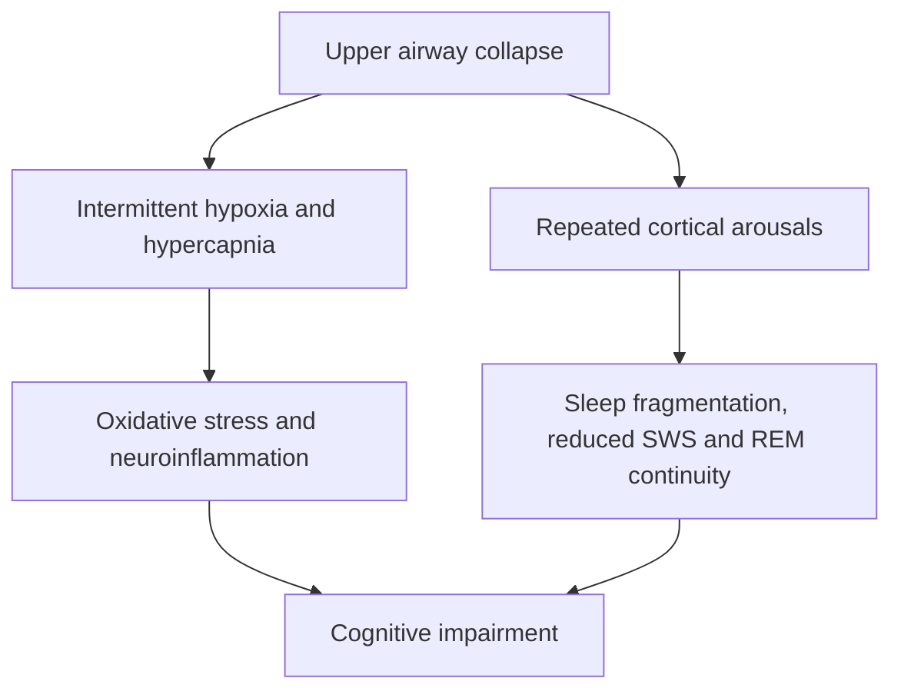

## Sleep disorders and cognitive consequences

### Overview and Conceptual Framework

Sleep disorders comprise a heterogeneous group of conditions characterized by disrupted sleep initiation, maintenance, architecture, timing, or quality, each associated with distinct patterns of cognitive impairment. Because sleep serves multiple interdependent functions, including memory consolidation, synaptic homeostasis, glymphatic clearance, and restoration of attentional and executive capacity, disruption at different levels of the sleep system produces correspondingly distinct cognitive profiles.

Sleep disorders are broadly classified according to the International Classification of Sleep Disorders (ICSD) into major categories including insomnias, sleep-related breathing disorders, central disorders of hypersomnolence, circadian rhythm sleep-wake disorders, parasomnias, and sleep-related movement disorders.

### Insomnia Disorder

- **Definition:** Persistent difficulty with sleep initiation, maintenance, or early morning awakening, accompanied by daytime impairment, occurring despite adequate opportunity for sleep, and persisting at least three nights per week for three months for chronic classification
- **Subtypes:** Sleep-onset insomnia, sleep-maintenance insomnia, and mixed presentations; may be primary or comorbid with psychiatric, medical, or substance-related conditions
- **Proposed mechanism:** The hyperarousal model, positing excessive physiological and cognitive activation (elevated cortical arousal, increased metabolic rate, heightened sympathetic activity) that interferes with the normal transition into and maintenance of sleep [Inference — the precise neurobiological substrate of hyperarousal in humans remains incompletely characterized]

**Cognitive consequences:**

- Impaired sustained attention and vigilance, often disproportionate to total sleep time lost, suggesting a contribution from hyperarousal itself rather than sleep loss alone
- Deficits in working memory and executive function, including cognitive flexibility and inhibitory control
- Subjective cognitive complaints frequently exceed objective performance deficits on standardized testing, a discrepancy noted consistently across insomnia research [Unverified — the basis for this subjective-objective discrepancy is debated, with proposed explanations including altered self-monitoring and negative cognitive bias]
- Associated with elevated risk of later cognitive decline in longitudinal aging studies, though causal directionality is difficult to establish given bidirectional relationships between sleep and cognitive/mood symptoms [Inference]

### Obstructive Sleep Apnea (OSA)

- **Definition:** Repeated episodes of partial or complete upper airway obstruction during sleep, resulting in intermittent hypoxia, hypercapnia, and cortical arousals that fragment sleep architecture
- **Pathophysiology:** Collapse of pharyngeal soft tissue during sleep-related loss of upper airway dilator muscle tone; risk factors include obesity, craniofacial anatomy, and reduced upper airway muscle tone
- **Severity measurement:** Apnea-hypopnea index (AHI), the number of apnea/hypopnea events per hour of sleep, used to classify severity as mild, moderate, or severe

**Cognitive consequences:**

- Deficits in sustained attention, vigilance, and psychomotor speed, largely attributable to sleep fragmentation and repeated micro-arousals preventing consolidated deep sleep
- Executive dysfunction, including impaired planning, cognitive flexibility, and working memory, proposed to relate additionally to intermittent hypoxia-related neural injury, particularly affecting prefrontal cortical regions
- Memory consolidation deficits, consistent with OSA's disruption of both slow-wave sleep and REM sleep continuity
- Associated in multiple longitudinal studies with increased risk of mild cognitive impairment and dementia, including Alzheimer's disease, though the degree to which CPAP treatment mitigates this long-term risk remains an active area of investigation [Unverified — treatment effects on long-term dementia risk are not yet firmly established in randomized evidence]

### Central Disorders of Hypersomnolence: Narcolepsy

- **Narcolepsy type 1:** Characterized by excessive daytime sleepiness, cataplexy (sudden loss of muscle tone triggered by strong emotion), and low or undetectable cerebrospinal fluid orexin/hypocretin levels, resulting from autoimmune-mediated destruction of orexinergic neurons in the lateral hypothalamus
- **Narcolepsy type 2:** Excessive daytime sleepiness without cataplexy and with normal orexin levels; pathophysiology less well characterized
- **Associated features:** Sleep paralysis, hypnagogic/hypnopompic hallucinations, and fragmented nighttime sleep, reflecting instability of the sleep-wake and REM-NREM flip-flop switches

**Cognitive consequences:**

- Impaired sustained attention and vigilance due to intrusive sleepiness and involuntary microsleep episodes during wakefulness
- Working memory deficits, often correlating with subjective sleepiness severity
- "Automatic behavior," in which routine tasks are performed with reduced awareness or subsequent recall during microsleep intrusions
- Cognitive impairment in narcolepsy is generally attributed primarily to state instability and fragmented sleep/wake boundaries rather than direct structural cognitive impairment; performance often normalizes with effective symptomatic treatment [Inference]

### Circadian Rhythm Sleep-Wake Disorders

- **Delayed sleep phase disorder:** Endogenous sleep timing substantially later than socially desired or required, resulting in chronic sleep restriction and misalignment when conforming to conventional schedules
- **Shift work disorder:** Circadian misalignment resulting from work schedules conflicting with the endogenous light-entrained clock
- **Jet lag disorder:** Transient misalignment following rapid transmeridian travel

**Cognitive consequences:**

- Cognitive impairment in these disorders arises from a combination of circadian misalignment (performing cognitively demanding tasks at a suboptimal circadian phase) and cumulative sleep debt from chronically shortened or fragmented sleep opportunity
- Performance decrements are most pronounced for sustained attention and vigilance tasks, which are particularly sensitive to both circadian phase and homeostatic sleep pressure
- Chronic shift work has been associated in epidemiological research with long-term cognitive effects, though disentangling circadian misalignment effects from cumulative sleep restriction effects in real-world shift worker populations remains methodologically challenging [Unverified]

### REM Sleep Behavior Disorder (RBD)

- **Definition:** Loss of the normal skeletal muscle atonia that characterizes REM sleep, resulting in physical enactment of dream content, sometimes with potential for injury to the patient or bed partner
- **Mechanism:** Dysfunction of the sublaterodorsal nucleus-to-spinal cord atonia-generating pathway
- **Clinical significance:** RBD is strongly associated with, and frequently prodromal to, alpha-synucleinopathies, including Parkinson's disease, dementia with Lewy bodies, and multiple system atrophy, often preceding motor or cognitive diagnosis by years

**Cognitive consequences:**

- Isolated RBD (occurring without an established neurodegenerative diagnosis) is associated with subtle cognitive deficits, particularly in visuospatial function and attention, in several longitudinal cohort studies, consistent with early, subclinical synucleinopathy-related neural changes [Inference]
- RBD is used as a research and clinical marker for identifying individuals at elevated risk for future development of Lewy body-related cognitive impairment and dementia

### Parasomnias (NREM Arousal Disorders)

- **Types:** Sleepwalking, sleep terrors, confusional arousals; characterized by incomplete arousal from slow-wave sleep, resulting in complex behaviors with impaired consciousness and typically no subsequent recall
- **Cognitive consequences:** Generally limited direct evidence of persistent daytime cognitive impairment in isolated parasomnias in the absence of comorbid sleep disruption, though frequent nocturnal episodes can secondarily fragment sleep and produce daytime sleepiness-related attentional effects [Unverified]

### Sleep Restriction and Cumulative Sleep Debt

Distinct from formally diagnosed sleep disorders, chronic partial sleep restriction (obtaining less sleep than physiologically needed on a recurring basis) produces well-characterized cognitive effects independent of any specific disorder diagnosis.

**Key Points**

- Cumulative sleep debt from chronic partial restriction (e.g., 4-6 hours nightly over multiple days) produces progressive decline in sustained attention and psychomotor vigilance performance, with deficits comparable in magnitude to acute total sleep deprivation after sufficient cumulative restriction
- A critical and well-replicated finding is that subjective sleepiness ratings often plateau or fail to track the continued objective decline in performance under chronic partial sleep restriction, meaning individuals may underestimate their own impairment [Inference — the precise dissociation mechanism between subjective and objective measures is not fully resolved]
- Performance on lapse-based vigilance tasks (e.g., psychomotor vigilance task) shows a dose-dependent relationship with both duration and severity of sleep restriction across controlled laboratory studies

$$\text{Cognitive impairment} \approx f(\text{cumulative sleep debt}, \text{circadian phase at testing}, \text{task type})$$

### Common Cognitive Domain Vulnerabilities Across Disorders

| Cognitive Domain | Relative Vulnerability | Primary Mechanistic Contributors |
| --- | --- | --- |
| Sustained attention/vigilance | Highly vulnerable across nearly all sleep disorders | Sleep fragmentation, circadian misalignment, cumulative sleep debt |
| Working memory | Moderately vulnerable | Fragmented SWS, prefrontal cortical dysfunction |
| Executive function | Vulnerable, particularly in OSA | Prefrontal circuit disruption, intermittent hypoxia |
| Declarative memory consolidation | Vulnerable when SWS is disrupted | Impaired hippocampal-neocortical dialogue |
| Emotional regulation | Vulnerable when REM is disrupted | Altered amygdala-prefrontal connectivity |
| Processing speed | Vulnerable, particularly with hypersomnolence | Reduced arousal state stability |

### Sleep Disorders, Neuroinflammation, and Long-Term Neurodegenerative Risk

- Chronic sleep disruption across multiple disorder categories has been associated with impaired glymphatic clearance of metabolic waste products, including beta-amyloid, based primarily on animal model and limited human imaging evidence
- Intermittent hypoxia in OSA is additionally associated with oxidative stress and neuroinflammatory processes that may independently contribute to neural injury beyond fragmentation-related mechanisms alone
- The bidirectional relationship between sleep disruption and neurodegenerative disease (poor sleep as both a risk factor for and an early symptom of conditions such as Alzheimer's disease) complicates causal interpretation in longitudinal human studies [Unverified — the field has not established definitive causal directionality or the degree to which sleep disorder treatment modifies long-term neurodegenerative trajectory]

### Diagnostic Assessment Approach

- **Polysomnography (PSG):** Gold standard for objective characterization of sleep architecture, respiratory events, and movement abnormalities
- **Actigraphy:** Wrist-worn accelerometry providing longitudinal estimates of sleep-wake patterns in the home environment, useful for circadian rhythm disorders and assessing real-world sleep patterns over extended periods
- **Multiple Sleep Latency Test (MSLT):** Measures daytime sleep propensity across repeated nap opportunities, used diagnostically for narcolepsy and idiopathic hypersomnia
- **Neuropsychological testing:** Domain-specific assessment (attention, working memory, executive function) to characterize the cognitive impact and monitor treatment response
- **Psychomotor Vigilance Task (PVT):** A widely used research and clinical tool measuring reaction time and lapses in sustained attention, sensitive to both acute and cumulative sleep loss

### Management Implications for Cognitive Outcomes

**Example**

A patient with moderate OSA (AHI 20) presenting with subjective memory complaints and impaired workplace performance undergoes continuous positive airway pressure (CPAP) treatment. Follow-up assessment at three months typically shows improvement in attention and vigilance measures corresponding to reduced sleep fragmentation, though the degree of improvement in memory-specific domains may be more variable and dependent on treatment adherence and duration of prior untreated disease. [Inference — individual treatment response varies considerably]

- Treatment of the underlying sleep disorder (CPAP for OSA, cognitive behavioral therapy for insomnia, orexin-based or stimulant pharmacotherapy for narcolepsy) generally improves attentional and vigilance-related cognitive measures, which are most directly tied to sleep continuity and quantity
- Recovery of memory consolidation-related cognitive function may lag behind or be less complete than recovery of attentional function, consistent with the distinct and potentially cumulative nature of sleep's memory-related contributions
- Cognitive behavioral therapy for insomnia (CBT-I) is considered a first-line treatment for chronic insomnia and has evidence supporting improvement in both sleep parameters and associated daytime cognitive complaints

**Next Steps**

- Obstructive sleep apnea pathophysiology and CPAP treatment mechanisms
- REM sleep behavior disorder as a prodromal marker for synucleinopathy
- Sleep-dependent memory consolidation mechanisms
- Glymphatic system and neurodegenerative disease risk
- Cognitive behavioral therapy for insomnia (CBT-I) principles
- Psychomotor vigilance task and sustained attention measurement
- Circadian rhythm sleep-wake disorders and chronotherapy