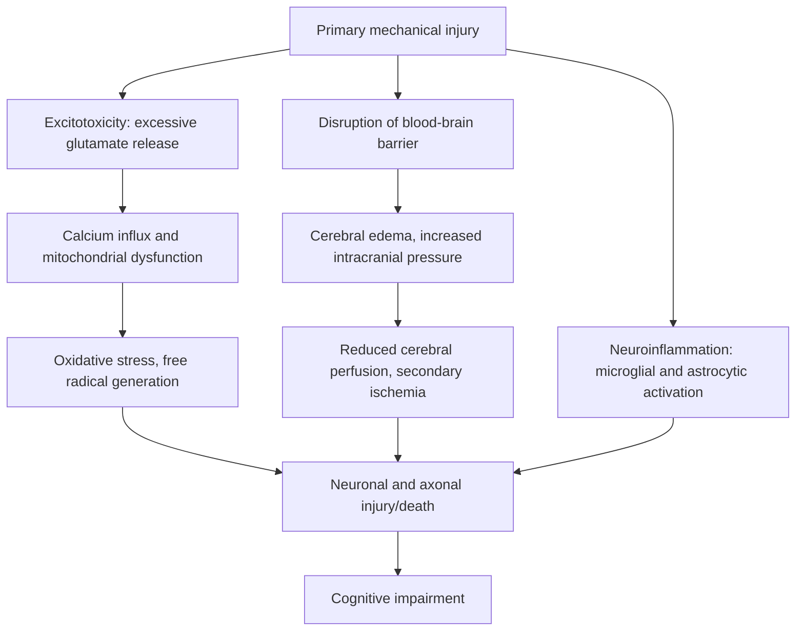

## Traumatic brain injury and cognitive outcomes

### Overview and Conceptual Framework

Traumatic brain injury (TBI) refers to an alteration in brain function, or other evidence of brain pathology, caused by an external mechanical force. TBI is a leading cause of acquired disability worldwide and produces a highly heterogeneous spectrum of cognitive outcomes, ranging from transient, fully resolving symptoms to permanent, severe impairment, depending on injury severity, mechanism, location, and individual factors.

TBI is not a single pathological entity but rather an umbrella term encompassing diverse injury mechanisms (focal contusion, diffuse axonal injury, hemorrhage) that produce distinct, though often overlapping, patterns of cognitive dysfunction.

### Classification of TBI Severity

TBI severity is most commonly classified using the Glasgow Coma Scale (GCS), assessed at initial presentation, along with duration of loss of consciousness (LOC) and post-traumatic amnesia (PTA).

| Severity | GCS Score | Loss of Consciousness | Post-Traumatic Amnesia |
| --- | --- | --- | --- |
| Mild | 13-15 | Less than 30 minutes | Less than 24 hours |
| Moderate | 9-12 | 30 minutes to 24 hours | 1 to 7 days |
| Severe | 3-8 | Greater than 24 hours | Greater than 7 days |

**Key Points**

- GCS assesses eye-opening, verbal response, and motor response, with scores ranging from 3 (deep coma/unresponsive) to 15 (fully alert and oriented)
- Mild TBI (including concussion) accounts for the large majority of TBI cases but produces a wide range of outcomes, from full symptom resolution within days to weeks in most cases, to persistent symptoms in a subset of patients
- Severity classification at presentation does not perfectly predict long-term cognitive outcome; structural and functional imaging findings, along with clinical course, provide additional prognostic information

### Primary Injury Mechanisms

Primary injury refers to damage occurring at the moment of biomechanical impact, before any secondary physiological cascade begins.

- **Focal contusion:** Bruising of brain tissue, typically occurring at the site of direct impact (coup injury) or at a site opposite the impact due to brain movement within the skull (contrecoup injury); frontal and temporal poles are particularly vulnerable due to bony skull base irregularities
- **Diffuse axonal injury (DAI):** Widespread shearing and stretching of axons resulting from rotational and angular acceleration-deceleration forces, particularly affecting the gray-white matter junction, corpus callosum, and brainstem; a major contributor to cognitive impairment in moderate-to-severe TBI, often disproportionate to what is visible on conventional structural imaging
- **Intracranial hemorrhage:** Includes epidural, subdural, subarachnoid, and intraparenchymal hemorrhage, each with distinct anatomical origin, clinical course, and management implications
- **Skull fracture:** May be associated with underlying contusion or hemorrhage, though presence or absence of fracture does not directly correlate with severity of underlying brain injury

### Secondary Injury Cascade

Secondary injury refers to the biochemical and physiological processes triggered by the primary injury that unfold over minutes to days (or longer) following the initial trauma, and which represent a major target for clinical intervention.

- **Excitotoxicity:** Excessive extracellular glutamate release overactivates NMDA and AMPA receptors, producing pathological calcium influx and downstream cellular injury
- **Neuroinflammation:** Microglial activation and cytokine release, which may serve both reparative and injurious roles depending on timing and magnitude
- **Cerebral edema and elevated intracranial pressure:** Can produce secondary ischemic injury by compromising cerebral perfusion pressure, a major target of acute clinical management in moderate-to-severe TBI
- **Delayed and chronic processes:** Includes ongoing neuroinflammation, and in some cases, progressive neurodegenerative changes that may continue well beyond the acute injury period

### Cognitive Domains Affected by TBI

TBI-related cognitive impairment is influenced by lesion location and mechanism, but certain domains are disproportionately vulnerable due to the anatomical susceptibility of specific regions to common injury mechanisms.

- **Executive function:** Among the most consistently affected domains, given the particular vulnerability of frontal lobes and frontal-subcortical white matter tracts to both contusion and diffuse axonal injury; impairments include deficits in planning, cognitive flexibility, inhibitory control, and working memory
- **Processing speed:** Frequently and robustly impaired, particularly following diffuse axonal injury, consistent with disruption of the widespread white matter networks supporting rapid information transfer
- **Attention:** Sustained and divided attention deficits are common, contributing to broader functional impairment across multiple cognitive tasks
- **Memory:** Both anterograde (difficulty forming new memories post-injury) and retrograde (loss of memories predating injury) amnesia can occur; medial temporal lobe and diencephalic structures are particularly vulnerable in more severe injuries
- **Language:** Less consistently affected than in focal stroke-related aphasia, but word-finding difficulty and reduced verbal fluency are common, particularly with frontal or dominant-hemisphere involvement

**Key Points**

- The combination of impaired processing speed and executive dysfunction is frequently described as a hallmark cognitive signature of moderate-to-severe TBI, particularly when diffuse axonal injury is a major contributor
- Cognitive profiles are highly individual and depend on injury location, mechanism, severity, pre-injury cognitive reserve, and age at injury

### Mild TBI/Concussion: Distinct Considerations

- **Definition:** A subset of TBI involving a complex pathophysiological process affecting the brain, typically induced by biomechanical forces, with GCS 13-15 and LOC (if present) under 30 minutes
- **Neurometabolic cascade:** A well-characterized model describes concussion as triggering an acute neurometabolic crisis involving ionic flux, altered glucose metabolism, and reduced cerebral blood flow, occurring in the relative absence of gross structural damage visible on standard imaging
- **Typical course:** Most individuals with a single, uncomplicated concussion show resolution of cognitive symptoms within 7 to 14 days in adults, and slightly longer in some pediatric and adolescent populations, though individual variability is substantial
- **Persistent post-concussive symptoms:** A subset of patients experience symptoms (cognitive, somatic, and/or emotional) persisting beyond the typical recovery window, sometimes termed persistent post-concussive symptoms; risk factors include prior concussion history, pre-existing psychiatric conditions, and certain injury characteristics, though the relative contribution of physiological versus psychological/contextual factors to prolonged symptoms remains actively debated [Unverified]

**Example**

A collegiate athlete sustains a concussion during play, with immediate on-field assessment showing GCS 15 and no loss of consciousness, but reporting headache, difficulty concentrating, and delayed verbal recall on sideline cognitive testing. Standard management involves a graduated return-to-activity protocol, with cognitive and physical exertion introduced incrementally while monitoring for symptom recurrence, reflecting current consensus that strict prolonged rest beyond the initial acute period is not clearly superior to a more graduated approach for most patients. [Inference — optimal management protocols continue to be refined based on emerging evidence]

### Repetitive Head Injury and Chronic Traumatic Encephalopathy (CTE)

- CTE is a neurodegenerative condition associated with a history of repetitive head impacts, characterized pathologically by perivascular accumulation of hyperphosphorylated tau protein, with a distinctive distribution pattern distinguishing it from Alzheimer's disease tau pathology
- Currently, CTE can only be definitively diagnosed post-mortem via neuropathological examination; no validated in-vivo biomarker or imaging method exists for definitive antemortem diagnosis, which significantly limits clinical and epidemiological research [Unverified — this represents an active and evolving area of research with significant methodological limitations]
- Clinical correlates proposed to be associated with CTE pathology include changes in mood, behavior, and cognition, though the relationship between repetitive head impact exposure, clinical symptoms during life, and eventual CTE pathology remains an area of substantial ongoing scientific investigation and is not fully established causally [Unverified]

### Neuroimaging in TBI Assessment

| Modality | Utility |
| --- | --- |
| CT (computed tomography) | First-line acute imaging; sensitive for hemorrhage, mass effect, skull fracture |
| Structural MRI | Greater sensitivity than CT for contusion, and for subacute/chronic changes |
| Susceptibility-weighted imaging (SWI) | Highly sensitive for detecting microhemorrhages associated with diffuse axonal injury |
| Diffusion tensor imaging (DTI) | Research and increasingly clinical tool for detecting white matter tract disruption, particularly relevant for diffuse axonal injury not visible on conventional sequences |
| Functional MRI | Primarily research tool for investigating altered network connectivity following TBI |

**Key Points**

- Mild TBI frequently presents with normal conventional CT and structural MRI despite clinically significant symptoms, reflecting the largely functional/metabolic (rather than grossly structural) nature of the underlying pathophysiology in many cases
- Advanced imaging techniques such as DTI can reveal white matter abnormalities not visible on conventional imaging, though their translation into individual-level clinical diagnostic or prognostic tools remains an active area of development [Unverified]

### Long-Term Cognitive and Neurodegenerative Risk

- Moderate-to-severe TBI has been associated in multiple longitudinal epidemiological studies with increased long-term risk of dementia, including Alzheimer's disease, relative to individuals without TBI history [Inference — while the epidemiological association is well-documented, the precise mechanistic pathway and degree of risk attributable specifically to TBI versus shared risk factors remains under investigation]
- A single mild TBI/concussion in the general population does not show as strong or consistent an association with long-term dementia risk as moderate-to-severe injury, though research in this area continues to evolve, particularly regarding repetitive mild injury exposure [Unverified]
- Proposed mechanistic links between TBI and later neurodegeneration include chronic neuroinflammation, disrupted proteostasis (including tau and amyloid processing), and cumulative white matter injury, though a definitive causal chain in humans has not been fully established [Inference]

### Age-Related Considerations

- **Pediatric TBI:** The developing brain shows both particular vulnerabilities (ongoing myelination and synaptic pruning processes that can be disrupted) and, in some contexts, greater plasticity-related recovery potential compared to adult injury, though outcomes vary substantially by injury severity, age at injury, and affected brain regions [Inference]
- **Older adult TBI:** Associated with generally worse cognitive and functional outcomes compared to younger adults with comparable injury severity, potentially related to reduced cognitive reserve, pre-existing cerebrovascular pathology, and reduced neuroplasticity, though this remains an area of active research [Inference]

### Neuropsychological Assessment and Rehabilitation

- **Assessment approach:** Comprehensive neuropsychological testing across attention, processing speed, executive function, memory, and language domains, ideally with serial assessment to track recovery trajectory
- **Cognitive rehabilitation:** Evidence-based approaches include compensatory strategy training (external aids, structured routines) for more severe or persistent deficits, and restorative approaches (attention process training, executive function training) with variable evidence depending on specific technique and population
- **Multidisciplinary management:** Often involves coordination across neuropsychology, physical and occupational therapy, speech-language pathology, and psychiatric/psychological support, given the frequent co-occurrence of cognitive, physical, and emotional/behavioral sequelae

### Illustrative Schematic: TBI Severity and Recovery Trajectories (svg_diagram)

<svg xmlns="http://www.w3.org/2000/svg" viewBox="0 0 740 300">
<text x="370" y="24" text-anchor="middle" font-size="15" font-weight="bold" fill="#222">Recovery Trajectories by Injury Severity (svg_diagram)</text>
<line x1="60" y1="250" x2="700" y2="250" stroke="#333" stroke-width="1.5" />
<line x1="60" y1="250" x2="60" y2="50" stroke="#333" stroke-width="1.5" />
<text x="30" y="55" font-size="10">Cognitive function</text>
<text x="370" y="275" text-anchor="middle" font-size="11">Time post-injury</text>
<path d="M60,90 L120,90 Q160,90 200,100" fill="none" stroke="#3a8a2a" stroke-width="2" />
<text x="220" y="100" font-size="10" fill="#3a8a2a">Mild (typical course)</text>
<path d="M60,150 L120,190 Q220,210 350,150 Q450,110 600,105" fill="none" stroke="#b58a2a" stroke-width="2" />
<text x="450" y="95" font-size="10" fill="#b58a2a">Moderate (gradual recovery)</text>
<path d="M60,230 L150,240 Q300,245 450,200 Q580,165 680,155" fill="none" stroke="#b5502a" stroke-width="2" />
<text x="500" y="185" font-size="10" fill="#b5502a">Severe (prolonged, plateau)</text>
<line x1="60" y1="60" x2="700" y2="60" stroke="#999" stroke-width="1" stroke-dasharray="3,3" />
<text x="680" y="55" text-anchor="end" font-size="9" fill="#666">Pre-injury baseline</text>
</svg>

**Next Steps**

- Diffuse axonal injury and white matter tract vulnerability
- Concussion neurometabolic cascade and return-to-play protocols
- Chronic traumatic encephalopathy: current diagnostic and research challenges
- Post-traumatic amnesia and acute cognitive recovery monitoring
- Cognitive rehabilitation strategies for executive dysfunction
- TBI as a risk factor for later-life neurodegenerative disease
- Secondary injury cascade and acute neuroprotective interventions