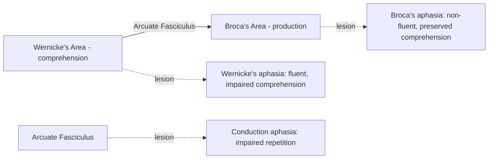
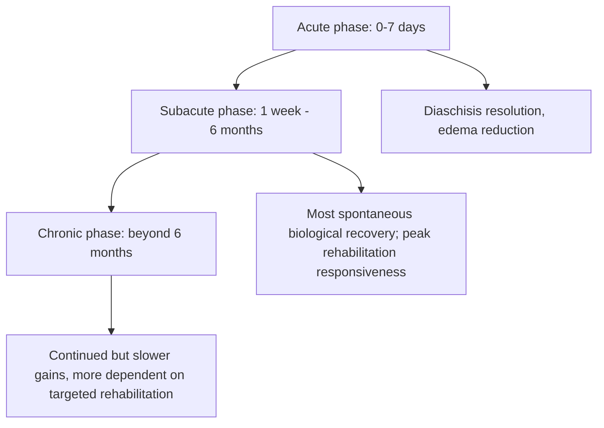

## Stroke and neurorehabilitation

### Overview and Conceptual Framework

Stroke is an acute neurological event resulting from disruption of blood supply to the brain, producing focal (and occasionally global) neural injury with cognitive, motor, and sensory consequences determined largely by lesion location, size, and mechanism. Neurorehabilitation encompasses the range of therapeutic interventions aimed at promoting functional recovery following stroke, grounded in principles of experience-dependent neuroplasticity.

Unlike traumatic brain injury, stroke-related deficits are typically more anatomically predictable, as they correspond to the vascular territory affected, allowing for more precise correlation between lesion location and resulting cognitive-behavioral syndrome.

### Stroke Classification and Pathophysiology

- **Ischemic stroke:** Accounts for the large majority of strokes; results from occlusion of a cerebral blood vessel, most commonly due to thrombosis (local clot formation, often atherosclerotic) or embolism (clot or debris traveling from a distant source, commonly cardiac)
- **Hemorrhagic stroke:** Results from rupture of a blood vessel, causing bleeding into brain tissue (intracerebral hemorrhage) or the subarachnoid space (subarachnoid hemorrhage, often from aneurysm rupture)
- **Transient ischemic attack (TIA):** Transient episode of neurological dysfunction caused by focal ischemia without evidence of acute infarction on imaging; considered a significant warning sign for subsequent stroke risk

**Key Points**

- The ischemic penumbra refers to hypoperfused but potentially salvageable tissue surrounding the irreversibly infarcted core, representing the primary target of acute reperfusion therapies
- Rapid restoration of blood flow (via thrombolysis or mechanical thrombectomy) within appropriate time windows can substantially limit the extent of permanent infarction, underlying the clinical emphasis on rapid stroke recognition and treatment ("time is brain")

### Vascular Territories and Associated Cognitive Syndromes

| Vascular Territory | Common Cognitive/Behavioral Syndrome |
| --- | --- |
| Middle cerebral artery (MCA), left/dominant hemisphere | Aphasia (Broca's, Wernicke's, global, depending on subregion), apraxia, right-left disorientation |
| Middle cerebral artery (MCA), right/non-dominant hemisphere | Hemispatial neglect, anosognosia, impaired visuospatial processing |
| Anterior cerebral artery (ACA) | Executive dysfunction, abulia, akinetic mutism (with bilateral involvement), lower-extremity-predominant weakness |
| Posterior cerebral artery (PCA) | Visual field deficits, visual agnosia, memory impairment (with medial temporal involvement), alexia without agraphia (dominant hemisphere) |
| Thalamic infarcts | Memory impairment, attentional deficits, arousal disturbances, occasionally aphasia-like syndromes with left-sided lesions |
| Small vessel/lacunar strokes | Often subtle or subcortical cognitive profile; can cause pure motor or sensory syndromes, or contribute to vascular cognitive impairment when multiple/cumulative |

### Aphasia Syndromes in Detail

Aphasia, an acquired language impairment, is among the most extensively characterized stroke-related cognitive syndromes due to its clear anatomical localization.

- **Broca's aphasia:** Non-fluent, effortful, agrammatic speech with relatively preserved comprehension; associated with inferior frontal gyrus (Broca's area) damage, typically in the left hemisphere
- **Wernicke's aphasia:** Fluent but often meaningless or paraphasic speech with impaired comprehension; associated with posterior superior temporal gyrus (Wernicke's area) damage
- **Global aphasia:** Severe impairment of both production and comprehension, typically resulting from large lesions affecting both anterior and posterior language regions
- **Conduction aphasia:** Relatively fluent speech and preserved comprehension with disproportionately impaired repetition, classically associated with arcuate fasciculus damage, the white matter tract connecting Broca's and Wernicke's areas

### Hemispatial Neglect

- **Definition:** Failure to attend to, respond to, or orient toward stimuli on one side of space (typically the left side, contralateral to a right-hemisphere lesion), not attributable to primary sensory or motor deficit
- **Anatomical correlates:** Most classically associated with right inferior parietal lobule and temporoparietal junction damage, though neglect can arise from lesions across a distributed frontoparietal attention network
- **Clinical features:** Patients may fail to eat food on one side of a plate, fail to groom one side of the body, or collide with objects on the neglected side; often accompanied by anosognosia (lack of awareness of the deficit itself)
- **Assessment:** Line bisection tasks, cancellation tasks, and clock drawing are commonly used bedside and formal assessment tools

**Key Points**

- Neglect is more common, more severe, and more persistent following right-hemisphere lesions than left-hemisphere lesions, consistent with theories proposing right-hemisphere dominance for spatial attention across both visual fields, while the left hemisphere's attentional network is proposed to be more lateralized to the contralateral field alone [Inference — specific theoretical models of hemispheric attentional asymmetry continue to be refined]
- Neglect is distinct from, but can co-occur with, visual field deficits (hemianopia); differentiating the two has important implications for rehabilitation approach

### Vascular Cognitive Impairment and Post-Stroke Dementia

- Vascular cognitive impairment (VCI) encompasses the spectrum of cognitive impairment attributable to cerebrovascular disease, ranging from mild impairment to vascular dementia, and can result from a single strategically located infarct or cumulative effects of multiple smaller lesions (multi-infarct dementia) or chronic small vessel disease
- **Strategic infarct dementia:** Cognitive impairment disproportionate to lesion size, resulting from damage to a location critical for cognitive network function (e.g., thalamus, angular gyrus, certain basal ganglia regions)
- Post-stroke dementia risk is elevated relative to age-matched non-stroke populations, with risk influenced by lesion location, volume, recurrent stroke, and pre-existing cognitive reserve or co-occurring neurodegenerative pathology (mixed vascular-Alzheimer's pathology is common, particularly in older stroke patients) [Inference — precise attribution between vascular and neurodegenerative contributions in mixed cases is often difficult in clinical practice]

### Principles of Neuroplasticity Underlying Recovery

Post-stroke recovery is grounded in the brain's capacity for structural and functional reorganization following injury.

- **Diaschisis resolution:** Early recovery is partly attributed to resolution of diaschisis, a temporary dysfunction in regions distant from but functionally connected to the lesion site, due to disrupted network input rather than direct structural damage
- **Perilesional reorganization:** Cortical tissue adjacent to the infarct can undergo functional remapping, with neurons adopting expanded or altered response properties to partially compensate for lost function
- **Contralesional/homologous region recruitment:** Analogous regions in the unaffected hemisphere may show increased activation post-stroke, though the degree to which this recruitment is adaptive (supporting recovery) versus maladaptive (reflecting reduced interhemispheric inhibition and potentially interfering with optimal recovery) varies by function and has been debated, particularly for motor recovery [Inference — this remains an active area of investigation, with evidence suggesting the adaptive value of contralesional recruitment may depend on lesion severity and specific network involved]
- **Experience-dependent plasticity:** Recovery-promoting reorganization is substantially influenced by rehabilitation-driven use and practice, consistent with broader principles of activity-dependent synaptic plasticity

$$\text{Recovery} \propto f(\text{lesion characteristics, residual network capacity, rehabilitation intensity, time since injury})$$

### Time Course of Recovery

**Key Points**

- The majority of spontaneous neurological recovery occurs within the first three to six months post-stroke, though the precise timeline and degree of plateau vary by function and individual, and continued meaningful improvement beyond this window is well-documented with sustained rehabilitation, challenging earlier assumptions of a fixed recovery ceiling [Inference — the field has moved away from strict recovery plateau timelines, though the rate of improvement does generally slow over time]
- Early, intensive rehabilitation during the subacute phase is generally associated with better outcomes, though excessively early and high-intensity mobilization in the very acute phase has shown mixed results in some clinical trials, underscoring the importance of appropriately timed intervention [Unverified — optimal timing and intensity protocols continue to be refined through ongoing clinical trials]

### Evidence-Based Rehabilitation Approaches

- **Constraint-induced movement therapy (CIMT):** Restraint of the unaffected limb combined with intensive, repetitive practice of the affected limb, used primarily for upper extremity motor recovery; supported by randomized trial evidence for appropriately selected patients with sufficient residual motor function
- **Task-specific and repetitive practice:** Grounded in the principle that functional recovery is enhanced by practicing meaningful, goal-directed tasks relevant to the patient's real-world functional needs, consistent with activity-dependent plasticity principles
- **Cognitive rehabilitation for aphasia:** Includes impairment-based approaches (targeting specific linguistic deficits) and functional/compensatory approaches (augmentative communication strategies); intensity and timing of speech-language therapy influence outcomes
- **Neglect-specific interventions:** Include visual scanning training, prism adaptation therapy, and limb activation approaches, though evidence for long-term functional benefit of individual specific techniques varies across studies [Unverified — comparative efficacy across neglect interventions remains an active research area]
- **Non-invasive brain stimulation:** Techniques such as transcranial magnetic stimulation (TMS) and transcranial direct current stimulation (tDCS) have been investigated as adjunctive tools to modulate interhemispheric excitability balance and potentially enhance rehabilitation outcomes, though clinical translation and standardized protocols remain areas of ongoing research and are not yet considered standard first-line therapy [Unverified]

**Example**

A patient with a right MCA stroke presents with left hemispatial neglect and left upper extremity weakness with preserved voluntary movement. Rehabilitation may combine visual scanning training targeting the neglect (teaching the patient to systematically direct attention leftward) with constraint-induced movement therapy for the affected arm, illustrating how cognitive and motor rehabilitation approaches are often integrated based on the specific deficit profile identified during assessment.

### Assessment Tools in Stroke Rehabilitation

| Domain | Representative Assessment |
| --- | --- |
| Global stroke severity | NIH Stroke Scale (NIHSS) |
| Functional independence | Modified Rankin Scale, Barthel Index, Functional Independence Measure (FIM) |
| Aphasia | Western Aphasia Battery, Boston Diagnostic Aphasia Examination |
| Neglect | Line bisection, cancellation tasks, Behavioral Inattention Test |
| General cognition | Montreal Cognitive Assessment (MoCA), domain-specific neuropsychological batteries |

### Illustrative Schematic: Lesion Location and Syndrome Mapping (svg_diagram)

<svg xmlns="http://www.w3.org/2000/svg" viewBox="0 0 720 320">
<text x="360" y="24" text-anchor="middle" font-size="15" font-weight="bold" fill="#222">Vascular Territory to Cognitive Syndrome Mapping (svg_diagram)</text>
<ellipse cx="200" cy="170" rx="150" ry="110" fill="#f5f5f5" stroke="#333" stroke-width="1.5" />
<text x="200" y="60" text-anchor="middle" font-size="11" font-weight="bold">Left Hemisphere</text>
<circle cx="150" cy="150" r="30" fill="#dce8f7" stroke="#2a6fb5" />
<text x="150" y="150" text-anchor="middle" font-size="9">Broca's</text>
<text x="150" y="195" text-anchor="middle" font-size="9">Non-fluent aphasia</text>
<circle cx="230" cy="190" r="30" fill="#f7e0dc" stroke="#b5502a" />
<text x="230" y="190" text-anchor="middle" font-size="9">Wernicke's</text>
<text x="230" y="235" text-anchor="middle" font-size="9">Fluent aphasia</text>
<ellipse cx="520" cy="170" rx="150" ry="110" fill="#f5f5f5" stroke="#333" stroke-width="1.5" />
<text x="520" y="60" text-anchor="middle" font-size="11" font-weight="bold">Right Hemisphere</text>
<circle cx="560" cy="150" r="30" fill="#e0f7dc" stroke="#3a8a2a" />
<text x="560" y="150" text-anchor="middle" font-size="9">Parietal</text>
<text x="560" y="195" text-anchor="middle" font-size="9">Hemispatial neglect</text>
</svg>

### Post-Stroke Emotional and Behavioral Sequelae

- Post-stroke depression is common and can independently impair cognitive performance and engagement with rehabilitation, underscoring the importance of integrated mood assessment and management alongside cognitive and physical rehabilitation
- Post-stroke fatigue is frequently reported and can significantly affect rehabilitation participation and cognitive testing performance, sometimes independent of stroke severity or lesion location [Unverified — the neurobiological basis of post-stroke fatigue remains incompletely understood]
- Apathy, distinct from depression, can occur particularly with frontal-subcortical circuit involvement and may be mistaken for lack of motivation during rehabilitation, with important implications for treatment approach

**Next Steps**

- Aphasia rehabilitation approaches and speech-language therapy protocols
- Hemispatial neglect: assessment and intervention techniques
- Vascular cognitive impairment and mixed vascular-Alzheimer's pathology
- Neuroplasticity mechanisms in post-injury recovery
- Non-invasive brain stimulation in stroke rehabilitation
- Post-stroke depression, apathy, and fatigue management
- Constraint-induced movement therapy and motor recovery principles