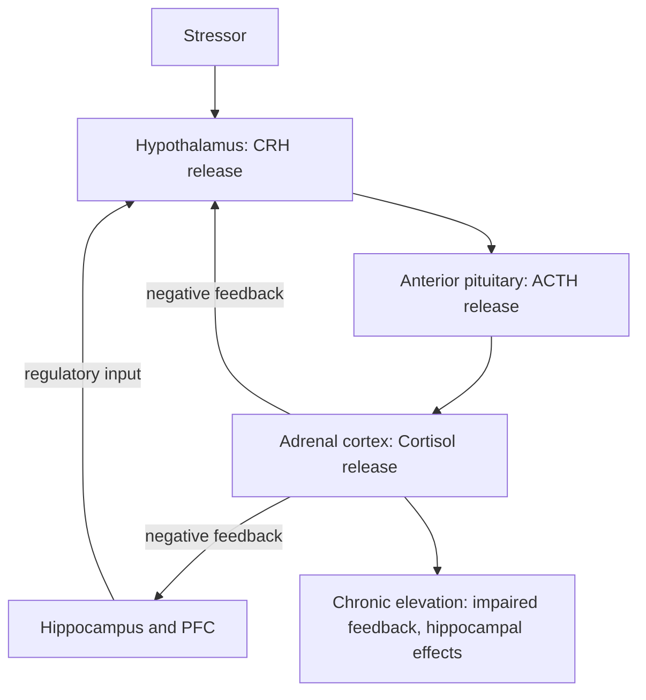

## Neurobiology of depression and anxiety

### Overview and Conceptual Framework

Depression and anxiety disorders are among the most prevalent psychiatric conditions and are increasingly understood through convergent neurobiological frameworks spanning neurotransmitter systems, neuroendocrine regulation, structural and functional circuit alterations, and neuroplasticity mechanisms. While historically approached through largely separate monoaminergic models, contemporary neuroscience emphasizes overlapping circuit-level dysfunction, particularly involving the prefrontal cortex, amygdala, hippocampus, and their interconnections, alongside shared dysregulation of stress-response systems.

Depression and anxiety frequently co-occur clinically and share substantial neurobiological overlap, though they remain distinguishable in their predominant circuit and symptom emphases: depression is more strongly associated with reward-processing and motivational circuit dysfunction, while anxiety disorders are more strongly associated with threat-detection and fear-circuit hyperreactivity, though this distinction reflects relative emphasis rather than a strict dichotomy. [Inference — the degree of neurobiological distinctness versus shared underlying vulnerability continues to be an active area of research]

### Historical Development of Neurobiological Models

- 1950s-1960s: Observations that reserpine (which depletes monoamines) could induce depressive symptoms, and that early antidepressants (monoamine oxidase inhibitors, tricyclics) increased monoaminergic transmission, gave rise to the monoamine hypothesis of depression
- 1960s-1980s: Extension of monoaminergic frameworks to anxiety, particularly implicating serotonergic and noradrenergic systems, alongside growing recognition of GABAergic involvement following the development of benzodiazepines
- 1990s-2000s: Growing recognition that monoamine depletion alone does not fully explain depression's pathophysiology or the delayed therapeutic response to antidepressants, prompting exploration of neuroplasticity-based and neurotrophic models
- 2000s-present: Circuit-based and neuroimaging-informed models, along with the neurotrophic hypothesis and, more recently, glutamatergic mechanisms (informed by the rapid antidepressant effects of ketamine), have substantially expanded and revised earlier monoaminergic frameworks

**Key Points**

- The monoamine hypothesis, while historically foundational and still clinically relevant to pharmacological treatment mechanisms, is now understood as an incomplete explanatory model rather than a comprehensive account of depression's neurobiology [Inference — this represents a significant shift in the field's consensus over recent decades]

### The Monoamine Hypothesis and Its Limitations

- **Core proposal:** Depression results from deficient serotonergic, noradrenergic, and/or dopaminergic neurotransmission; anxiety disorders involve related but distinct monoaminergic and GABAergic dysregulation
- **Supporting evidence:** Efficacy of selective serotonin reuptake inhibitors (SSRIs), serotonin-norepinephrine reuptake inhibitors (SNRIs), and older monoaminergic agents in treating both depression and various anxiety disorders
- **Key limitations:** Antidepressants increase synaptic monoamine availability within hours, but clinical therapeutic effects typically take several weeks to manifest, indicating that downstream adaptive changes (rather than acute monoamine elevation itself) likely mediate therapeutic benefit; additionally, monoamine depletion studies do not reliably induce depression in individuals without prior vulnerability

$$\text{Therapeutic lag} \gg \text{Acute monoamine elevation timescale}$$

This temporal dissociation is a central piece of evidence motivating neuroplasticity-based models discussed below.

### The HPA Axis and Stress Neurobiology

Dysregulation of the hypothalamic-pituitary-adrenal (HPA) axis is one of the most consistently replicated neurobiological findings across depression and anxiety research.

- **Normal regulation:** Corticotropin-releasing hormone (CRH) from the hypothalamus triggers adrenocorticotropic hormone (ACTH) release from the pituitary, stimulating cortisol release from the adrenal cortex; cortisol normally exerts negative feedback on the hypothalamus and pituitary, along with regulatory input from the hippocampus and prefrontal cortex, to terminate the stress response
- **Dysregulation in depression:** A substantial subset of individuals with depression show HPA axis hyperactivity, including elevated basal cortisol and impaired dexamethasone suppression (reduced negative feedback sensitivity), though this finding is not universal across all depressed individuals and its diagnostic specificity is limited [Unverified — HPA axis findings show considerable heterogeneity across studies and individual patients]
- **Chronic stress and hippocampal vulnerability:** The hippocampus contains a high density of glucocorticoid receptors and is particularly vulnerable to the effects of chronic cortisol elevation; animal models demonstrate that chronic stress can reduce hippocampal dendritic complexity and neurogenesis, findings that have informed (though not been fully confirmed at the same magnitude in) human depression research [Inference — translation of specific structural findings from animal stress models to human depression pathophysiology involves important interpretive caveats]

### Structural and Functional Circuit Alterations

**Key regions implicated:**

- **Prefrontal cortex (particularly dorsolateral and ventromedial subregions):** Involved in emotion regulation, executive control over affective responses, and modulation of subcortical threat and reward circuits; reduced prefrontal volume and altered activity patterns are reported in depression, with the ventromedial/orbitofrontal regions particularly implicated in emotion regulation deficits
- **Amygdala:** Central to fear and threat processing; hyperreactivity to negative or threat-related stimuli is a robust and consistently replicated finding across anxiety disorders and is also frequently reported in depression, particularly regarding negative emotional bias
- **Hippocampus:** Implicated in both memory function and stress regulation; reduced hippocampal volume is one of the more consistently replicated structural findings in depression, though whether this reflects a pre-existing vulnerability factor, a consequence of illness/stress exposure, or both remains debated [Inference]
- **Anterior cingulate cortex (ACC):** The subgenual/rostral ACC in particular shows altered activity in depression and has been a target for interventions such as deep brain stimulation in severe, treatment-resistant cases; the dorsal ACC is implicated in conflict monitoring and is frequently reported as hyperactive in anxiety disorders
- **Insula:** Involved in interoceptive awareness and is frequently implicated in anxiety disorders, consistent with the somatic symptom burden (racing heart, physical tension) characteristic of many anxiety presentations

**Key Points**

- A commonly proposed circuit-level model describes reduced top-down prefrontal regulatory control over an amygdala that shows exaggerated bottom-up threat reactivity, contributing to both excessive fear/anxiety responses and difficulty down-regulating negative affect in depression [Inference — this represents a useful organizing framework rather than a fully mechanistically established causal account]
- Reward circuitry, particularly involving the ventral striatum/nucleus accumbens and its dopaminergic input from the ventral tegmental area, shows blunted responsivity to rewarding stimuli in depression, proposed as a neural correlate of anhedonia (loss of interest or pleasure), a core diagnostic symptom

### Anxiety-Specific Circuit Considerations

- **Fear conditioning circuitry:** The amygdala (particularly the basolateral and central nuclei) plays a central role in acquiring and expressing conditioned fear responses; the ventromedial prefrontal cortex is implicated in fear extinction, the process by which conditioned fear responses are inhibited following repeated non-reinforced exposure to the conditioned stimulus
- **Extinction deficits:** Impaired fear extinction learning and/or extinction recall, potentially reflecting reduced ventromedial prefrontal regulatory capacity over amygdala output, is a proposed mechanism contributing to persistent, excessive anxiety and has informed exposure-based therapeutic approaches [Inference]
- **Bed nucleus of the stria terminalis (BNST):** Increasingly implicated in sustained anxiety states (as opposed to phasic fear responses more classically associated with the amygdala), reflecting a proposed distinction between acute fear and more prolonged anxious apprehension [Inference — the precise functional distinction between amygdala-mediated fear and BNST-mediated anxiety in humans remains an active area of investigation]

**Example**

In exposure-based cognitive behavioral therapy for a specific phobia, repeated, controlled exposure to the feared stimulus without the anticipated negative outcome is proposed to strengthen ventromedial prefrontal cortex-mediated inhibitory control over amygdala-driven fear responses, consistent with extinction learning models, illustrating a proposed neurobiological substrate for an established behavioral treatment approach. [Inference]

### The Neurotrophic Hypothesis and BDNF

- **Core proposal:** Depression is associated with reduced expression of brain-derived neurotrophic factor (BDNF) and impaired neuroplasticity, particularly within the hippocampus and prefrontal cortex; effective antidepressant treatment is proposed to act partly by increasing BDNF expression and promoting adaptive neuroplasticity, including adult hippocampal neurogenesis
- **Supporting evidence:** Chronic stress reduces BDNF expression and hippocampal neurogenesis in animal models; conversely, chronic (though notably not acute) antidepressant administration increases BDNF expression and hippocampal neurogenesis in animal studies, a timescale that aligns better with the delayed clinical onset of antidepressant efficacy than the monoamine hypothesis alone
- **Limitations:** The causal necessity of adult hippocampal neurogenesis specifically for antidepressant efficacy has been challenged by some findings, and the degree to which adult human hippocampal neurogenesis occurs at physiologically meaningful levels remains a genuinely contested question in the field [Unverified — this is an area of active scientific debate rather than settled consensus]

### Glutamatergic Mechanisms and Rapid-Acting Antidepressants

- The discovery that ketamine, an NMDA receptor antagonist, produces rapid (within hours) antidepressant effects in treatment-resistant depression substantially shifted neurobiological models toward glutamatergic mechanisms, distinct from traditional monoaminergic pathways
- **Proposed mechanism:** Ketamine's NMDA receptor antagonism is proposed to trigger downstream synaptic plasticity changes, including increased synaptogenesis in the prefrontal cortex, potentially mediated through disinhibition of glutamatergic pyramidal neurons and downstream BDNF/mTOR signaling pathway activation [Inference — the precise mechanistic chain from NMDA antagonism to sustained antidepressant effect continues to be actively investigated, and multiple non-mutually-exclusive mechanisms have been proposed]
- This glutamatergic model has motivated development of related rapid-acting agents (e.g., esketamine) and highlighted synaptic plasticity, rather than monoamine level per se, as a potentially more proximal therapeutic target

### Neuroinflammation in Depression and Anxiety

- A subset of research implicates elevated pro-inflammatory cytokines (such as IL-6, TNF-alpha, and C-reactive protein) in depression, supported partly by the observation that some individuals receiving inflammatory cytokine therapy (e.g., interferon-alpha for certain medical conditions) develop depressive symptoms
- Proposed mechanisms linking inflammation to depression include cytokine effects on monoamine metabolism (e.g., via activation of the kynurenine pathway, diverting tryptophan away from serotonin synthesis), HPA axis dysregulation, and effects on neuroplasticity
- This represents an active but still-developing area of research; not all individuals with depression show elevated inflammatory markers, suggesting neuroinflammation may characterize a biological subtype rather than a universal feature of depression [Inference — the field increasingly favors subtype-based rather than unitary models of depression neurobiology]

### Genetic and Epigenetic Considerations

- Depression and anxiety disorders show moderate heritability based on twin studies, with polygenic architecture (involving many genes of small individual effect) rather than single-gene causation being the consistent finding from genome-wide association studies
- Gene-environment interaction models, such as early proposals regarding serotonin transporter gene (5-HTTLPR) polymorphisms interacting with early life stress exposure to predict depression risk, generated substantial research interest, though subsequent larger-scale replication attempts have produced mixed and often non-replicating results, illustrating the broader challenge of candidate gene approaches in psychiatric genetics [Unverified — this specific finding has not been consistently replicated in larger, more rigorous studies]
- Epigenetic mechanisms (DNA methylation, histone modification) affecting stress-response gene expression, informed substantially by animal models of early life adversity, represent an active area of translational research into how environmental exposures may durably alter neurobiological stress reactivity [Inference]

### Illustrative Schematic: Prefrontal-Amygdala-Hippocampal Circuit (svg_diagram)

<svg xmlns="http://www.w3.org/2000/svg" viewBox="0 0 720 300">
<text x="360" y="22" text-anchor="middle" font-size="15" font-weight="bold" fill="#222">Core Circuit Dysregulation Model (svg_diagram)</text>
<rect x="270" y="50" width="180" height="55" rx="8" fill="#dce8f7" stroke="#2a6fb5" />
<text x="360" y="72" text-anchor="middle" font-size="11" font-weight="bold">Prefrontal Cortex</text>
<text x="360" y="88" text-anchor="middle" font-size="9">Top-down regulation (reduced)</text>
<rect x="100" y="180" width="180" height="55" rx="8" fill="#f7e0dc" stroke="#b5502a" />
<text x="190" y="202" text-anchor="middle" font-size="11" font-weight="bold">Amygdala</text>
<text x="190" y="218" text-anchor="middle" font-size="9">Threat reactivity (increased)</text>
<rect x="440" y="180" width="180" height="55" rx="8" fill="#e0f7dc" stroke="#3a8a2a" />
<text x="530" y="202" text-anchor="middle" font-size="11" font-weight="bold">Hippocampus</text>
<text x="530" y="218" text-anchor="middle" font-size="9">Stress regulation, memory (reduced volume)</text>
<line x1="330" y1="105" x2="220" y2="180" stroke="#333" stroke-width="1.5" marker-end="url(#arrow2)" />
<line x1="390" y1="105" x2="500" y2="180" stroke="#333" stroke-width="1.5" marker-end="url(#arrow2)" />
<line x1="280" y1="207" x2="440" y2="207" stroke="#333" stroke-width="1.2" stroke-dasharray="4,3" />
</svg>

### Integration and Current State of the Field

- Contemporary models increasingly favor a multi-level, systems-based framework integrating neurotransmitter, neuroendocrine, structural/functional circuit, neurotrophic, glutamatergic, inflammatory, and genetic/epigenetic factors, rather than any single unifying mechanism
- Substantial individual heterogeneity in the underlying neurobiological profile of patients meeting clinical criteria for depression or anxiety disorders is increasingly recognized, motivating research into biologically informed subtyping (e.g., inflammatory subtype, anhedonic/reward-circuit subtype) to guide more personalized treatment selection, though such approaches remain largely investigational rather than standard clinical practice [Unverified]

**Next Steps**

- HPA axis dysregulation and stress neurobiology in depth
- Ketamine, esketamine, and glutamatergic antidepressant mechanisms
- Fear conditioning, extinction, and exposure-based therapy neurobiology
- Neuroinflammation and cytokine-mediated depression subtypes
- Adult hippocampal neurogenesis: evidence and controversy
- Reward circuitry and anhedonia in depression
- Genetic and epigenetic contributions to stress-related psychiatric disorders