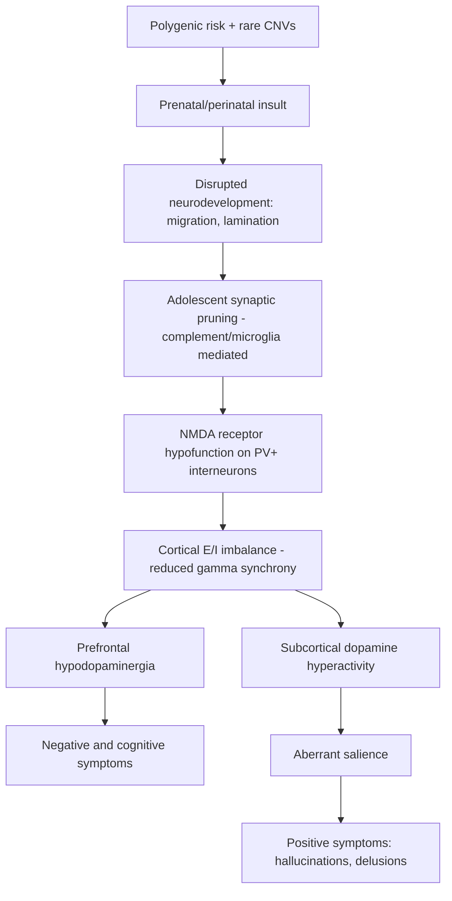

## Neurobiology of Schizophrenia

### Overview

Schizophrenia is a chronic, severe neuropsychiatric disorder affecting approximately 0.3–0.7% of the population worldwide, characterized by disturbances in thought, perception, affect, and behavior. Its neurobiology is best understood as a **neurodevelopmental disorder with progressive elements**, involving genetic risk, early developmental insults, and later synaptic/circuit dysfunction that converges on aberrant dopaminergic, glutamatergic, and GABAergic signaling. No single lesion, gene, or neurotransmitter fully explains the disorder; instead, it reflects disrupted large-scale brain network connectivity emerging from multiple converging pathways.

**Key Points**

- Schizophrenia involves positive symptoms (hallucinations, delusions, disorganized thought), negative symptoms (avolition, anhedonia, alogia, flat affect), and cognitive symptoms (working memory, executive function, processing speed deficits)
- The disorder is highly heritable (twin studies estimate heritability at 60–80%) but polygenic, with no single causal gene
- Current models integrate neurodevelopmental, neurodegenerative, and dysconnection hypotheses

---

### Neurodevelopmental Hypothesis

The neurodevelopmental hypothesis posits that schizophrenia originates from disrupted brain development occurring prenatally or perinatally, with symptoms emerging later due to normal maturational processes (e.g., adolescent synaptic pruning) unmasking latent circuit abnormalities.

**Key Points**

- Early "hits" (second-trimester viral infection, obstetric complications, maternal malnutrition, prenatal stress) disrupt neuronal migration and cortical lamination
- A "second hit" during adolescence—excessive or aberrant synaptic pruning—is thought to unmask the underlying vulnerability, coinciding with typical age of onset (late teens to early 30s)
- Minor physical anomalies and subtle cytoarchitectural disorganization (e.g., abnormal neuronal positioning in the entorhinal cortex and hippocampus) support a prenatal timing of insult
- [Inference] The precise mechanistic link between prenatal insult and adolescent-onset psychosis remains incompletely characterized and is an active area of investigation

---

### Genetic Architecture

Schizophrenia is polygenic, with risk conferred by both common variants of small individual effect and rare variants of larger effect.

#### Common Variant Risk

Genome-wide association studies (GWAS) have identified over 280 independent loci associated with schizophrenia risk, most located in noncoding regulatory regions affecting gene expression rather than protein structure.

- The **major histocompatibility complex (MHC) locus** on chromosome 6 shows the strongest common-variant association, implicating immune/complement system involvement
- **Complement component 4 (C4)** variants, particularly C4A, are associated with increased schizophrenia risk; C4A promotes excessive synaptic pruning by microglia during development, linking immune signaling to the pruning hypothesis
- Genes involved in synaptic function, calcium channel signaling (e.g., *CACNA1C*), and glutamatergic neurotransmission are enriched among risk loci

#### Rare Variant Risk

- **Copy number variants (CNVs)**, particularly the 22q11.2 deletion (velocardiofacial syndrome), confer substantially elevated risk (roughly 20–25 fold increase), making it one of the strongest known genetic risk factors
- Other implicated CNVs include deletions/duplications at 1q21.1, 15q13.3, and 16p11.2
- Rare, damaging variants in genes encoding NMDA receptor complex proteins and synaptic scaffolding proteins have been identified via exome sequencing

**Example**

A patient with 22q11.2 deletion syndrome presenting with cardiac defects, palatal abnormalities, and cognitive impairment carries substantially elevated lifetime psychosis risk, illustrating a monogenic-like contributor within an otherwise polygenic disorder.

---

### The Dopamine Hypothesis

The dopamine hypothesis remains the most clinically influential framework, though it has evolved substantially from its original formulation.

#### Classical (Type 1) Dopamine Hypothesis

- Proposed that psychosis results from **global dopaminergic hyperactivity**
- Supported by two converging observations: (1) antipsychotic drug efficacy correlates strongly with their affinity for blocking D2 receptors, and (2) dopamine-enhancing drugs (amphetamine, L-DOPA) can induce or worsen psychotic symptoms

#### Revised Dopamine Hypothesis (Regionally Specific)

The current model proposes **regionally dissociated dopaminergic dysfunction**:

- **Subcortical/striatal hyperdopaminergia**: Elevated presynaptic dopamine synthesis capacity and release in the associative striatum, driving positive symptoms (hallucinations, delusions) via aberrant salience attribution—the misattribution of motivational significance to neutral stimuli
- **Prefrontal cortical hypodopaminergia**: Reduced D1 receptor-mediated dopaminergic tone in the dorsolateral prefrontal cortex (DLPFC), contributing to negative symptoms and cognitive deficits (working memory impairment)

**Key Points**

- PET imaging studies using $^{18}$F-DOPA consistently demonstrate elevated striatal dopamine synthesis capacity in schizophrenia patients and in individuals at clinical high risk who later convert to psychosis
- The striatal dopamine abnormality appears to precede illness onset and correlates with symptom severity
- [Inference] Prefrontal hypodopaminergia is less directly measurable in vivo and is inferred largely from cognitive task performance, pharmacological challenge studies, and indirect imaging correlates

#### Aberrant Salience Model

Kapur's aberrant salience hypothesis frames dopamine dysregulation not as directly causing hallucinations/delusions but as creating a neurochemical state in which irrelevant stimuli acquire inappropriate motivational salience; delusions represent a cognitive attempt to make sense of these aberrant experiences.

---

### The Glutamate Hypothesis and NMDA Receptor Hypofunction

The glutamate hypothesis has gained substantial traction, partly because it better accounts for negative and cognitive symptoms, which dopamine-based models explain poorly.

**Key Points**

- NMDA receptor antagonists (ketamine, phencyclidine/PCP) reproduce the full symptom triad of schizophrenia (positive, negative, and cognitive symptoms) in healthy volunteers—unlike amphetamine, which primarily reproduces positive symptoms
- The core proposal is **NMDA receptor hypofunction**, particularly on GABAergic interneurons
- NMDA receptor hypofunction on fast-spiking parvalbumin-positive (PV+) interneurons disinhibits downstream glutamatergic pyramidal neurons, producing cortical excitatory/inhibitory (E/I) imbalance
- This disinhibition can secondarily drive subcortical dopamine hyperactivity, providing a mechanistic bridge between the glutamate and dopamine hypotheses

#### GABAergic Interneuron Dysfunction

- Postmortem studies show reduced expression of **GAD67** (glutamic acid decarboxylase, the GABA-synthesizing enzyme) and reduced **parvalbumin** expression in cortical interneurons, particularly in the DLPFC and hippocampus
- PV+ interneurons generate cortical gamma oscillations (30–80 Hz) via fast, synchronized inhibitory feedback onto pyramidal neuron populations
- Reduced PV+ interneuron function correlates with **diminished gamma-band synchrony**, observed in EEG/MEG studies during cognitive tasks, and is proposed as a mechanistic link between cellular pathology and cognitive symptoms (working memory deficits)

$$\text{E/I imbalance} = \frac{\text{Glutamatergic excitatory drive}}{\text{GABAergic inhibitory tone}}$$

---

### Circuit and Connectivity-Level Dysfunction

Schizophrenia is increasingly conceptualized as a **dysconnection syndrome** rather than a disorder of isolated regions.

#### Structural Connectivity

- Diffusion tensor imaging (DTI) studies show reduced white matter integrity (fractional anisotropy) in tracts connecting frontal, temporal, and limbic regions, including the **arcuate fasciculus**, **uncinate fasciculus**, and **cingulum bundle**
- Reduced oligodendrocyte gene expression and myelination abnormalities have been reported in postmortem tissue

#### Functional Connectivity

- Resting-state fMRI studies show altered connectivity within the **default mode network (DMN)**, **salience network**, and **frontoparietal executive control network**
- Failure of appropriate DMN suppression during externally directed tasks is associated with disorganized thought and attentional deficits
- Thalamocortical connectivity is frequently disrupted, with reduced prefrontal-thalamic and increased sensorimotor-thalamic connectivity reported across studies

#### Key Implicated Circuits

| Circuit | Associated Dysfunction | Symptom Domain |
| --- | --- | --- |
| Mesolimbic dopamine pathway (VTA → nucleus accumbens) | Hyperactivity | Positive symptoms |
| Mesocortical dopamine pathway (VTA → DLPFC) | Hypoactivity | Negative/cognitive symptoms |
| Hippocampal-prefrontal circuit | Reduced synchrony, altered glutamatergic drive | Working memory deficits |
| Thalamocortical circuit | Sensory gating failure | Sensory processing abnormalities, attention deficits |

---

### Structural and Cellular Neuropathology

**Key Points**

- Modest but consistently replicated **ventricular enlargement** (lateral and third ventricles) and reduced total brain/gray matter volume, particularly in the medial temporal lobe, hippocampus, and superior temporal gyrus
- Progressive gray matter loss has been observed longitudinally in some first-episode cohorts, particularly in frontal and temporal regions, though the degree to which this reflects illness progression versus antipsychotic medication effects remains debated [Unverified]
- Postmortem studies show **reduced neuropil** (dendritic spine density and synaptic density) rather than frank neuronal loss—consistent with a synaptic/connectivity disorder rather than classic neurodegeneration
- Reduced dendritic spine density has been specifically documented in layer 3 pyramidal neurons of the DLPFC

---

### Neurodevelopmental Pruning and Microglial Involvement

- Adolescent synaptic pruning, mediated substantially by **microglia** via complement-tagging mechanisms (C1q, C3, C4), is proposed as the "second hit" in the two-hit model
- Excessive complement-mediated pruning during adolescence, potentiated by C4A overexpression, may excessively thin cortical synaptic connections in genetically vulnerable individuals, contributing to the typical adolescent/young-adult onset window
- [Inference] While the C4-pruning mechanism is well supported in animal models and genetic association data, direct causal demonstration in human patients remains an active research area

---

### Neuroinflammation and Immune Involvement

- Elevated pro-inflammatory cytokines (IL-6, TNF-α, IL-1β) have been reported in subsets of patients, particularly during acute psychotic episodes
- Maternal immune activation (MIA) during pregnancy (e.g., influenza, toxoplasmosis exposure) is epidemiologically associated with increased offspring schizophrenia risk, supported by animal MIA models showing downstream dopaminergic and behavioral abnormalities
- The MHC/complement genetic signal reinforces an immune-system contribution, though schizophrenia is not classified as a primary autoimmune or inflammatory disease

---

### Integrative Model: Convergence of Pathways

---

### Neurotransmitter Systems Summary Diagram

<svg xmlns="http://www.w3.org/2000/svg" viewBox="0 0 760 420">
<title>Dopaminergic and Glutamatergic Circuit Dysfunction in Schizophrenia (svg_diagram)</title>
<rect x="0" y="0" width="760" height="420" fill="#ffffff" />
<text x="380" y="25" font-size="15" font-weight="bold" text-anchor="middle" fill="#1a1a1a">Dopaminergic and Glutamatergic Circuit Dysfunction (svg_diagram)</text>
<rect x="40" y="60" width="160" height="60" rx="8" fill="#dbeafe" stroke="#2563eb" stroke-width="1.5" />
<text x="120" y="85" font-size="12" text-anchor="middle" fill="#1e3a8a">Ventral Tegmental</text>
<text x="120" y="101" font-size="12" text-anchor="middle" fill="#1e3a8a">Area (VTA)</text>
<rect x="40" y="180" width="160" height="60" rx="8" fill="#fee2e2" stroke="#dc2626" stroke-width="1.5" />
<text x="120" y="205" font-size="12" text-anchor="middle" fill="#7f1d1d">Nucleus Accumbens</text>
<text x="120" y="221" font-size="12" text-anchor="middle" fill="#7f1d1d">(mesolimbic - HYPER)</text>
<rect x="40" y="300" width="160" height="60" rx="8" fill="#dcfce7" stroke="#16a34a" stroke-width="1.5" />
<text x="120" y="325" font-size="12" text-anchor="middle" fill="#14532d">Dorsolateral PFC</text>
<text x="120" y="341" font-size="12" text-anchor="middle" fill="#14532d">(mesocortical - HYPO)</text>
<path d="M120 120 L120 175" stroke="#2563eb" stroke-width="2" marker-end="url(#arrow1)" />
<path d="M120 240 L120 175" stroke="#2563eb" stroke-width="2" marker-end="url(#arrow1)" transform="rotate(180 120 207)" />
<path d="M120 120 Q60 210 120 295" stroke="#16a34a" stroke-width="2" fill="none" marker-end="url(#arrow2)" />
<rect x="420" y="60" width="160" height="60" rx="8" fill="#fef3c7" stroke="#d97706" stroke-width="1.5" />
<text x="500" y="85" font-size="12" text-anchor="middle" fill="#78350f">Glutamatergic</text>
<text x="500" y="101" font-size="12" text-anchor="middle" fill="#78350f">Pyramidal Neuron</text>
<rect x="420" y="180" width="160" height="60" rx="8" fill="#ede9fe" stroke="#7c3aed" stroke-width="1.5" />
<text x="500" y="200" font-size="11" text-anchor="middle" fill="#4c1d95">PV+ GABAergic</text>
<text x="500" y="215" font-size="11" text-anchor="middle" fill="#4c1d95">Interneuron</text>
<text x="500" y="230" font-size="11" text-anchor="middle" fill="#b91c1c">(NMDA-R hypofunction)</text>
<rect x="420" y="300" width="160" height="60" rx="8" fill="#fee2e2" stroke="#dc2626" stroke-width="1.5" />
<text x="500" y="322" font-size="12" text-anchor="middle" fill="#7f1d1d">Reduced Gamma</text>
<text x="500" y="338" font-size="12" text-anchor="middle" fill="#7f1d1d">Synchrony (E/I imbalance)</text>
<path d="M500 240 L500 175" stroke="#7c3aed" stroke-width="2" marker-end="url(#arrowblock)" />
<path d="M500 240 L500 295" stroke="#dc2626" stroke-width="2" marker-end="url(#arrow1)" />
<path d="M200 210 L415 210" stroke="#9ca3af" stroke-width="1.5" stroke-dasharray="4,3" marker-end="url(#arrow1)" />
<text x="310" y="200" font-size="10" text-anchor="middle" fill="#4b5563">modulates</text>
</svg>

---

### Clinical-Translational Correlates

**Example**

A first-episode psychosis patient shows elevated $^{18}$F-DOPA uptake in the associative striatum on PET imaging (correlating with positive symptom severity) alongside impaired N-back task performance and reduced DLPFC activation on fMRI (correlating with negative/cognitive symptoms)—illustrating the regional dopamine dissociation model in a single clinical presentation.

- **Antipsychotic pharmacology**: Typical (first-generation) antipsychotics act primarily via D2 receptor antagonism, effectively treating positive symptoms but with limited efficacy for negative/cognitive symptoms and risk of extrapyramidal side effects due to nigrostriatal D2 blockade
- Atypical (second-generation) antipsychotics combine D2 antagonism with serotonin 5-HT2A antagonism, offering a modestly improved side-effect profile
- **Clozapine** remains the gold standard for treatment-resistant schizophrenia, with a distinct receptor-binding profile (including D4, 5-HT2A, muscarinic, and histaminergic affinity) whose precise mechanism of superior efficacy is not fully established [Unverified]
- Glutamatergic-targeted therapeutics (e.g., glycine transporter inhibitors, mGluR2/3 agonists) have been investigated as adjunctive treatments targeting negative/cognitive symptoms, though clinical trial results have been mixed [Inference: efficacy is not yet firmly established across trials]

---

### Cognitive Symptom Neurobiology

- Working memory deficits correlate with reduced DLPFC activation efficiency and altered dopaminergic tone (following an inverted-U relationship with D1 receptor stimulation)
- Sensory gating deficits (reduced P50 suppression, impaired prepulse inhibition) reflect thalamocortical and hippocampal circuit dysfunction and are used as translational biomarkers in animal models
- Processing speed and verbal memory deficits are among the most robust and clinically significant cognitive impairments, often present before illness onset and relatively stable over the disease course

---

### Related Topics

- Dopamine receptor pharmacology (D1–D5 subtypes) and antipsychotic mechanisms of action
- NMDA receptor structure, subunit composition, and glutamatergic synaptic transmission
- Complement system and microglial synaptic pruning in neurodevelopment
- Maternal immune activation models of neuropsychiatric risk
- 22q11.2 deletion syndrome and psychiatric genetics
- Default mode network dysfunction across psychiatric disorders
- Prepulse inhibition and sensory gating paradigms in translational neuroscience
- Clozapine pharmacology and treatment-resistant schizophrenia
- Gamma oscillations and cortical interneuron physiology
- Polygenic risk scores in psychiatric disease prediction