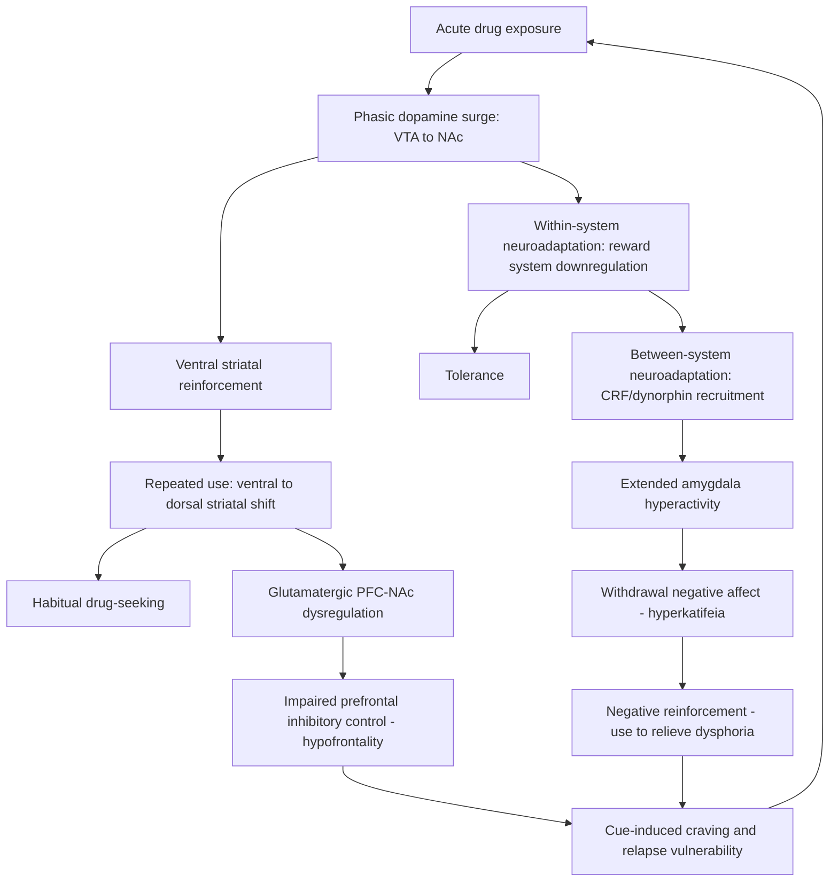

## Neurobiology of Addiction and Substance Use

### Overview

Addiction is a chronic, relapsing disorder characterized by compulsive substance seeking and use despite adverse consequences, loss of control over intake, and the emergence of a negative emotional state when access is prevented. Modern neurobiological models conceptualize addiction not as a simple failure of willpower but as a progressive **hijacking of reward, motivation, memory, and executive control circuitry**, producing lasting neuroadaptations that persist long after drug use ceases.

**Key Points**

- Addiction involves three recurring stages: binge/intoxication, withdrawal/negative affect, and preoccupation/anticipation (craving)
- Each stage is associated with dysfunction in a distinct but interconnected neural circuit: basal ganglia, extended amygdala, and prefrontal cortex, respectively
- The disorder reflects a transition from voluntary, reward-driven use to compulsive, habit-driven use, accompanied by allostatic changes in brain reward set-points

---

### The Mesolimbic Dopamine System

The mesolimbic dopamine pathway is the central substrate for the acute reinforcing effects of nearly all addictive substances.

**Key Points**

- Dopaminergic neurons originate in the **ventral tegmental area (VTA)** and project primarily to the **nucleus accumbens (NAc)**, with additional projections to the prefrontal cortex, amygdala, and hippocampus
- Virtually all drugs of abuse, despite differing primary pharmacological mechanisms, converge on increasing dopamine release in the NAc, particularly the **NAc shell**
- Under natural conditions, dopamine neurons fire phasically in response to unpredicted rewards and reward-predicting cues, encoding a **reward prediction error** signal
- Drugs of abuse produce dopamine release that is larger, more prolonged, and not subject to the normal habituation seen with natural rewards, contributing to their strong reinforcing potency

$$\delta = R - V(s)$$

Where $\delta$ is the prediction error signal (approximated by phasic dopamine firing), $R$ is the received reward, and $V(s)$ is the expected value of the state.

#### Substance-Specific Mechanisms of Dopamine Elevation

| Substance | Primary Mechanism | Direct Target |
| --- | --- | --- |
| Cocaine | Blocks dopamine transporter (DAT) reuptake | Dopamine transporter |
| Amphetamine | Reverses DAT, promotes non-vesicular dopamine release | Dopamine transporter |
| Opioids | Disinhibit VTA dopamine neurons via mu-opioid receptor-mediated inhibition of GABAergic interneurons | Mu-opioid receptors on GABA interneurons |
| Nicotine | Directly stimulates nicotinic acetylcholine receptors on VTA dopamine neurons and glutamatergic terminals | Nicotinic acetylcholine receptors (α4β2, α7) |
| Alcohol | Enhances GABA-A receptor function, disinhibits VTA dopamine neurons, modulates NMDA and opioid systems | Multiple: GABA-A, NMDA, endogenous opioid |
| Cannabinoids (THC) | CB1 receptor activation disinhibits VTA dopamine neurons via GABAergic interneuron suppression | CB1 receptors |

**Example**

Opioids and alcohol both increase VTA dopamine firing through a shared disinhibition mechanism: they suppress local GABAergic interneurons that normally tonically inhibit dopamine neurons, illustrating convergent circuit logic despite distinct primary receptor targets.

---

### Stage 1: Binge/Intoxication — Basal Ganglia Circuitry

This stage involves the acute rewarding effects of a substance and the initial development of conditioned associations between drug effects and environmental cues.

- The **ventral striatum (NAc)** mediates initial reinforcement, while with repeated use, control progressively shifts to the **dorsal striatum**, reflecting a transition from goal-directed drug use to **habitual, stimulus-response drug seeking**
- This ventral-to-dorsal striatal shift parallels the neurobiological transition from voluntary use to compulsive habit, and is thought to underlie the automaticity of drug-seeking behavior in established addiction
- Repeated dopamine surges drive synaptic plasticity in NAc medium spiny neurons (MSNs), altering AMPA/NMDA receptor ratios and dendritic spine morphology—cellular substrates of drug-associated learning

---

### Stage 2: Withdrawal/Negative Affect — Extended Amygdala

This stage reflects the emergence of a negative emotional state (dysphoria, anxiety, irritability) upon cessation of use, driving negative reinforcement (using to relieve withdrawal distress rather than for reward).

**Key Points**

- The **extended amygdala**—comprising the central nucleus of the amygdala (CeA), bed nucleus of the stria terminalis (BNST), and a transition zone in the NAc shell—is the principal substrate for this stage
- Chronic drug exposure produces **within-system neuroadaptations**: downregulation of dopaminergic and opioidergic reward systems, requiring more drug to achieve the same hedonic effect (tolerance)
- Chronic exposure also produces **between-system neuroadaptations**: recruitment of anti-reward, stress-related systems, particularly upregulation of **corticotropin-releasing factor (CRF)** signaling in the extended amygdala
- Elevated CRF and dynorphin (an endogenous kappa-opioid receptor agonist) activity during withdrawal produce dysphoria and stress reactivity, a state termed **hyperkatifeia**
- This shift constitutes an **allostatic** process: the brain's reward set-point is recalibrated downward, meaning baseline (non-drugged) states become subjectively negative, a change that does not fully normalize even after prolonged abstinence [Inference: full reversibility versus permanent recalibration remains debated in the literature]

---

### Stage 3: Preoccupation/Anticipation — Prefrontal Cortex and Craving Circuitry

This stage involves craving, cue-induced drug seeking, and impaired inhibitory control, and is most closely tied to relapse vulnerability.

- The **prefrontal cortex (PFC)**, particularly the dorsolateral PFC, orbitofrontal cortex (OFC), and anterior cingulate cortex (ACC), governs executive control, decision-making, and inhibition of maladaptive behavior
- Chronic drug use is associated with **hypofrontality**—reduced PFC gray matter volume, glucose metabolism, and functional connectivity—impairing the capacity to inhibit drug-seeking impulses
- Glutamatergic projections from the PFC and basolateral amygdala to the NAc are critical for cue-induced craving and reinstatement of drug-seeking behavior in animal models
- The **hippocampus** contributes contextual memory linking environments to drug availability, contributing to context-induced relapse

---

### Neuroplasticity and Molecular Adaptations

#### Glutamatergic Plasticity

- Chronic drug exposure produces persistent alterations in glutamatergic synaptic strength within the NAc, described in preclinical models as **incentive sensitization**—a progressive increase in the incentive salience ("wanting") attributed to drug and drug-associated cues, dissociable from hedonic "liking"
- Reduced basal extracellular glutamate in the NAc, accompanied by hyperresponsive synaptic glutamate release upon drug-cue exposure, has been characterized in cocaine self-administration models via a "glutamate homeostasis" framework, implicating impaired function of the cystine-glutamate exchanger on astrocytes

#### Transcriptional and Epigenetic Mechanisms

- **ΔFosB**, a highly stable transcription factor, accumulates in NAc medium spiny neurons with repeated drug exposure and is implicated in mediating long-term sensitized behavioral responses to drugs
- Chronic drug exposure alters histone acetylation and DNA methylation patterns at genes regulating synaptic plasticity, contributing to persistent transcriptional changes underlying long-term craving and relapse vulnerability
- **CREB (cAMP response element-binding protein)** activation in the NAc is associated with tolerance and dysphoria, functioning somewhat oppositely to ΔFosB in terms of behavioral valence

---

### Circuit-Level Integrative Model

---

### Circuit Diagram: Three-Stage Addiction Model

<svg xmlns="http://www.w3.org/2000/svg" viewBox="0 0 780 460">
<title>Three-Stage Neurocircuitry Model of Addiction (svg_diagram)</title>
<rect x="0" y="0" width="780" height="460" fill="#ffffff" />
<text x="390" y="25" font-size="15" font-weight="bold" text-anchor="middle" fill="#1a1a1a">Three-Stage Neurocircuitry Model of Addiction (svg_diagram)</text>
<rect x="30" y="60" width="220" height="100" rx="10" fill="#dbeafe" stroke="#2563eb" stroke-width="1.5" />
<text x="140" y="85" font-size="13" font-weight="bold" text-anchor="middle" fill="#1e3a8a">Binge / Intoxication</text>
<text x="140" y="105" font-size="11" text-anchor="middle" fill="#1e3a8a">Basal Ganglia</text>
<text x="140" y="122" font-size="10" text-anchor="middle" fill="#1e3a8a">VTA to Ventral Striatum</text>
<text x="140" y="138" font-size="10" text-anchor="middle" fill="#1e3a8a">to Dorsal Striatum</text>
<rect x="280" y="200" width="220" height="100" rx="10" fill="#fee2e2" stroke="#dc2626" stroke-width="1.5" />
<text x="390" y="225" font-size="13" font-weight="bold" text-anchor="middle" fill="#7f1d1d">Withdrawal / Negative Affect</text>
<text x="390" y="245" font-size="11" text-anchor="middle" fill="#7f1d1d">Extended Amygdala</text>
<text x="390" y="262" font-size="10" text-anchor="middle" fill="#7f1d1d">CeA, BNST</text>
<text x="390" y="278" font-size="10" text-anchor="middle" fill="#7f1d1d">CRF / Dynorphin recruitment</text>
<rect x="530" y="60" width="220" height="100" rx="10" fill="#dcfce7" stroke="#16a34a" stroke-width="1.5" />
<text x="640" y="85" font-size="13" font-weight="bold" text-anchor="middle" fill="#14532d">Preoccupation / Anticipation</text>
<text x="640" y="105" font-size="11" text-anchor="middle" fill="#14532d">Prefrontal Cortex</text>
<text x="640" y="122" font-size="10" text-anchor="middle" fill="#14532d">DLPFC, OFC, ACC</text>
<text x="640" y="138" font-size="10" text-anchor="middle" fill="#14532d">Hypofrontality, craving</text>
<path d="M250 110 L275 110 Q390 110 390 195" stroke="#374151" stroke-width="2" fill="none" marker-end="url(#a1)" />
<path d="M390 300 Q390 380 640 165" stroke="#374151" stroke-width="2" fill="none" marker-end="url(#a1)" />
<path d="M640 160 Q640 380 250 140" stroke="#374151" stroke-width="2" fill="none" marker-end="url(#a1)" />

<text x="390" y="400" font-size="11" text-anchor="middle" fill="`#4b5563`">Cyclical progression: repeated traversal deepens circuit adaptation with each relapse</text>

</svg>

---

### Individual Vulnerability Factors

**Key Points**

- Genetic factors account for an estimated 40–60% of addiction risk, varying by substance (heritability is notably higher for cocaine and opioid dependence than for hallucinogens)
- Polymorphisms in genes encoding dopamine receptors (e.g., *DRD2*), metabolic enzymes (e.g., *ALDH2* for alcohol, conferring protective flushing reactions in some East Asian populations), and opioid receptors (*OPRM1*) influence susceptibility and treatment response
- Adolescent brain development, marked by relatively earlier maturation of subcortical reward circuitry compared to prefrontal regulatory circuitry, is associated with heightened vulnerability to initiating substance use and greater susceptibility to long-term neuroadaptive changes [Inference: causal versus correlational relationship between adolescent onset and severity is difficult to fully disentangle from confounds]
- Early life stress and adverse childhood experiences are robustly associated with elevated addiction risk, potentially via CRF system sensitization and altered stress reactivity

---

### Clinical-Translational Correlates

**Example**

A patient in early abstinence from chronic opioid use exhibits blunted response to natural rewards (anhedonia), elevated anxiety, and physiological hyperarousal—consistent with extended amygdala CRF/dynorphin hyperactivity during the withdrawal/negative affect stage—while simultaneously showing strong autonomic and subjective craving responses to drug-paired cues (e.g., paraphernalia, locations), consistent with PFC-driven incentive salience during the preoccupation/anticipation stage.

#### Pharmacotherapy Targets by Mechanism

| Target System | Example Medication | Mechanism |
| --- | --- | --- |
| Opioid receptors | Methadone, buprenorphine | Full/partial mu-opioid agonism, reduces withdrawal and craving |
| Opioid receptors | Naltrexone | Mu-opioid antagonism, blocks reinforcing effects |
| GABA/glutamate | Acamprosate | Modulates glutamatergic hyperactivity in alcohol withdrawal |
| Nicotinic receptors | Varenicline | Partial α4β2 nicotinic agonist, reduces craving and reward |
| Dopamine/norepinephrine | Bupropion | Reuptake inhibition, used in smoking cessation |

- Behavioral and pharmacological treatments targeting the PFC's regulatory capacity (e.g., cognitive-behavioral therapy, contingency management) aim to restore top-down inhibitory control over the sensitized striatal and extended amygdala circuits
- [Unverified] The degree to which pharmacotherapy produces lasting reversal of circuit-level neuroadaptations, as opposed to symptomatic management, remains an open question requiring longitudinal imaging data

---

### Related Topics

- Incentive-sensitization theory versus opponent-process theory of addiction
- Reward prediction error and dopaminergic coding (Schultz model)
- Medium spiny neuron subtypes (D1 vs. D2 pathway) in striatal circuitry
- Corticotropin-releasing factor (CRF) system and stress-addiction interactions
- Adolescent neurodevelopment and substance use vulnerability windows
- Cue reactivity paradigms and craving assessment in addiction neuroimaging
- Pharmacogenomics of addiction treatment response
- Behavioral addictions (gambling, gaming) and shared neurobiological substrates
- Relapse prevention and extinction learning circuitry
- Epigenetics of drug-induced gene expression (ΔFosB, histone modification)