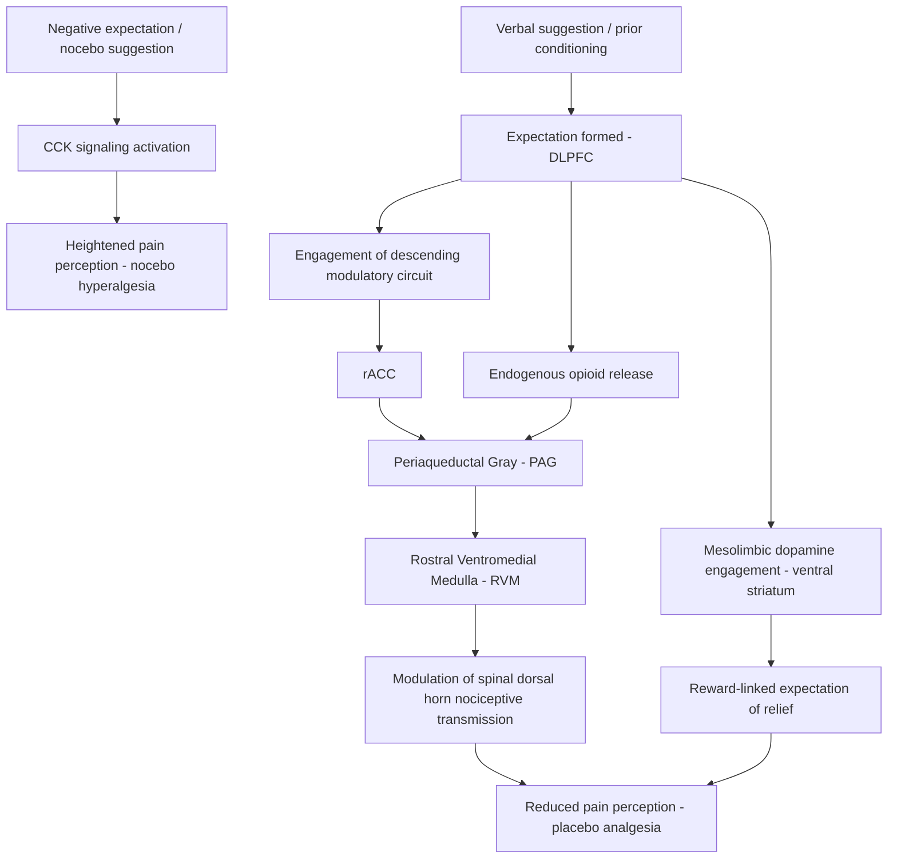

## Placebo Effects and the Neuroscience of Expectation

### Overview

The placebo effect refers to measurable, genuine physiological and psychological changes produced by an inert treatment or sham intervention, arising not from any pharmacological or biologically active mechanism but from the brain's own predictive and regulatory processes. Rather than representing a methodological nuisance to be controlled away, the placebo response is now understood as a distinct, mechanistically tractable neurobiological phenomenon—closely linked to **expectation, learning, and top-down modulation of physiological systems**.

**Key Points**

- Placebo effects are dissociable from the **natural history** of a condition (regression to the mean, spontaneous remission) and from response bias, though all three can co-occur in clinical trials
- The nocebo effect is the mirror-image phenomenon: negative expectations producing genuine adverse symptoms or worsened outcomes from an inert intervention
- Two principal psychological mechanisms drive placebo responses: **expectation** (conscious or unconscious anticipation of an outcome) and **conditioning** (associative learning from prior treatment-outcome pairings)

---

### Core Psychological Mechanisms

#### Expectation

- Explicit or implicit beliefs about a treatment's likely effect can directly shape both subjective experience and objective physiological outcomes
- Verbal suggestion, prior experience, treatment cost/branding, and the perceived authority of the administering clinician all modulate the strength of expectation-driven effects
- Expectation effects can occur even when a treatment is transparently labeled as inert ("open-label placebo"), provided a rationale is given, indicating that effects are not solely dependent on deception

#### Conditioning

- Classical (Pavlovian) conditioning occurs when a previously neutral stimulus (e.g., pill shape, injection ritual, clinical setting) becomes paired with an active drug's pharmacological effect over repeated exposures
- After conditioning, the neutral stimulus alone can elicit a portion of the physiological response previously produced only by the active drug
- Conditioned placebo responses can be more resistant to extinction and, in some paradigms, can produce effects on immune and endocrine parameters that are difficult to achieve through verbal suggestion alone

**Example**

In classic conditioning paradigms, repeated pairing of a novel-tasting drink with an immunosuppressant drug can result in the drink alone later producing measurable immunosuppression—demonstrating that placebo-like conditioning can extend beyond subjective report to objectively measurable biological systems.

---

### Neurobiology of Placebo Analgesia

Placebo analgesia is the most extensively characterized placebo phenomenon at the neural circuit level, serving as the primary model system for understanding expectation-driven modulation of physiological states.

#### Descending Pain Modulatory System

- Placebo analgesia substantially engages the **descending pain modulatory pathway**, involving the rostral anterior cingulate cortex (rACC), which projects to the periaqueductal gray (PAG), which in turn modulates nociceptive transmission at the level of the spinal dorsal horn via the rostral ventromedial medulla (RVM)
- Prefrontal cortical regions, particularly the dorsolateral prefrontal cortex (DLPFC), are implicated in generating and maintaining the expectation that drives engagement of this descending system
- Functional neuroimaging studies consistently show reduced activity in pain-processing regions (e.g., dorsal ACC, insula, thalamus, somatosensory cortex) during placebo analgesia, correlating with the magnitude of reported pain relief

#### Opioidergic Mechanism

- Placebo analgesia is substantially mediated by endogenous **opioid** release, demonstrated most directly through studies using the opioid antagonist **naloxone**, which can partially or fully block placebo analgesic effects in many (though not all) experimental paradigms
- PET imaging using opioid receptor radioligands has demonstrated increased endogenous opioid release in the PAG, rACC, and DLPFC during placebo administration, correlating with the magnitude of reported analgesia
- [Inference] The degree to which naloxone reversibility generalizes across all placebo analgesia paradigms (versus specific conditioning/expectation contexts) remains an area of ongoing investigation, as some studies report naloxone-insensitive placebo effects

#### Non-Opioidergic Mechanisms

- Placebo analgesia induced through conditioning with non-opioid analgesics (e.g., NSAIDs) can engage distinct, non-opioidergic pathways, indicating **mechanistic specificity**: the neurochemical system engaged by placebo can mirror the system engaged by the drug the placebo was conditioned to mimic
- Cannabinoid (CB1) receptor involvement has also been implicated in some placebo analgesia paradigms, again suggesting pharmacologically specific conditioning effects

---

### Dopaminergic Involvement in Placebo Response

- Placebo effects in **Parkinson's disease** have been particularly informative: placebo administration (e.g., sham surgery, saline injection framed as active medication) can produce measurable striatal dopamine release, detected via PET imaging with radiolabeled raclopride displacement
- This placebo-induced dopamine release correlates with subjective and objective improvement in motor symptoms and is associated with activity in the reward-related circuitry, including the ventral striatum
- The magnitude of dopaminergic placebo response has been linked to individual differences in reward sensitivity and prior treatment expectations, reinforcing the role of the mesolimbic reward system in mediating expectation-driven therapeutic benefit

---

### Predictive Coding and Bayesian Framework

Contemporary theoretical models frame placebo (and nocebo) effects within a **predictive processing** or **Bayesian brain** framework, in which perception and physiological regulation reflect a continuous integration of prior expectations with incoming sensory/interoceptive evidence.

$$P(\text{state} \mid \text{evidence}) \propto P(\text{evidence} \mid \text{state}) \cdot P(\text{state})$$

- Under this framework, strong **priors** (expectations) can substantially bias the perceived intensity of a sensory or interoceptive signal (e.g., pain, nausea, fatigue), effectively acting as a top-down "prediction" that is weighted against ascending sensory evidence
- Placebo treatment strengthens the prior toward an expectation of relief, biasing perception even when the underlying nociceptive or interoceptive input is unchanged
- This framework also explains nocebo effects: a strong prior expectation of harm or side effects biases perception toward symptom detection, potentially amplifying genuinely benign interoceptive signals into reportable adverse symptoms
- [Inference] While predictive coding provides a compelling unifying theoretical account, direct empirical validation of specific Bayesian parameters (precision-weighting, prior strength) in placebo paradigms is still an active and evolving area of computational psychiatry research

---

### Nocebo Effects

- Nocebo effects can be induced by negative verbal suggestion, prior adverse experience, observational learning (witnessing another person's adverse reaction), and social/media transmission of expected side effects
- Nocebo hyperalgesia (heightened pain perception from negative expectation) has been shown to involve activation of **cholecystokinin (CCK)** signaling; CCK antagonists can block nocebo-induced hyperalgesia in experimental studies
- Nocebo effects carry direct clinical significance: informed consent disclosures listing potential side effects can measurably increase the rate of those same side effects being reported, independent of the pharmacological agent's actual properties
- This creates a clinically relevant ethical tension between the requirement for informed consent and the risk of inducing nocebo-related adverse symptom reporting

---

### Individual Differences and Predictors of Placebo Response

**Key Points**

- Placebo responsiveness shows substantial inter-individual variability and is influenced by personality traits (optimism, suggestibility), prior treatment history, and situational context (patient-clinician relationship quality, treatment ritual elaborateness)
- Neuroimaging studies have attempted to identify structural and functional predictors of placebo responsiveness (e.g., baseline mu-opioid receptor availability, DLPFC-PAG connectivity strength), though findings across studies show meaningful heterogeneity [Unverified: no single robust, replicated biomarker of placebo responsiveness has been firmly established for clinical use]
- Genetic polymorphisms affecting dopaminergic and opioidergic signaling (e.g., *COMT* Val158Met) have been associated with differential placebo response magnitude in some studies

---

### Circuit-Level Integrative Model

---

### Descending Pain Modulation Diagram

<svg xmlns="http://www.w3.org/2000/svg" viewBox="0 0 720 440">
<title>Descending Pain Modulatory Pathway in Placebo Analgesia (svg_diagram)</title>
<rect x="0" y="0" width="720" height="440" fill="#ffffff" />
<text x="360" y="25" font-size="15" font-weight="bold" text-anchor="middle" fill="#1a1a1a">Descending Pain Modulatory Pathway in Placebo Analgesia (svg_diagram)</text>
<rect x="260" y="55" width="200" height="55" rx="8" fill="#dbeafe" stroke="#2563eb" stroke-width="1.5" />
<text x="360" y="78" font-size="12" text-anchor="middle" fill="#1e3a8a">Dorsolateral Prefrontal Cortex</text>
<text x="360" y="95" font-size="10" text-anchor="middle" fill="#1e3a8a">(expectation generation)</text>
<rect x="260" y="140" width="200" height="55" rx="8" fill="#fef3c7" stroke="#d97706" stroke-width="1.5" />
<text x="360" y="163" font-size="12" text-anchor="middle" fill="#78350f">Rostral Anterior Cingulate</text>
<text x="360" y="180" font-size="10" text-anchor="middle" fill="#78350f">Cortex (rACC)</text>
<rect x="260" y="225" width="200" height="55" rx="8" fill="#dcfce7" stroke="#16a34a" stroke-width="1.5" />
<text x="360" y="248" font-size="12" text-anchor="middle" fill="#14532d">Periaqueductal Gray (PAG)</text>
<text x="360" y="265" font-size="10" text-anchor="middle" fill="#14532d">Endogenous opioid release</text>
<rect x="260" y="310" width="200" height="55" rx="8" fill="#ede9fe" stroke="#7c3aed" stroke-width="1.5" />
<text x="360" y="333" font-size="12" text-anchor="middle" fill="#4c1d95">Rostral Ventromedial Medulla</text>
<text x="360" y="350" font-size="10" text-anchor="middle" fill="#4c1d95">(RVM)</text>
<rect x="260" y="395" width="200" height="40" rx="8" fill="#fee2e2" stroke="#dc2626" stroke-width="1.5" />
<text x="360" y="420" font-size="11" text-anchor="middle" fill="#7f1d1d">Spinal Dorsal Horn (inhibited)</text>
<path d="M360 110 L360 135" stroke="#374151" stroke-width="2" marker-end="url(#a2)" />
<path d="M360 195 L360 220" stroke="#374151" stroke-width="2" marker-end="url(#a2)" />
<path d="M360 280 L360 305" stroke="#374151" stroke-width="2" marker-end="url(#a2)" />
<path d="M360 365 L360 390" stroke="#374151" stroke-width="2" marker-end="url(#a2)" />

<text x="480" y="420" font-size="10" fill="`#4b5563`">Net effect:</text>

<text x="480" y="435" font-size="10" fill="`#4b5563`">reduced nociceptive signal</text>

</svg>

---

### Clinical-Translational Correlates

**Example**

In a clinical trial for a novel analgesic, a subset of patients receiving the inert placebo arm report clinically meaningful pain reduction. Naloxone co-administration in a mechanistic sub-study partially reverses this placebo analgesic effect, providing evidence that the improvement reflects genuine endogenous opioid engagement rather than pure response bias or reporting artifact.

- **Open-label placebo (OLP)** trials, in which patients are told they are receiving an inert substance along with an explanation of the placebo mechanism, have shown clinically meaningful benefit in conditions including irritable bowel syndrome, chronic low back pain, and cancer-related fatigue, suggesting that ritual and expectation can retain therapeutic value even without deception [Unverified: effect sizes and durability vary considerably across OLP trial designs and conditions]
- Clinical trial design must account for placebo response magnitude when powering studies, particularly in conditions with historically high placebo response rates (e.g., depression, pain, irritable bowel syndrome)
- Placebo/nocebo mechanisms have direct relevance to clinician-patient communication: how risks and benefits are framed can measurably shift both therapeutic benefit and adverse event reporting

---

### Related Topics

- Predictive coding and the Bayesian brain hypothesis
- Endogenous opioid system pharmacology and PET ligand imaging methods
- Classical conditioning and associative learning circuits
- Placebo response in psychiatric clinical trials (antidepressant trial design)
- Nocebo effects in informed consent and clinical communication ethics
- Descending pain modulation and chronic pain pathophysiology
- Dopaminergic reward prediction in Parkinson's disease placebo response
- Interoception and top-down modulation of bodily symptom perception
- Deep brain stimulation sham-surgery controlled trial design
- Psychoneuroimmunology and conditioned immune responses