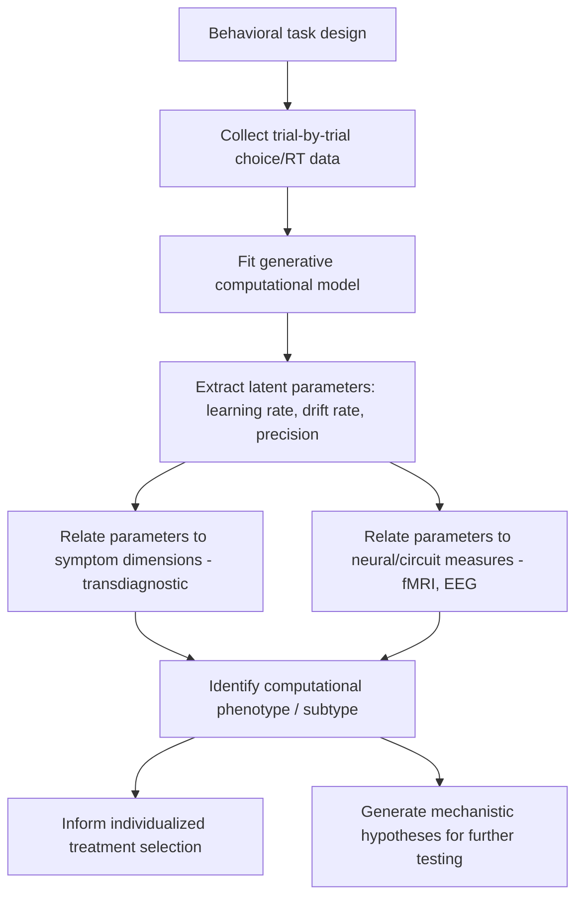

## Computational Psychiatry Approaches

### Overview

Computational psychiatry is an emerging interdisciplinary field that applies formal mathematical and computational models—drawn from machine learning, reinforcement learning, Bayesian inference, and dynamical systems theory—to understand the mechanisms underlying psychiatric symptoms, improve diagnostic classification, and inform treatment selection. Rather than relying solely on descriptive symptom clusters (as in traditional DSM/ICD nosology), computational psychiatry aims to formalize the latent cognitive and neural processes that generate observable behavior, bridging levels of explanation from molecules to circuits to symptoms.

**Key Points**

- The field is often organized around two complementary approaches: **theory-driven (generative) modeling**, which formalizes hypothesized cognitive/neural mechanisms, and **data-driven modeling**, which uses machine learning to identify patterns in large, high-dimensional datasets without strong prior mechanistic assumptions
- A central motivation is addressing the limitations of purely symptom-based psychiatric classification, which shows poor biological specificity, high comorbidity rates, and substantial within-diagnosis heterogeneity
- Computational psychiatry seeks to identify **latent variables**—not directly observable but inferable from behavior—that may correspond more closely to underlying neurobiological dysfunction than surface-level symptoms do

---

### Theory-Driven (Generative) Modeling Approaches

#### Reinforcement Learning Models

- Reinforcement learning (RL) models formalize how organisms learn to select actions that maximize reward and minimize punishment through iterative trial-and-error experience
- Core RL constructs—including reward prediction error, learning rate, and value estimation—are used to model dysfunction in disorders such as depression, addiction, and schizophrenia
- In **model-free RL**, values of actions/states are learned incrementally through direct experience of outcomes; in **model-based RL**, an internal model of the environment's structure is used to plan and simulate outcomes prospectively

$$Q(s,a) \leftarrow Q(s,a) + \alpha \left[ r + \gamma \max_{a'} Q(s',a') - Q(s,a) \right]$$

Where $Q(s,a)$ is the estimated value of taking action $a$ in state $s$, $\alpha$ is the learning rate, $r$ is the received reward, and $\gamma$ is the discount factor.

**Example**

Reduced model-based (relative to model-free) control has been reported in individuals with higher compulsivity trait scores, including those with obsessive-compulsive disorder and substance use disorders, using sequential two-step decision tasks—suggesting an overreliance on habitual, stimulus-driven action selection at the expense of flexible, goal-directed planning.

- Depression has been associated with reduced sensitivity to reward prediction errors and blunted learning rates following reward, consistent with anhedonia and reduced reward-driven behavioral engagement [Inference: findings vary across specific task paradigms and depression subtypes]

#### Bayesian and Predictive Coding Models

- Bayesian models formalize perception and belief updating as a process of combining **prior expectations** with incoming sensory evidence, weighted by their relative precision (inverse variance/reliability)
- **Predictive coding** frameworks propose that the brain continuously generates top-down predictions about sensory input and computes prediction errors when predictions and evidence mismatch, updating internal models accordingly
- Psychotic symptoms (hallucinations, delusions) have been modeled as arising from aberrant precision-weighting: assigning excessive precision (confidence) to prior beliefs relative to sensory evidence, or conversely, to noisy sensory prediction errors being misattributed excessive significance
- Autism spectrum conditions have been modeled, in some frameworks, as involving atypically high precision-weighting of sensory prediction errors relative to priors, though this remains a debated and actively studied hypothesis [Unverified: competing computational accounts of autism exist and are not fully reconciled]

$$\hat{s} = \frac{\pi_{\text{prior}} \cdot \mu_{\text{prior}} + \pi_{\text{sensory}} \cdot s}{\pi_{\text{prior}} + \pi_{\text{sensory}}}$$

Where $\hat{s}$ is the resulting percept/belief, $\mu_{\text{prior}}$ is the prior belief, $s$ is sensory evidence, and $\pi$ denotes precision (confidence weighting) of each source.

#### Active Inference

- Active inference extends predictive coding to action selection, proposing that organisms act to minimize expected **free energy**—a bound on surprise—by either updating internal beliefs to match sensory evidence or acting on the world to make sensory evidence match beliefs
- This framework has been applied to model motivational and volitional deficits, including negative symptoms in schizophrenia (reduced action toward goals due to imprecise beliefs about action-outcome contingencies)

#### Drift Diffusion and Evidence Accumulation Models

- Drift diffusion models (DDMs) formalize decision-making as a noisy accumulation of evidence toward a response threshold, decomposing reaction time and accuracy data into interpretable parameters: drift rate (evidence accumulation speed), decision threshold (response caution), and non-decision time
- Altered decision thresholds and drift rates have been reported across anxiety disorders (heightened caution/threshold) and impulsivity-related conditions (reduced threshold), offering a mechanistic decomposition of behavior beyond simple accuracy/reaction-time comparisons

---

### Data-Driven Modeling Approaches

#### Machine Learning Classification

- Supervised machine learning algorithms (support vector machines, random forests, gradient boosting, deep neural networks) are applied to neuroimaging, genetic, and clinical data to classify diagnostic status or predict treatment outcome
- Multivariate pattern analysis (MVPA) applied to fMRI data attempts to identify distributed neural patterns that discriminate between diagnostic groups or predict symptom severity, offering greater sensitivity than univariate region-of-interest approaches in many cases
- **Key limitation**: Classification accuracy reported in original discovery samples frequently does not replicate in independent validation cohorts, reflecting overfitting, small sample sizes relative to feature dimensionality, and site/scanner-related variability [Unverified: reported "biomarker" accuracy figures in the literature should be interpreted cautiously pending large-scale replication]

#### Normative Modeling

- Normative modeling constructs population-level reference trajectories (e.g., of brain structure across age) analogous to pediatric growth charts, allowing individual patients to be characterized by their deviation from the expected normative range rather than by group-average case-control comparisons
- This approach directly addresses within-diagnosis heterogeneity by capturing individual-level deviation patterns rather than assuming uniform group-level effects

#### Data-Driven Symptom Dimensionality (RDoC-Aligned Approaches)

- Data-driven clustering and dimensionality-reduction techniques (e.g., factor analysis, canonical correlation analysis) are used to identify transdiagnostic symptom dimensions that cut across traditional diagnostic boundaries, aligning with frameworks such as the NIMH **Research Domain Criteria (RDoC)**
- RDoC organizes psychopathology along dimensional constructs (e.g., negative valence systems, positive valence systems, cognitive systems) spanning multiple units of analysis from genes to circuits to behavior, explicitly intended as a research framework rather than a clinical diagnostic replacement

---

### Key Computational Constructs Applied Across Disorders

| Construct | Model Origin | Clinical Application |
| --- | --- | --- |
| Reward prediction error | Reinforcement learning | Depression, addiction, schizophrenia |
| Model-based vs. model-free control | Reinforcement learning | OCD, compulsivity, addiction |
| Precision-weighting of priors | Bayesian/predictive coding | Psychosis, autism |
| Expected free energy | Active inference | Negative symptoms, avolition |
| Drift rate / decision threshold | Drift diffusion models | Anxiety, impulsivity, ADHD |
| Temporal discounting rate | Behavioral economics | Addiction, impulsivity |

---

### Computational Phenotyping Workflow

---

### Model Fitting and Validation Pipeline Diagram

<svg xmlns="http://www.w3.org/2000/svg" viewBox="0 0 740 380">
<title>Computational Model Fitting and Validation Pipeline (svg_diagram)</title>
<rect x="0" y="0" width="740" height="380" fill="#ffffff" />
<text x="370" y="25" font-size="15" font-weight="bold" text-anchor="middle" fill="#1a1a1a">Computational Model Fitting and Validation Pipeline (svg_diagram)</text>
<rect x="30" y="60" width="150" height="55" rx="8" fill="#dbeafe" stroke="#2563eb" stroke-width="1.5" />
<text x="105" y="83" font-size="11" text-anchor="middle" fill="#1e3a8a">Raw Behavioral</text>
<text x="105" y="99" font-size="11" text-anchor="middle" fill="#1e3a8a">Data (choices, RTs)</text>
<rect x="220" y="60" width="150" height="55" rx="8" fill="#fef3c7" stroke="#d97706" stroke-width="1.5" />
<text x="295" y="83" font-size="11" text-anchor="middle" fill="#78350f">Candidate Models</text>
<text x="295" y="99" font-size="11" text-anchor="middle" fill="#78350f">(RL, DDM, Bayesian)</text>
<rect x="410" y="60" width="150" height="55" rx="8" fill="#dcfce7" stroke="#16a34a" stroke-width="1.5" />
<text x="485" y="83" font-size="11" text-anchor="middle" fill="#14532d">Parameter Estimation</text>
<text x="485" y="99" font-size="11" text-anchor="middle" fill="#14532d">(MLE / Hierarchical Bayes)</text>
<rect x="600" y="60" width="120" height="55" rx="8" fill="#ede9fe" stroke="#7c3aed" stroke-width="1.5" />
<text x="660" y="83" font-size="11" text-anchor="middle" fill="#4c1d95">Model Comparison</text>
<text x="660" y="99" font-size="10" text-anchor="middle" fill="#4c1d95">(AIC / BIC / WAIC)</text>
<rect x="220" y="180" width="150" height="55" rx="8" fill="#fee2e2" stroke="#dc2626" stroke-width="1.5" />
<text x="295" y="203" font-size="11" text-anchor="middle" fill="#7f1d1d">Posterior Predictive</text>
<text x="295" y="219" font-size="11" text-anchor="middle" fill="#7f1d1d">Check</text>
<rect x="410" y="180" width="150" height="55" rx="8" fill="#dbeafe" stroke="#2563eb" stroke-width="1.5" />
<text x="485" y="203" font-size="11" text-anchor="middle" fill="#1e3a8a">Out-of-Sample</text>
<text x="485" y="219" font-size="11" text-anchor="middle" fill="#1e3a8a">Validation</text>
<rect x="220" y="290" width="340" height="55" rx="8" fill="#f3f4f6" stroke="#4b5563" stroke-width="1.5" />
<text x="390" y="313" font-size="11" text-anchor="middle" fill="#1f2937">Clinically Interpretable Parameter</text>
<text x="390" y="329" font-size="11" text-anchor="middle" fill="#1f2937">(e.g., learning rate deficit) reported</text>
<path d="M180 87 L215 87" stroke="#374151" stroke-width="2" marker-end="url(#a3)" />
<path d="M370 87 L405 87" stroke="#374151" stroke-width="2" marker-end="url(#a3)" />
<path d="M560 87 L595 87" stroke="#374151" stroke-width="2" marker-end="url(#a3)" />
<path d="M485 115 L485 175" stroke="#374151" stroke-width="2" marker-end="url(#a3)" />
<path d="M410 207 L375 207" stroke="#374151" stroke-width="2" marker-end="url(#a3)" />
<path d="M390 235 L390 285" stroke="#374151" stroke-width="2" marker-end="url(#a3)" />
</svg>

---

### Methodological Considerations and Limitations

**Key Points**

- **Model identifiability**: Different generative models can sometimes produce similar behavioral predictions, making it statistically difficult to definitively distinguish between competing mechanistic accounts from behavioral data alone; parameter recovery simulations are used to assess whether a model's parameters can be reliably estimated given realistic data
- **Hierarchical Bayesian estimation** is increasingly preferred over simple maximum-likelihood fitting, as it pools information across participants to produce more stable individual-level parameter estimates, particularly valuable with limited trials per subject
- Test-retest reliability of computational parameters derived from laboratory tasks has been reported as modest in several studies, raising concerns about their readiness as individual-level clinical biomarkers [Unverified: reliability estimates vary substantially by task and parameter type, and this is an active area of methodological scrutiny]
- Translating group-level computational findings into individually actionable clinical tools ("computational biomarkers") remains substantially aspirational at present; most applications remain at the research/mechanistic-hypothesis stage rather than validated clinical deployment [Inference]

---

### Clinical-Translational Applications

**Example**

A patient with treatment-resistant depression completes a probabilistic reward learning task. Computational modeling reveals a selectively reduced learning rate following positive feedback (relative to negative feedback), distinguishing this patient's underlying reward-learning deficit from an alternative patient showing globally blunted prediction error signaling—illustrating how computational phenotyping can, in principle, reveal distinct mechanistic subtypes within the same diagnostic label.

- Computational psychiatry approaches are being explored to predict differential treatment response (e.g., predicting which patients will respond preferentially to cognitive-behavioral therapy versus pharmacotherapy based on baseline computational task performance)
- Closed-loop and adaptive experimental designs increasingly use real-time computational modeling to adjust task difficulty or stimulus timing based on an individual's estimated latent parameters during data collection
- The field maintains strong connections to **precision psychiatry**, which aims to move beyond one-size-fits-all treatment toward mechanistically informed, individualized intervention selection

---

### Related Topics

- Reinforcement learning theory and dopaminergic reward prediction error coding
- Active inference and the free energy principle (Friston framework)
- Drift diffusion modeling and evidence accumulation in decision-making
- Research Domain Criteria (RDoC) framework and dimensional psychopathology
- Hierarchical Bayesian modeling and parameter estimation methods
- Normative modeling and individual deviation-based neuroimaging analysis
- Precision psychiatry and biomarker-guided treatment selection
- Machine learning replicability and overfitting in neuroimaging research
- Two-step task paradigms and model-based/model-free control assessment
- Transdiagnostic approaches to psychiatric classification