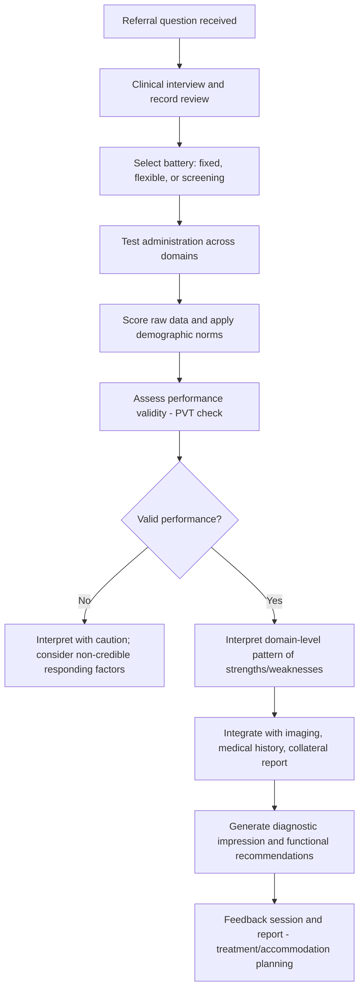

## Neuropsychological Assessment Methods

### Overview

Neuropsychological assessment is the systematic use of standardized behavioral tests to measure cognitive, emotional, and functional abilities, enabling inference about the integrity of specific brain systems. It bridges clinical neuroscience and applied practice, serving diagnostic, localization, treatment-planning, and outcome-monitoring purposes across neurological, psychiatric, and developmental populations.

**Key Points**

- Assessment relies on the principle that specific cognitive domains map, at least partially, onto identifiable neural systems, allowing patterns of performance to inform hypotheses about underlying brain dysfunction
- A comprehensive battery typically samples multiple domains: attention, memory, language, visuospatial function, executive function, processing speed, and motor function
- Test scores are interpreted relative to normative data (age-, education-, and often demographically-adjusted), not against an absolute standard, since cognitive performance varies substantially across the healthy population

---

### Psychometric Foundations

#### Reliability and Validity

- **Test-retest reliability** reflects the consistency of scores across repeated administrations and is essential for tracking change over time (e.g., disease progression, treatment response, recovery)
- **Construct validity** refers to the degree to which a test actually measures the cognitive construct it purports to measure, established through convergent (correlation with related measures) and discriminant (lack of correlation with unrelated measures) validation
- **Ecological validity** refers to how well test performance predicts real-world functional outcomes (occupational functioning, independent living, driving safety)—a domain where traditional office-based testing has documented limitations [Inference: the gap between laboratory task performance and real-world function is a persistent, only partially resolved methodological challenge]

#### Normative Comparison Standards

- Raw scores are converted to standardized scores (e.g., z-scores, scaled scores, T-scores) using demographically stratified normative samples
- **Demographic corrections** for age, education, and sometimes sex/gender are applied because these variables systematically influence performance independent of pathology
- Use of population-specific norms (matched for culture, language, and educational background) is critical for valid interpretation; applying norms derived from a mismatched population risks systematic over- or under-estimation of impairment [Unverified: the degree of bias introduced by norm mismatch varies by test and population, and continues to be studied and addressed via ongoing norm development]

$$z = \frac{X - \mu}{\sigma}$$

Where $X$ is the individual's raw score, $\mu$ is the normative sample mean, and $\sigma$ is the normative sample standard deviation.

---

### Domains of Assessment

#### Attention and Processing Speed

| Test | Domain Measured | Key Feature |
| --- | --- | --- |
| Trail Making Test (Parts A & B) | Processing speed, set-shifting | Part B adds executive/switching demand |
| Digit Span (WAIS-based) | Auditory attention, working memory | Forward span vs. backward/sequencing span dissociate simple attention from manipulation |
| Symbol Digit Modalities Test | Processing speed | Sensitive to diffuse/subcortical dysfunction |
| Continuous Performance Tests (CPT) | Sustained attention, vigilance | Used heavily in ADHD assessment |

#### Memory

- **Verbal learning tests** (e.g., California Verbal Learning Test, Rey Auditory Verbal Learning Test) assess encoding, immediate recall, learning curve across trials, delayed recall, and recognition, allowing dissociation between encoding versus retrieval versus storage/consolidation deficits
- **Visual/nonverbal memory tests** (e.g., Rey-Osterrieth Complex Figure) assess visuospatial memory and can dissociate from verbal memory performance, informing lateralization (left hemisphere/verbal versus right hemisphere/visuospatial memory systems)
- A **learning curve** that is flat across trials with disproportionately impaired delayed recall relative to immediate recall is classically associated with hippocampal/medial temporal lobe dysfunction (e.g., early Alzheimer's disease), whereas impaired encoding with better-preserved recognition-versus-free-recall performance is more suggestive of frontal-subcortical retrieval dysfunction

**Example**

A patient shows normal immediate recall on a word list task but a marked drop-off after a 30-minute delay, with recognition performance also impaired (cannot correctly identify studied words from distractors)—a pattern consistent with a genuine consolidation/storage deficit localizing to medial temporal lobe structures, as opposed to a retrieval-based deficit, where delayed recognition would typically remain relatively preserved.

#### Language

- Assessment spans confrontation naming (e.g., Boston Naming Test), verbal fluency (phonemic/letter fluency and semantic/category fluency), comprehension, and repetition
- **Category fluency deficits disproportionate to letter fluency deficits** are classically associated with semantic/temporal lobe dysfunction (e.g., Alzheimer's disease), whereas **letter fluency deficits disproportionate to category fluency** are more associated with frontal-executive dysfunction
- Formal aphasia batteries (e.g., Boston Diagnostic Aphasia Examination) are used to characterize aphasia subtypes following focal lesions (stroke, tumor) by profiling fluency, comprehension, repetition, and naming

#### Visuospatial Function

- Tests include figure copying (Rey-Osterrieth Complex Figure copy trial), clock drawing, and judgment of line orientation
- Visuospatial deficits, particularly with left-sided neglect on cancellation or drawing tasks, are classically associated with right parietal lobe dysfunction

#### Executive Function

- Executive function is a multidimensional construct encompassing set-shifting/cognitive flexibility, inhibitory control, working memory manipulation, planning, and abstract reasoning
- **Wisconsin Card Sorting Test**: assesses set-shifting and the ability to use feedback to change response strategy; perseverative errors are a classic marker of prefrontal (particularly dorsolateral) dysfunction
- **Stroop Test**: assesses inhibitory control via interference resolution between automatic (word reading) and controlled (color naming) processing
- **Verbal fluency (letter/phonemic)**: recruits frontal-executive strategic search processes in addition to language systems

#### Motor and Sensorimotor Function

- Grip strength (dynamometry), finger tapping speed, and grooved pegboard tests assess fine and gross motor function, useful for lateralizing dysfunction and detecting subtle motor slowing in conditions such as Parkinson's disease

---

### Performance Validity and Symptom Validity Testing

**Key Points**

- **Performance validity tests (PVTs)** are embedded or standalone measures designed to detect insufficient effort or non-credible performance, which can invalidate an entire assessment if undetected (particularly relevant in forensic/disability evaluation contexts)
- PVTs often use forced-choice recognition paradigms designed to appear more difficult than they actually are, such that even individuals with genuine severe memory impairment typically perform above chance, making below-chance or implausibly poor performance suggestive of non-credible responding
- Failure on PVTs does not necessarily indicate deliberate malingering—it can also reflect somatic symptom amplification, psychiatric distress, or other non-volitional factors—and results must be interpreted within the broader clinical context rather than treated as a definitive diagnosis of dishonesty [Inference]

---

### Assessment Approaches: Fixed Battery vs. Flexible/Hypothesis-Driven

| Approach | Description | Example |
| --- | --- | --- |
| Fixed (standardized) battery | Comprehensive, identical battery administered to all patients | Halstead-Reitan Neuropsychological Battery |
| Flexible/hypothesis-driven battery | Tests selected based on referral question and preliminary findings, adapted during evaluation | Boston Process Approach |
| Screening batteries | Brief, broad-domain instruments for rapid triage | Montreal Cognitive Assessment (MoCA), Mini-Mental State Examination (MMSE) |

- Fixed batteries offer standardization and psychometric rigor but can be time-inefficient and insensitive to individual referral questions
- Flexible batteries allow efficient, targeted hypothesis testing but require greater clinical expertise and introduce potential examiner-dependent variability
- Brief screening instruments (MoCA, MMSE) are useful for rapid dementia screening but lack the sensitivity and domain specificity of comprehensive batteries, and are prone to ceiling effects in high-functioning individuals [Unverified: sensitivity/specificity figures for screening tools vary across studies and populations, and cutoff scores require careful contextual interpretation]

---

### Assessment Workflow

---

### Domain-Lesion Correlation Diagram

<svg xmlns="http://www.w3.org/2000/svg" viewBox="0 0 740 420">
<title>Cognitive Domain to Neuroanatomical Correlation Overview (svg_diagram)</title>
<rect x="0" y="0" width="740" height="420" fill="#ffffff" />
<text x="370" y="25" font-size="15" font-weight="bold" text-anchor="middle" fill="#1a1a1a">Cognitive Domain to Neuroanatomical Correlation (svg_diagram)</text>
<rect x="30" y="60" width="180" height="65" rx="8" fill="#dbeafe" stroke="#2563eb" stroke-width="1.5" />
<text x="120" y="85" font-size="12" text-anchor="middle" fill="#1e3a8a">Executive Function</text>
<text x="120" y="102" font-size="10" text-anchor="middle" fill="#1e3a8a">Set-shifting, inhibition</text>
<text x="120" y="117" font-size="10" font-weight="bold" text-anchor="middle" fill="#1e3a8a">Prefrontal Cortex</text>
<rect x="280" y="60" width="180" height="65" rx="8" fill="#fee2e2" stroke="#dc2626" stroke-width="1.5" />
<text x="370" y="85" font-size="12" text-anchor="middle" fill="#7f1d1d">Declarative Memory</text>
<text x="370" y="102" font-size="10" text-anchor="middle" fill="#7f1d1d">Encoding, consolidation</text>
<text x="370" y="117" font-size="10" font-weight="bold" text-anchor="middle" fill="#7f1d1d">Medial Temporal Lobe</text>
<rect x="530" y="60" width="180" height="65" rx="8" fill="#dcfce7" stroke="#16a34a" stroke-width="1.5" />
<text x="620" y="85" font-size="12" text-anchor="middle" fill="#14532d">Visuospatial Function</text>
<text x="620" y="102" font-size="10" text-anchor="middle" fill="#14532d">Neglect, construction</text>
<text x="620" y="117" font-size="10" font-weight="bold" text-anchor="middle" fill="#14532d">Parietal Cortex (R &gt; L)</text>
<rect x="30" y="180" width="180" height="65" rx="8" fill="#fef3c7" stroke="#d97706" stroke-width="1.5" />
<text x="120" y="205" font-size="12" text-anchor="middle" fill="#78350f">Language</text>
<text x="120" y="222" font-size="10" text-anchor="middle" fill="#78350f">Naming, fluency, comprehension</text>
<text x="120" y="237" font-size="10" font-weight="bold" text-anchor="middle" fill="#78350f">Perisylvian L Hemisphere</text>
<rect x="280" y="180" width="180" height="65" rx="8" fill="#ede9fe" stroke="#7c3aed" stroke-width="1.5" />
<text x="370" y="205" font-size="12" text-anchor="middle" fill="#4c1d95">Processing Speed</text>
<text x="370" y="222" font-size="10" text-anchor="middle" fill="#4c1d95">Diffuse/subcortical sensitivity</text>
<text x="370" y="237" font-size="10" font-weight="bold" text-anchor="middle" fill="#4c1d95">White Matter Tracts</text>
<rect x="530" y="180" width="180" height="65" rx="8" fill="#f3f4f6" stroke="#4b5563" stroke-width="1.5" />
<text x="620" y="205" font-size="12" text-anchor="middle" fill="#1f2937">Motor Function</text>
<text x="620" y="222" font-size="10" text-anchor="middle" fill="#1f2937">Speed, coordination</text>
<text x="620" y="237" font-size="10" font-weight="bold" text-anchor="middle" fill="#1f2937">Primary Motor Cortex / BG</text>

<text x="370" y="300" font-size="11" text-anchor="middle" fill="`#4b5563`">Note: mapping reflects probabilistic association, not strict one-to-one localization</text>

<text x="370" y="320" font-size="11" text-anchor="middle" fill="`#4b5563`">Most tasks recruit distributed, overlapping networks rather than single regions</text>

</svg>

---

### Clinical-Translational Correlates

**Example**

A 68-year-old patient referred for memory concerns completes comprehensive testing showing intact attention and processing speed, preserved letter fluency, but significantly impaired delayed verbal recall with poor recognition discrimination and disproportionate category (versus letter) fluency deficits. This domain-specific pattern—sparing frontal-executive markers while showing hippocampal/temporal-type memory and semantic impairment—supports a clinical impression consistent with amnestic mild cognitive impairment of the Alzheimer's type, informing subsequent biomarker workup and monitoring recommendations, though neuropsychological pattern alone is not diagnostic and is integrated with imaging and fluid biomarkers.

- Serial neuropsychological assessment (repeat testing over time) is used to distinguish genuine cognitive decline from normal aging, requiring statistical methods (e.g., reliable change indices) to account for practice effects and measurement error when interpreting change scores
- Neuropsychological profiles inform differential diagnosis among dementia subtypes (e.g., Alzheimer's disease versus frontotemporal dementia versus dementia with Lewy bodies), each showing characteristic, though overlapping, domain-specific patterns
- Results directly inform functional recommendations: capacity determinations, return-to-work/return-to-driving decisions, and educational/occupational accommodations

---

### Related Topics

- Dementia subtype differential diagnosis via cognitive profile
- Reliable change index and statistical methods for serial testing
- Performance validity testing and forensic neuropsychology
- Aphasia classification and the Boston Diagnostic Aphasia Examination
- Executive function models (unity/diversity framework, Miyake model)
- Cross-cultural and multilingual neuropsychological norm development
- Ecological validity and real-world functional assessment
- Pediatric neuropsychological assessment and developmental norms
- Traumatic brain injury assessment and recovery trajectory monitoring
- Biomarker integration with cognitive testing in Alzheimer's disease diagnosis