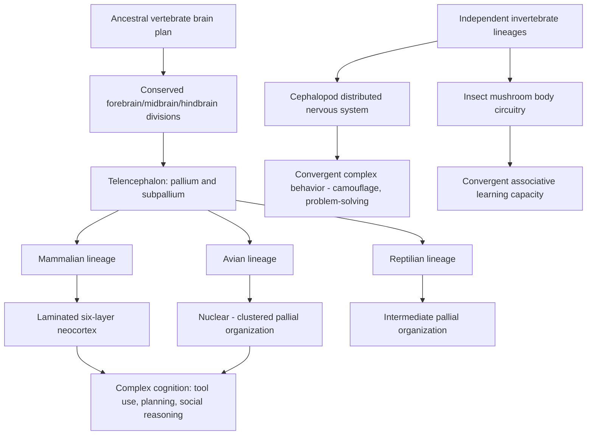

## Comparative Neuroanatomy Across Species

### Overview

Comparative neuroanatomy examines the structural organization of nervous systems across taxa to identify shared (homologous), independently evolved (convergent/analogous), and lineage-specific neural features. This field provides the anatomical foundation for evolutionary cognitive neuroscience, revealing how conserved developmental programs and selective pressures have shaped brain organization to support cognition, sensory processing, and behavior across the animal kingdom.

**Key Points**

- **Homology** refers to similarity due to shared common ancestry (e.g., the vertebrate pallium across all vertebrate classes), whereas **analogy/convergence** refers to independently evolved similarity due to shared functional demands (e.g., complex forebrain circuitry in birds and mammals)
- Brain evolution proceeds largely through modification of existing developmental plans (descent with modification) rather than wholesale invention of novel structures, though genuinely novel elaborations (e.g., mammalian neocortical lamination) do occur
- Encephalization—brain size relative to body size—varies dramatically across taxa and is only one of several relevant comparative metrics, alongside neuron number, neuron density, and connectivity patterns

---

### The Vertebrate Brain Bauplan

All vertebrate brains share a fundamentally conserved developmental organization, established early in the field of comparative neuroanatomy and confirmed by modern molecular/genetic evidence.

#### Conserved Regional Divisions

- The vertebrate neural tube differentiates into a conserved sequence of divisions along the rostrocaudal axis: **forebrain (prosencephalon)**, **midbrain (mesencephalon)**, and **hindbrain (rhombencephalon)**
- The forebrain further subdivides into **telencephalon** (cerebral hemispheres, including the pallium and subpallium) and **diencephalon** (thalamus, hypothalamus, epithalamus)
- This basic regional plan, along with the conserved expression patterns of key developmental transcription factors (e.g., *Otx2*, *Fgf8*, *Shh* signaling centers), is shared across all vertebrates, providing strong molecular evidence for deep homology of the vertebrate brain's basic organization

#### The Pallium: A Case Study in Homology and Divergence

- The **pallium** (dorsal telencephalon) is present across all vertebrates but has diversified dramatically in its cytoarchitecture across lineages
- In mammals, the pallium gives rise to the **six-layered neocortex**, a laminar structure organized into radial columns with characteristic layer-specific connectivity
- In birds, the pallium develops into **nuclear** (clustered, non-layered) structures, historically underappreciated but now understood to support complex, cortex-comparable computations despite the absence of cortical lamination
- In reptiles, the pallium shows an intermediate organization, and comparative developmental studies have been influential in reconstructing the likely organization of the ancestral amniote pallium from which both mammalian cortex and avian pallium independently elaborated

**Example**

Corvids (crows, ravens) and great apes show comparable performance on tests of tool use, causal reasoning, and self-control despite corvids possessing a nuclear (non-laminated) pallium entirely lacking a neocortex—illustrating that complex cognition can arise from convergent circuit-level solutions rather than requiring a specific laminar architecture.

---

### Neuron Number, Density, and Scaling

#### Allometric Scaling Principles

- Brain mass generally scales with body mass across vertebrates following a power-law relationship, but this relationship (encephalization) alone poorly predicts cognitive capacity across widely divergent taxa
- Comparative work using the isotropic fractionator method has demonstrated that **absolute neuron number**, particularly in the pallium/cortex, correlates more directly with several cognitive metrics than brain mass or encephalization quotient alone
- Primates show a notably different neuronal scaling rule compared to rodents: primate cortical neuron density remains relatively stable as cortical volume increases, allowing primates to pack substantially more neurons into a given cortical volume than rodents achieve at equivalent brain sizes, contributing to humans possessing a very high absolute cortical neuron count despite not having the largest brain in absolute terms

| Species | Approximate Total Brain Neurons | Approximate Cortical/Pallial Neurons |
| --- | --- | --- |
| Human | ~86 billion | ~16 billion |
| African elephant | ~257 billion | ~5.6 billion (most concentrated in cerebellum) |
| Long-finned pilot whale | ~37 billion (cerebral cortex) | High cortical neuron count |
| Mouse | ~71 million | ~14 million |

- The elephant example is instructive: despite having roughly three times as many total brain neurons as humans, the overwhelming majority of elephant neurons are located in the cerebellum rather than the cerebral cortex, illustrating why total brain neuron count alone is an incomplete comparative metric for cognitive capacity [Inference: precise causal links between neuron distribution and specific cognitive capacities remain an active area of comparative research]

---

### Cerebellum: Numerical Dominance and Function

- The cerebellum, despite its comparatively small volume relative to the cerebral cortex, contains the majority of neurons in most vertebrate brains studied to date, owing to the extremely high density of small granule cells
- Traditionally associated primarily with motor coordination, accumulating comparative and human neuroimaging evidence implicates cerebellar circuits in cognitive and affective processing via loops with prefrontal and association cortices, suggesting a broader computational role than classically assumed [Unverified: the precise nature and extent of cerebellar contribution to higher cognition across species remains an evolving research area]

---

### Invertebrate Nervous Systems: Alternative Solutions

Invertebrate nervous systems illustrate that complex behavior does not require vertebrate-style centralized brain architecture, offering informative points of both convergence and contrast.

#### Cephalopod Nervous Systems

- Cephalopods (particularly octopuses) possess the largest and most complex nervous systems among invertebrates, with a notably distributed architecture: a substantial proportion of total neurons reside in the arms themselves rather than the central brain, enabling a degree of semi-autonomous local processing and control
- Cephalopod neural complexity evolved entirely independently from vertebrate lineages (last common ancestor predates centralized nervous system evolution in either lineage), making cephalopod cognitive sophistication—including tool use, problem-solving, and camouflage-related visual processing—a striking case of convergent evolution of complex cognition via a fundamentally different neuroanatomical substrate

#### Insect Nervous Systems

- Insect brains, though orders of magnitude smaller in absolute neuron number than vertebrate brains, support surprisingly sophisticated behaviors including navigation, learning, and social communication
- The **mushroom bodies** in insect brains are a well-characterized structure implicated in associative learning and memory, functionally (though not developmentally) analogous in role to aspects of vertebrate hippocampal/associative learning function
- Honeybee mushroom body circuitry has become an influential model system for studying the cellular and circuit basis of associative learning at a tractable scale

---

### Convergent Evolution of Complex Cognition

**Key Points**

- Birds (particularly corvids and parrots) and primates represent one of the best-documented cases of convergent cognitive evolution: comparable performance on causal reasoning, planning, and social cognition tasks despite highly divergent pallial architecture and a last common ancestor (stem amniote) predating the divergence of the mammalian and avian lineages by roughly 300 million years
- This convergence suggests that certain computational principles supporting complex cognition (e.g., high neuron density in associative regions, specific connectivity motifs) may be achievable through multiple distinct anatomical implementations, rather than requiring one specific structural solution (such as a laminated neocortex)
- Comparative studies of avian pallial circuitry have identified connectivity patterns with functional parallels to mammalian cortical microcircuits, despite the absence of cortical lamination, supporting a "canonical circuit" convergence hypothesis at the level of connectivity motifs rather than gross anatomy [Inference: the degree of true circuit-level equivalence versus superficial functional analogy remains debated]

---

### Comparative Neuroanatomy Overview Diagram

---

### Vertebrate Brain Regional Homology Diagram

<svg xmlns="http://www.w3.org/2000/svg" viewBox="0 0 760 400">
<title>Conserved Vertebrate Forebrain Divisions and Lineage Divergence (svg_diagram)</title>
<rect x="0" y="0" width="760" height="400" fill="#ffffff" />
<text x="380" y="25" font-size="15" font-weight="bold" text-anchor="middle" fill="#1a1a1a">Conserved Vertebrate Forebrain Divisions and Divergence (svg_diagram)</text>
<rect x="290" y="55" width="180" height="55" rx="8" fill="#f3f4f6" stroke="#4b5563" stroke-width="1.5" />
<text x="380" y="78" font-size="12" text-anchor="middle" fill="#1f2937">Ancestral Amniote</text>
<text x="380" y="95" font-size="10" text-anchor="middle" fill="#1f2937">Pallium (telencephalon)</text>
<rect x="60" y="160" width="180" height="70" rx="8" fill="#dbeafe" stroke="#2563eb" stroke-width="1.5" />
<text x="150" y="183" font-size="12" text-anchor="middle" fill="#1e3a8a">Mammalian Lineage</text>
<text x="150" y="200" font-size="10" text-anchor="middle" fill="#1e3a8a">Laminated neocortex</text>
<text x="150" y="216" font-size="10" text-anchor="middle" fill="#1e3a8a">6-layer columnar organization</text>
<rect x="290" y="160" width="180" height="70" rx="8" fill="#fef3c7" stroke="#d97706" stroke-width="1.5" />
<text x="380" y="183" font-size="12" text-anchor="middle" fill="#78350f">Reptilian Lineage</text>
<text x="380" y="200" font-size="10" text-anchor="middle" fill="#78350f">Intermediate organization</text>
<text x="380" y="216" font-size="10" text-anchor="middle" fill="#78350f">3-layer cortical regions</text>
<rect x="520" y="160" width="180" height="70" rx="8" fill="#dcfce7" stroke="#16a34a" stroke-width="1.5" />
<text x="610" y="183" font-size="12" text-anchor="middle" fill="#14532d">Avian Lineage</text>
<text x="610" y="200" font-size="10" text-anchor="middle" fill="#14532d">Nuclear pallium</text>
<text x="610" y="216" font-size="10" text-anchor="middle" fill="#14532d">Non-laminated clusters</text>
<rect x="150" y="290" width="440" height="60" rx="8" fill="#ede9fe" stroke="#7c3aed" stroke-width="1.5" />
<text x="370" y="315" font-size="12" text-anchor="middle" fill="#4c1d95">Convergent complex cognition in mammals and birds</text>
<text x="370" y="332" font-size="10" text-anchor="middle" fill="#4c1d95">despite ~300 million years of independent pallial evolution</text>
<path d="M340 110 Q200 130 150 155" stroke="#374151" stroke-width="2" fill="none" marker-end="url(#a4)" />
<path d="M380 110 L380 155" stroke="#374151" stroke-width="2" marker-end="url(#a4)" />
<path d="M420 110 Q560 130 610 155" stroke="#374151" stroke-width="2" fill="none" marker-end="url(#a4)" />
<path d="M150 230 Q200 260 300 285" stroke="#374151" stroke-width="2" fill="none" marker-end="url(#a4)" />
<path d="M610 230 Q550 260 450 285" stroke="#374151" stroke-width="2" fill="none" marker-end="url(#a4)" />
</svg>

---

### Methodological Approaches in Comparative Neuroanatomy

**Key Points**

- **Isotropic fractionator method**: a histological technique for directly quantifying total neuron number in a brain region by dissolving tissue into a homogeneous nuclear suspension and counting neuronal nuclei, enabling accurate cross-species neuron count comparisons without relying on stereological extrapolation
- **Comparative tract-tracing**: injection of anterograde/retrograde tracers to map homologous connectivity patterns across species, foundational for establishing circuit-level homology claims
- **Molecular/developmental gene expression mapping**: use of conserved transcription factor expression domains (e.g., *Pax6*, *Emx1*, *Dlx* genes) to establish developmental homology between regions that may appear anatomically dissimilar in adults
- Modern comparative neuroanatomy increasingly integrates connectomics, single-cell transcriptomics, and cross-species imaging to move beyond gross anatomical comparison toward cellular and molecular-level homology assessment

---

### Clinical-Translational Correlates

**Example**

Rodent models remain the dominant preclinical system for neuropsychiatric drug development, yet the absence of a granular prefrontal layer 4 and substantially lower prefrontal neuron density compared to primates constrains the direct translational validity of rodent prefrontal-dependent cognitive findings to human executive function—a key consideration driving increased use of non-human primate models for translational research on complex cognitive and psychiatric constructs.

- Comparative neuroanatomy directly informs the selection and interpretation of animal models in translational neuroscience, since structural homology (or its absence) affects how confidently findings generalize across species
- Non-human primate models are often prioritized for studying prefrontal-dependent executive function and social cognition given closer homology to human prefrontal cortical organization, while rodent models remain valuable for genetically tractable, high-throughput circuit-level mechanistic work

---

### Related Topics

- Neocortical evolution and the origin of cortical lamination
- Avian pallium reorganization and the 2004 avian brain nomenclature revision
- Isotropic fractionator methodology and quantitative neuron counting
- Cephalopod neurobiology and distributed nervous system control
- Encephalization quotient and its limitations as a cognitive proxy
- Corvid and parrot cognition research (tool use, planning, theory of mind)
- Comparative connectomics and cross-species circuit homology
- Developmental transcription factors and forebrain patterning (Pax6, Emx1, Dlx)
- Cerebellar contributions to non-motor cognitive function
- Animal model selection in translational neuropsychiatric research