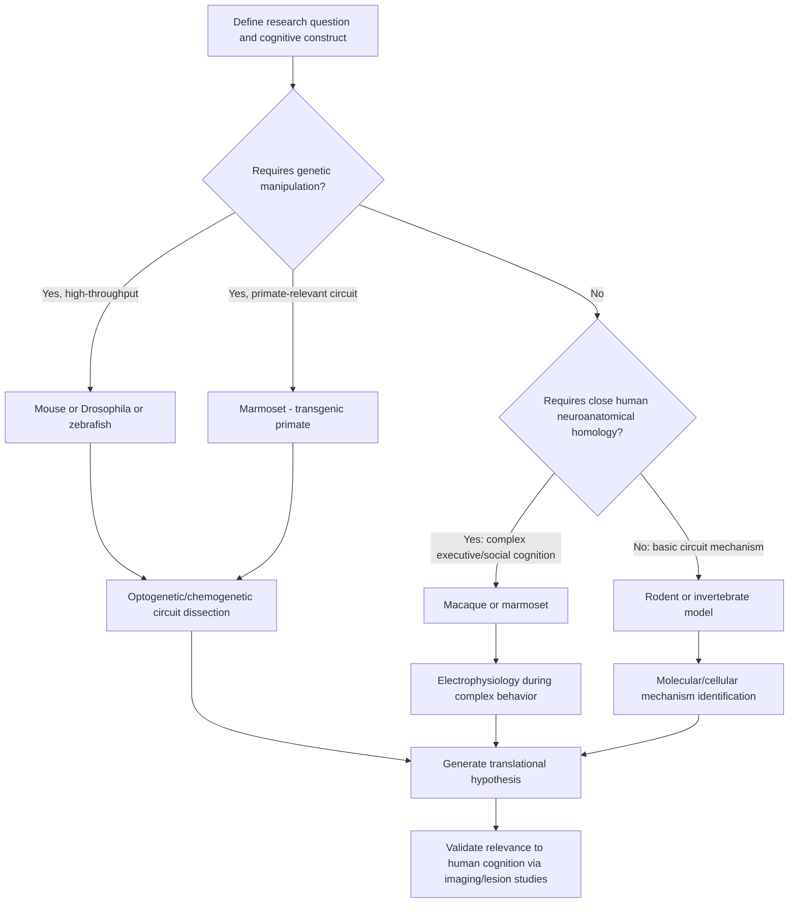

## Animal Models in Cognitive Neuroscience Research

### Overview

Animal models are indispensable tools in cognitive neuroscience, enabling invasive, causal, and mechanistic investigation of neural circuits underlying cognition that is not ethically or technically feasible in humans. Model selection involves balancing genetic/experimental tractability against phylogenetic and neuroanatomical similarity to humans, with different species offering complementary strengths across the translational research pipeline.

**Key Points**

- No single animal model is universally optimal; model choice depends on the specific research question, the cognitive domain under study, and the required level of invasiveness or genetic manipulation
- Cross-species translational validity depends on the degree of homology (shared ancestry) versus mere behavioral analogy (convergent function) between the model system and human cognition being studied
- The field increasingly integrates multiple model systems in parallel—using genetically tractable species (mice, flies, zebrafish) for mechanistic circuit dissection and higher-order species (non-human primates) for validating translational relevance to human cognition

---

### Rodent Models

Rodents, particularly mice and rats, are the most widely used mammalian models in cognitive neuroscience due to their genetic tractability, short generation time, low cost, and well-characterized neuroanatomy.

#### Mice (*Mus musculus*)

- Mice offer unparalleled genetic manipulability: transgenic, knockout, knock-in, and conditional/inducible gene expression systems (e.g., Cre-lox recombination) allow precise, cell-type-specific and temporally controlled manipulation of gene expression
- **Optogenetics** and **chemogenetics (DREADDs)** are predominantly developed and deployed in mice, enabling millisecond-precision (optogenetic) or longer-duration (chemogenetic) causal manipulation of genetically defined neural populations during behavior
- Standard cognitive assays include the Morris water maze (spatial learning/memory, hippocampal-dependent), fear conditioning paradigms (amygdala-dependent associative learning), and novel object recognition (recognition memory)
- **Limitation**: mouse prefrontal cortex is considerably less elaborated than primate prefrontal cortex, both in relative size and cytoarchitectural complexity (notably lacking a clear granular layer 4 in most schemes), constraining direct translational inference for complex primate-like executive function [Inference: the degree of functional homology for specific prefrontal subregions between rodents and primates remains actively debated in the comparative literature]

#### Rats (*Rattus norvegicus*)

- Rats have historically been preferred over mice for complex behavioral and electrophysiological paradigms due to larger brain size (facilitating electrode/cannula placement), more sophisticated baseline behavioral repertoires, and a longer history of well-validated behavioral protocols
- Rats remain the dominant model for many operant conditioning, decision-making, and addiction paradigms (e.g., self-administration procedures), as well as for detailed single-unit and multi-unit electrophysiological recording during complex behavior

**Example**

Place cells recorded in the rodent hippocampus (subsequently extended to grid cells in entorhinal cortex) were first characterized through single-unit electrophysiology in freely moving rats and mice, providing foundational evidence for a cognitive map underlying spatial navigation—a discovery later recognized with the 2014 Nobel Prize in Physiology or Medicine and substantially generalized to human hippocampal function via subsequent human intracranial and fMRI work.

---

### Non-Human Primate Models

Non-human primates (NHPs), particularly macaques (*Macaca mulatta*, rhesus; *Macaca fascicularis*, cynomolgus) and to a lesser extent marmosets (*Callithrix jacchus*), occupy a distinctive translational niche due to closer phylogenetic and neuroanatomical proximity to humans.

**Key Points**

- Macaques possess a prefrontal cortex with granular layer 4 organization broadly comparable to humans, along with complex social cognition, sophisticated visual processing, and dexterous manual behavior, supporting stronger translational inference for human-relevant executive function, decision-making, and social cognition research
- Single-unit and multi-unit electrophysiology in behaving NHPs has been foundational for establishing core principles of primate cognition, including persistent delay-period activity in prefrontal and parietal cortex during working memory tasks, and reward-value coding in orbitofrontal and striatal circuits
- **Marmosets** have gained increasing research prominence due to their smaller size, shorter generation time relative to macaques, natural lissencephalic (smooth) cortex facilitating certain imaging/recording approaches, and emerging genetic tractability (including successful transgenic marmoset lines), offering a genetically manipulable NHP alternative
- NHP research carries substantial ethical, regulatory, and cost considerations, and is subject to increasingly stringent welfare oversight and, in some jurisdictions, use restrictions, shaping current research practice and international variation in NHP availability [Unverified: specific regulatory landscapes vary by country and continue to evolve]

---

### Non-Mammalian and Invertebrate Model Systems

#### Zebrafish (*Danio rerio*)

- Zebrafish larvae possess optical transparency, enabling whole-brain, cellular-resolution functional imaging during behavior using light-sheet microscopy combined with genetically encoded calcium indicators—a capability not achievable in opaque mammalian brains at comparable scale
- Rapid external development, high fecundity, and genetic tractability (including CRISPR-based gene editing) support high-throughput genetic and pharmacological screening approaches
- Used extensively to study basic sensorimotor circuits, simple learning paradigms, and increasingly, models of anxiety-like and social behavior, though translational relevance to complex human cognition remains necessarily indirect given substantial phylogenetic distance and simpler behavioral repertoire

#### Drosophila melanogaster (Fruit Fly)

- Offers an extraordinarily powerful genetic toolkit (the most extensive genetic manipulation resources of any model organism), a fully mapped connectome for portions of the brain, and comparatively simple, well-characterized neural circuits
- The **mushroom body** circuit has become a premier model for dissecting the cellular and molecular basis of associative learning and memory at single-neuron/single-synapse resolution
- Optogenetic and thermogenetic tools (e.g., GAL4-UAS system combined with effector transgenes) allow highly specific, reproducible circuit manipulation
- Findings from Drosophila have revealed conserved molecular mechanisms of memory formation (e.g., cAMP/PKA/CREB signaling cascades) that generalize, at the molecular level, across highly divergent taxa including mammals

#### C. elegans (Nematode)

- Possesses a fully mapped connectome (302 neurons, all synaptic connections characterized), representing the only organism with a completely known nervous system wiring diagram
- Used to study fundamental principles of circuit-level information processing, simple learning/habituation, and genetic/molecular mechanisms of neural development, offering a tractable minimal system for testing general principles that may generalize (with appropriate caution) to more complex nervous systems

---

### Model Systems Comparison

| Model | Genetic Tractability | Neuroanatomical Similarity to Humans | Primary Use Case |
| --- | --- | --- | --- |
| Mouse | Very High | Low-Moderate | Circuit dissection, optogenetics, gene function |
| Rat | Moderate | Low-Moderate | Complex behavior, electrophysiology, addiction models |
| Marmoset | Increasing | High | Genetically tractable primate cognition/social behavior |
| Macaque | Low | Very High | Working memory, decision-making, visual cognition, social cognition |
| Zebrafish | High | Low | Whole-brain imaging, high-throughput screening |
| Drosophila | Very High | Very Low | Molecular/cellular learning mechanisms, connectomics |
| C. elegans | Very High | Very Low | Fundamental circuit wiring principles |

---

### Techniques Enabled Across Model Systems

**Key Points**

- **Optogenetics**: light-sensitive ion channels/pumps (e.g., channelrhodopsin, halorhodopsin) enable millisecond-precision activation or silencing of genetically defined neural populations; most extensively developed in rodents, increasingly applied in NHPs and Drosophila
- **Chemogenetics (DREADDs)**: engineered receptors activated exclusively by otherwise-inert synthetic ligands, enabling longer time-scale, less invasive circuit manipulation than optogenetics, well-suited to freely behaving animals over extended periods
- **Calcium imaging**: genetically encoded calcium indicators (e.g., GCaMP variants) combined with two-photon or miniature head-mounted microscopy allow real-time visualization of neural activity across large populations of identified neurons during behavior
- **Connectomics**: serial electron microscopy reconstruction has produced complete or near-complete connectomes for C. elegans, larval Drosophila, and substantial portions of the Drosophila adult brain, with mouse cortical connectomic mapping efforts ongoing at smaller regional scales given the vastly greater complexity involved

---

### Translational Validity Considerations

**Key Points**

- The **reverse translation problem**: many findings robust in rodent models (e.g., certain pharmacological antidepressant effects in behavioral despair paradigms) have failed to translate into effective human treatments, highlighting limits of behavioral homology even when molecular targets are conserved
- Cognitive constructs studied across species must be operationalized carefully; superficially similar behavioral tasks (e.g., "anxiety-like behavior" in rodent open-field tests) may not correspond precisely to the subjective, richly contextual human experience the task is intended to model [Inference: the construct validity of many rodent behavioral paradigms for modeling specific human psychiatric symptoms remains a subject of ongoing methodological debate]
- The NIMH Research Domain Criteria (RDoC) framework explicitly encourages cross-species comparability by defining constructs (e.g., "acute threat/fear") at multiple units of analysis (genes, circuits, physiology, behavior) that can be more directly operationalized similarly across species than traditional diagnostic categories

---

### Model Selection Workflow

---

### Cross-Species Translational Pipeline Diagram

<svg xmlns="http://www.w3.org/2000/svg" viewBox="0 0 760 380">
<title>Cross-Species Translational Research Pipeline (svg_diagram)</title>
<rect x="0" y="0" width="760" height="380" fill="#ffffff" />
<text x="380" y="25" font-size="15" font-weight="bold" text-anchor="middle" fill="#1a1a1a">Cross-Species Translational Research Pipeline (svg_diagram)</text>
<rect x="30" y="60" width="150" height="70" rx="8" fill="#ede9fe" stroke="#7c3aed" stroke-width="1.5" />
<text x="105" y="85" font-size="11" text-anchor="middle" fill="#4c1d95">C. elegans /</text>
<text x="105" y="100" font-size="11" text-anchor="middle" fill="#4c1d95">Drosophila</text>
<text x="105" y="118" font-size="10" text-anchor="middle" fill="#4c1d95">Molecular mechanism</text>
<rect x="220" y="60" width="150" height="70" rx="8" fill="#dbeafe" stroke="#2563eb" stroke-width="1.5" />
<text x="295" y="85" font-size="11" text-anchor="middle" fill="#1e3a8a">Zebrafish</text>
<text x="295" y="103" font-size="10" text-anchor="middle" fill="#1e3a8a">Whole-brain circuit</text>
<text x="295" y="118" font-size="10" text-anchor="middle" fill="#1e3a8a">imaging</text>
<rect x="410" y="60" width="150" height="70" rx="8" fill="#fef3c7" stroke="#d97706" stroke-width="1.5" />
<text x="485" y="85" font-size="11" text-anchor="middle" fill="#78350f">Mouse / Rat</text>
<text x="485" y="103" font-size="10" text-anchor="middle" fill="#78350f">Genetic circuit</text>
<text x="485" y="118" font-size="10" text-anchor="middle" fill="#78350f">dissection</text>
<rect x="600" y="60" width="150" height="70" rx="8" fill="#dcfce7" stroke="#16a34a" stroke-width="1.5" />
<text x="675" y="85" font-size="11" text-anchor="middle" fill="#14532d">NHP (macaque /</text>
<text x="675" y="100" font-size="11" text-anchor="middle" fill="#14532d">marmoset)</text>
<text x="675" y="118" font-size="10" text-anchor="middle" fill="#14532d">Human-relevant validation</text>
<rect x="300" y="220" width="180" height="70" rx="8" fill="#fee2e2" stroke="#dc2626" stroke-width="1.5" />
<text x="390" y="245" font-size="12" text-anchor="middle" fill="#7f1d1d">Human Studies</text>
<text x="390" y="262" font-size="10" text-anchor="middle" fill="#7f1d1d">Neuroimaging, lesion,</text>
<text x="390" y="277" font-size="10" text-anchor="middle" fill="#7f1d1d">intracranial recording</text>
<path d="M105 130 Q105 200 300 245" stroke="#9ca3af" stroke-width="1.5" fill="none" stroke-dasharray="4,3" marker-end="url(#a5)" />
<path d="M295 130 Q295 180 350 220" stroke="#374151" stroke-width="2" fill="none" marker-end="url(#a5)" />
<path d="M485 130 Q485 180 430 220" stroke="#374151" stroke-width="2" fill="none" marker-end="url(#a5)" />
<path d="M675 130 Q675 200 480 245" stroke="#374151" stroke-width="2.5" fill="none" marker-end="url(#a5)" />

<text x="380" y="330" font-size="10" text-anchor="middle" fill="`#4b5563`">Increasing translational proximity to human cognition (left to right)</text>

</svg>

---

### Clinical-Translational Correlates

**Example**

Macaque electrophysiology studies demonstrating sustained delay-period firing in dorsolateral prefrontal cortex during working memory tasks directly informed subsequent human intracranial EEG and fMRI studies identifying analogous sustained prefrontal activity during working memory maintenance, illustrating a successful primate-to-human translational pathway that would not have been achievable through rodent models alone given prefrontal homology considerations.

- Preclinical drug development for neuropsychiatric conditions typically proceeds through a staged pipeline: initial mechanistic and target validation in rodents, followed by safety and efficacy signal testing in NHPs (particularly for compounds targeting complex cognitive/social domains) prior to human clinical trials
- The 3Rs framework (Replacement, Reduction, Refinement) guides ethical animal research practice, encouraging replacement with non-animal or lower-phylogenetic-order methods where scientifically valid, minimizing animal numbers, and refining procedures to reduce suffering

---

### Related Topics

- Optogenetics and chemogenetics: circuit manipulation methodology
- Hippocampal place cells and grid cells: rodent spatial navigation research
- Prefrontal cortex delay-period activity and working memory in primates
- Connectomics: C. elegans, Drosophila, and mammalian mapping efforts
- Research Domain Criteria (RDoC) and cross-species construct validity
- 3Rs framework and animal research ethics
- Marmoset transgenics and emerging primate genetic models
- Reverse translation failures in psychiatric drug development
- Two-photon and light-sheet microscopy for in vivo imaging
- Comparative neuroanatomy and cross-species homology assessment