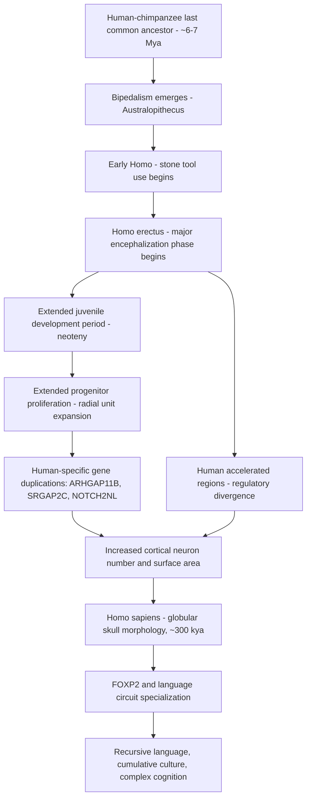

## Evolution of the Human Brain and Cognition

### Overview

Human brain evolution reflects a series of anatomical, developmental, and organizational changes within the primate lineage that, over roughly 6–7 million years since the divergence from the last common ancestor shared with chimpanzees, produced a brain approximately three times larger than expected for a primate of comparable body size, along with cognitive capacities including complex language, cumulative culture, and advanced executive function. Modern accounts emphasize that human brain evolution involved not a single change but a constellation of interacting developmental, genetic, and life-history modifications.

**Key Points**

- Human brain evolution is best understood through comparative hominin fossil evidence (endocranial volume and morphology), comparative genomics (human-chimpanzee genomic divergence, ~1.2% at the nucleotide level), and comparative neuroanatomy across extant primates
- Encephalization in the hominin lineage was not linear or gradual but occurred in discrete phases, with the most dramatic increase occurring within the genus *Homo*, particularly after approximately 2 million years ago
- No single "human cognition gene" has been identified; current evidence supports a polygenic, developmentally distributed basis for human-specific cognitive specializations

---

### Fossil Evidence and Encephalization Timeline

#### Hominin Endocranial Volume Trends

| Hominin | Approximate Age | Approximate Cranial Capacity |
| --- | --- | --- |
| *Australopithecus afarensis* | ~3.9–2.9 Mya | ~400–500 cm³ |
| *Homo habilis* | ~2.4–1.4 Mya | ~500–650 cm³ |
| *Homo erectus* | ~1.9 Mya–110 kya | ~600–1100 cm³ (increased over time) |
| *Homo heidelbergensis* | ~700–200 kya | ~1100–1400 cm³ |
| *Homo neanderthalensis* | ~400–40 kya | ~1200–1750 cm³ |
| *Homo sapiens* | ~300 kya–present | ~1350 cm³ (average, variable) |

- Cranial capacity roughly tripled from early australopithecines to modern humans, with the steepest rate of increase occurring within *Homo erectus* and subsequent *Homo* species
- Neanderthals possessed cranial capacities comparable to or exceeding modern humans on average, though brain **shape** differed notably (more elongated, less globular), with modern human skulls showing a distinctively rounded, globular morphology that developed gradually over the *Homo sapiens* lineage and appears linked to parietal and cerebellar expansion [Inference: the specific cognitive consequences of this globularity difference remain a topic of ongoing paleoanthropological and comparative research]

#### Endocast Analysis Limitations

- Direct brain tissue does not fossilize; inferences rely on **endocasts** (internal skull casts) that preserve overall size, gross gyral/sulcal impressions, and some vascular markings, but not cytoarchitecture, connectivity, or cellular organization
- This constrains fossil-based inference largely to size, shape, and very coarse surface morphology, requiring integration with comparative genomic and developmental evidence to reconstruct finer-grained neurobiological changes [Unverified: many specific functional claims about fossil hominin cognition based on endocast morphology alone remain necessarily speculative]

---

### Developmental Mechanisms of Brain Expansion

#### Neoteny and Extended Development

- Human brain development is markedly prolonged relative to other primates: humans are born with brains at approximately 25% of adult volume (compared to approximately 40% in chimpanzees), with substantial postnatal brain growth continuing for years after birth
- This extended postnatal developmental window, sometimes discussed under the broader concept of **neoteny** (retention of juvenile traits into later developmental stages), is thought to allow greater environmental and experiential input to shape synaptic connectivity during a longer window of plasticity
- Human infant helplessness (altriciality) and the extended juvenile period are hypothesized to reflect an evolutionary trade-off between the pelvic constraints of bipedal locomotion and the need to deliver an infant before the head becomes too large for safe vaginal birth—the **obstetric dilemma** hypothesis, though this hypothesis has faced empirical challenges and alternative explanations (e.g., metabolic constraints on gestation length) have been proposed [Unverified: the obstetric dilemma hypothesis remains actively debated in current paleoanthropological literature]

#### Radial Unit Expansion and Progenitor Proliferation

- Comparative developmental neurobiology indicates that human cortical expansion arises substantially from an extended period of neural progenitor cell proliferation during prenatal development, increasing the number of radial columnar units and, within each unit, the number of neurons generated
- Genes implicated in regulating progenitor proliferation duration and cortical folding (e.g., *ARHGAP11B*, a human-specific gene duplication) have been shown in experimental models to increase progenitor pool expansion and cortical surface area when introduced into non-human primate or rodent model systems, providing mechanistic evidence linking specific genomic changes to expanded neurogenesis [Inference: translating in vitro/model organism findings to definitive claims about human evolutionary history requires caution, as these studies demonstrate developmental capacity rather than direct historical causation]

---

### Genomic Changes Associated with Human Brain Evolution

**Key Points**

- Human and chimpanzee genomes differ by approximately 1.2% at the nucleotide level in directly alignable regions, though structural variants, copy number changes, and regulatory element differences contribute additional functionally relevant divergence beyond simple nucleotide substitution rate
- **Human accelerated regions (HARs)**: genomic regions highly conserved across most vertebrates but showing a significantly elevated substitution rate specifically in the human lineage, suggesting strong positive selection; many HARs are located near genes involved in neurodevelopment and are enriched in regulatory (non-coding) rather than protein-coding sequence
- **FOXP2**: a transcription factor gene strongly associated with human speech and language capacity, identified through study of a family with a severe speech/language disorder linked to a FOXP2 mutation; the human FOXP2 protein differs from the chimpanzee version by two amino acid substitutions, and experimental "humanized" FOXP2 mouse models show altered vocalization patterns and striatal synaptic plasticity, though FOXP2's role is best understood as one contributing factor among many rather than a singular "language gene" [Inference: popular characterizations of FOXP2 as *the* language gene oversimplify its actual polygenic, circuit-distributed contribution]
- Gene duplications specific to the human lineage (e.g., *SRGAP2C*, *ARHGAP11B*, *NOTCH2NL* paralogs) have been implicated in promoting increased neuronal density, delayed neuronal maturation, and expanded progenitor proliferation in human cortical development

---

### Comparative Cognitive Capacities: Human Specializations

#### Domains of Human-Elaborated Cognition

- **Cumulative culture**: the capacity to build incrementally on prior generations' knowledge and technology (the "ratchet effect"), enabling technological and cultural complexity to accumulate over generations in a manner not clearly matched in other extant species
- **Recursive/hierarchical language**: human language exhibits generative, recursive syntactic structure allowing embedding of phrases within phrases to produce effectively unlimited novel expressions, a capacity that—while precursors to vocal learning and referential communication exist in other species—appears to reach a qualitatively distinct level of combinatorial complexity in humans
- **Theory of mind and shared intentionality**: humans show a particularly elaborated capacity for representing others' mental states and engaging in collaborative, jointly-intentional activity from early in development, proposed by some researchers as a key foundational difference underlying human cultural and cooperative capacities relative to other great apes [Inference: the degree to which these capacities are qualitatively unique versus differences of degree from great ape precursors remains an active comparative cognition debate]

#### Comparative Great Ape Cognition

- Chimpanzees and other great apes demonstrate tool use, some forms of social learning, basic numerical processing, and rudimentary theory-of-mind-like behaviors, indicating that many cognitive building blocks are shared and were likely present in the last common hominin-panin ancestor
- The human elaboration appears to involve quantitative scaling (e.g., substantially greater working memory capacity, prefrontal connectivity) combined with qualitative differences in social-cognitive motivation and cultural transmission fidelity, rather than the wholesale invention of entirely novel cognitive modules absent in other primates

---

### Brain Region-Specific Elaboration in Humans

| Region | Relative Elaboration in Humans | Proposed Functional Relevance |
| --- | --- | --- |
| Prefrontal cortex | Disproportionately expanded white matter connectivity relative to gray matter volume compared to other primates | Executive function, planning, behavioral flexibility |
| Cerebellum | Notably expanded relative to overall brain scaling, particularly lateral cerebellar hemispheres | Implicated in cognitive/language processing beyond classical motor role |
| Temporal-parietal association cortex | Expanded relative to primary sensory/motor cortex | Language, social cognition, abstract reasoning |
| Broca's and Wernicke's areas (perisylvian language network) | Structurally and connectively specialized (e.g., arcuate fasciculus expansion) | Language production and comprehension |

- [Unverified] The relative degree of human prefrontal expansion compared to what would be predicted by primate allometric scaling alone has been a subject of ongoing empirical debate, with some analyses suggesting human prefrontal cortex is proportionally larger than predicted and others suggesting it scales consistently with general primate allometric trends, with the disproportionate change instead concentrated in prefrontal connectivity/white matter rather than gray matter volume per se

---

### Integrative Timeline and Mechanism Model

---

### Hominin Encephalization Timeline Diagram

<svg xmlns="http://www.w3.org/2000/svg" viewBox="0 0 760 380">
<title>Hominin Cranial Capacity Trend Over Evolutionary Time (svg_diagram)</title>
<rect x="0" y="0" width="760" height="380" fill="#ffffff" />
<text x="380" y="25" font-size="15" font-weight="bold" text-anchor="middle" fill="#1a1a1a">Hominin Cranial Capacity Over Evolutionary Time (svg_diagram)</text>
<line x1="80" y1="320" x2="700" y2="320" stroke="#374151" stroke-width="2" />
<line x1="80" y1="320" x2="80" y2="50" stroke="#374151" stroke-width="2" />
<text x="40" y="55" font-size="10" fill="#374151">1750</text>
<text x="40" y="320" font-size="10" fill="#374151">0</text>
<text x="20" y="185" font-size="10" fill="#374151" transform="rotate(-90 20 185)">cm³</text>
<text x="390" y="355" font-size="11" text-anchor="middle" fill="#374151">Time (Mya to present, right = more recent)</text>
<circle cx="140" cy="290" r="8" fill="#2563eb" />
<text x="140" y="270" font-size="9" text-anchor="middle" fill="#1e3a8a">A. afarensis</text>
<text x="140" y="310" font-size="8" text-anchor="middle" fill="#1e3a8a">~450 cm³</text>
<circle cx="260" cy="275" r="8" fill="#d97706" />
<text x="260" y="255" font-size="9" text-anchor="middle" fill="#78350f">H. habilis</text>
<text x="260" y="295" font-size="8" text-anchor="middle" fill="#78350f">~600 cm³</text>
<circle cx="400" cy="220" r="9" fill="#16a34a" />
<text x="400" y="200" font-size="9" text-anchor="middle" fill="#14532d">H. erectus</text>
<text x="400" y="240" font-size="8" text-anchor="middle" fill="#14532d">~850 cm³</text>
<circle cx="520" cy="130" r="10" fill="#7c3aed" />
<text x="520" y="110" font-size="9" text-anchor="middle" fill="#4c1d95">H. heidelbergensis</text>
<text x="520" y="150" font-size="8" text-anchor="middle" fill="#4c1d95">~1250 cm³</text>
<circle cx="620" cy="90" r="11" fill="#dc2626" />
<text x="620" y="70" font-size="9" text-anchor="middle" fill="#7f1d1d">H. neanderthalensis</text>
<text x="620" y="110" font-size="8" text-anchor="middle" fill="#7f1d1d">~1450 cm³</text>
<circle cx="660" cy="95" r="10" fill="#1e3a8a" />
<text x="680" y="85" font-size="9" text-anchor="middle" fill="#1e3a8a">H. sapiens</text>
<text x="680" y="105" font-size="8" text-anchor="middle" fill="#1e3a8a">~1350 cm³</text>
<path d="M140 290 L260 275 L400 220 L520 130 L620 90 L660 95" stroke="#9ca3af" stroke-width="1.5" fill="none" stroke-dasharray="4,3" />
</svg>

---

### Clinical-Translational Correlates

**Example**

Comparative genomic analysis of FOXP2 in the KE family—in which affected individuals carrying a heterozygous FOXP2 point mutation show severe deficits in orofacial motor coordination for speech and broader expressive/receptive language impairment—provided a foundational bridge between molecular genetics and language circuit function, subsequently informing research into developmental language disorders and the broader corticostriatal circuitry supporting speech motor planning in clinical populations.

- Comparative and evolutionary neuroscience findings inform understanding of human-specific vulnerability to certain neuropsychiatric and neurodevelopmental conditions, under the hypothesis that evolutionarily novel or rapidly elaborated circuits (e.g., expanded prefrontal-striatal-cerebellar loops, protracted developmental windows) may carry correspondingly elevated vulnerability to disruption, a framework sometimes termed the "evolutionary mismatch" or "developmental vulnerability" perspective on conditions such as schizophrenia and autism [Inference: this remains a theoretical framework rather than an established causal mechanism, with direct empirical support still developing]
- Studying human-specific genes (e.g., *SRGAP2C*, *NOTCH2NL*) in cerebral organoid and humanized animal models provides an experimentally tractable window into mechanisms of human cortical expansion relevant to neurodevelopmental disorder research

---

### Related Topics

- Human accelerated regions (HARs) and regulatory genomic evolution
- FOXP2 and the genetics of speech/language disorders
- Cerebral organoid models of human-specific cortical development
- Comparative great ape cognition and theory of mind research
- Obstetric dilemma hypothesis and human life-history evolution
- Neoteny and developmental plasticity in human brain maturation
- Human-specific gene duplications (SRGAP2C, ARHGAP11B, NOTCH2NL)
- Endocast analysis methodology and paleoneurology
- Cumulative culture and the ratchet effect in human cognitive evolution
- Evolutionary mismatch theory in neuropsychiatric vulnerability