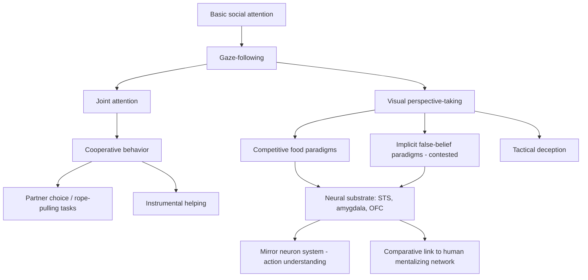

## Primate Social Cognition Studies

### Overview

Primate social cognition research investigates how nonhuman primates represent, predict, and respond to the mental states, intentions, and social relationships of conspecifics, providing a comparative foundation for understanding the evolutionary origins of human social cognitive capacities including theory of mind, cooperation, and social learning. This field integrates naturalistic behavioral observation, controlled experimental paradigms, and increasingly, neurobiological investigation of the circuits underlying social behavior.

**Key Points**

- Primate social cognition spans a hierarchy of capacities, from basic social attention and gaze-following to more complex constructs such as perspective-taking, deception, and cooperative planning
- A central and long-running debate concerns whether nonhuman primates possess genuine **theory of mind**—the ability to attribute mental states (beliefs, desires, knowledge) to others—or whether apparently mentalistic behavior can be more parsimoniously explained by sophisticated behavior-reading and associative learning without genuine mental-state attribution
- The **Social Brain Hypothesis** proposes that primate brain (particularly neocortex) size evolved substantially in response to the cognitive demands of navigating complex social groups, rather than primarily in response to ecological/foraging demands

---

### The Social Brain Hypothesis

- Robin Dunbar's comparative analyses across primate species identified a correlation between neocortex ratio (neocortex volume relative to the rest of the brain) and typical social group size, proposed to reflect the computational demands of tracking and managing numerous simultaneous social relationships
- This relationship gave rise to the concept of "Dunbar's number," an extrapolated estimate (commonly cited around 150) of the cognitively sustainable limit on stable human social relationships, based on extrapolating the primate neocortex-ratio/group-size relationship to human neocortical proportions
- [Unverified] The precise numerical estimate and the generalizability of the underlying relationship to modern human social contexts (including digitally mediated relationships) remain debated, and some researchers have questioned the strength and specificity of the original comparative correlation
- Competing/complementary hypotheses (e.g., the ecological/foraging complexity hypothesis) propose that dietary and foraging demands, rather than purely social factors, also substantially drove primate brain expansion, and current consensus generally treats social and ecological pressures as interacting rather than mutually exclusive explanatory factors

---

### Theory of Mind in Nonhuman Primates

#### Foundational Paradigms

- **False-belief tasks**, the gold-standard human developmental test for theory of mind (requiring understanding that another agent can hold a belief that differs from reality), have been adapted for nonhuman primates using looking-time and anticipatory-looking paradigms rather than verbal report
- Some studies using eye-tracking-based implicit false-belief paradigms have reported that apes show anticipatory gaze patterns consistent with tracking another agent's false belief about an object's location, suggesting an implicit form of belief-tracking may be present [Unverified: replication and interpretation of these findings remain contested, with some researchers arguing the results can be explained by lower-level behavior-reading rules rather than genuine mental-state representation]

#### Competitive Paradigms: The Hare-Tomasello Line of Research

- Studies using competitive food-retrieval paradigms have shown that subordinate chimpanzees adjust their behavior based on what a dominant competitor can or cannot see, preferentially retrieving food that is hidden from the dominant's view—suggesting sensitivity to what another individual "knows" or has perceptual access to
- This line of research has been influential in establishing that at least some primates demonstrate visual perspective-taking (understanding what another agent can or cannot see), which is considered a foundational, though not sufficient, component of full theory of mind
- Critics have argued that such findings may reflect learned behavioral rules ("avoid food visible to dominants") rather than genuine attribution of visual/mental states, an interpretive tension that remains unresolved and characterizes much of the broader debate in comparative theory-of-mind research [Inference]

#### Gaze Following and Joint Attention

- Gaze-following (orienting attention toward where another individual is looking) is well-documented across multiple primate species, including monkeys, and represents a foundational building block for more complex social-cognitive capacities
- **Joint attention**—coordinated attention to an object or event shared between two individuals, typically accompanied by referential communicative gestures (e.g., pointing)—is more robustly and spontaneously demonstrated in human infants than in nonhuman primates, though enculturated or language-trained apes have shown some capacity for referential gestural communication under specific conditions
- The relative rarity of spontaneous declarative pointing (pointing purely to share attention/interest, as opposed to imperative pointing to request an object) in nonhuman primates is frequently cited as a key qualitative difference from human infant social-cognitive development [Inference: the degree to which this reflects a genuine cognitive capacity difference versus differences in communicative motivation/ecology remains debated]

---

### Cooperation and Prosocial Behavior

**Key Points**

- Chimpanzees demonstrate targeted helping behavior in some experimental contexts (e.g., retrieving out-of-reach objects for a human experimenter or conspecific), suggesting a capacity for instrumental helping, though spontaneous prosocial food-sharing in experimental paradigms has historically been reported as more limited and context-dependent compared to humans
- Cooperative tasks requiring coordinated joint action (e.g., the cooperative "rope-pulling" paradigm, in which two individuals must simultaneously pull ropes to access food that neither can retrieve alone) have demonstrated that chimpanzees and other primates can recognize the need for a partner and will recruit more effective collaborators, indicating some understanding of the structure of cooperative interdependence
- Marmosets, as cooperative breeders (relying on alloparental care), show comparatively elevated spontaneous prosocial food-sharing behavior relative to chimpanzees in some experimental comparisons, suggesting that species-typical social/reproductive ecology (cooperative breeding demands) may shape the degree of prosocial tendency independent of general "intelligence" level [Inference: this comparative pattern supports ecological/life-history explanations for variation in prosociality across primate species]

---

### Deception and Tactical Behavior

- Field observations and experimental studies have documented instances of tactical deception in primates—behavior that misleads a conspecific in ways that appear to benefit the deceiver, such as concealing food discovery from dominant individuals or issuing false alarm calls
- The interpretation of such behavior as reflecting intentional, mentalistic deception (requiring the deceiver to represent and manipulate another's beliefs) versus simple associative learning of behavior-outcome contingencies (e.g., "concealing food access reduces food loss") remains a central methodological and interpretive challenge in the field [Unverified: distinguishing genuine intentional deception from learned behavioral strategies is difficult to establish conclusively from naturalistic observation alone]

---

### Neurobiological Substrates of Primate Social Cognition

#### The "Social Brain" Network

- Comparative neuroimaging and lesion studies in macaques have identified a network of regions consistently implicated in social cognitive processing: the **superior temporal sulcus (STS)** (biological motion and gaze processing), **amygdala** (social/emotional salience, threat detection), **orbitofrontal cortex** (social reward valuation), and **medial prefrontal cortex** (broadly implicated in social reasoning, though its specific primate homology to human "mentalizing" regions remains an active research question)
- Single-unit recordings in macaque STS have identified neurons selectively responsive to gaze direction, facial identity, and body movement, providing a cellular-level substrate for social perceptual processing that parallels human fMRI findings implicating analogous regions in face and biological-motion processing

#### Mirror Neurons

- Mirror neurons, first identified via single-unit recording in macaque premotor area F5 (and subsequently in parietal cortex), fire both when a monkey performs a specific goal-directed action and when it observes another individual (or experimenter) performing the same or a similar action
- Mirror neuron systems have been proposed as a potential neural substrate for action understanding, imitation, and by extension, some forms of social cognition, though the specific causal contribution of mirror neurons to higher-order theory-of-mind capacities (as opposed to more basic action recognition) remains actively debated and has been subject to considerable popular overinterpretation beyond what the primary electrophysiological evidence directly supports [Unverified: strong claims linking mirror neurons directly to human empathy, language origins, or full theory-of-mind capacity substantially outpace the direct experimental evidence in primates]

---

### Comparative Summary Across Social-Cognitive Domains

| Capacity | Strength of Evidence in Nonhuman Primates | Key Species Studied |
| --- | --- | --- |
| Gaze-following | Strong, well-replicated | Macaques, chimpanzees, various monkeys |
| Visual perspective-taking (competitive context) | Moderate-strong | Chimpanzees |
| Joint attention / declarative pointing | Weak-moderate, limited spontaneous occurrence | Chimpanzees, enculturated apes |
| False-belief understanding (implicit) | Contested/mixed | Chimpanzees, other great apes |
| Instrumental helping | Moderate | Chimpanzees |
| Cooperative partner choice | Moderate-strong | Chimpanzees, capuchins |
| Tactical deception (behavioral) | Moderate (observational) | Chimpanzees, baboons |

---

### Social Cognition Research Framework Diagram

---

### Social Brain Network Diagram

<svg xmlns="http://www.w3.org/2000/svg" viewBox="0 0 720 400">
<title>Primate Social Brain Network Regions (svg_diagram)</title>
<rect x="0" y="0" width="720" height="400" fill="#ffffff" />
<text x="360" y="25" font-size="15" font-weight="bold" text-anchor="middle" fill="#1a1a1a">Primate Social Brain Network Regions (svg_diagram)</text>
<ellipse cx="360" cy="210" rx="220" ry="150" fill="#f9fafb" stroke="#9ca3af" stroke-width="1" stroke-dasharray="4,3" />
<rect x="280" y="60" width="160" height="55" rx="8" fill="#dbeafe" stroke="#2563eb" stroke-width="1.5" />
<text x="360" y="83" font-size="12" text-anchor="middle" fill="#1e3a8a">Superior Temporal</text>
<text x="360" y="99" font-size="10" text-anchor="middle" fill="#1e3a8a">Sulcus (gaze, biological motion)</text>
<rect x="80" y="160" width="160" height="55" rx="8" fill="#fee2e2" stroke="#dc2626" stroke-width="1.5" />
<text x="160" y="183" font-size="12" text-anchor="middle" fill="#7f1d1d">Amygdala</text>
<text x="160" y="199" font-size="10" text-anchor="middle" fill="#7f1d1d">Social salience, threat</text>
<rect x="480" y="160" width="160" height="55" rx="8" fill="#dcfce7" stroke="#16a34a" stroke-width="1.5" />
<text x="560" y="183" font-size="12" text-anchor="middle" fill="#14532d">Orbitofrontal Cortex</text>
<text x="560" y="199" font-size="10" text-anchor="middle" fill="#14532d">Social reward valuation</text>
<rect x="280" y="290" width="160" height="55" rx="8" fill="#ede9fe" stroke="#7c3aed" stroke-width="1.5" />
<text x="360" y="313" font-size="12" text-anchor="middle" fill="#4c1d95">Medial Prefrontal</text>
<text x="360" y="329" font-size="10" text-anchor="middle" fill="#4c1d95">Social reasoning (proposed)</text>
<path d="M340 115 L200 165" stroke="#374151" stroke-width="1.5" fill="none" />
<path d="M380 115 L520 165" stroke="#374151" stroke-width="1.5" fill="none" />
<path d="M200 215 L320 290" stroke="#374151" stroke-width="1.5" fill="none" />
<path d="M520 215 L400 290" stroke="#374151" stroke-width="1.5" fill="none" />
<path d="M240 190 L480 190" stroke="#374151" stroke-width="1.5" fill="none" />

<text x="360" y="380" font-size="10" text-anchor="middle" fill="`#4b5563`">Interconnected network supporting perceptual, affective, and evaluative components of social cognition</text>

</svg>

---

### Clinical-Translational Correlates

**Example**

Macaque single-unit studies identifying STS neurons selectively responsive to averted versus direct gaze, and amygdala neurons responsive to social threat cues, have directly informed human fMRI research on social cognitive impairment in autism spectrum conditions, where atypical activation of homologous regions (fusiform face area, STS, amygdala) during social stimulus processing has been extensively documented, illustrating a translational bridge from primate single-cell physiology to human clinical neuroimaging.

- Comparative primate social cognition research informs models of human social cognitive disorders, including autism spectrum conditions and social anxiety, by identifying evolutionarily conserved neural circuits whose dysfunction may underlie specific social-cognitive symptom domains
- Macaque models of social behavior are increasingly used in translational research on oxytocin/vasopressin system modulation of social bonding and affiliative behavior, informing candidate pharmacological approaches for social cognitive impairment in clinical populations [Unverified: translational efficacy of oxytocin-based interventions in human clinical trials has shown mixed results to date]

---

### Related Topics

- Social Brain Hypothesis and neocortex ratio comparative analysis
- False-belief task paradigms in comparative and developmental psychology
- Mirror neuron system: discovery, function, and interpretive controversies
- Superior temporal sulcus function in social perception
- Cooperative breeding and prosociality across primate species
- Oxytocin/vasopressin systems and primate affiliative behavior
- Autism spectrum condition models of social cognitive circuit dysfunction
- Tactical deception and behavioral ecology in wild primate populations
- Joint attention development in human infancy versus nonhuman primates
- Comparative neuroanatomy of prefrontal-temporal social cognition networks