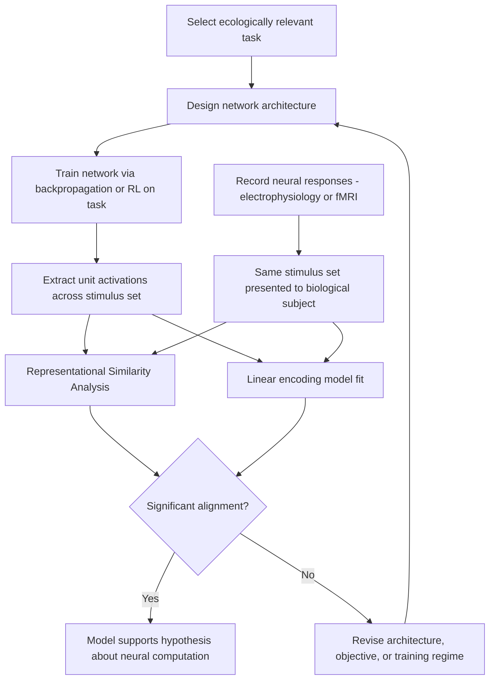

## Neural Network Models of Brain Function

### Overview

Neural network models of brain function use artificial computational systems—ranging from biologically detailed spiking networks to abstract deep learning architectures—to formalize hypotheses about how neural circuits compute, learn, and represent information. These models serve dual purposes: as tools for understanding biological neural computation (computational neuroscience) and as engineering systems whose emergent properties can be compared against empirical neural and behavioral data to test theories of brain function.

**Key Points**

- Models span a spectrum of biological realism, from highly abstract connectionist networks concerned primarily with functional/computational properties, to biophysically detailed spiking neuron models constrained by known cellular and synaptic mechanisms
- A central methodological strategy in modern computational neuroscience involves training artificial neural networks on ecologically relevant tasks and then comparing internal network representations to recorded neural activity, testing whether task-optimized artificial systems spontaneously develop brain-like representations
- No current model fully captures brain function; each modeling approach makes explicit trade-offs between biological plausibility, computational tractability, and explanatory/predictive power

---

### Classical Connectionist Models

#### The Perceptron and Multi-Layer Networks

- The perceptron, introduced by Frank Rosenblatt, represented an early formal model of a single neuron-like unit computing a weighted sum of inputs passed through a threshold nonlinearity, directly inspired by simplified neuronal integrate-and-fire logic
- Multi-layer perceptrons (MLPs), trained via the **backpropagation** algorithm, extended this framework to networks with hidden layers, enabling learning of nonlinear input-output mappings not achievable with a single-layer perceptron
- **Parallel Distributed Processing (PDP)** models, developed prominently by Rumelhart, McClelland, and colleagues in the 1980s, demonstrated that distributed representations across simple interconnected units could account for a range of cognitive phenomena (e.g., word reading, past-tense verb generation) without requiring explicit symbolic rule systems, providing an influential alternative to classical symbolic cognitive architectures

$$a_j = f\left(\sum_i w_{ij} x_i + b_j\right)$$

Where $a_j$ is the activation of unit $j$, $w_{ij}$ is the connection weight from input $i$, $x_i$ is the input activation, $b_j$ is a bias term, and $f$ is a nonlinear activation function.

#### Hopfield Networks and Attractor Dynamics

- Hopfield networks are recurrent networks with symmetric connectivity that settle into stable activity patterns (attractor states) representing stored memories, formalized using an energy function that the network dynamics provably minimize
- These models provided an influential early framework for content-addressable memory (pattern completion from partial cues) and have informed theoretical accounts of hippocampal pattern completion/separation and cortical attractor dynamics in working memory maintenance
- Modern **continuous attractor network** models extend this framework to explain persistent neural activity observed during working memory delay periods and ring-attractor dynamics implicated in head-direction and spatial navigation circuits

---

### Biophysically Detailed Models

#### Single-Neuron Models

| Model | Biological Detail | Computational Cost |
| --- | --- | --- |
| Integrate-and-fire (leaky) | Low: membrane potential integration with fixed threshold reset | Very low |
| Izhikevich model | Moderate: reproduces diverse spiking patterns with few parameters | Low |
| Hodgkin-Huxley model | High: explicit voltage-gated ion channel conductance dynamics | High |
| Compartmental/multi-compartment models | Very high: dendritic morphology, spatially distributed conductances | Very high |

- The **Hodgkin-Huxley model**, originally developed from squid giant axon experiments, remains the foundational biophysical framework describing action potential generation via voltage-gated sodium and potassium conductances, expressed as a system of coupled differential equations
- Simplified spiking models (leaky integrate-and-fire, Izhikevich) sacrifice some biophysical detail to enable large-scale network simulation while retaining key qualitative spiking dynamics, representing a common trade-off in large-scale brain simulation efforts

$$C_m \frac{dV}{dt} = -g_L(V - E_L) - g_{Na}m^3h(V - E_{Na}) - g_K n^4(V - E_K) + I_{ext}$$

This is the core Hodgkin-Huxley membrane equation, where $C_m$ is membrane capacitance, $g$ terms represent ionic conductances, $E$ terms represent reversal potentials, and $m$, $h$, $n$ are voltage- and time-dependent gating variables.

#### Large-Scale Spiking Network Simulations

- Large-scale spiking neural network simulations (e.g., cortical microcircuit models incorporating multiple neuron types and layer-specific connectivity) aim to reproduce emergent population-level phenomena such as oscillatory dynamics, balanced excitation/inhibition, and stimulus-evoked response patterns observed empirically
- These simulations are computationally intensive and increasingly rely on specialized neuromorphic hardware or high-performance computing clusters to achieve biologically realistic scale (millions to billions of neurons), though matching true cortical neuron/synapse counts (tens of billions of neurons, trillions of synapses in human cortex) remains far beyond current simulation capacity [Unverified: the degree to which current large-scale simulations meaningfully capture emergent cortical-scale computation, as opposed to reproducing lower-level statistical properties, remains debated]

---

### Deep Learning Models as Brain Models

#### Convolutional Neural Networks and Ventral Visual Stream

- Convolutional neural networks (CNNs) trained on large-scale image classification tasks have become an influential model system for the primate ventral visual stream, motivated by architectural parallels: CNNs employ local receptive fields, hierarchical feature extraction, and pooling operations that loosely parallel the hierarchical organization of visual cortex (V1 through V4 to inferotemporal cortex)
- A substantial body of work has demonstrated that intermediate and late layers of task-optimized (particularly object-recognition-trained) CNNs show significant representational similarity to neural population responses recorded in macaque inferotemporal cortex, using metrics such as representational similarity analysis (RSA) and linear predictivity of neural responses from model unit activations
- **Key finding**: models optimized purely for behavioral task performance (object recognition accuracy), without any explicit neuroscientific constraint, spontaneously develop internal representations that predict neural responses better than models designed with hand-crafted features, suggesting that task optimization under architectural/computational constraints may be a productive route to discovering brain-like computation [Inference: this correlational relationship between task performance and neural predictivity, while robust across multiple studies, does not by itself establish that the underlying computational mechanisms are identical to biological ones]

**Example**

The Brain-Score benchmark platform quantitatively ranks CNN architectures on their ability to predict primate visual cortical neural responses and human behavioral data, providing a standardized framework for testing which artificial architectures best capture ventral stream computation, and has been used to demonstrate that architectural modifications improving standard object-recognition accuracy do not always correspondingly improve neural predictivity, indicating partial dissociation between the two optimization objectives.

#### Recurrent Neural Networks and Dynamical Systems Models

- Recurrent neural networks (RNNs), including gated architectures (LSTM, GRU), have been used to model cognitive processes involving temporal dynamics and memory, including working memory maintenance, decision-making, and motor sequence generation
- RNNs trained on neuroscience-inspired tasks (e.g., perceptual decision-making, delayed match-to-sample working memory tasks) have been analyzed using dynamical systems approaches (fixed-point analysis, state-space trajectory analysis) to characterize the computational mechanisms the network discovers, revealing solutions (e.g., line attractors for evidence accumulation, rotational dynamics for timing) that have subsequently been compared to and found consistent with recorded neural population dynamics in prefrontal and motor cortices

#### Reinforcement Learning and the Basal Ganglia-Dopamine System

- Temporal difference (TD) reinforcement learning models, formalized in artificial RL agents, provided the theoretical framework that directly predicted and was subsequently validated by the discovery that midbrain dopamine neuron firing encodes a reward prediction error signal, representing one of the most frequently cited successful convergences between an artificial learning algorithm and biological neural computation
- Deep reinforcement learning architectures (combining deep neural network function approximation with RL algorithms) have been used to model more complex, hierarchically structured behavior and have informed computational psychiatry frameworks for understanding model-based versus model-free control dysfunction

---

### Predictive Coding and Generative Models

- Predictive coding network architectures explicitly implement hierarchical generative models in which higher levels generate top-down predictions about lower-level activity, with only the residual prediction error propagated forward, contrasting with standard feedforward deep learning architectures that lack this explicit error-correction hierarchy
- Variational autoencoders and other generative deep learning architectures have been proposed as computational implementations of hierarchical Bayesian inference frameworks relevant to perception, offering an alternative theoretical bridge between machine learning architectures and predictive processing accounts of cortical function

---

### Model Comparison Methodologies

**Key Points**

- **Representational Similarity Analysis (RSA)**: compares the pairwise similarity structure of neural population responses to the pairwise similarity structure of artificial network unit activations across the same stimulus set, providing an architecture-agnostic method for comparing representational geometry between biological and artificial systems
- **Linear predictivity/encoding models**: fit a linear mapping from artificial network unit activations to individual neuron or voxel responses, with prediction accuracy on held-out data serving as a quantitative measure of representational alignment
- **Behavioral comparison**: comparing error patterns, psychophysical thresholds, and generalization behavior between artificial networks and biological subjects performing matched tasks, providing an independent, architecture-agnostic validation route beyond neural response prediction alone

---

### Model Class Comparison Table

| Model Class | Primary Use | Biological Realism | Key Insight Generated |
| --- | --- | --- | --- |
| Perceptron/MLP (PDP models) | Cognitive process modeling | Low | Distributed representation without symbolic rules |
| Hopfield/attractor networks | Memory, working memory maintenance | Low-Moderate | Content-addressable memory, persistent activity |
| Hodgkin-Huxley/compartmental models | Cellular biophysics | Very High | Ionic basis of action potentials, dendritic computation |
| Large-scale spiking networks | Circuit/population dynamics | High | Oscillations, excitation/inhibition balance |
| Task-optimized CNNs | Visual cortex representation | Moderate (functional analogy) | Task optimization yields brain-predictive representations |
| RNNs (dynamical systems analysis) | Working memory, decision-making | Moderate (functional analogy) | Computational mechanisms underlying temporal cognition |
| Deep RL / TD learning | Reward learning, basal ganglia | Moderate (algorithmic analogy) | Dopamine as reward prediction error signal |

---

### Modeling Pipeline: Task-Optimized Network to Neural Comparison

---

### Biophysical vs. Functional Modeling Spectrum Diagram

<svg xmlns="http://www.w3.org/2000/svg" viewBox="0 0 760 340">
<title>Spectrum of Neural Network Model Biological Realism (svg_diagram)</title>
<rect x="0" y="0" width="760" height="340" fill="#ffffff" />
<text x="380" y="25" font-size="15" font-weight="bold" text-anchor="middle" fill="#1a1a1a">Spectrum of Neural Network Model Biological Realism (svg_diagram)</text>
<line x1="60" y1="180" x2="700" y2="180" stroke="#374151" stroke-width="2" />
<text x="60" y="210" font-size="11" text-anchor="start" fill="#374151">Abstract / Functional</text>
<text x="700" y="210" font-size="11" text-anchor="end" fill="#374151">Biophysically Detailed</text>
<circle cx="120" cy="180" r="8" fill="#2563eb" />
<text x="120" y="150" font-size="10" text-anchor="middle" fill="#1e3a8a">Perceptron /</text>
<text x="120" y="164" font-size="10" text-anchor="middle" fill="#1e3a8a">PDP models</text>
<circle cx="280" cy="180" r="8" fill="#d97706" />
<text x="280" y="150" font-size="10" text-anchor="middle" fill="#78350f">Task-optimized</text>
<text x="280" y="164" font-size="10" text-anchor="middle" fill="#78350f">CNNs / RNNs</text>
<circle cx="440" cy="180" r="8" fill="#16a34a" />
<text x="440" y="150" font-size="10" text-anchor="middle" fill="#14532d">Leaky integrate-</text>
<text x="440" y="164" font-size="10" text-anchor="middle" fill="#14532d">and-fire networks</text>
<circle cx="590" cy="180" r="8" fill="#7c3aed" />
<text x="590" y="150" font-size="10" text-anchor="middle" fill="#4c1d95">Large-scale spiking</text>
<text x="590" y="164" font-size="10" text-anchor="middle" fill="#4c1d95">cortical models</text>
<circle cx="670" cy="180" r="8" fill="#dc2626" />
<text x="670" y="150" font-size="10" text-anchor="middle" fill="#7f1d1d">Hodgkin-Huxley /</text>
<text x="670" y="164" font-size="10" text-anchor="middle" fill="#7f1d1d">compartmental</text>

<text x="380" y="270" font-size="11" text-anchor="middle" fill="`#4b5563`">Trade-off: biological detail increases interpretability of mechanism</text>

<text x="380" y="288" font-size="11" text-anchor="middle" fill="`#4b5563`">but decreases scalability and tractability of large-scale simulation</text>

</svg>

---

### Limitations and Open Questions

**Key Points**

- **The representational alignment problem**: high similarity between artificial network representations and neural data (via RSA or encoding models) demonstrates correlational, not necessarily mechanistic, correspondence; two systems can produce similar output representations via substantially different underlying computational processes [Inference]
- Standard backpropagation, while highly effective for training artificial networks, is generally considered biologically implausible as a literal mechanism of synaptic learning in the brain (due to its requirement for precise, symmetric backward weight transport and global error signals), motivating ongoing research into biologically plausible alternative learning rules (e.g., predictive coding-based learning, feedback alignment, local Hebbian-like rules)
- Task-optimized models are necessarily shaped by the specific training objective and dataset chosen by the researcher, raising the concern that apparent neural alignment may partly reflect convergent solutions to a shared task-relevant statistical structure rather than a deep shared computational principle [Unverified: the extent to which this concern undermines specific published alignment findings varies by study and remains actively scrutinized within the field]

---

### Clinical-Translational Correlates

**Example**

Computational psychiatry research increasingly uses deep reinforcement learning models, originally developed for artificial agents, to formally characterize altered reward-learning parameters (e.g., blunted learning rates) in depression and altered model-based/model-free balance in compulsive disorders, illustrating a direct translational pathway from brain-inspired artificial network research back into clinical mechanistic modeling.

- Neuromorphic computing hardware, designed to implement spiking neural network computation with greater energy efficiency by more closely mimicking biological neural dynamics, represents an active area of engineering research with potential future applications in both brain-computer interface systems and low-power AI hardware
- Comparisons between artificial network failure modes (e.g., adversarial vulnerability, catastrophic forgetting) and analogous or contrasting patterns in human/animal perception and learning continue to generate hypotheses about what computational principles the brain has evolved that current artificial systems may still lack

---

### Related Topics

- Representational Similarity Analysis (RSA) methodology
- Reward prediction error and temporal difference learning in dopamine research
- Hodgkin-Huxley model and biophysical ion channel dynamics
- Predictive coding and hierarchical generative models
- Brain-Score benchmark and ventral visual stream modeling
- Biologically plausible alternatives to backpropagation
- Attractor network models of working memory and spatial navigation
- Neuromorphic computing and spiking hardware architectures
- Dynamical systems analysis of recurrent neural network computation
- Deep reinforcement learning models in computational psychiatry