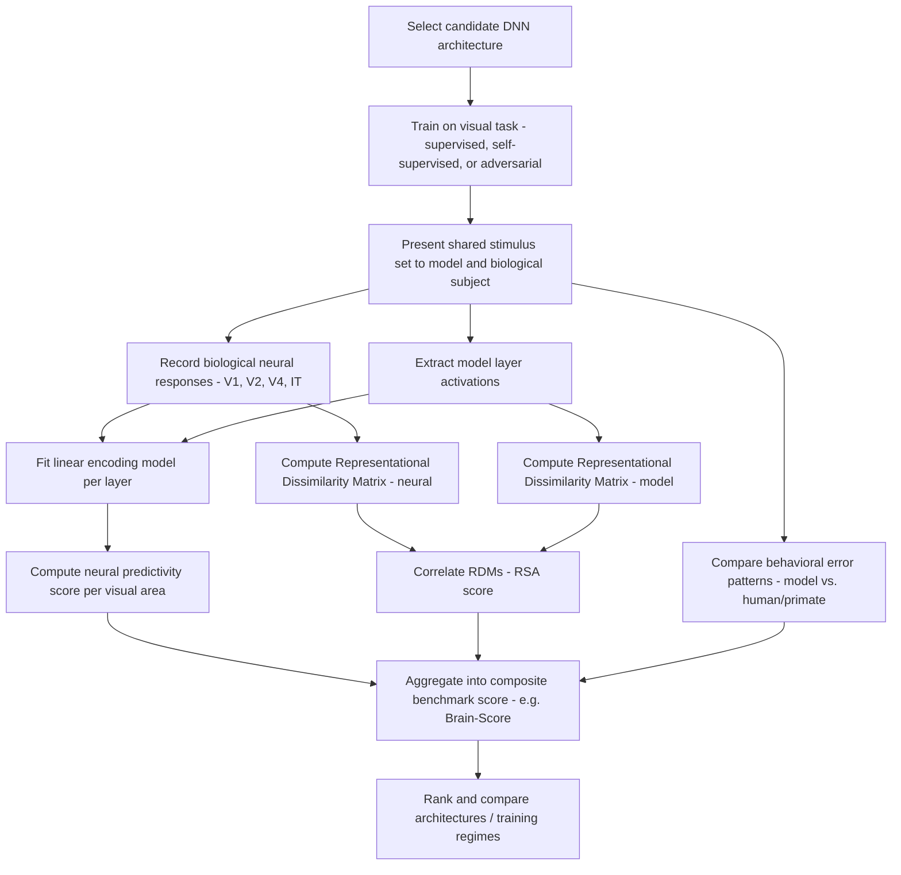

## Deep Learning Models and Visual Cortex Alignment

### Overview

Deep learning models and visual cortex alignment research investigates the degree to which artificial neural networks trained on visual tasks—predominantly convolutional neural networks (CNNs) and, more recently, transformer-based architectures—develop internal representations that quantitatively predict biological visual system responses. This research program has become one of the most productive and closely scrutinized intersections of machine learning and systems neuroscience, offering both a tool for generating neuroscientific hypotheses and a testbed for evaluating whether task-optimized artificial systems capture genuine principles of biological visual computation.

**Key Points**

- The central empirical finding is that intermediate-to-late layers of CNNs trained on large-scale object recognition (e.g., ImageNet classification) show substantial quantitative correspondence to neural population responses recorded in the primate ventral visual stream, particularly inferotemporal (IT) cortex
- This correspondence is typically assessed using linear encoding models (predicting neural responses from a linear combination of network unit activations) and representational similarity analysis (RSA), rather than requiring exact architectural correspondence between artificial units and biological neurons
- Alignment findings have generated an influential, though contested, hypothesis: that optimizing a sufficiently flexible computational system for ecologically relevant behavioral performance under architectural constraints may be a productive route to discovering the actual computational solutions employed by biological visual cortex

---

### The Ventral Visual Stream: Biological Reference System

- The primate ventral visual "what" pathway proceeds through a hierarchical sequence of cortical areas: primary visual cortex (V1), extrastriate areas V2 and V4, culminating in inferotemporal cortex (IT), with progressively larger receptive fields, increasing tolerance to image transformations (position, scale, viewpoint), and increasing selectivity for complex object features
- IT cortex is classically associated with high-level, transformation-tolerant object representation, and is the primary comparison target for most deep learning-visual cortex alignment studies given its role as the culmination of ventral stream feedforward processing before information is passed to prefrontal and medial temporal regions
- This hierarchical organization, with progressively increasing receptive field size and feature complexity, provided an early architectural inspiration for hierarchical feedforward CNN design, predating the deep learning era in earlier hierarchical models such as the Neocognitron

---

### Methodological Approaches to Alignment Assessment

#### Linear Encoding Models

- The dominant quantitative approach fits a linear regression (or ridge regression) mapping from a chosen network layer's unit activations to recorded neural responses (single-unit firing rates, multi-unit activity, or fMRI voxel responses) for a shared stimulus set, then evaluates prediction accuracy on held-out stimuli
- The use of a **linear** mapping is a deliberate methodological choice: it tests whether the relevant information is present in an easily decodable (linearly accessible) format within the network's representation, consistent with the assumption that downstream biological readout mechanisms are plausibly close to linear
- Layer-wise analysis typically reveals a systematic correspondence: early network layers best predict early visual areas (V1), while later network layers best predict later visual areas (V4, IT), providing evidence for hierarchical representational correspondence beyond simple overall similarity

$$\hat{r}_i = \sum_j w_{ij} \phi_j(x) + b_i$$

Where $\hat{r}_i$ is the predicted response of neuron $i$, $\phi_j(x)$ is the activation of network unit $j$ for stimulus $x$, and $w_{ij}$, $b_i$ are fitted regression weights.

#### Representational Similarity Analysis (RSA)

- RSA computes a representational dissimilarity matrix (RDM)—the pairwise dissimilarity between neural (or model) responses across all stimulus pairs in a set—for both the biological and artificial system, then quantifies the correlation between the two RDMs
- This approach is architecture-agnostic (does not require establishing a specific mapping between individual artificial units and individual neurons) and has been influential in comparing representational geometry across highly disparate systems, including comparisons between humans, monkeys, and models on identical stimulus sets

#### Behavioral Comparison Methods

- Beyond neural response prediction, alignment is also assessed via behavioral metrics: comparing image-by-image error patterns, confusion matrices, and psychophysical response patterns between artificial networks and human/primate subjects performing matched object recognition tasks
- Models showing strong neural predictivity do not automatically show strong behavioral error-pattern correspondence, and dissociations between these two alignment metrics have been documented, indicating that neural and behavioral alignment, while related, are not fully redundant measures [Inference: the precise relationship between neural-level and behavioral-level alignment metrics remains an active area of methodological investigation]

---

### The Brain-Score Benchmark

- **Brain-Score** is a widely used, standardized, publicly available benchmarking platform that aggregates multiple primate neural and human/primate behavioral datasets to produce composite alignment scores for candidate model architectures, enabling systematic, reproducible comparison across the rapidly growing space of proposed CNN and transformer architectures
- The platform separately scores models on neural predictivity (across V1, V2, V4, and IT benchmarks) and behavioral predictivity, allowing researchers to dissociate which architectural or training modifications improve which type of alignment
- A key empirical observation from Brain-Score-style analyses is that architectural modifications that improve standard ImageNet classification accuracy do not monotonically improve neural predictivity—models optimized purely for maximal classification accuracy beyond a certain point can show declining or plateauing alignment with primate neural data, suggesting that pure task-performance optimization and brain-alignment optimization are related but partially dissociable objectives [Unverified: the precise architectural/training factors driving this dissociation remain an active area of investigation]

**Example**

Early, comparatively shallow CNN architectures (e.g., AlexNet-era models) showed strong IT-predictivity gains as depth and task performance increased, but subsequent very deep, highly accurate architectures have sometimes shown a plateau or decline in neural predictivity despite continued improvement in raw classification accuracy—illustrating that "brain-likeness" and "task performance" are correlated but not identical optimization targets.

---

### Architectural and Training Factors Influencing Alignment

**Key Points**

- **Recurrent and feedback connectivity**: standard feedforward CNNs lack the extensive recurrent and top-down feedback connections present in biological visual cortex; recurrent CNN variants have shown improved prediction of neural responses during specific temporal windows (particularly later stages of the neural response, consistent with feedback/recurrent processing contributions) and improved performance on challenging, occlusion-heavy image recognition, suggesting recurrence captures biologically relevant computation absent in purely feedforward models
- **Adversarial robustness training**: CNNs trained with adversarial robustness objectives (explicitly trained to resist small, human-imperceptible perturbations designed to fool the network) have in some studies shown improved neural predictivity and more human-like error patterns compared to standard accuracy-optimized training, suggesting that standard training may allow networks to exploit non-robust, non-brain-like statistical shortcuts absent from biological visual processing [Unverified: this finding, while replicated in several studies, has not been universally confirmed across all model/dataset combinations]
- **Training data and objective**: self-supervised and contrastive learning objectives (which do not require labeled categorical data) have been shown in some studies to produce representations with neural predictivity comparable to or exceeding standard supervised classification training, suggesting that the specific supervisory signal (explicit category labels) may not be strictly necessary for developing brain-like visual representations, more closely paralleling the largely unsupervised nature of biological visual development

#### Vision Transformers

- Vision Transformer (ViT) architectures, which process images via self-attention mechanisms over image patches rather than convolutional operations, represent a more recent architectural class evaluated for neural alignment
- Comparative studies suggest ViTs can achieve neural predictivity comparable to CNNs despite lacking the built-in local connectivity and translation-invariance architectural priors that motivated early CNN-visual cortex analogies, raising questions about whether specific convolutional architectural features are necessary for brain-like representation or whether sufficiently flexible architectures trained on the right objective converge to similar solutions regardless of built-in inductive bias [Inference: this remains an open and actively debated question in the alignment literature]

---

### Comparative Alignment Summary Table

| Model Modification | Effect on Neural Predictivity (General Trend) | Effect on Task Accuracy |
| --- | --- | --- |
| Increasing depth (early CNN era) | Increased | Increased |
| Very deep architectures beyond a point | Plateau or decline | Continued increase |
| Adversarial robustness training | Often increased | Often slightly decreased (clean accuracy) |
| Recurrent/feedback connectivity | Increased, especially for later response windows | Improved on challenging/occluded images |
| Self-supervised training objectives | Comparable or increased in some studies | Comparable, task-dependent |
| Vision Transformer architecture | Comparable to CNNs in several benchmarks | Comparable or superior on large datasets |

---

### Alignment Assessment Pipeline

---

### Hierarchical Correspondence Diagram

<svg xmlns="http://www.w3.org/2000/svg" viewBox="0 0 760 380">
<title>Hierarchical Correspondence Between CNN Layers and Ventral Visual Stream (svg_diagram)</title>
<rect x="0" y="0" width="760" height="380" fill="#ffffff" />
<text x="380" y="25" font-size="15" font-weight="bold" text-anchor="middle" fill="#1a1a1a">CNN Layer to Ventral Stream Correspondence (svg_diagram)</text>
<rect x="30" y="70" width="150" height="55" rx="8" fill="#dbeafe" stroke="#2563eb" stroke-width="1.5" />
<text x="105" y="93" font-size="12" text-anchor="middle" fill="#1e3a8a">Early CNN Layers</text>
<text x="105" y="110" font-size="10" text-anchor="middle" fill="#1e3a8a">Edges, oriented gratings</text>
<rect x="220" y="70" width="150" height="55" rx="8" fill="#fef3c7" stroke="#d97706" stroke-width="1.5" />
<text x="295" y="93" font-size="12" text-anchor="middle" fill="#78350f">Mid CNN Layers</text>
<text x="295" y="110" font-size="10" text-anchor="middle" fill="#78350f">Textures, contours</text>
<rect x="410" y="70" width="150" height="55" rx="8" fill="#dcfce7" stroke="#16a34a" stroke-width="1.5" />
<text x="485" y="93" font-size="12" text-anchor="middle" fill="#14532d">Late CNN Layers</text>
<text x="485" y="110" font-size="10" text-anchor="middle" fill="#14532d">Object parts, shape</text>
<rect x="600" y="70" width="140" height="55" rx="8" fill="#ede9fe" stroke="#7c3aed" stroke-width="1.5" />
<text x="670" y="93" font-size="12" text-anchor="middle" fill="#4c1d95">Final/FC Layers</text>
<text x="670" y="110" font-size="10" text-anchor="middle" fill="#4c1d95">Object category</text>
<path d="M105 125 L105 200" stroke="#2563eb" stroke-width="2" stroke-dasharray="3,2" marker-end="url(#a6)" />
<path d="M295 125 L295 200" stroke="#d97706" stroke-width="2" stroke-dasharray="3,2" marker-end="url(#a6)" />
<path d="M485 125 L485 200" stroke="#16a34a" stroke-width="2" stroke-dasharray="3,2" marker-end="url(#a6)" />
<path d="M670 125 L670 200" stroke="#7c3aed" stroke-width="2" stroke-dasharray="3,2" marker-end="url(#a6)" />
<rect x="30" y="205" width="150" height="45" rx="8" fill="#dbeafe" stroke="#2563eb" stroke-width="1.5" />
<text x="105" y="232" font-size="12" text-anchor="middle" fill="#1e3a8a">V1</text>
<rect x="220" y="205" width="150" height="45" rx="8" fill="#fef3c7" stroke="#d97706" stroke-width="1.5" />
<text x="295" y="232" font-size="12" text-anchor="middle" fill="#78350f">V2</text>
<rect x="410" y="205" width="150" height="45" rx="8" fill="#dcfce7" stroke="#16a34a" stroke-width="1.5" />
<text x="485" y="232" font-size="12" text-anchor="middle" fill="#14532d">V4</text>
<rect x="600" y="205" width="140" height="45" rx="8" fill="#ede9fe" stroke="#7c3aed" stroke-width="1.5" />
<text x="670" y="232" font-size="12" text-anchor="middle" fill="#4c1d95">Inferotemporal (IT)</text>

<text x="380" y="300" font-size="11" text-anchor="middle" fill="`#4b5563`">Linear encoding models systematically show best prediction</text>

<text x="380" y="318" font-size="11" text-anchor="middle" fill="`#4b5563`">when matching relative hierarchical depth between model and brain area</text>

</svg>

---

### Interpretive Limitations and Open Debates

**Key Points**

- **Correlation versus mechanism**: strong quantitative alignment (high encoding-model accuracy or RSA correlation) demonstrates that a model's representational geometry statistically resembles neural population geometry, but does not by itself establish that the underlying computational algorithm or biophysical mechanism is shared—multiple distinct computational processes can converge on similar representational outputs [Inference]
- **Stimulus set dependence**: alignment scores can be sensitive to the specific stimulus set used for evaluation, and models optimized or evaluated primarily on natural object images may show reduced alignment when tested on out-of-distribution stimuli, raising generalizability concerns
- **The "shortcut learning" critique**: some researchers have argued that even well-aligned models may achieve their performance and representational similarity partly through non-biologically-relevant statistical shortcuts present in training data, rather than through genuinely brain-like computational principles, a concern supported by documented differences in adversarial vulnerability and texture-versus-shape bias between standard CNNs and human perception [Unverified: the degree to which this critique undermines the broader alignment research program, versus representing a solvable methodological limitation, remains debated]
- Most alignment work has focused on the ventral "what" visual stream; alignment research on the dorsal "where/how" visual stream and other sensory modalities is comparatively less developed, representing a notable gap in current model-brain comparison research [Inference]

---

### Clinical-Translational Correlates

**Example**

Deep learning-visual cortex alignment research has informed the design of visual neuroprosthetic and cortical visual interface systems, where CNN-derived representations of expected neural population responses to visual stimuli are used to guide electrode placement and stimulation pattern design in experimental visual cortical prosthesis research, illustrating a translational application of alignment findings beyond basic neuroscience theory-testing.

- Alignment methodology has been extended to clinical neuroimaging contexts, using encoding models built from deep network representations to decode or reconstruct visual percepts from fMRI or intracranial data, with potential future relevance to visual rehabilitation and brain-computer interface development
- Findings regarding non-robust, non-brain-like statistical shortcuts in standard CNN training have informed broader AI safety and robustness research, illustrating a reciprocal flow of insight from neuroscience-inspired alignment critique back into core machine learning practice

---

### Related Topics

- Representational Similarity Analysis (RSA) methodology and applications
- Brain-Score benchmark platform and standardized model evaluation
- Ventral visual stream hierarchy: V1, V2, V4, and inferotemporal cortex
- Adversarial robustness and texture-versus-shape bias in CNN vision
- Vision Transformer architectures and self-attention mechanisms
- Self-supervised and contrastive learning objectives in visual representation
- fMRI-based visual reconstruction and neural decoding methods
- Recurrent and feedback connectivity in biological versus artificial vision
- Dorsal visual stream computational modeling (comparatively underdeveloped area)
- Neuroprosthetic and visual cortical interface applications