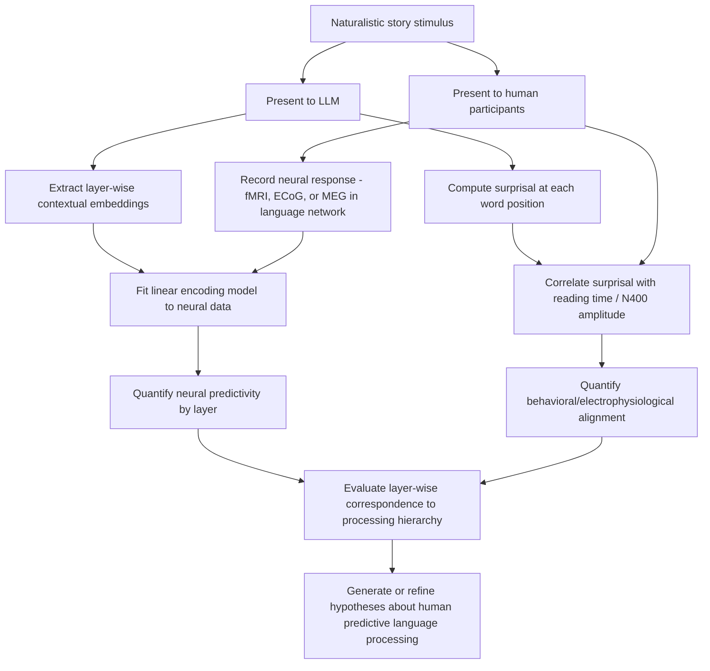

## Large Language Models and Human Language Processing

### Overview

Large language model (LLM) and human language processing research examines whether transformer-based neural network architectures, trained to predict text via next-token prediction over massive text corpora, develop internal representations and processing dynamics that parallel those underlying human language comprehension and production. This research program parallels the deep learning-visual cortex alignment literature but applies to linguistic processing, using LLM internal states as a candidate computational model of the human language network.

**Key Points**

- LLMs are trained predominantly via **self-supervised next-word (or next-token) prediction**, learning to estimate the probability distribution over the next token given preceding context, without explicit linguistic rule supervision
- A growing body of work demonstrates that LLM internal representations, particularly from intermediate layers, show significant quantitative alignment with human neural responses (fMRI, ECoG, MEG) during naturalistic language comprehension
- This alignment has renewed debate about long-standing questions in psycholinguistics and cognitive science regarding the role of prediction, statistical learning, and hierarchical syntactic structure in human language processing

---

### Transformer Architecture Fundamentals

- The transformer architecture, introduced by Vaswani and colleagues, relies on the **self-attention mechanism**, which computes weighted relationships between all tokens in an input sequence in parallel, allowing the model to flexibly weight the relevance of any prior context token when processing a given position
- Unlike earlier recurrent architectures (LSTMs, GRUs) that process sequences step-by-step, transformers process entire sequences with attention-based context integration, enabling substantially more efficient parallelized training on very large corpora
- Modern large language models stack many transformer layers (often dozens to over a hundred), with each layer progressively refining a contextualized representation of each token, culminating in output layers used to predict the next token's probability distribution

$$\text{Attention}(Q, K, V) = \text{softmax}\left(\frac{QK^T}{\sqrt{d_k}}\right)V$$

Where $Q$, $K$, $V$ are the query, key, and value matrices derived from the input representations, and $d_k$ is the dimensionality of the key vectors, used as a scaling factor.

---

### Neural Alignment: LLMs and the Human Language Network

#### Core Empirical Findings

- Multiple studies using naturalistic story-listening or story-reading paradigms combined with fMRI, electrocorticography (ECoG), and MEG have found that LLM layer activations predict human language network neural responses substantially above chance, using encoding-model methodology directly analogous to that used in visual cortex alignment research
- Alignment is strongest with regions of the classical **fronto-temporal language network**, including left inferior frontal gyrus (Broca's area territory) and superior/middle temporal regions (Wernicke's area territory and surrounding cortex), consistent with these regions' established role in language comprehension
- As with visual models, alignment tends to be strongest in intermediate network layers rather than the earliest or final layers, with the earliest layers showing better correspondence to lower-level, more surface-form-sensitive processing and later layers showing correspondence patterns more associated with integrative, contextual meaning representation [Inference: precise layer-by-layer correspondence to specific processing stages remains an active area of ongoing characterization]

#### Next-Word Prediction as a Shared Computational Principle

- A central and influential claim emerging from this line of research is that **next-word prediction**, the training objective of LLMs, may itself be closely related to a genuine computational principle employed by the human brain during language comprehension, rather than being merely an engineering convenience
- This claim connects to a long-standing literature in psycholinguistics on predictive processing during language comprehension, including the well-established **N400 event-related potential (ERP) component**, whose amplitude is modulated by the predictability/surprisal of an upcoming word given prior context—providing a pre-existing human electrophysiological marker of predictive language processing that LLM surprisal metrics can be directly compared against
- Studies have shown that LLM-derived **surprisal** (the negative log-probability the model assigns to the actual next word, given context) correlates with human reading times (self-paced reading, eye-tracking fixation durations) and with N400 amplitude, providing convergent behavioral and electrophysiological evidence linking LLM-internal predictive computation to human language processing dynamics

$$\text{Surprisal}(w_t) = -\log P(w_t \mid w_1, \ldots, w_{t-1})$$

Where $P(w_t \mid w_1, \ldots, w_{t-1})$ is the model's predicted probability of the actual observed word $w_t$ given preceding context.

**Example**

In a naturalistic story-listening fMRI paradigm, surprisal values computed from a large language model at each word position correlate significantly with BOLD signal amplitude increases in the language network at corresponding time points, and this surprisal-based encoding model explains a significant portion of neural response variance beyond simpler models based on word frequency or part-of-speech alone—demonstrating that LLM-derived contextual prediction captures neurally relevant information not captured by simpler linguistic features.

---

### Syntactic and Hierarchical Structure Sensitivity

**Key Points**

- A key theoretical question concerns whether transformer-based LLMs, which lack explicit built-in hierarchical/recursive syntactic structure (unlike some classical symbolic parsing models), nonetheless learn to implicitly represent hierarchical syntactic dependencies from statistical exposure alone
- Probing studies (training simple classifiers on frozen LLM internal representations to predict syntactic properties such as part-of-speech, dependency relations, or constituency structure) have found that syntactic information is substantially decodable from LLM internal representations, suggesting the models implicitly encode structure-sensitive information despite lacking explicit architectural syntactic priors
- LLMs show measurable sensitivity to long-distance syntactic dependencies (e.g., subject-verb agreement across intervening clauses) in controlled psycholinguistic-style evaluation paradigms, though performance can degrade with increased sentence complexity or unusual/rare syntactic constructions, and the precise degree to which this reflects genuine hierarchical structural representation versus sophisticated sequential statistical approximation remains debated [Unverified: this constitutes one of the most actively contested questions in the LLM-linguistics interface, with strong arguments and evidence presented on multiple sides]

---

### Comparison to Classical Psycholinguistic Theory

| Framework/Finding | Classical Psycholinguistic Account | LLM-Based Reframing |
| --- | --- | --- |
| Predictive processing during comprehension | N400 as index of lexical predictability | Surprisal correlates with N400 and reading time |
| Syntactic parsing | Rule-based hierarchical parsers (e.g., generative grammar-inspired models) | Implicit structure emerges from statistical training without explicit rules |
| Garden-path sentence processing | Serial/parallel parsing models with reanalysis costs | LLM surprisal spikes at disambiguation points parallel human reading-time slowdowns |
| Semantic composition | Compositional semantic theories (structured meaning combination) | Contextual embeddings integrate meaning via distributed attention-weighted combination |

- Garden-path sentences (temporarily structurally ambiguous sentences requiring reanalysis, e.g., "The horse raced past the barn fell") have been used to test whether LLMs show elevated surprisal at the point of syntactic disambiguation analogous to the well-documented human reading-time slowdown at the same point, with several studies reporting qualitatively similar patterns, offering a further point of convergence between model and human processing signatures [Inference: convergence in surprisal patterns does not establish that models resolve the ambiguity via the same reanalysis mechanism proposed in classical parsing theories]

---

### Language Network Localization Methodology

- Much of this research relies on individually functionally localized language regions (using independent language localizer tasks in each participant) rather than group-averaged anatomical coordinates, a methodological approach that has substantially improved sensitivity and specificity in human language neuroimaging research given known inter-individual variability in language network topography
- This individual-subject functional localization approach, combined with naturalistic (rather than isolated single-word or single-sentence) stimuli, represents a methodological shift that has been particularly important for enabling meaningful LLM-brain alignment comparisons under ecologically valid, continuous language processing conditions

---

### Alignment and Comparison Pipeline

---

### Language Network Alignment Diagram

<svg xmlns="http://www.w3.org/2000/svg" viewBox="0 0 740 380">
<title>LLM Layer Correspondence to Human Language Network Regions (svg_diagram)</title>
<rect x="0" y="0" width="740" height="380" fill="#ffffff" />
<text x="370" y="25" font-size="15" font-weight="bold" text-anchor="middle" fill="#1a1a1a">LLM-Human Language Network Alignment (svg_diagram)</text>
<rect x="40" y="70" width="200" height="60" rx="8" fill="#dbeafe" stroke="#2563eb" stroke-width="1.5" />
<text x="140" y="93" font-size="12" text-anchor="middle" fill="#1e3a8a">Early Transformer Layers</text>
<text x="140" y="110" font-size="10" text-anchor="middle" fill="#1e3a8a">Surface form, lexical features</text>
<rect x="270" y="70" width="200" height="60" rx="8" fill="#fef3c7" stroke="#d97706" stroke-width="1.5" />
<text x="370" y="93" font-size="12" text-anchor="middle" fill="#78350f">Middle Transformer Layers</text>
<text x="370" y="110" font-size="10" text-anchor="middle" fill="#78350f">Syntactic, contextual integration</text>
<rect x="500" y="70" width="200" height="60" rx="8" fill="#dcfce7" stroke="#16a34a" stroke-width="1.5" />
<text x="600" y="93" font-size="12" text-anchor="middle" fill="#14532d">Late Transformer Layers</text>
<text x="600" y="110" font-size="10" text-anchor="middle" fill="#14532d">Task/output-specific representation</text>
<path d="M140 130 L140 190" stroke="#2563eb" stroke-width="2" stroke-dasharray="3,2" marker-end="url(#a7)" />
<path d="M370 130 L370 190" stroke="#d97706" stroke-width="2.5" marker-end="url(#a7)" />
<path d="M600 130 L600 190" stroke="#16a34a" stroke-width="2" stroke-dasharray="3,2" marker-end="url(#a7)" />
<rect x="200" y="200" width="340" height="70" rx="8" fill="#ede9fe" stroke="#7c3aed" stroke-width="1.5" />
<text x="370" y="225" font-size="12" text-anchor="middle" fill="#4c1d95">Fronto-Temporal Language Network</text>
<text x="370" y="243" font-size="10" text-anchor="middle" fill="#4c1d95">Left IFG (Broca's territory)</text>
<text x="370" y="258" font-size="10" text-anchor="middle" fill="#4c1d95">Superior/Middle Temporal (Wernicke's territory)</text>

<text x="370" y="320" font-size="11" text-anchor="middle" fill="`#4b5563`">Strongest alignment typically observed with middle-layer representations</text>

</svg>

---

### Limitations and Open Debates

**Key Points**

- **Prediction versus comprehension**: strong surprisal-neural correlations demonstrate that predictive computation is relevant to observed neural dynamics, but do not establish that next-word prediction is the *sole* or even primary computational objective the human language system optimizes for; human language comprehension additionally involves referential, pragmatic, and world-knowledge integration processes not obviously reducible to token-level prediction [Inference]
- **Architectural implausibility**: standard transformer self-attention computes relationships across the full input context with parallel, non-incremental processing during training, which differs substantially from the strictly incremental, left-to-right, real-time processing constraints of human sentence comprehension, raising questions about the biological plausibility of the underlying mechanism despite representational alignment [Inference]
- **Confound of statistical co-occurrence with genuine linguistic structure**: as with visual alignment research, high alignment scores could in principle reflect convergent solutions to shared surface statistical regularities in language rather than shared deep structural/compositional computation, and disentangling these possibilities remains methodologically challenging [Unverified]
- Most alignment studies to date have focused on relatively passive language comprehension (listening, reading); alignment during active language production remains comparatively underexplored and methodologically more difficult to study with current neuroimaging approaches

---

### Clinical-Translational Correlates

**Example**

LLM-derived surprisal and contextual embedding measures are increasingly used as objective, quantitative severity markers in research on aphasia and other acquired language disorders, where comparing a patient's language production statistics against LLM-based expected language models can help quantify subtle deficits in lexical selection, syntactic complexity, or discourse coherence beyond what traditional clinical language batteries capture, though clinical validation of these methods remains in relatively early stages [Unverified: clinical utility and diagnostic validity of LLM-based language markers requires further prospective validation].

- Speech-to-text and brain-computer interface research for communication restoration in individuals with severe motor speech impairment (e.g., ALS, locked-in syndrome) increasingly incorporates language model components to improve decoding accuracy from neural signals, leveraging LLM-based contextual prediction to disambiguate noisy neural decoding output
- Computational psycholinguistic models derived from LLM alignment research are informing new theoretical accounts of language processing differences in developmental language disorders and are being explored as tools for characterizing discourse-level language changes in early neurodegenerative conditions

---

### Related Topics

- Transformer architecture and self-attention mechanism fundamentals
- N400 event-related potential and predictive language processing
- Surprisal theory in psycholinguistics and reading-time research
- Broca's and Wernicke's area function in the fronto-temporal language network
- Probing classifiers and interpretability methods for neural network representations
- Garden-path sentences and syntactic reanalysis in human parsing
- Individual functional localization methodology in language neuroimaging
- Brain-computer interfaces for communication restoration
- Naturalistic neuroimaging paradigms (story-listening fMRI/ECoG)
- Compositional semantics and distributed representation theories