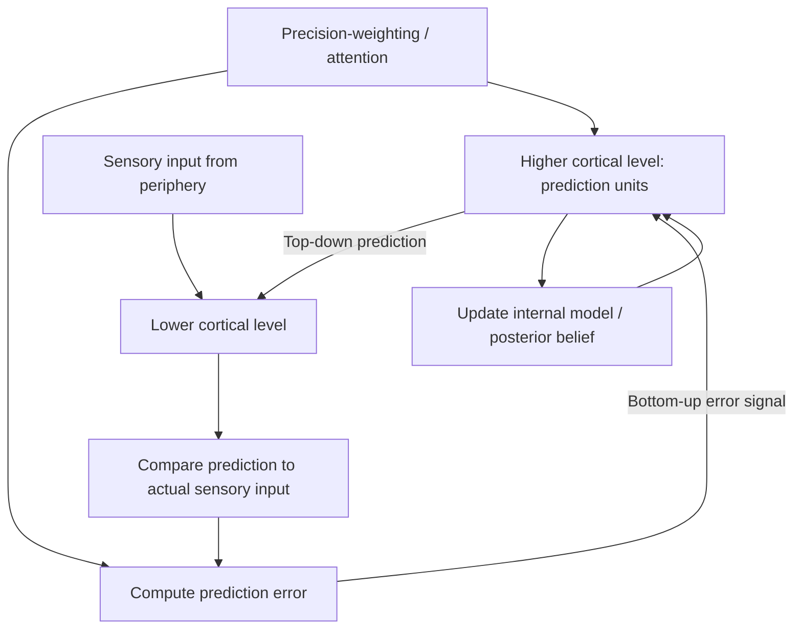

## Predictive Coding and the Bayesian Brain

### Overview

The predictive coding and Bayesian brain framework proposes that the brain functions fundamentally as a hierarchical inference machine, continuously generating top-down predictions about the causes of its sensory input and updating internal models based on the mismatch (prediction error) between predicted and actual input. This framework unifies perception, action, attention, and learning under a single formal computational principle grounded in Bayesian probability theory, representing one of the most influential unifying theoretical frameworks in contemporary theoretical neuroscience.

**Key Points**

- The Bayesian brain hypothesis proposes that neural computation approximates Bayesian inference: combining prior beliefs with sensory evidence, weighted by their relative reliability (precision), to generate a posterior belief about the state of the world
- Predictive coding provides a specific proposed neural implementation of this broader Bayesian framework, in which only prediction errors (rather than raw sensory data) are propagated forward through the cortical hierarchy
- The framework has been extended into **active inference**, which incorporates action selection as a means of minimizing prediction error, alongside internal belief updating

---

### Bayesian Inference: Formal Foundation

- Bayesian inference formalizes how a prior belief should be optimally updated in light of new evidence, using Bayes' theorem to compute a posterior probability distribution over possible states of the world

$$P(s \mid o) = \frac{P(o \mid s) \, P(s)}{P(o)}$$

Where $P(s \mid o)$ is the posterior probability of a hidden state $s$ given observation $o$, $P(o \mid s)$ is the likelihood, $P(s)$ is the prior, and $P(o)$ is the marginal probability of the observation (evidence).

- In the neural implementation context, this is often expressed as a precision-weighted combination of prior and sensory evidence, where **precision** refers to the inverse of variance—a measure of the reliability or confidence associated with a given source of information

$$\hat{s} = \frac{\pi_{prior} \mu_{prior} + \pi_{sensory} \, o}{\pi_{prior} + \pi_{sensory}}$$

Where $\hat{s}$ is the resulting posterior estimate, $\mu_{prior}$ is the prior mean, $o$ is the sensory observation, and $\pi_{prior}$, $\pi_{sensory}$ denote the precision of the prior and sensory channels respectively.

- A key qualitative implication: when sensory precision is high (reliable, low-noise input), the posterior estimate is weighted more heavily toward sensory evidence; when prior precision is high (strong, confident prior belief) or sensory input is noisy/ambiguous, the posterior is weighted more heavily toward the prior—providing a formal account of numerous perceptual phenomena in which context and expectation bias perception

---

### Predictive Coding: Proposed Neural Implementation

#### Hierarchical Prediction and Error Propagation

- Predictive coding proposes that cortical hierarchies are organized into reciprocally connected levels, where each level generates a top-down prediction about the expected activity at the level below, and only the **residual prediction error** (the difference between prediction and actual input) is passed forward (bottom-up) to update representations at higher levels
- This architecture is proposed to be implemented via distinct neuronal populations: **prediction units** encoding the current best estimate of hidden causes, and **error units** encoding the discrepancy between predictions and observed activity, with feedback connections carrying predictions and feedforward connections carrying prediction errors
- Prominent implementational proposals (e.g., the Rao and Ballard model, and later elaborations within the predictive coding literature) have linked this circuit logic to the known laminar organization of cortical microcircuits, proposing that superficial cortical layers preferentially carry feedforward error signals while deep layers carry feedback predictions, broadly consistent with known anatomical patterns of feedforward/feedback laminar connectivity, though the precise mapping of specific neuron types onto "prediction" versus "error" functional roles remains an area of ongoing empirical investigation [Unverified: the degree to which specific laminar/cell-type predictions of the model have been directly confirmed electrophysiologically remains incomplete and actively researched]

#### Precision as Attentional Gain

- Within this framework, **attention** is formalized as the precision-weighting (confidence-weighting) assigned to prediction errors: increasing the gain on a particular error signal increases its influence on subsequent belief updating, providing a unified computational account linking attention and Bayesian inference
- This reframes classical attentional gain modulation (well-documented in single-unit recordings showing enhanced firing rates for attended stimuli) as a specific instance of precision-weighting within the broader predictive coding computational scheme

---

### Predictive Coding Circuit Diagram

---

### Active Inference and the Free Energy Principle

**Key Points**

- **Active inference**, developed extensively by Karl Friston, extends predictive coding to incorporate action: rather than only updating internal beliefs to reduce prediction error (perceptual inference), an agent can also act on the world to change sensory input so that it conforms to predictions (active inference proper)
- This framework is unified under the **free energy principle**, which proposes that biological self-organizing systems act to minimize a quantity called variational free energy, an upper bound on "surprise" (the negative log-probability of sensory observations given the organism's generative model)
- Under active inference, motor commands are reframed not as outputs computed from a separate control system, but as themselves generated by proprioceptive predictions that the motor system fulfills via classical reflex arcs—a reconceptualization in which action execution is achieved by predicting the sensory consequences of movement and allowing low-level reflexive mechanisms to minimize the resulting prediction error

$$F = D_{KL}[q(s) \, \| \, p(s \mid o)] - \ln p(o)$$

Where $F$ is variational free energy, $D_{KL}$ is the Kullback-Leibler divergence between the approximate posterior $q(s)$ and the true posterior $p(s \mid o)$, and $\ln p(o)$ relates to model evidence for the observations.

- [Inference] The free energy principle has been proposed by its proponents as a highly general, potentially unifying framework applicable across perception, action, learning, and even broader biological self-organization; this degree of generality has drawn both substantial interest and significant critique regarding falsifiability and the risk of the framework being unfalsifiable or overly flexible in post-hoc explanatory application

---

### Empirical Applications and Supporting Phenomena

#### Perceptual Phenomena Explained by Precision-Weighting

- **Bistable perception** (e.g., binocular rivalry, ambiguous figures) has been modeled as reflecting competing generative model hypotheses with fluctuating relative precision/confidence, with perceptual switches corresponding to shifts in which hypothesis currently has higher posterior probability
- **Illusions arising from strong priors** (e.g., the hollow-face illusion, where a concave mask is perceived as convex due to a strong prior favoring convex faces) are interpreted within this framework as instances where a strong prior overrides otherwise informative but lower-precision sensory evidence
- Repetition suppression (reduced neural response to repeated/predictable stimuli) has been reinterpreted within predictive coding as reflecting reduced prediction error for expected, repeated input, rather than solely reflecting simple neuronal fatigue or adaptation

#### Clinical Applications: Psychosis

- Aberrant precision-weighting has been proposed as a unifying computational account of psychotic symptoms: **hallucinations** may arise from assigning excessive precision to top-down predictions/priors relative to sensory evidence (causing perception to be dominated by expectation rather than actual input), while **delusions** may arise from a complementary failure to appropriately down-weight the precision of unexpected, low-level sensory prediction errors, causing spurious or noisy signals to be assigned inappropriately high explanatory significance, driving aberrant belief formation
- This framework connects to and provides a computational elaboration of the aberrant salience hypothesis of dopamine dysfunction in schizophrenia, proposing that dopaminergic signaling may physiologically implement precision-weighting of prediction errors [Inference: the specific mapping between dopaminergic signaling and formal precision parameters remains a theoretical proposal requiring further direct empirical validation]

#### Clinical Applications: Autism Spectrum Conditions

- Some computational accounts have proposed that autism spectrum conditions involve atypically **high and inflexible precision** assigned to sensory prediction errors relative to priors, potentially accounting for sensory hypersensitivity, a preference for predictable/repetitive environments, and difficulty with contextual/prior-based disambiguation of ambiguous information
- This account remains one of several competing computational proposals for autism, and has faced empirical challenges and alternative formulations proposing different, sometimes opposite, patterns of altered precision-weighting across different sensory/cognitive domains [Unverified: no single computational account of autism within the predictive coding framework has achieved consensus support, and this remains an active area of competing theoretical development]

---

### Precision-Weighting and Clinical Symptom Model Diagram

<svg xmlns="http://www.w3.org/2000/svg" viewBox="0 0 740 380">
<title>Precision-Weighting Model of Psychotic Symptom Generation (svg_diagram)</title>
<rect x="0" y="0" width="740" height="380" fill="#ffffff" />
<text x="370" y="25" font-size="15" font-weight="bold" text-anchor="middle" fill="#1a1a1a">Precision-Weighting Model of Psychotic Symptoms (svg_diagram)</text>
<rect x="40" y="70" width="280" height="80" rx="8" fill="#dbeafe" stroke="#2563eb" stroke-width="1.5" />
<text x="180" y="95" font-size="12" font-weight="bold" text-anchor="middle" fill="#1e3a8a">Excessive prior precision</text>
<text x="180" y="113" font-size="10" text-anchor="middle" fill="#1e3a8a">(top-down prediction dominates</text>
<text x="180" y="128" font-size="10" text-anchor="middle" fill="#1e3a8a">over sensory evidence)</text>
<text x="180" y="143" font-size="11" font-weight="bold" text-anchor="middle" fill="#dc2626">→ Hallucinations</text>
<rect x="420" y="70" width="280" height="80" rx="8" fill="#fee2e2" stroke="#dc2626" stroke-width="1.5" />
<text x="560" y="95" font-size="12" font-weight="bold" text-anchor="middle" fill="#7f1d1d">Excessive sensory error precision</text>
<text x="560" y="113" font-size="10" text-anchor="middle" fill="#7f1d1d">(noisy prediction errors assigned</text>
<text x="560" y="128" font-size="10" text-anchor="middle" fill="#7f1d1d">inappropriate significance)</text>
<text x="560" y="143" font-size="11" font-weight="bold" text-anchor="middle" fill="#dc2626">→ Delusions</text>
<rect x="200" y="210" width="340" height="60" rx="8" fill="#f3f4f6" stroke="#4b5563" stroke-width="1.5" />
<text x="370" y="235" font-size="12" text-anchor="middle" fill="#1f2937">Proposed dopaminergic implementation</text>
<text x="370" y="253" font-size="10" text-anchor="middle" fill="#1f2937">of aberrant precision-weighting (theoretical)</text>
<path d="M180 150 L300 210" stroke="#374151" stroke-width="1.5" fill="none" />
<path d="M560 150 L440 210" stroke="#374151" stroke-width="1.5" fill="none" />

<text x="370" y="320" font-size="10" text-anchor="middle" fill="`#4b5563`">Note: this remains a theoretical framework requiring further direct validation</text>

</svg>

---

### Methodological Approaches to Testing the Framework

**Key Points**

- **Mismatch negativity (MMN)**, an event-related potential elicited by unexpected/deviant auditory stimuli within a predictable sequence, is widely used as an electrophysiological index of prediction error signaling and has been extensively studied as a candidate biomarker in schizophrenia research, where reduced MMN amplitude is a well-replicated finding interpreted as reflecting impaired prediction error generation [Inference: MMN reduction is a robust and widely replicated finding in schizophrenia, though its precise mechanistic interpretation within a strict predictive coding framework, versus alternative accounts, remains a topic of ongoing discussion]
- Computational modeling studies fit hierarchical Bayesian models (e.g., the Hierarchical Gaussian Filter) to behavioral data from learning and decision-making tasks, extracting individual-level estimates of belief-updating parameters and precision-weighting tendencies, which are then related to symptom measures or neural data
- Pharmacological manipulation studies (e.g., NMDA receptor antagonist administration, dopaminergic manipulation) are used to test specific proposed neurotransmitter-precision mappings, providing a causal intervention approach to testing components of the broader theoretical framework

---

### Critiques and Limitations

**Key Points**

- **Falsifiability concerns**: critics have argued that the extreme generality of the free energy principle and predictive coding framework risks rendering it difficult to falsify, since nearly any observed neural or behavioral pattern can potentially be redescribed post-hoc in terms of prediction, error, and precision-weighting without generating strong, independently falsifiable a priori predictions [Unverified: this remains a genuine, actively debated methodological critique within the field, distinct from questions about the framework's specific empirical instantiations]
- **Underdetermination of specific neural implementation**: while the abstract computational framework is mathematically well-specified, the specific proposed neural/laminar implementation (which cell types and circuits instantiate "prediction" versus "error" units) remains only partially confirmed by direct electrophysiological evidence, and alternative circuit implementations consistent with the same general computational principle have been proposed
- Direct, decisive discrimination between predictive coding and competing theoretical frameworks (e.g., standard hierarchical feedforward processing models, alternative Bayesian implementations) using currently available neuroimaging and electrophysiological methods remains methodologically challenging, given that multiple distinct circuit implementations can often produce statistically similar observable signatures [Inference]

---

### Clinical-Translational Correlates

**Example**

A patient with early psychosis undergoing an auditory oddball MMN paradigm shows significantly reduced mismatch negativity amplitude compared to healthy controls, consistent with the broader literature linking reduced MMN to schizophrenia-spectrum conditions; within a predictive coding framework, this finding is interpreted as reflecting impaired generation or propagation of bottom-up prediction error signals, informing NMDA receptor-focused mechanistic hypotheses about the disorder consistent with the broader NMDA receptor hypofunction model of psychosis.

- Predictive coding-informed computational psychiatry approaches are being explored to develop individualized computational biomarkers derived from precision-weighting parameter estimates, intended to eventually inform diagnosis or treatment stratification, though this application remains substantially at the research stage rather than validated clinical practice [Unverified]
- The framework has informed novel therapeutic conceptualizations, including reframing certain psychotherapeutic interventions (e.g., exposure-based treatments for anxiety disorders) in terms of updating maladaptive high-precision threat-related priors through controlled exposure to disconfirming sensory evidence

---

### Related Topics

- Free energy principle and active inference (Friston framework)
- Mismatch negativity (MMN) as an electrophysiological index of prediction error
- Aberrant salience hypothesis and dopamine dysfunction in schizophrenia
- Hierarchical Gaussian Filter and computational modeling of belief updating
- NMDA receptor hypofunction and glutamatergic models of psychosis
- Attention as precision-weighting: unifying computational frameworks
- Cortical laminar microcircuit organization and feedforward/feedback connectivity
- Computational accounts of autism spectrum sensory processing
- Bistable perception and binocular rivalry as tests of Bayesian inference
- Exposure-based psychotherapy reframed through predictive coding theory