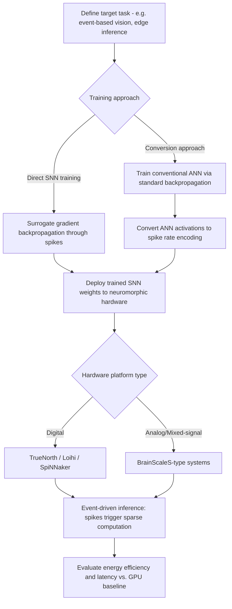

## Brain-Inspired Computing Architectures

### Overview

Brain-inspired computing architectures encompass hardware and algorithmic systems designed to emulate structural or functional principles of biological neural computation, motivated by the brain's remarkable energy efficiency, robustness to noise and component failure, and capacity for adaptive, real-time learning. This field spans a spectrum from **neuromorphic hardware** (physical silicon systems implementing spiking neural dynamics) to **algorithmic frameworks** (spiking neural networks, biologically plausible learning rules) that can run on conventional or specialized hardware, united by the shared goal of narrowing the substantial efficiency gap between biological and conventional digital computation.

**Key Points**

- The primary engineering motivation is energy efficiency: the human brain operates on approximately 20 watts of power while performing computations that would require orders of magnitude more energy on conventional von Neumann architecture hardware, motivating hardware designs that depart from the traditional separation of memory and processing
- Neuromorphic systems typically implement some combination of: spiking (event-driven) communication, in-memory or near-memory computation, massive parallelism, and analog or mixed-signal circuit design, in contrast to the synchronous, clocked, digital, memory-processor-separated architecture of conventional CPUs/GPUs
- The field bridges computational neuroscience (providing biological design principles), computer engineering (implementing them in silicon), and machine learning (developing algorithms suited to event-driven, low-precision hardware)

---

### The Von Neumann Bottleneck and Motivation for Neuromorphic Design

- Conventional digital computer architecture, following the von Neumann model, physically separates memory (data storage) from the central processing unit, requiring continuous data transfer between the two—a design bottleneck responsible for a substantial proportion of energy consumption and latency in data-intensive computation such as deep neural network inference
- Biological neural systems, by contrast, perform computation and memory storage in an integrated manner at the synapse: synaptic weights simultaneously store information and directly participate in the computation (signal transmission and integration) occurring at that connection point, without an analogous separated memory-fetch step
- Neuromorphic architectures explicitly attempt to replicate this integrated memory-computation principle, often termed **in-memory computing** or **compute-in-memory**, to reduce the energy and latency costs associated with the von Neumann bottleneck

---

### Spiking Neural Networks (SNNs)

#### Core Computational Principles

- Spiking neural networks represent the primary algorithmic framework underlying most neuromorphic hardware, using discrete, event-driven spikes (analogous to biological action potentials) rather than continuous-valued activations as used in conventional deep learning (artificial neural networks, ANNs)
- Information in SNNs can be encoded through multiple schemes: **rate coding** (information conveyed by spike frequency over a time window, analogous to firing rate coding in biological neurons), **temporal coding** (information conveyed by precise spike timing), and **population coding** (information distributed across the relative activity pattern of a neuron population)
- Neuron models used in SNNs range from simplified leaky integrate-and-fire (LIF) neurons, favored for hardware efficiency, to more biophysically detailed models (e.g., Izhikevich neurons) when greater dynamical richness is required, reflecting the same biological-realism-versus-tractability trade-off found in computational neuroscience modeling more broadly

$$\tau \frac{dV}{dt} = -(V - V_{rest}) + R I(t)$$

The leaky integrate-and-fire model: membrane potential $V$ decays toward resting potential $V_{rest}$ with time constant $\tau$, driven by input current $I(t)$ and membrane resistance $R$; a spike is emitted and $V$ is reset when $V$ crosses a threshold.

#### Event-Driven, Sparse Computation

- A key efficiency advantage of SNNs on appropriately designed hardware is **event-driven, sparse computation**: because information is communicated only via discrete spike events rather than continuous activation values computed at every clock cycle, computation and energy expenditure occur only when and where spikes actually happen, potentially yielding substantial efficiency gains for sparse, temporally structured input compared to dense, synchronous ANN computation
- This sparsity advantage is most pronounced for temporally structured, event-based sensory input (e.g., from neuromorphic/event-based cameras), where SNNs can, in principle, avoid the wasted computation on unchanged/static regions of a scene that conventional frame-based processing would still fully recompute at each frame

---

### Major Neuromorphic Hardware Platforms

| Platform | Developer | Key Architectural Feature |
| --- | --- | --- |
| TrueNorth | IBM | Large-scale digital neuromorphic chip; massively parallel, event-driven, low-power digital neurosynaptic cores |
| Loihi / Loihi 2 | Intel | Digital neuromorphic research chip with on-chip learning (programmable synaptic plasticity rules) |
| SpiNNaker / SpiNNaker 2 | University of Manchester | Massively parallel digital architecture using ARM cores optimized for large-scale spiking network simulation |
| BrainScaleS | Heidelberg University | Analog/mixed-signal neuromorphic system operating at accelerated-than-biological time scales |
| Akida | BrainChip | Commercial edge-AI neuromorphic processor targeting low-power inference applications |

[Unverified] Specific performance benchmarks, power consumption figures, and current commercial/research availability of these platforms are subject to ongoing hardware development; figures reported in various publications should be verified against current vendor documentation given the rapid pace of iteration in this space.

#### Digital vs. Analog/Mixed-Signal Approaches

- **Digital neuromorphic systems** (e.g., TrueNorth, Loihi, SpiNNaker) implement spiking neuron and synapse dynamics using conventional digital logic, offering greater precision, reproducibility, and ease of programming/debugging, at some cost to the maximal energy efficiency achievable
- **Analog and mixed-signal systems** (e.g., BrainScaleS) implement neuron and synapse dynamics using physical analog circuit properties (e.g., capacitor charge/discharge dynamics directly implementing membrane potential integration), potentially offering greater energy efficiency and more direct physical analogy to biological dynamics, at the cost of increased susceptibility to circuit noise, manufacturing variability, and more challenging programmability
- On-chip, local synaptic plasticity (implementing spike-timing-dependent plasticity or other biologically inspired learning rules directly in hardware) is a key differentiating feature across platforms, with some systems (e.g., Loihi) explicitly supporting programmable on-chip learning rather than requiring offline training followed by weight deployment

---

### Biologically Plausible Learning Rules

**Key Points**

- Standard backpropagation, the dominant training algorithm for conventional deep learning, is widely considered biologically implausible as a literal synaptic learning mechanism, primarily due to its requirement for symmetric forward/backward weight transport and non-local error signal propagation, neither of which have clear biological correlates
- **Spike-timing-dependent plasticity (STDP)**, a biologically documented synaptic plasticity rule in which the relative timing of pre- and post-synaptic spikes determines the direction and magnitude of synaptic weight change (potentiation for pre-before-post timing, depression for post-before-pre timing, in the classical formulation), is among the most widely implemented biologically inspired learning rules in neuromorphic hardware and SNN research
- Alternative biologically plausible learning approaches being actively researched include **feedback alignment** (using fixed, random feedback weights instead of exact symmetric backward weights), **predictive coding-based learning** (deriving local learning rules from the predictive coding framework's error-minimization objective), and various local, Hebbian-inspired learning rules, all motivated by the goal of achieving effective learning using only locally available information at each synapse, more closely approximating known biological constraints [Inference: while these methods have shown promise on smaller-scale benchmark tasks, none has yet been demonstrated to match backpropagation's training effectiveness and scalability on very large-scale tasks, representing an active and unresolved research frontier]

---

### Training Approaches for Spiking Networks

- **Direct SNN training** using surrogate gradient methods: since the discrete, non-differentiable spike generation function is incompatible with standard gradient-based backpropagation, surrogate gradient approaches substitute a smooth, differentiable approximation of the spike function during the backward pass, enabling gradient-based training of SNNs despite their discrete dynamics
- **ANN-to-SNN conversion**: an alternative approach trains a conventional (non-spiking) ANN using standard backpropagation, then converts the trained network into an equivalent SNN by approximating ANN activation values via spike rates, leveraging mature ANN training infrastructure while still producing a deployable spiking network for neuromorphic hardware, though this approach can introduce some accuracy degradation and does not fully leverage the temporal dynamics unique to genuinely spike-based computation [Unverified: relative performance trade-offs between direct training and conversion approaches remain an active area of comparative research]

---

### Neuromorphic System Design Pipeline

---

### In-Memory Computing Architecture Diagram

<svg xmlns="http://www.w3.org/2000/svg" viewBox="0 0 740 360">
<title>Von Neumann versus In-Memory Neuromorphic Architecture (svg_diagram)</title>
<rect x="0" y="0" width="740" height="360" fill="#ffffff" />
<text x="370" y="25" font-size="15" font-weight="bold" text-anchor="middle" fill="#1a1a1a">Von Neumann vs. In-Memory Neuromorphic Architecture (svg_diagram)</text>

<text x="180" y="55" font-size="13" font-weight="bold" text-anchor="middle" fill="`#1f2937`">Conventional (Von Neumann)</text>

<rect x="80" y="75" width="200" height="55" rx="8" fill="#dbeafe" stroke="#2563eb" stroke-width="1.5" />
<text x="180" y="107" font-size="12" text-anchor="middle" fill="#1e3a8a">Memory (weights stored)</text>
<rect x="80" y="180" width="200" height="55" rx="8" fill="#fee2e2" stroke="#dc2626" stroke-width="1.5" />
<text x="180" y="212" font-size="12" text-anchor="middle" fill="#7f1d1d">Processor (CPU/GPU)</text>
<path d="M180 130 L180 175" stroke="#374151" stroke-width="2" marker-end="url(#a8)" />
<path d="M200 175 L200 130" stroke="#374151" stroke-width="2" marker-end="url(#a8)" />
<text x="230" y="155" font-size="9" fill="#7f1d1d">data transfer</text>
<text x="230" y="168" font-size="9" fill="#7f1d1d">bottleneck</text>

<text x="560" y="55" font-size="13" font-weight="bold" text-anchor="middle" fill="`#1f2937`">Neuromorphic (In-Memory)</text>

<rect x="460" y="75" width="200" height="160" rx="8" fill="#dcfce7" stroke="#16a34a" stroke-width="1.5" />
<text x="560" y="105" font-size="12" text-anchor="middle" fill="#14532d">Integrated synaptic</text>
<text x="560" y="122" font-size="12" text-anchor="middle" fill="#14532d">memory + computation</text>
<text x="560" y="150" font-size="10" text-anchor="middle" fill="#14532d">Spikes trigger local</text>
<text x="560" y="165" font-size="10" text-anchor="middle" fill="#14532d">weight-computation</text>
<text x="560" y="180" font-size="10" text-anchor="middle" fill="#14532d">at point of storage</text>
<text x="560" y="205" font-size="10" text-anchor="middle" fill="#14532d">No separate fetch step</text>

<text x="370" y="290" font-size="11" text-anchor="middle" fill="`#4b5563`">Eliminating the repeated memory-processor data transfer</text>

<text x="370" y="308" font-size="11" text-anchor="middle" fill="`#4b5563`">is a primary source of the targeted energy efficiency gain</text>

</svg>

---

### Applications and Use Cases

**Key Points**

- **Edge computing and low-power inference**: neuromorphic hardware's energy efficiency advantage is particularly relevant for battery-powered edge devices requiring real-time sensory processing (e.g., always-on keyword spotting, gesture recognition, autonomous drone/robotic sensing), where conventional GPU-based inference would be prohibitively power-hungry
- **Event-based sensing integration**: neuromorphic vision sensors (event-based/"silicon retina" cameras) that output sparse, asynchronous pixel-level brightness-change events rather than conventional dense frame-based images pair naturally with SNN processing, jointly offering high temporal resolution, low latency, and low power consumption for tasks such as high-speed object tracking
- **Large-scale brain simulation research**: platforms such as SpiNNaker were explicitly designed to support large-scale, biologically detailed spiking network simulation for computational neuroscience research purposes, distinct from the edge-inference application focus of some other neuromorphic platforms
- **Robotics and real-time control**: the low-latency, event-driven processing characteristic of neuromorphic systems is being explored for real-time sensorimotor control applications requiring rapid reactive responses to changing sensory input

---

### Current Limitations and Open Challenges

**Key Points**

- **Training difficulty**: SNNs remain generally more difficult to train effectively than conventional ANNs at large scale, given the non-differentiability of spikes and the comparative immaturity of surrogate gradient and biologically plausible learning methods relative to decades of backpropagation optimization refinement
- **Software and tooling ecosystem immaturity**: neuromorphic hardware programming frameworks remain considerably less mature, standardized, and user-friendly compared to the extensive, well-optimized software ecosystems (e.g., PyTorch, TensorFlow, associated hardware compilers) available for conventional GPU-based deep learning, representing a practical adoption barrier
- **Benchmark and accuracy gaps**: on many standard machine learning benchmark tasks, SNNs running on neuromorphic hardware have not generally matched the raw accuracy achieved by state-of-the-art conventional deep learning models on equivalent tasks, though the comparison is complicated by neuromorphic systems' distinct efficiency-accuracy trade-off profile and their particular suitability for specific task types (sparse, temporally structured, low-power scenarios) rather than general-purpose benchmark competition [Inference: whether this gap reflects fundamental limitations versus current relative immaturity of the field compared to decades of conventional deep learning optimization remains genuinely uncertain]
- Manufacturing variability and noise in analog/mixed-signal neuromorphic systems present ongoing engineering challenges for achieving consistent, reproducible large-scale deployment

---

### Clinical-Translational Correlates

**Example**

Neuromorphic processing approaches are being explored in experimental brain-computer interface systems, where the low-latency, event-driven, low-power characteristics of spiking neural network processing are well-suited to real-time decoding of neural signals from implanted electrode arrays in patients with severe motor impairment, potentially enabling more power-efficient, longer-battery-life implantable or wearable neural interface devices compared to conventional digital signal processing approaches.

- Neuromorphic hardware principles are being investigated for prosthetic control applications, where energy-efficient, real-time sensorimotor processing is directly relevant to extending battery life and reducing latency in closed-loop neuroprosthetic systems
- The broader research program of understanding biological neural computation to inform artificial hardware design creates a reciprocal relationship with computational neuroscience: engineering constraints and performance characteristics of neuromorphic systems can, in some cases, generate testable hypotheses about efficiency trade-offs potentially relevant to biological neural circuit design, though this reciprocal inferential direction requires particular methodological caution against overinterpretation [Inference]

---

### Related Topics

- Spike-timing-dependent plasticity (STDP) and synaptic learning rules
- Surrogate gradient methods for training spiking neural networks
- Event-based/neuromorphic vision sensors ("silicon retina" cameras)
- In-memory computing and the von Neumann bottleneck
- Loihi, TrueNorth, and SpiNNaker platform architectures
- Biologically plausible alternatives to backpropagation (feedback alignment, predictive coding-based learning)
- Edge AI and low-power inference applications
- Brain-computer interface hardware and neuromorphic signal decoding
- Analog versus digital circuit design trade-offs in neuromorphic engineering
- Leaky integrate-and-fire and Izhikevich neuron models