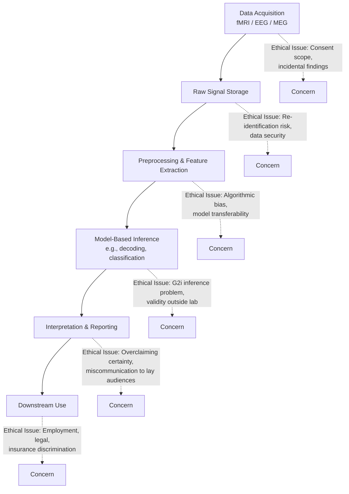

## Ethics of Neuroimaging and Mental Privacy

### Overview

Neuroimaging ethics concerns the moral, legal, and social implications of technologies that visualize or record brain structure and activity — including MRI, fMRI, EEG, PET, and emerging techniques like fNIRS and high-density EEG-based brain-computer interfaces (BCIs). Mental privacy is the specific sub-domain addressing whether, and under what conditions, third parties (governments, employers, insurers, researchers, corporations) may access information about an individual's neural states, and what protections individuals retain over inferences drawn from their brain data.

The field sits at the intersection of philosophy of mind, bioethics, law, and cognitive neuroscience. It has grown urgent as neuroimaging has moved from purely clinical/research contexts toward consumer neurotechnology (wearable EEG, "brain wellness" devices) and forensic/commercial applications (lie detection, neuromarketing, cognitive profiling).

---

### Core Ethical Principles

#### 1. Cognitive Liberty

**Key Points**

- Defined as the right of individuals to control their own mental processes and cognition, free from unauthorized interference or monitoring.
- Sometimes framed as a corollary of freedom of thought (protected in international human rights law, e.g., Article 18 of the Universal Declaration of Human Rights).
- Encompasses both a negative right (freedom *from* external manipulation or surveillance of one's mental states) and a positive right (freedom *to* alter one's own cognition, relevant to debates on cognitive enhancement and psychoactive substances).

[Inference] The application of cognitive liberty as a distinct legal doctrine (rather than an extension of existing privacy or bodily autonomy law) remains unsettled in most jurisdictions as of 2026.

#### 2. Mental Privacy

**Key Points**

- The claim that neural data — even when not directly "read" as thoughts — can support probabilistic inferences about mental states, traits, and dispositions that individuals have not consented to disclose.
- Distinguished from general informational privacy because neural data is: (a) generated involuntarily (b) difficult for the subject to consciously suppress or falsify, and (c) potentially informative about conditions the subject may not yet know about themselves (e.g., preclinical neurological disease markers).
- Raises the question of "decisional privacy" — protecting the right not to have decisions or preferences inferred from brain signals before they are behaviorally expressed.

#### 3. Mental Integrity

**Key Points**

- Protection against unauthorized alteration of an individual's mental states via direct neurotechnological intervention (e.g., neurostimulation, closed-loop BCIs that write as well as read).
- Distinct from privacy: integrity concerns *modification*, privacy concerns *observation*.

#### 4. Psychological Continuity / Personal Identity

**Key Points**

- Concerns whether neurotechnological intervention (deep brain stimulation, brain-computer interfaces, neuroprosthetics) can alter a person's sense of self, agency, or authenticity.
- Documented clinically in some deep brain stimulation (DBS) patients for Parkinson's disease and treatment-resistant depression, who report post-intervention changes in personality or decision-making that raise questions of informed consent to identity change.

---

### The "Neurorights" Framework

A prominent proposed framework (Ienca & Andorno, 2017) articulates four (later expanded to five) candidate neurorights:

1. **Right to cognitive liberty** — freedom to control one's own mental states.
2. **Right to mental privacy** — protection of neural data from unauthorized access.
3. **Right to mental integrity** — protection against harm from neurotechnology.
4. **Right to psychological continuity** — protection of personal identity from unconsented alteration.
5. **Right to protection from algorithmic bias** — protection against discriminatory interpretation of neural data (added in some later formulations).

**Example**

Chile amended its constitution in 2021 to explicitly protect "brain activity and the information derived from it," becoming the first country to codify neurorights at the constitutional level. Subsequent Chilean court rulings (e.g., against the company Emotiv regarding an EEG headset's data practices) have tested how these rights apply to commercial devices.

[Unverified] The precise scope and enforceability of Chile's neurorights provisions — including how courts will balance them against competing interests such as public safety or commercial data use — is still being determined through ongoing litigation and regulatory interpretation.

---

### Technical Basis for Privacy Concerns

#### What Neuroimaging Modalities Can and Cannot Reveal

| Modality | Spatial Resolution | Temporal Resolution | Practical Inferential Power | Portability/Accessibility |
| --- | --- | --- | --- | --- |
| fMRI (BOLD signal) | ~1–3 mm | Seconds | High (with decoding models) — can reconstruct rough visual imagery, some semantic categories | Low (fixed scanner, expensive) |
| EEG | Poor (~cm) | Milliseconds | Moderate — can detect P300 responses (recognition), some workload/attention states | High (consumer wearables exist) |
| fNIRS | Moderate | ~1 second | Moderate — cortical hemodynamics, workload | Moderate-high (wearable) |
| MEG | Good | Milliseconds | High but currently confined to research settings | Very low |
| Implanted electrodes (ECoG, intracortical) | Very high | Very high | Highest — direct decoding of imagined speech/movement in BCI research | Very low (invasive) |

**Key Points**

- Widely publicized results on "decoding thoughts" (e.g., reconstructing viewed images or imagined speech from fMRI) rely on machine learning models trained on extensive individual-specific data under controlled conditions; they do not generalize to covert, real-world "mind reading" without the subject's cooperation and extensive prior calibration.
- Techniques such as the P300-based Guilty Knowledge Test (GKT) and fMRI-based lie detection (e.g., marketed by companies such as No Lie MRI and Cephos in the 2000s–2010s) claimed to detect deception, but peer-reviewed evaluations have found accuracy rates that degrade substantially outside laboratory conditions and are vulnerable to countermeasures.
- [Inference] The gap between the technical reality of current decoding limits and public/legal perception of neuroimaging as reliable "mind reading" is itself considered by many ethicists to be a distinct harm, because it can lead to premature legal or commercial reliance on unvalidated inferences.

---

### Domains of Application and Associated Ethical Issues

#### 1. Clinical and Research Neuroimaging

**Key Points**

- Incidental findings: structural scans obtained for research purposes sometimes reveal clinically significant abnormalities (e.g., tumors, aneurysms) unrelated to the study's aims, raising questions about researchers' duty to disclose, since disclosure requires clinical follow-up infrastructure many research protocols lack.
- Informed consent complexity: research participants may not anticipate that raw imaging data, once collected, could later be reanalyzed with newer decoding algorithms not available at the time of consent (a temporal consent gap).
- Data sharing and open science: initiatives such as OpenNeuro and the Human Connectome Project promote data sharing for reproducibility, but raise re-identification risk, since structural MRI (particularly facial reconstruction from skull-adjacent tissue) can potentially be used to re-identify anonymized participants.

#### 2. Forensic and Legal Applications

**Key Points**

- Neuroimaging evidence has been introduced in criminal trials, primarily in sentencing/mitigation phases (e.g., arguing reduced culpability based on structural or functional brain abnormalities) rather than as direct proof of guilt or innocence.
- Courts have generally been more receptive to neuroimaging as mitigating evidence than as reliable lie-detection or intent-determination evidence, given the group-to-individual inference problem — most neuroimaging findings are validated at the group/statistical level and their application to a single individual defendant involves inferential uncertainty.
- The "my brain made me do it" defense raises deeper philosophical questions about the relationship between neural determinism and legal conceptions of free will and responsibility, without a documented consensus resolution.

#### 3. Employment and Insurance

**Key Points**

- Potential use cases (largely speculative/emerging as of 2026) include cognitive/attention monitoring via consumer EEG in high-risk occupations (aviation, transportation, industrial safety) and neuromarketing-derived consumer profiling.
- Insurance underwriting based on neuroimaging biomarkers of future disease risk (e.g., preclinical Alzheimer's markers) raises concerns analogous to genetic discrimination debates (cf. GINA — the U.S. Genetic Information Nondiscrimination Act of 2008 — which does not explicitly cover neural data).
- [Speculation] Some ethicists anticipate that neural data will eventually be treated by regulators similarly to genetic data, requiring purpose-built anti-discrimination statutes, though as of 2026 comprehensive neural-data-specific legislation remains rare outside jurisdictions like Chile.

#### 4. Commercial and Consumer Neurotechnology

**Key Points**

- Consumer EEG wearables (marketed for meditation, focus tracking, or sleep monitoring) collect neural data typically governed by standard commercial privacy policies and terms of service rather than health-data-specific regulation (e.g., HIPAA in the U.S. generally does not apply to non-clinical consumer devices).
- Neuromarketing uses EEG/fMRI to study consumer responses to advertising, raising concerns about targeting techniques that could exploit subconscious or pre-reflective responses that consumers cannot consciously access or resist.
- [Inference] The regulatory gap between consumer neurotech (largely unregulated) and clinical neuroimaging (heavily regulated) is considered by many privacy scholars to be the area of most active ethical and legal concern going into the late 2020s, given the scale of data collection outside clinical oversight.

---

### Governance and Regulatory Landscape

**Key Points**

- **UNESCO** adopted a "Recommendation on the Ethics of Neurotechnology" (2025) — the first global normative instrument specifically addressing neurotechnology ethics, encouraging member states to develop mental privacy protections. [Unverified: exact provisions and adoption status by individual member states should be checked against the current UNESCO text, as recommendations are non-binding and implementation varies.]
- **Chile**: constitutional neurorights amendment (2021), described above.
- **European Union**: neural data is generally treated as a special category of personal data under the GDPR's broader "health data" and "biometric data" provisions, though GDPR was not drafted with neurotechnology specifically in mind; the EU's AI Act (2024) touches on high-risk biometric categorization systems, which may extend to certain neurotechnology applications. [Inference] Whether GDPR's existing categories adequately cover the inferential/derivative nature of neural data (i.e., data *inferred* from neural signals, not just the raw signal) is actively debated among EU data protection scholars.
- **United States**: no comprehensive federal neural-data-specific law exists as of 2026; some states (e.g., Colorado's 2024 amendment to its Privacy Act, and California's proposed extensions to the CCPA) have begun explicitly classifying neural data as "sensitive personal information."
- **OECD** issued a 2019 Recommendation on Responsible Innovation in Neurotechnology, providing non-binding principles later referenced by several national policy frameworks.

---

### Philosophical Debates

#### Is Neural Data Categorically Different from Other Biometric Data?

**Key Points**

- **Argument for exceptionalism**: neural data is the physical substrate most proximate to subjective experience, cognition, and personal identity; its collection is arguably more intimately invasive than fingerprints or facial geometry, which reveal identity but not (currently) inner mental content.
- **Argument against exceptionalism**: current neuroimaging cannot reliably access propositional thought content outside constrained laboratory paradigms, so treating raw neural signals as equivalent to "reading minds" may overstate present technical capability and risks regulatory overreach or misallocated concern relative to more mature privacy threats (e.g., digital behavioral tracking).
- This is an active, unresolved debate in neuroethics and privacy law scholarship, without a documented consensus position.

#### The Group-to-Individual (G2i) Inference Problem

**Key Points**

- Most neuroimaging findings establish statistical relationships at the population level (e.g., "activation in region X correlates with deceptive responses across N subjects").
- Applying such findings to draw conclusions about a specific individual (e.g., in a courtroom) involves an inferential leap that the underlying statistics do not directly support, since population-level correlation does not guarantee individual-level diagnostic accuracy.
- This is a primary technical basis for skepticism toward forensic neuroimaging applications, distinct from the political/ethical objections.

---

### Illustrative Diagram: Ethical Tension Points Across the Neuroimaging Data Pipeline

---

### Diagram: Neurorights Framework Structure (svg_diagram)

<svg viewBox="0 0 760 420" xmlns="http://www.w3.org/2000/svg" font-family="Helvetica, Arial, sans-serif">
<text x="380" y="30" text-anchor="middle" font-size="18" font-weight="bold" fill="#1a1a2e">Neurorights Framework (svg_diagram)</text>
<circle cx="380" cy="220" r="70" fill="#4361ee" opacity="0.15" stroke="#4361ee" stroke-width="2"/>
<text x="380" y="215" text-anchor="middle" font-size="14" font-weight="bold" fill="#1a1a2e">Cognitive</text>
<text x="380" y="232" text-anchor="middle" font-size="14" font-weight="bold" fill="#1a1a2e">Liberty</text>
<circle cx="220" cy="140" r="90" fill="#f72585" opacity="0.12" stroke="#f72585" stroke-width="2"/>
<text x="220" y="130" text-anchor="middle" font-size="14" font-weight="bold" fill="#1a1a2e">Mental</text>
<text x="220" y="148" text-anchor="middle" font-size="14" font-weight="bold" fill="#1a1a2e">Privacy</text>
<circle cx="540" cy="140" r="90" fill="#3a86ff" opacity="0.12" stroke="#3a86ff" stroke-width="2"/>
<text x="540" y="130" text-anchor="middle" font-size="14" font-weight="bold" fill="#1a1a2e">Mental</text>
<text x="540" y="148" text-anchor="middle" font-size="14" font-weight="bold" fill="#1a1a2e">Integrity</text>
<circle cx="220" cy="320" r="90" fill="#2ec4b6" opacity="0.12" stroke="#2ec4b6" stroke-width="2"/>
<text x="220" y="310" text-anchor="middle" font-size="13" font-weight="bold" fill="#1a1a2e">Psychological</text>
<text x="220" y="328" text-anchor="middle" font-size="13" font-weight="bold" fill="#1a1a2e">Continuity</text>
<circle cx="540" cy="320" r="90" fill="#ff9f1c" opacity="0.12" stroke="#ff9f1c" stroke-width="2"/>
<text x="540" y="305" text-anchor="middle" font-size="12" font-weight="bold" fill="#1a1a2e">Protection from</text>
<text x="540" y="322" text-anchor="middle" font-size="12" font-weight="bold" fill="#1a1a2e">Algorithmic</text>
<text x="540" y="339" text-anchor="middle" font-size="12" font-weight="bold" fill="#1a1a2e">Bias</text>

<text x="380" y="400" text-anchor="middle" font-size="12" fill="#555">Overlapping, mutually reinforcing candidate rights (Ienca & Andorno, 2017; extended)</text>

</svg>

---

### Practical Frameworks for Ethical Review

**Key Points**

- Institutional Review Boards (IRBs)/Research Ethics Committees evaluating neuroimaging studies typically assess: scope and specificity of consent, incidental findings protocols, data anonymization/de-identification adequacy, and data sharing/retention plans.
- The **precautionary principle** is frequently invoked in neurotechnology policy discussions, favoring preemptive regulation given the potential magnitude of harm (identity, autonomy) even under scientific uncertainty about current capabilities — though critics argue this can stifle beneficial research and clinical applications.
- **Purpose limitation** (a GDPR-derived principle) is often proposed as a baseline safeguard: neural data collected for one purpose (e.g., medical diagnosis) should not be repurposed for unrelated inference (e.g., employment screening) without separate consent.

---

### Case Example

**Example**

A hypothetical (illustrative, non-real) scenario: an employer deploys consumer-grade EEG headbands marketed for "focus tracking" during work hours. The device vendor's terms of service permit aggregate data resale to third-party analytics firms. Ethical issues raised include: (1) whether workplace power imbalances undermine the voluntariness of employee consent, (2) whether "focus" metrics derived from EEG have adequate validity for consequential decisions like performance review, and (3) whether resale of aggregated-but-potentially-re-identifiable neural data breaches purpose limitation norms even if formally anonymized.

---

### Conclusion

**Conclusion**

Neuroimaging ethics and mental privacy sit at an unusually fast-moving intersection of technical capability, philosophical questions about the nature of selfhood, and lagging legal frameworks. The central tension is between the genuine, growing inferential power of neurotechnology (especially combined with machine learning) and its current real-world limitations — a gap that creates risk both from underregulation (allowing premature or exploitative use) and from overregulation driven by exaggerated claims about "mind reading" capability. The neurorights framework, pioneered in Chile and referenced by UNESCO and OECD guidance, represents the most concrete attempt to date to translate these concerns into enforceable protections, though [Inference] the field is likely to continue evolving significantly as consumer neurotechnology adoption increases and as decoding techniques improve in accuracy and accessibility.

---

**Related Topics**

- Brain-computer interfaces (BCIs): technical architecture and ethical governance
- Informed consent models for longitudinal neuroimaging research
- The neuroscience of deception detection and its legal admissibility
- Genetic privacy law (GINA) as a comparative regulatory precedent
- Deep brain stimulation (DBS) and personal identity/authenticity debates
- Neuromarketing: methodology and consumer protection law
- Algorithmic bias in neural decoding models across demographic groups
- Philosophy of mind: the hard problem of consciousness and its relevance to "reading" mental states
- Data anonymization limits for structural MRI (facial reconstruction risk)
- Comparative neurorights legislation (Chile, EU, U.S. state-level initiatives)