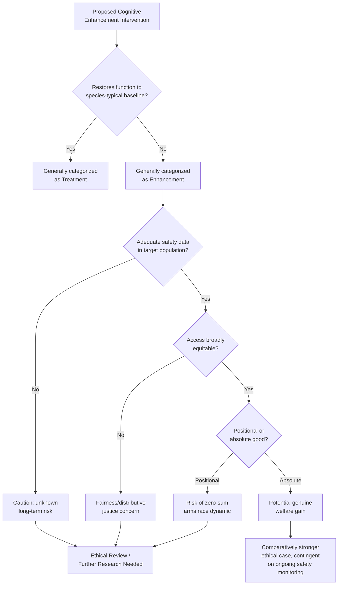

## Cognitive Enhancement Debates

### Overview

Cognitive enhancement refers to the use of pharmacological, technological, or biological interventions to improve cognitive functions — memory, attention, executive function, processing speed, or mood-related cognitive capacities — in individuals without a diagnosed impairment, as distinct from treatment aimed at restoring function to a clinically defined baseline. The ethical debate centers on whether such enhancement is a legitimate individual choice and societal good, or whether it introduces unacceptable risks to safety, fairness, authenticity, and social structure.

This topic spans neuropharmacology, neurotechnology (BCIs, neurostimulation), bioethics, philosophy of personal identity, and public policy.

---

### Defining the Treatment–Enhancement Distinction

**Key Points**

- The conventional distinction: **treatment** restores a function impaired by disease/injury to a species-typical baseline; **enhancement** improves function beyond that baseline in the absence of pathology.
- This distinction is widely used in policy and clinical ethics but is philosophically contested, since "species-typical baseline" is itself a statistical construct, and conditions like ADHD exist on a diagnostic spectrum where the treatment/enhancement line is not sharply defined by biology alone.
- [Inference] Many bioethicists regard the treatment–enhancement distinction as practically useful for policy purposes (e.g., regulating prescription of stimulants) even while acknowledging it lacks a fully principled philosophical foundation.

---

### Categories of Cognitive Enhancement

#### 1. Pharmacological Enhancement ("Nootropics" / "Smart Drugs")

**Key Points**

- **Stimulants** (methylphenidate, amphetamine salts): approved for ADHD/narcolepsy; used off-label by healthy individuals (notably students and some professionals) to improve sustained attention and working memory under fatigue or time pressure.
- **Modafinil/armodafinil**: approved for narcolepsy/shift-work disorder; studied off-label for wakefulness-dependent cognitive tasks; evidence suggests modest benefits primarily on tasks requiring sustained attention, with less consistent effects on more complex executive functions.
- **Cholinesterase inhibitors** (e.g., donepezil): approved for Alzheimer's disease; occasionally studied for healthy-population memory enhancement with mixed and generally modest results.
- **Over-the-counter "nootropic" stacks** (e.g., combinations of caffeine, L-theanine, racetams, omega-3s): marketed with enhancement claims that frequently exceed the strength of supporting clinical evidence; efficacy and safety data are often limited compared to prescription pharmaceuticals. [Unverified — claims for many specific proprietary nootropic products should be evaluated against current peer-reviewed literature, as evidence quality varies widely by compound and formulation.]

**Example**

A widely cited 2008 *Nature* survey found a substantial minority of academic respondents reported using cognitive-enhancing drugs (primarily methylphenidate, modafinil, or beta-blockers) for non-medical purposes, fueling early academic debate on the ethics of "cosmetic neurology." [Inference] Self-report survey methodology in this literature has known limitations (social desirability bias, sampling bias toward respondents already interested in the topic), so prevalence estimates across different surveys vary considerably and should be treated as approximate.

#### 2. Neurostimulation-Based Enhancement

**Key Points**

- **Transcranial direct current stimulation (tDCS)**: low-intensity electrical stimulation applied via scalp electrodes; studied for effects on learning rate, motor skill acquisition, and working memory. Effect sizes in the peer-reviewed literature are generally small and show substantial between-study and between-individual variability.
- **Transcranial magnetic stimulation (TMS)**: FDA-approved for treatment-resistant depression; studied off-label/experimentally for cognitive enhancement in healthy populations with more limited evidence base than for its approved clinical indications.
- **Consumer tDCS devices**: marketed direct-to-consumer for gaming, learning, or general "brain training," operating largely outside the medical device regulatory pathways applied to clinical neurostimulation devices in most jurisdictions. [Inference] The safety profile of repeated, unsupervised consumer tDCS use over the long term is not well characterized, since most peer-reviewed studies involve short-term, supervised, limited-session protocols.

#### 3. Neurotechnological Enhancement (BCIs, Neural Implants)

**Key Points**

- Currently dominated by therapeutic applications (motor restoration in paralysis, communication BCIs for locked-in patients); genuine cognitive *enhancement* (as opposed to restoration) via invasive BCI remains largely prospective/experimental as of 2026.
- Companies developing high-bandwidth BCIs (e.g., Neuralink, Synchron, and others) primarily target therapeutic indications in current clinical trials; enhancement use cases for healthy individuals are discussed prospectively in industry and academic literature but are not current standard practice.
- [Speculation] Long-term enhancement-oriented BCI use in healthy populations is frequently discussed in neuroethics literature as a future scenario requiring proactive governance, rather than a documented current practice.

#### 4. Non-Pharmacological, Non-Invasive Approaches

**Key Points**

- **Cognitive training ("brain games")**: commercial programs (e.g., Lumosity, historically) claimed broad transfer of trained skills to general cognitive ability; a substantial body of peer-reviewed meta-analytic evidence has found that gains are often largely limited to the trained tasks themselves, with limited generalization ("far transfer") to untrained cognitive domains. The FTC's 2016 settlement with Lumosity's parent company over deceptive advertising claims is a notable regulatory precedent.
- **Physical exercise, sleep optimization, nutrition**: robustly supported by evidence as contributing to cognitive function, generally categorized separately from "enhancement" in ethical debates since they align with widely endorsed health promotion rather than raising novel enhancement-specific ethical questions.

---

### Core Ethical Arguments

#### Arguments Favoring Permissive Approaches to Enhancement

**Key Points**

- **Autonomy**: individuals have a right to make decisions about their own cognitive functioning, analogous to rights over other aspects of bodily autonomy, provided informed consent and harm-avoidance conditions are met.
- **Welfare/utility**: enhancement could increase aggregate wellbeing, productivity, and quality of life; proponents argue that opposing enhancement while accepting other performance-improving interventions (education, caffeine, good nutrition) is inconsistent absent a principled distinction.
- **Beneficence toward underperformers**: enhancement could help offset cognitive disadvantages (e.g., due to fatigue, aging, or baseline variation), potentially serving equity goals rather than only privilege.

#### Arguments Favoring Restrictive/Cautious Approaches

**Key Points**

- **Safety and unknown long-term risk**: many enhancement interventions, particularly novel pharmacological and neurostimulation approaches, lack long-term safety data in healthy populations, since clinical trials for approved uses focus on specific patient populations and durations.
- **Coercion and structural pressure**: even without formal mandates, competitive environments (academic, professional) could create de facto pressure to use enhancers, undermining the voluntariness that autonomy-based arguments depend on.
- **Fairness and distributive justice**: unequal access to effective and safe enhancement technologies (driven by cost, geography, insurance coverage) could exacerbate existing socioeconomic inequality, an argument frequently raised regarding the "enhancement divide" or "neuro-divide."
- **Authenticity concerns**: philosophers (e.g., drawing on Carl Elliott's work on "enhancement technologies and the ethics of authenticity") raise questions about whether pharmacologically or technologically altered cognitive traits remain authentically "one's own," and whether achievement attained via enhancement carries the same value as unenhanced achievement.
- **Character and virtue-based objections**: some bioethicists (e.g., drawing on President's Council on Bioethics reports from the mid-2000s) argue that enhancement bypasses the character-building process traditionally associated with effortful achievement, altering the meaning of accomplishment.

---

### The Fairness Debate in Detail

#### Enhancement as Analogous to Doping in Sport

**Key Points**

- A common analogy compares cognitive enhancement in academic/professional contexts to performance-enhancing drug use in competitive sport, where fairness concerns justify prohibition even absent direct harm to third parties.
- Critics of the analogy note disanalogies: academic and professional competition (unlike sport) is not typically governed by an agreed rule-set explicitly defining "natural" performance as the baseline for fair comparison, making the applicability of anti-doping-style prohibition less clear-cut.
- [Inference] There is no broad consensus among ethicists on whether the sport-doping analogy is apt; it remains a contested rhetorical and philosophical framework rather than a settled position.

#### Positional vs. Absolute Goods

**Key Points**

- Enhancement's fairness implications differ depending on whether the goods at stake are **positional** (value derived from relative ranking, e.g., competitive exam scores, job market advantage) or **absolute** (value independent of others' performance, e.g., personal wellbeing, quality of life).
- For positional goods, widespread access to enhancement may simply reset the competitive baseline without net benefit (an "arms race" dynamic) while still carrying individual health risk from use.
- For absolute goods, individual enhancement can provide genuine welfare gains independent of others' choices.

---

### Regulatory and Policy Landscape

**Key Points**

- Most jurisdictions regulate cognitive enhancement substances indirectly, through prescription drug control laws (regulating manufacture, distribution, and prescribing) rather than through enhancement-specific legislation; off-label use by individuals who obtain a prescription (e.g., via diagnosis-seeking behavior) exists in a regulatory gray zone in many countries.
- Some academic and professional institutions have considered (and a minority have implemented) policies on cognitive enhancer use in testing or competitive contexts, though this remains far less standardized than, e.g., anti-doping regimes in professional sport.
- Neurostimulation devices marketed for wellness/enhancement (as opposed to FDA/EMA-cleared medical devices) often fall outside strict medical device regulation in many jurisdictions, a regulatory gap frequently cited by consumer safety advocates.
- [Unverified] The current (2026) regulatory status of specific nootropic compounds and consumer neurostimulation devices varies by jurisdiction and is subject to ongoing regulatory change; readers should consult current national drug and device regulatory agency guidance for specifics relevant to a given jurisdiction.

---

### Illustrative Diagram: Enhancement Ethics Decision Framework

---

### Diagram: Spectrum of Enhancement Modalities by Invasiveness and Evidence Maturity (svg_diagram)

<svg xmlns="http://www.w3.org/2000/svg" viewBox="0 0 780 380" font-family="Helvetica, Arial, sans-serif">
<text x="390" y="28" text-anchor="middle" font-size="17" font-weight="bold" fill="#1a1a2e">Enhancement Modalities: Invasiveness vs. Evidence Maturity (svg_diagram)</text>
<line x1="80" y1="330" x2="720" y2="330" stroke="#333" stroke-width="2" />
<line x1="80" y1="330" x2="80" y2="60" stroke="#333" stroke-width="2" />
<text x="400" y="360" text-anchor="middle" font-size="13" fill="#333">Invasiveness →</text>
<text x="30" y="195" text-anchor="middle" font-size="13" fill="#333" transform="rotate(-90 30 195)">Evidence Maturity →</text>
<circle cx="160" cy="290" r="14" fill="#2ec4b6" />
<text x="160" y="315" text-anchor="middle" font-size="11" fill="#1a1a2e">Sleep/Exercise</text>
<circle cx="230" cy="150" r="14" fill="#4361ee" />
<text x="230" y="130" text-anchor="middle" font-size="11" fill="#1a1a2e">Prescription</text>
<text x="230" y="143" text-anchor="middle" font-size="11" fill="#1a1a2e">Stimulants</text>
<circle cx="330" cy="250" r="14" fill="#ff9f1c" />
<text x="330" y="275" text-anchor="middle" font-size="11" fill="#1a1a2e">OTC Nootropics</text>
<circle cx="430" cy="220" r="14" fill="#f72585" />
<text x="430" y="200" text-anchor="middle" font-size="11" fill="#1a1a2e">Consumer tDCS</text>
<circle cx="520" cy="180" r="14" fill="#3a86ff" />
<text x="520" y="160" text-anchor="middle" font-size="11" fill="#1a1a2e">Clinical TMS</text>
<text x="520" y="173" text-anchor="middle" font-size="11" fill="#1a1a2e">(off-label)</text>
<circle cx="640" cy="290" r="14" fill="#e63946" />
<text x="640" y="315" text-anchor="middle" font-size="11" fill="#1a1a2e">Enhancement BCI</text>
<text x="640" y="328" text-anchor="middle" font-size="11" fill="#1a1a2e">(prospective)</text>

<text x="700" y="345" text-anchor="middle" font-size="10" fill="#666">high</text>

<text x="90" y="345" text-anchor="middle" font-size="10" fill="#666">low</text>

<text x="55" y="70" text-anchor="middle" font-size="10" fill="#666">high</text>

<text x="55" y="320" text-anchor="middle" font-size="10" fill="#666">low</text>

</svg>

---

### Philosophical Positions Summary

| Position | Core Claim | Representative Emphasis |
| --- | --- | --- |
| Liberal enhancement (transhumanist-adjacent) | Enhancement is a natural extension of human self-improvement and should be broadly permitted with safety oversight | Autonomy, welfare maximization |
| Bioconservative | Enhancement threatens human dignity, authenticity, or "giftedness" of natural capacities | Authenticity, character, meaning of achievement |
| Justice-focused | Enhancement's permissibility depends heavily on equitable access; unequal access is the primary ethical problem | Distributive justice, structural fairness |
| Precautionary/risk-focused | Insufficient long-term safety data warrants restrictive policy until evidence matures | Non-maleficence, evidentiary rigor |

[Inference] These categories represent recurring argumentative clusters in the academic literature rather than a formally agreed-upon taxonomy; individual scholars often combine elements across categories.

---

### Conclusion

**Conclusion**

Cognitive enhancement debates lack resolution primarily because they combine an unsettled conceptual question (what distinguishes treatment from enhancement, and whether that distinction should matter morally) with genuinely unresolved empirical questions (long-term safety, true effect sizes outside controlled studies, and the extent of "far transfer" from cognitive training). Ethical frameworks converge on autonomy, safety, and fairness as central considerations, but diverge sharply in how much weight each principle should carry relative to the others, and in whether current interventions have sufficiently mature evidence to justify permissive policy. As neurostimulation and BCI technologies mature beyond current largely therapeutic applications, [Inference] many neuroethicists anticipate the debate's practical stakes will intensify, making proactive, evidence-based governance frameworks a growing priority.

---

**Related Topics**

- Treatment vs. enhancement distinction: philosophical foundations and critiques
- Neuroethics of ADHD diagnosis and stimulant prescribing practices
- Deep brain stimulation and personality/identity change
- Doping in sport: comparative regulatory and philosophical frameworks
- Distributive justice and the "enhancement divide"
- Regulatory pathways for consumer neurostimulation devices
- Transhumanism and posthumanist philosophy
- Cognitive training and the far-transfer problem in learning science
- Brain-computer interfaces: therapeutic vs. enhancement use cases
- Informed consent standards for off-label pharmacological use