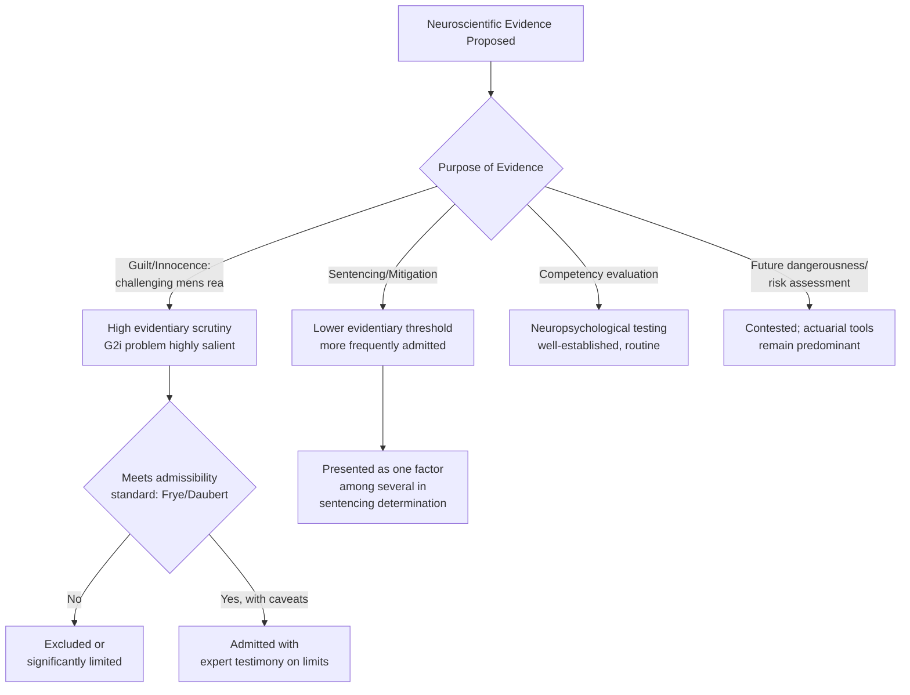

## Neurolaw and Criminal Responsibility

### Overview

Neurolaw is an interdisciplinary field examining how neuroscientific evidence and theory intersect with legal doctrine, procedure, and practice — most prominently in criminal law, where questions of intent (*mens rea*), capacity, responsibility, and punishment have traditionally relied on folk-psychological and behavioral evidence. The central question neurolaw poses is whether, and how, brain-based evidence should inform or reshape legal judgments about culpability, competency, dangerousness, and sentencing.

This topic draws on cognitive neuroscience, criminal law doctrine, philosophy of free will and moral responsibility, and forensic psychiatry.

---

### Foundational Legal Concepts Implicated

#### Mens Rea and Actus Reus

**Key Points**

- Criminal liability in most common-law systems requires both a guilty act (*actus reus*) and a guilty mental state (*mens rea* — e.g., intent, knowledge, recklessness, negligence).
- Neurolaw is primarily concerned with *mens rea*: whether neuroscientific evidence can inform determinations of whether a defendant possessed the requisite mental state at the time of the offense.
- [Inference] Legal systems generally require *mens rea* to be established through behavioral and testimonial evidence in practice, with neuroscientific evidence typically serving a supplementary or contextual role rather than a determinative one, given current technical limitations discussed below.

#### Criminal Responsibility and Excuse Doctrines

**Key Points**

- **Insanity defenses** (e.g., M'Naghten Rule, Model Penal Code substantial capacity test, Durham rule in limited historical use) ask whether a defendant, due to mental disease or defect, lacked the capacity to understand the wrongfulness of their conduct or to conform conduct to the law.
- **Diminished capacity** doctrines (available in some jurisdictions, notably contested and abolished or limited in others, e.g., largely eliminated at the federal level in the U.S. following the Insanity Defense Reform Act of 1984) may reduce (rather than eliminate) culpability, potentially downgrading offense classification (e.g., murder to manslaughter).
- **Competency to stand trial** is a distinct threshold question — whether a defendant can currently understand proceedings and assist in their own defense — separate from responsibility for the underlying act.

---

### Types of Neuroscientific Evidence Introduced in Legal Proceedings

#### 1. Structural Neuroimaging (MRI, CT)

**Key Points**

- Most commonly introduced to demonstrate structural brain abnormalities (e.g., frontal lobe lesions, tumors, atrophy) as evidence relevant to capacity or mitigation.
- Courts have most frequently admitted such evidence during the **sentencing/mitigation phase** of capital and other serious felony cases, rather than as direct evidence negating guilt, reflecting a lower evidentiary threshold for mitigating factors compared to elements of the offense itself.

#### 2. Functional Neuroimaging (fMRI, PET)

**Key Points**

- Introduced more rarely and with greater judicial scrutiny than structural imaging, given ongoing debate about the reliability of functional imaging for individual-level (as opposed to group-level) diagnostic claims.
- fMRI-based "lie detection" evidence (e.g., from companies such as No Lie MRI and Cephos, active primarily in the 2000s–2010s) has been proposed in various cases but has generally faced exclusion or significant skepticism under evidentiary admissibility standards in U.S. courts (e.g., *Daubert* and *Frye* standards), reflecting courts' concerns about general acceptance and validated accuracy rates outside controlled conditions.

#### 3. EEG-Based Evidence

**Key Points**

- Includes P300-based "brain fingerprinting" (marketed under that term by Lawrence Farwell), proposed as a method to detect whether a subject has knowledge of specific crime-related details based on recognition-related EEG responses.
- Judicial acceptance has been inconsistent and limited; courts have generally treated such techniques cautiously given contested validation standards and limited independent replication under real-world forensic conditions. [Unverified] The current admissibility status of specific EEG-based forensic techniques varies significantly by jurisdiction and case, and should be verified against current case law for any specific legal context.

#### 4. Genetic and Neurodevelopmental Evidence

**Key Points**

- Evidence regarding genetic variants (e.g., MAOA-L, sometimes informally termed the "warrior gene" in media coverage) combined with early childhood maltreatment has been introduced in a small number of cases as mitigating evidence regarding predisposition to impulsive aggression.
- [Inference] The scientific literature on gene-environment interaction effects (such as MAOA-L × early adversity) involves modest, probabilistic effect sizes at the population level; individual-level predictive claims drawn from such evidence in a specific legal case represent a significant inferential extension beyond what the underlying population-level research directly supports.

---

### The Landmark Case Trajectory (Illustrative Examples)

**Example**

*Roper v. Simmons* (U.S. Supreme Court, 2005) abolished the juvenile death penalty, with the majority opinion referencing developmental and neuroscientific research on adolescent brain maturation (particularly prefrontal cortex development related to impulse control and risk assessment) as part of its reasoning regarding reduced culpability in juveniles.

*Graham v. Florida* (2010) and *Miller v. Alabama* (2012) extended related reasoning to life-without-parole sentencing for juveniles, continuing to draw on developmental neuroscience regarding adolescent culpability.

[Inference] Legal scholars differ on how much independent causal weight neuroscientific evidence carried in these decisions versus serving as corroborating support for conclusions the Court might have reached on developmental-psychological and policy grounds alone; the opinions themselves cite neuroscience as one strand of supporting evidence among several.

---

### The Central Scientific-Legal Tension: Group-to-Individual (G2i) Inference

**Key Points**

- The majority of neuroscientific findings relevant to legal questions (e.g., links between prefrontal abnormalities and impulsivity, or amygdala reactivity and aggression) are established through group-level statistical studies.
- Applying group-level findings to determine whether a *specific individual defendant's* brain state caused or substantially contributed to their specific criminal act requires an inferential step the underlying statistics do not directly support — a defendant may show a "risk-associated" brain pattern without that pattern being causally sufficient or even necessary for their behavior, and many individuals with similar patterns do not commit crimes.
- This G2i problem is widely regarded in the neurolaw and philosophy-of-science literature as the primary scientific limitation on using neuroimaging evidence for individualized culpability determinations, as distinct from policy-level or mitigating use.

---

### Philosophical Debate: Neuroscience, Determinism, and Free Will

#### The "Brain Made Me Do It" Argument

**Key Points**

- Some commentators and defense arguments suggest that demonstrating a neurobiological basis for behavior undermines traditional notions of free will and therefore moral/legal responsibility.
- Critics (including many neuroscientists and philosophers) counter that **all** behavior has some neurobiological basis — the existence of a neural correlate for an action does not, by itself, establish that the action was involuntary, coerced, or outside the agent's control, since neural causation and voluntary agency are not mutually exclusive under most contemporary philosophical accounts of action.
- Neuroscientist and legal scholar collaborations (e.g., work associated with the MacArthur Foundation Research Network on Law and Neuroscience) have generally argued against wholesale determinism-based challenges to criminal responsibility, instead favoring more targeted, evidence-specific applications (e.g., regarding specific capacity questions).

#### Compatibilism and Legal Responsibility Frameworks

**Key Points**

- Most legal systems implicitly operate on a **compatibilist** framework, where responsibility depends on capacities such as rational deliberation, understanding of wrongfulness, and ability to conform conduct to law/norms — rather than on a metaphysical requirement of libertarian free will (freedom from all causal determination).
- Under this framework, neuroscientific evidence is legally relevant primarily insofar as it bears on these specific *capacities* (e.g., "did this defendant have the capacity to understand wrongfulness?"), not on the general metaphysical question of determinism.
- [Inference] Most practicing neurolaw scholars and legal ethicists reportedly favor this capacity-based framing over broad determinism-based arguments, since the latter would, if accepted, undermine the entire concept of criminal responsibility rather than provide a basis for case-specific legal distinctions — a conclusion few courts or legal systems appear prepared to adopt.

---

### Applications Beyond Guilt/Innocence

#### 1. Sentencing and Mitigation

**Key Points**

- Most established use of neuroscientific evidence in criminal proceedings; brain abnormality evidence is regularly introduced to argue for reduced sentences or against capital punishment based on diminished capacity for self-control or moral reasoning.

#### 2. Risk Assessment and Future Dangerousness

**Key Points**

- Some jurisdictions use structured risk assessment tools in parole and sentencing decisions; a minority incorporate or have explored incorporating neurobiological markers (e.g., certain structural or functional imaging correlates studied in psychopathy research) alongside established behavioral/actuarial risk factors.
- This raises the G2i problem in a particularly high-stakes form: predicting *future* individual behavior from group-level neurobiological correlates carries substantial uncertainty, and false positive/negative risk in this context has direct implications for liberty deprivation.
- [Inference] The use of neurobiological markers for individualized future-dangerousness prediction remains ethically contested and is not standard practice in most jurisdictions' formal risk-assessment protocols as of 2026, which continue to rely predominantly on actuarial/behavioral instruments (e.g., the Static-99 or similar validated tools) rather than neuroimaging.

#### 3. Competency and Capacity Evaluations

**Key Points**

- Neuropsychological testing (distinct from neuroimaging per se) is well-established and routinely used in competency-to-stand-trial evaluations, assessing cognitive functions like memory, executive function, and comprehension directly relevant to legal competency standards.

---

### Evidentiary Admissibility Standards (Illustrative — U.S. Context)

**Key Points**

- **Frye standard** ("general acceptance" in the relevant scientific community) — used in some U.S. state courts.
- **Daubert standard** (federal courts and many states, following *Daubert v. Merrell Dow Pharmaceuticals*, 1993) — considers testability, peer review/publication, known error rates, and general acceptance.
- Neuroscientific evidence, particularly novel or forensic-specific techniques (e.g., brain fingerprinting, fMRI lie detection), has frequently faced admissibility challenges under these standards due to contested error rates and limited independent validation for the specific forensic application proposed. [Unverified] Admissibility outcomes are highly fact- and jurisdiction-specific; general statements here should not be read as predictive of outcomes in any specific case.

---

### Illustrative Diagram: Neurolaw Evidentiary Pathway

---

### Diagram: Levels of Legal Relevance vs. Scientific Certainty (svg_diagram)

<svg xmlns="http://www.w3.org/2000/svg" viewBox="0 0 760 380" font-family="Helvetica, Arial, sans-serif">
<text x="380" y="28" text-anchor="middle" font-size="16" font-weight="bold" fill="#1a1a2e">Legal Use vs. Scientific Certainty of Neuroevidence (svg_diagram)</text>
<line x1="90" y1="330" x2="700" y2="330" stroke="#333" stroke-width="2" />
<line x1="90" y1="330" x2="90" y2="60" stroke="#333" stroke-width="2" />
<text x="395" y="358" text-anchor="middle" font-size="12" fill="#333">Legal Consequence Severity →</text>
<text x="40" y="195" text-anchor="middle" font-size="12" fill="#333" transform="rotate(-90 40 195)">Required Scientific Certainty →</text>
<circle cx="170" cy="120" r="15" fill="#2ec4b6" />
<text x="170" y="100" text-anchor="middle" font-size="11" fill="#1a1a2e">Competency</text>
<text x="170" y="113" text-anchor="middle" font-size="11" fill="#1a1a2e">Evaluation</text>
<circle cx="330" cy="220" r="15" fill="#4361ee" />
<text x="330" y="245" text-anchor="middle" font-size="11" fill="#1a1a2e">Sentencing</text>
<text x="330" y="258" text-anchor="middle" font-size="11" fill="#1a1a2e">Mitigation</text>
<circle cx="500" cy="270" r="15" fill="#ff9f1c" />
<text x="500" y="295" text-anchor="middle" font-size="11" fill="#1a1a2e">Diminished</text>
<text x="500" y="308" text-anchor="middle" font-size="11" fill="#1a1a2e">Capacity Claim</text>
<circle cx="630" cy="100" r="15" fill="#e63946" />
<text x="630" y="80" text-anchor="middle" font-size="11" fill="#1a1a2e">Guilt/Innocence</text>
<text x="630" y="93" text-anchor="middle" font-size="11" fill="#1a1a2e">(mens rea negation)</text>

<text x="670" y="350" text-anchor="middle" font-size="10" fill="#666">high</text>

<text x="110" y="350" text-anchor="middle" font-size="10" fill="#666">low</text>

<text x="65" y="75" text-anchor="middle" font-size="10" fill="#666">high</text>

<text x="65" y="315" text-anchor="middle" font-size="10" fill="#666">low</text>

</svg>

---

### Cross-Jurisdictional Notes

**Key Points**

- Civil law jurisdictions (e.g., much of continental Europe) often incorporate psychiatric and neuropsychological evidence through court-appointed expert evaluation processes rather than adversarial expert testimony, resulting in a structurally different evidentiary role for neuroscience compared to common-law adversarial systems.
- [Unverified] Comparative statements about the frequency and impact of neuroscientific evidence across different national legal systems should be treated as approximate, given limited systematic cross-jurisdictional empirical study of this specific question and ongoing legal evolution.

---

### Conclusion

**Conclusion**

Neurolaw's central and unresolved challenge is bridging a scientific paradigm built on population-level statistical inference with a legal paradigm requiring individualized, case-specific determinations of guilt and responsibility. Courts have shown a consistent pattern of greater receptivity to neuroscientific evidence in **mitigation and capacity** contexts, where the evidentiary bar is lower and the evidence supplements rather than replaces traditional legal and behavioral evidence, and greater caution toward neuroscientific evidence offered to directly **negate guilt or predict future dangerousness**, where the group-to-individual inference problem is most acute. Philosophically, the field has largely moved away from broad determinism-based challenges to criminal responsibility and toward more targeted, capacity-focused applications compatible with existing compatibilist legal frameworks. [Inference] As neuroimaging and decoding techniques continue to develop, most legal scholars in this area anticipate that the core tension between statistical/probabilistic scientific evidence and individualized legal judgment will remain a persistent methodological challenge rather than one likely to be fully resolved by technical advances alone.

---

**Related Topics**

- The group-to-individual (G2i) inference problem in forensic science generally
- Adolescent brain development and juvenile justice policy
- Psychopathy, antisocial personality disorder, and neurobiological correlates
- Free will, determinism, and compatibilism in moral philosophy
- Daubert/Frye evidentiary standards and expert scientific testimony
- Forensic neuropsychological assessment methodology
- Risk assessment instruments in parole and sentencing (actuarial vs. clinical judgment)
- Gene-environment interaction research (e.g., MAOA) and behavioral genetics ethics
- Comparative criminal justice systems: adversarial vs. inquisitorial approaches to expert evidence
- Ethics of neuroimaging and mental privacy (related chapter topic)